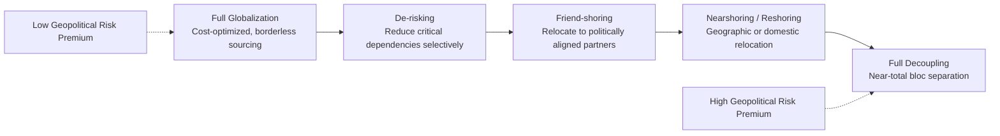

## The Fragmentation of Globalization and Friend-Shoring

### Overview

Since roughly 2018, and accelerating sharply after the COVID-19 pandemic and Russia's 2022 invasion of Ukraine, the post-Cold War model of hyperglobalized, efficiency-maximizing supply chains has been giving way to a more fragmented, security-conscious international economic order. Analysts increasingly describe this shift using terms like "geoeconomic fragmentation," "slowbalization," "de-risking," and "friend-shoring." This topic sits at the center of contemporary geopolitical risk analysis because it converts what were once purely commercial sourcing decisions into matters of national security policy, sanctions exposure, and alliance politics.

### Defining the Core Concepts

| Term | Definition |
| --- | --- |
| **Globalization (classical model)** | Post-1990s model prioritizing lowest-cost, most-efficient global sourcing regardless of political alignment between trading partners |
| **Deglobalization** | A broad reduction in cross-border trade, capital, and labor flows relative to global GDP |
| **Fragmentation / Geoeconomic fragmentation** | A more precise term (used prominently by the IMF) describing the reorganization of trade and investment along geopolitical bloc lines rather than a uniform global retreat from trade |
| **Friend-shoring (or "ally-shoring")** | Relocating supply chains to countries considered politically aligned or trusted, even if not the lowest-cost option |
| **Reshoring / Onshoring** | Returning production to the home country entirely |
| **Nearshoring** | Relocating production to geographically proximate countries (e.g., U.S. firms shifting to Mexico) |
| **De-risking** | A narrower term (adopted by the EU and G7 in 2023) emphasizing selective reduction of critical dependencies rather than wholesale decoupling |
| **Decoupling** | The most extreme end of the spectrum — near-total severance of economic ties between rival blocs, most often discussed in the U.S.-China context |

[Fact] The IMF has explicitly used "geoeconomic fragmentation" as a term of art in its research and *World Economic Outlook* publications, distinguishing it from a uniform decline in globalization; trade is being *redirected* along geopolitical lines more than it is contracting in aggregate. [Inference] The precise magnitude and permanence of this redirection are actively debated among economists, since aggregate global trade-to-GDP ratios have not collapsed as sharply as bloc-specific trade patterns suggest.

### Historical Drivers and Timeline

- **2018–2019: U.S.-China trade war** — Section 301 tariffs initiated under the first Trump administration marked an early, explicit use of trade policy as a geopolitical instrument rather than purely an economic one.
- **2020: COVID-19 pandemic** — Exposed acute vulnerabilities in globally concentrated supply chains, especially for personal protective equipment, active pharmaceutical ingredients, and semiconductors, prompting widespread corporate and government supply chain reviews.
- **2021–2022: Global semiconductor shortage** — Highlighted the concentration risk of advanced chip fabrication in Taiwan (TSMC) and reliance on a small number of firms (ASML for lithography equipment), directly linking supply chain resilience to great-power competition over Taiwan.
- **2022: Russia's invasion of Ukraine** — Triggered the most extensive coordinated sanctions regime in modern history against a G20 economy, demonstrating that even deeply integrated economies (Russia-EU energy trade) could be rapidly severed, and accelerating European energy diversification away from Russian supply.
- **2022: U.S. CHIPS and Science Act** — Provided subsidies for domestic and allied semiconductor manufacturing, explicitly tying industrial policy to national security and alliance politics.
- **2022: U.S. Inflation Reduction Act (IRA)** — Included domestic content and "foreign entity of concern" restrictions on EV battery supply chains, effectively mandating friend-shored sourcing to qualify for subsidies.
- **2023: G7 adoption of "de-risking" language** — European Commission President Ursula von der Leyen's formulation of "de-risking, not decoupling" from China became the dominant G7 framing, distinguishing the EU/allied approach from more aggressive U.S. decoupling rhetoric in certain sectors.
- **2023–2025: Expanding export controls** — U.S. restrictions on advanced semiconductor and semiconductor-manufacturing-equipment exports to China (and subsequent expansions) exemplify targeted "small yard, high fence" technology control rather than blanket decoupling.

### Mechanisms Driving Fragmentation

**Key Points**

- **National security tariffs and export controls** — Instruments like Section 232 (national security) tariffs and the U.S. Commerce Department's Entity List directly restrict trade based on geopolitical alignment rather than economic efficiency.
- **Industrial policy and subsidy competition** — The CHIPS Act, IRA, and EU Chips Act represent a broader return to state-directed industrial policy, with subsidies increasingly conditioned on supply chain geography and country of origin.
- **Sanctions regimes** — Coordinated multilateral sanctions (post-2022 Russia sanctions being the largest recent example) demonstrate the weaponization of financial infrastructure (SWIFT restrictions, central bank asset freezes) as geopolitical tools, incentivizing targeted states to build parallel financial infrastructure.
- **Critical mineral and rare earth dependencies** — China's dominance in rare earth processing (not necessarily extraction) has prompted allied efforts (e.g., the Minerals Security Partnership) to build parallel supply chains for materials critical to EVs, batteries, and defense systems.
- **Data localization and digital sovereignty rules** — Regulations requiring data to be stored and processed within national or regional borders (EU GDPR-adjacent rules, China's Cybersecurity Law, India's data localization proposals) fragment what was once a more unified global data infrastructure.
- **Investment screening mechanisms** — Expanded foreign direct investment screening (CFIUS in the U.S., the EU's FDI Screening Regulation) increasingly blocks or conditions cross-border investment in sensitive sectors based on the investor's country of origin.

### Friend-Shoring in Practice: Sectoral Examples

**Example**

*Semiconductors*: Following the CHIPS Act, TSMC, Samsung, and Intel announced expanded fabrication capacity in the United States; the EU Chips Act pursued a parallel strategy for European semiconductor self-sufficiency. This represents a shift from a purely cost-optimized model (concentrated in Taiwan and South Korea) toward geographic diversification aligned with the security concerns of the purchasing bloc.

*Electric vehicle batteries*: The IRA's foreign entity of concern provisions have pushed U.S. and allied automakers to restructure battery and critical mineral supply chains away from Chinese-linked processing, accelerating investment in North American and allied-country (e.g., Indonesia, Australia) mineral processing capacity — though China retains substantial midstream processing dominance in the near term.

*Apparel and light manufacturing*: Nearshoring to Mexico and Central America, and diversification toward Vietnam, India, and Bangladesh away from sole reliance on China, reflects a blend of cost-driven diversification (post-tariff) and lower-order friend-shoring, though this segment is driven more by tariff avoidance than strict security alignment.

[Inference] The relative weight of "genuine security friend-shoring" versus "tariff arbitrage relabeled as friend-shoring" in observed corporate sourcing shifts is difficult to disentangle empirically and is a matter of ongoing debate among trade economists.

### Economic Costs and Trade-offs

- **Efficiency loss** — Redirecting supply chains away from the lowest-cost producer necessarily raises production costs; IMF and World Bank research has modeled potential global GDP losses from severe fragmentation scenarios, though estimates vary significantly by assumed severity of decoupling.
- **Inflationary pressure** — Reduced reliance on low-cost manufacturing bases contributes to structurally higher input costs, a factor increasingly cited by central banks alongside energy and labor market dynamics.
- **Redundancy vs. resilience trade-off** — Building parallel, redundant supply chains (e.g., "China+1" strategies) trades short-term cost efficiency for long-term resilience against geopolitical shocks — a calculation risk analysts are frequently asked to help quantify for corporate clients.
- **Uneven impact on emerging markets** — Countries like Vietnam, India, Mexico, and Indonesia have benefited as alternative manufacturing hubs ("China+1" beneficiaries), while countries perceived as more geopolitically aligned with a rival bloc may find themselves increasingly excluded from certain supply chains regardless of cost competitiveness.

$$\text{Total Landed Cost} = \text{Unit Production Cost} + \text{Logistics Cost} + \text{Tariff Exposure} + \text{Geopolitical Risk Premium}$$

[Inference] The "geopolitical risk premium" term in this framework is not a standardized line item in corporate accounting; it represents an increasingly common qualitative or scenario-weighted adjustment analysts apply when advising on sourcing decisions, rather than a formally quantified industry-standard metric.

### Bloc Formation and the "Two Systems" Debate

A recurring theme in current geopolitical risk literature is whether the global economy is bifurcating into two semi-separate blocs — broadly, a U.S.-aligned bloc and a China-Russia-aligned bloc — with a large group of non-aligned or multi-aligned states ("swing states" or "the Global South") deliberately maintaining ties to both.

- **BRICS expansion** (adding Egypt, Ethiopia, Iran, UAE, and Saudi Arabia's contested participation as of the 2024 expansion) reflects an attempt to build alternative multilateral economic institutions and reduce dollar dependency, though members' economic and strategic alignment remains heterogeneous.
- **De-dollarization discourse** — Increased bilateral trade settlement in non-dollar currencies (e.g., Russia-China, India-UAE) is frequently cited as evidence of fragmentation, though the U.S. dollar's share of global reserves and trade invoicing has declined only gradually. [Unverified] Claims of imminent, large-scale de-dollarization circulate widely in commentary but are not consistently supported by reserve currency composition data, which should be checked against current IMF COFER figures rather than assumed.
- **"Non-aligned" strategic hedging** — States like India, Vietnam, Indonesia, Saudi Arabia, and the UAE have pursued deliberate multi-alignment strategies, maintaining economic and security ties across blocs simultaneously — a pattern risk analysts must model as distinct from binary bloc membership.

### Illustration: Fragmentation Spectrum

### Analytical Frameworks for Assessing Fragmentation Risk

**Key Points**

- **Supply chain mapping (tier 1–3 dependency analysis)** — Risk analysts increasingly map not just direct (tier 1) suppliers but sub-tier dependencies to identify hidden geopolitical concentration risk (e.g., a "friend-shored" tier-1 supplier that itself depends on a tier-3 supplier in a sanctioned jurisdiction).
- **Choke point identification** — Mapping critical, hard-to-substitute nodes (e.g., Taiwan for advanced logic chips, the Strait of Hormuz for oil transit, the Netherlands' ASML for EUV lithography) as single points of failure with outsized geopolitical risk exposure.
- **Scenario planning for bloc-contingent outcomes** — Constructing distinct scenarios (e.g., "status quo de-risking," "Taiwan contingency decoupling shock," "renewed U.S.-China trade détente") rather than a single linear fragmentation forecast, consistent with the alternative-futures analytic technique used broadly in the field.
- **Regulatory tracking** — Systematic monitoring of export control lists (Entity List, Military End-User List), sanctions designations (OFAC SDN list), and investment screening decisions as leading indicators of fragmentation trajectory in specific sectors.

### Related Topics

- Semiconductor supply chain geopolitics and the Taiwan contingency
- Sanctions regimes and their circumvention mechanisms
- Critical minerals and rare earth supply chain security
- De-dollarization and the future of reserve currencies
- Industrial policy competition (CHIPS Act, EU Chips Act, IRA) as geopolitical instruments
- The "Global South" and non-aligned state strategic hedging
- Export control regimes and technology denial strategy
- Scenario planning methodology for supply chain risk assessment