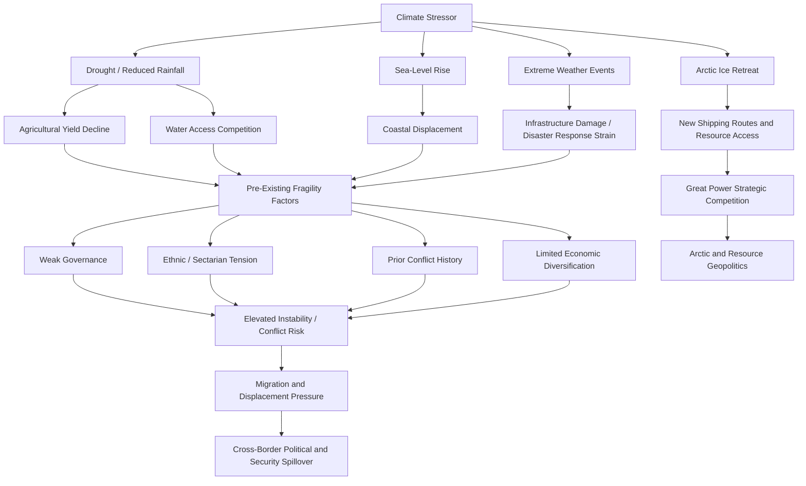

## Climate Change as a Geopolitical Risk Multiplier

### Overview

Climate change is widely characterized in defense, intelligence, and risk-analysis literature as a "threat multiplier" or "risk multiplier" — a concept popularized by a 2007 CNA Corporation military advisory board report and subsequently adopted by the U.S. Department of Defense, NATO, and multiple national security strategies. The framing holds that climate change does not typically create wholly new categories of geopolitical risk on its own; rather, it intensifies existing fragilities — resource scarcity, weak governance, ethnic and resource-based tensions, migration pressures — making conflict, instability, and state fragility more likely or more severe than they would otherwise be. This makes climate change a cross-cutting variable that risk analysts increasingly integrate into country and regional risk models rather than treating as a standalone, separate risk category.

### The "Threat Multiplier" Concept

[Fact] The term "threat multiplier" in this context originates from the CNA Corporation's 2007 report *National Security and the Threat of Climate Change*, produced by a military advisory board of retired U.S. generals and admirals, and has since been formally adopted in U.S. Department of Defense climate risk assessments and NATO's Climate Change and Security Action Plan.

The core analytical logic:

$$\text{Instability Risk} = f(\text{Baseline Fragility}, \text{Climate Stress}, \text{Governance Capacity})$$

Climate stress (drought, flooding, heat, sea-level rise) interacts multiplicatively rather than additively with pre-existing fragility factors — weak state institutions, ethnic or sectarian tension, contested resource access, prior conflict history — meaning the same climate shock produces very different geopolitical outcomes depending on the underlying resilience of the affected state or region. [Inference] This multiplicative framing is a widely used heuristic in policy and defense literature rather than a precisely estimated statistical model; rigorous econometric work in this space typically models specific mechanisms (e.g., rainfall shocks and conflict onset) rather than a single unified "instability risk" function.

### Primary Transmission Mechanisms

**Resource Scarcity and Competition**

- **Water stress** — Transboundary river basins (Nile, Mekong, Indus, Tigris-Euphrates) are focal points where upstream damming, changing precipitation patterns, and population growth intersect with existing political tension. The Grand Ethiopian Renaissance Dam dispute among Ethiopia, Egypt, and Sudan is a widely cited contemporary case of water-related geopolitical friction exacerbated by hydrological uncertainty.
- **Agricultural disruption and food security** — Shifting precipitation and temperature patterns affecting crop yields in already food-insecure regions (Sahel, Horn of Africa) can contribute to price shocks and localized unrest; the 2010–2011 Russian wheat export ban following a severe heatwave is frequently cited in the academic literature as a contributing factor to global wheat price spikes preceding the Arab Spring, though the extent of its causal role relative to domestic political grievances remains debated among researchers.
- **Fisheries and maritime resource disputes** — Changing ocean temperatures shifting fish stock migration patterns have contributed to tension in disputed maritime zones, including in the South China Sea and West African coastal waters.

**Migration and Displacement**

- **Climate-induced displacement** — Slow-onset environmental change (desertification, sea-level rise, repeated drought) and sudden-onset disasters (floods, cyclones) contribute to both internal displacement and cross-border migration pressure. The Internal Displacement Monitoring Centre (IDMC) publishes annual data distinguishing disaster-displacement from conflict-displacement, though attributing any single migration flow purely to climate versus economic or political factors is analytically difficult. [Inference] Most rigorous displacement research treats climate as one contributing factor among several (economic opportunity, conflict, family networks) rather than a sole or cleanly separable cause, and analysts should be cautious of monocausal "climate refugee" framing found in less rigorous commentary.
- **Small island states and sea-level rise** — Nations such as Tuvalu, Kiribati, and the Marshall Islands face existential territorial questions, prompting novel legal and diplomatic initiatives, including Tuvalu's 2023 "Falepili Union" treaty with Australia addressing climate mobility and Pacific security cooperation.

**State Fragility and Governance Stress**

- Climate stress can strain already limited state capacity for service delivery and disaster response, particularly in regions with weak governance, potentially widening legitimacy gaps that non-state armed groups or insurgencies can exploit.
- The Lake Chad Basin — spanning Nigeria, Chad, Niger, and Cameroon — is frequently cited in security literature as a case where lake shrinkage, population growth, and pre-existing weak governance have coincided with the operating environment of Boko Haram and related insurgent groups, though researchers caution against a simplistic single-cause narrative given the region's complex pre-existing political economy.

**Arctic Geopolitics**

- Sea ice retreat is opening new shipping routes (the Northern Sea Route, Northwest Passage) and access to previously inaccessible hydrocarbon and mineral resources, intensifying strategic competition among Arctic Council states (Russia, U.S., Canada, Nordic states) and growing non-Arctic power interest (notably China's self-declared "near-Arctic state" positioning).
- Renewed military and infrastructure investment in the Arctic by Russia and NATO member states reflects a directly climate-enabled shift in the strategic geography of a previously peripheral region.

### Great Power and Institutional Responses

**Key Points**

- **U.S. Department of Defense** — Has incorporated climate risk into formal planning documents, including installation vulnerability assessments and the 2021 DoD Climate Risk Analysis, treating climate impacts on military infrastructure (e.g., flooding at coastal bases) as an operational readiness issue.
- **NATO** — Adopted a Climate Change and Security Action Plan (2021) committing to integrate climate considerations into alliance planning, exercises, and capability targets.
- **EU** — The European Green Deal and associated Carbon Border Adjustment Mechanism (CBAM) represent climate policy with direct geoeconomic and trade-policy dimensions, effectively linking decarbonization policy to trade competitiveness and creating friction points with trading partners who view CBAM as protectionist.
- **UN Security Council** — Has held periodic debates on climate-security linkages, though efforts to establish a standing UNSC mechanism on climate security have faced resistance from permanent members skeptical of expanding the Council's mandate into environmental policy.
- **Multilateral climate finance disputes** — The "loss and damage" fund established at COP27 (2022) and operationalized at COP28 (2023) reflects an emerging and contested geopolitical fault line between developed and developing nations over historical responsibility and financing obligations, a recurring source of North-South diplomatic friction in climate negotiations.

### Energy Transition as a Distinct Geopolitical Risk Vector

The shift away from fossil fuels introduces its own geopolitical risk dynamics, somewhat distinct from physical climate impacts:

- **Critical mineral dependency** — The energy transition shifts resource dependency from oil and gas (historically concentrated in the Middle East, Russia, and a few other producers) toward critical minerals (lithium, cobalt, nickel, rare earths) concentrated in a different set of countries (Democratic Republic of Congo for cobalt, Chile/Australia/China for lithium processing, China for rare earth processing dominance), creating new supply chain concentration risks analyzed alongside the friend-shoring trends discussed elsewhere in this curriculum.
- **Petrostate fiscal and political stability** — Oil- and gas-dependent economies (Russia, Gulf states, Venezuela, Nigeria) face longer-term fiscal sustainability questions as global demand growth slows, with implications for domestic political stability in states heavily reliant on hydrocarbon export revenue for social spending and regime legitimacy.
- **Stranded asset risk** — Analysts increasingly assess the geopolitical implications of hydrocarbon reserves becoming economically "stranded" under aggressive decarbonization scenarios, particularly for producer states with limited economic diversification.

[Inference] The pace and eventual scale of demand destruction for fossil fuels remains genuinely uncertain and depends heavily on policy choices, technology cost trajectories, and political will across major consuming economies; forecasts in this domain should be treated as scenario-dependent rather than as settled projections.

### Methodological Challenges in Attribution

**Key Points**

- **Correlation vs. causation** — Establishing that climate stress directly causes conflict, as opposed to correlating with it via confounding variables (poverty, governance quality, ethnic fractionalization), is methodologically difficult; the academic literature on "climate-conflict links" remains an active and contested area of quantitative social science research.
- **Publication and framing bias** — Some scholars caution that the "threat multiplier" framing, while policy-useful, can risk overstating climate's causal weight relative to political and economic drivers, or can be invoked to securitize what are fundamentally governance and development challenges. [Inference] This is a genuine methodological debate within the academic literature rather than a fringe position; risk analysts should be aware that reputable scholars disagree on the relative causal weight of climate variables in specific conflict case studies.
- **Data quality limitations** — Reliable historical climate and conflict data are often sparser precisely in the fragile states where the threat-multiplier dynamic is theorized to be strongest, complicating rigorous empirical testing.

### Illustration: Climate Risk Transmission Pathway

### Practical Application in Risk Analysis

**Example**

A country risk model assessing the Sahel region might incorporate climate variables not as a standalone score but as a modifier applied to an underlying governance-fragility baseline: a country with strong institutional capacity and diversified water access absorbs a drought shock with limited instability spillover, while a country with weak governance, high resource dependency, and prior conflict history facing the same drought magnitude might see substantially elevated risk of localized conflict, displacement, or extremist group recruitment. Analysts typically operationalize this by tracking leading indicators (precipitation anomalies, food price indices, displacement flow data from IDMC or UNHCR) alongside traditional political-risk indicators rather than relying on climate data in isolation.

**Next Steps**

- Water security and transboundary river basin diplomacy
- Climate finance geopolitics: loss and damage, just energy transition partnerships
- Arctic strategic competition and Arctic Council dynamics
- Critical mineral supply chains for the energy transition
- Climate-conflict quantitative research methodology and its limitations
- Petrostate political economy under energy transition pressure
- Climate-induced displacement: legal status gaps and policy responses