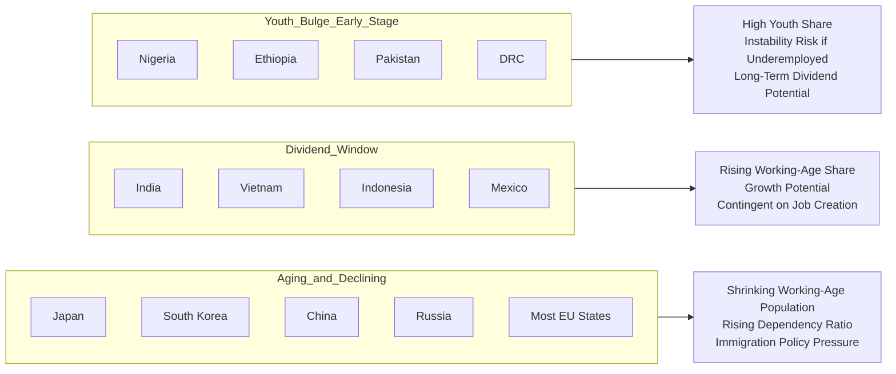

## Demographic Shifts and Their Strategic Implications

### Overview

Demography is among the most predictable long-term variables available to geopolitical risk analysts — population age structures, fertility trajectories, and migration patterns are visible decades in advance with far greater confidence than most political or economic forecasts. Despite this predictability, demographic shifts are frequently underweighted in near-term risk analysis relative to their eventual strategic consequences. This topic examines how population aging, fertility decline, youth bulges, and migration reshape military capacity, economic growth potential, fiscal sustainability, and the underlying balance of great power competition over multi-decade horizons.

### Core Demographic Concepts for Risk Analysis

- **Total Fertility Rate (TFR)** — The average number of children a woman would have over her lifetime given current age-specific fertility rates. A TFR of approximately 2.1 is generally considered the "replacement rate" in low-mortality developed economies.
- **Demographic dividend** — The economic growth potential that arises when a country's working-age population share rises relative to dependents (children and elderly), typically following fertility decline but before population aging sets in.
- **Demographic transition model** — A four-to-five stage framework describing the historical shift from high birth/death rates to low birth/death rates as societies industrialize and develop, used as a baseline heuristic for anticipating where a given country sits on its long-term population trajectory.
- **Youth bulge** — A population age structure with a disproportionately large share of young adults (often defined as ages 15–29), historically associated in political science literature with elevated risk of social unrest and political instability, particularly when combined with limited economic opportunity.
- **Median age** — A commonly used single-number proxy for a country's demographic and, by extension, strategic profile.
- **Dependency ratio** — The ratio of dependents (under 15 and over 64) to the working-age population (15–64), a key input for fiscal sustainability and pension system analysis.

$$\text{Dependency Ratio} = \frac{\text{Population}_{<15} + \text{Population}_{65+}}{\text{Population}_{15-64}} \times 100$$

### Aging and Fertility Decline in Advanced and Major Economies

**Key Points**

- **China** — Faces a historically unprecedented demographic reversal following the one-child policy (1980–2015); China's population began declining in 2022, and its working-age population has been shrinking for over a decade. This is widely cited by analysts as a structural headwind to long-term Chinese economic growth potential and a factor in debates over the durability of Chinese strategic ambitions on a multi-decade horizon. [Inference] The precise strategic implications are actively debated: some analysts argue a shrinking window of relative power could increase incentives for near-term assertiveness (a "closing window" thesis, notably associated with scholars like Hal Brands and Michael Beckley), while others emphasize China's continued capacity for military modernization and technological advancement despite demographic headwinds; this remains a genuinely contested analytical question rather than a settled consensus.
- **Japan** — The most advanced case globally of sustained population aging and decline, with a median age among the highest in the world; long treated as a leading indicator of policy responses (immigration liberalization, automation investment, pension reform, defense budget trade-offs against social spending) that other aging societies may eventually face.
- **South Korea** — Has recorded among the lowest total fertility rates in the world in recent years (well below 1.0 in various annual measures), an extreme case frequently cited in demographic literature, with direct implications for future military recruitment given the country's conscription-based force structure amid a persistent North Korea security threat.
- **Russia** — Faces compounding demographic pressures from long-term low fertility, elevated male mortality, and substantial additional population loss and emigration associated with the war in Ukraine (both military casualties and emigration of working-age men avoiding mobilization), compounding pre-existing long-term population decline projections. [Unverified] Specific figures on war-related demographic loss and emigration vary significantly across sources and are politically contested; verify against current demographic research rather than treating any single estimate as definitive.
- **Europe (broadly)** — Most EU member states have below-replacement fertility, with population aging driving major policy debates over pension sustainability, immigration policy, and defense spending trade-offs against rising healthcare and social security costs.
- **United States** — Maintains relatively higher fertility and, critically, higher net immigration than most other advanced economies, giving it a comparatively more favorable long-term demographic trajectory among major powers, though U.S. fertility has also declined substantially below replacement rate in recent decades.

### Youth Bulges and Instability Risk

- **Sub-Saharan Africa** — Home to the world's youngest and fastest-growing regional population, with median ages in many countries under 20; this creates significant long-term economic potential (a possible future demographic dividend) contingent on adequate education, job creation, and governance capacity, alongside near-term risks associated with youth unemployment where economic absorption capacity lags population growth.
- **Middle East and North Africa (MENA)** — Youth bulge dynamics have been widely cited (with debated causal weight) as a contributing structural factor in the 2010–2011 Arab Spring uprisings, where large cohorts of educated but underemployed young adults faced limited political and economic opportunity. [Inference] As with climate-conflict attribution, youth-bulge-to-instability causal claims are contested in the academic literature; youth bulge is best treated as one risk factor among several (governance quality, economic opportunity, social media penetration, prior authoritarian repression) rather than a standalone predictive variable.
- **Pakistan and parts of South Asia** — Continue to exhibit relatively young population structures with significant implications for future labor force size, education system strain, and potential migration pressure.

### Strategic and Military Implications

**Military Recruitment and Force Structure**

- Countries reliant on conscription-based militaries (South Korea, Israel, several European states reintroducing conscription discussion) face a shrinking eligible population pool as fertility declines, creating long-term force-generation constraints that factor into defense planning.
- Aging societies face a structural trade-off between defense spending and rising age-related social spending (pensions, healthcare) as a share of national budgets — a tension increasingly discussed in NATO burden-sharing debates.

**Economic Growth Potential**

- Working-age population decline directly constrains potential GDP growth absent offsetting productivity gains (automation, AI-driven productivity, immigration), a dynamic central to long-term forecasts of relative U.S.-China economic trajectory.
- The "demographic dividend" enjoyed by China from the 1980s through roughly the 2010s, and now largely exhausted, is frequently contrasted with India's current and prospective dividend window as its working-age population share continues rising while China's contracts — a comparison central to contemporary "which country becomes the next manufacturing and growth engine" analysis.

**Immigration as a Strategic Variable**

- Countries with the political and institutional capacity to sustain high immigration (the U.S., Canada, Australia, and increasingly parts of Europe under labor shortage pressure) can partially offset native-born fertility decline, giving immigration policy direct long-term strategic weight beyond its domestic political salience.
- Immigration policy is simultaneously a demographic-strategic tool and one of the most politically contested domestic policy areas across advanced democracies, creating tension between long-term demographic-economic interest and near-term political feasibility that risk analysts must track as a distinct variable from the underlying demographic need itself.

### India as a Demographic Case Study

**Example**

India surpassed China as the world's most populous country around 2023 and currently has a substantially younger median age and a still-rising working-age population share, positioning it — according to a demographic-dividend framework — for a multi-decade window of favorable labor force growth. However, analysts caution that a favorable age structure is a necessary but not sufficient condition for realizing a demographic dividend: outcomes depend heavily on India's capacity to generate sufficient formal-sector employment, improve educational and skills outcomes, and sustain infrastructure investment at the scale needed to absorb its growing labor force. [Inference] Whether India successfully converts its demographic profile into sustained high growth (as East Asian economies did in prior decades) or instead experiences persistent underemployment among its youth population (a "demographic burden" outcome) remains an open and actively debated question among development economists, not a foregone conclusion.

### Migration as a Distinct Geopolitical Variable

- **Labor migration corridors** — Structural labor migration flows (South Asia to the Gulf states, Central America to the U.S., North Africa to Europe) are shaped by demographic complementarity between aging labor-scarce destination countries and younger labor-abundant origin countries, making migration policy an increasingly load-bearing element of bilateral relationships.
- **Remittance dependency** — Several origin countries (Philippines, Mexico, several Central Asian states) rely heavily on remittance inflows from diaspora labor migration as a share of GDP, creating a distinct channel through which destination-country immigration policy shifts transmit directly into origin-country economic and political stability.
- **Aging destination countries' policy dilemma** — Countries facing acute labor shortages from population aging (Japan, Germany, South Korea) face a structural tension between economic need for immigration and domestic political resistance to it, a recurring theme across advanced-economy politics.

### Illustration: Demographic Trajectory Comparison

### Analytical Approach for Risk Practitioners

**Key Points**

- **Use demography as a slow-moving structural baseline, not a forecasting tool for near-term events** — Population trends unfold over decades and rarely explain sudden political shocks on their own; they are best used to contextualize the underlying capacity and constraints a state operates within.
- **Combine demographic data with governance and economic absorption capacity indicators** — A youth bulge or a working-age population decline means little in isolation; its strategic significance depends on whether the relevant economy and political system can generate matching employment opportunities or manage the associated fiscal burden.
- **Track UN Population Division and national census/statistical office data as primary sources** — The UN World Population Prospects releases (updated periodically) are the standard reference dataset used across the field for population projections, though even UN projections carry meaningful uncertainty ranges, particularly for fertility assumptions decades into the future.
- **Distinguish population size from population structure** — A large population is not itself a strategic advantage; the age structure, dependency ratio, and labor force participation rate are typically more analytically relevant to strategic capacity than raw population totals.

### Related Topics

- The demographic dividend: theory, conditions, and historical case studies (East Asian Tigers)
- China's demographic trajectory and its implications for long-term strategic competition
- India's economic rise and the conditions for converting demographic potential into growth
- Migration policy as a strategic and diplomatic instrument
- Youth bulge theory and contested links to political instability
- Pension system sustainability and fiscal risk in aging economies
- Automation and AI as potential offsets to working-age population decline