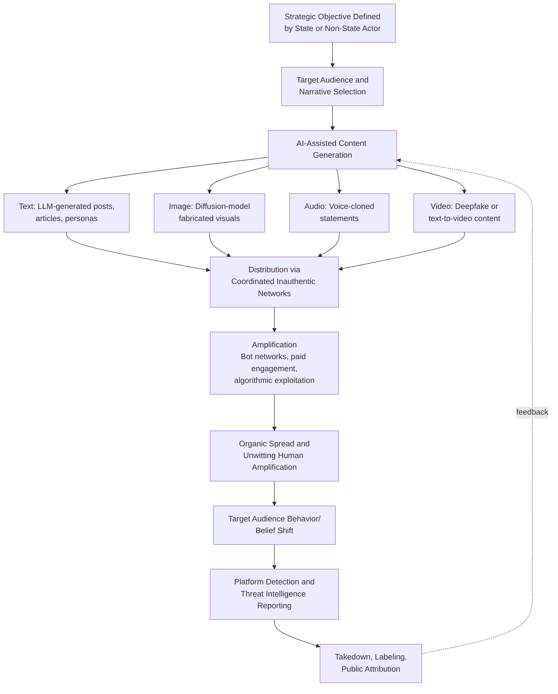

## AI-Driven Information Warfare and Synthetic Media

### Overview

The proliferation of generative AI since roughly 2022 has fundamentally lowered the cost, increased the scale, and improved the sophistication of information operations available to both state and non-state actors. Synthetic media — text, images, audio, and video generated or manipulated by AI systems — now enables disinformation campaigns, election interference, and psychological operations that previously required substantial human labor and specialized production capability. This is an area of rapid technical change; the specific tools, detection methods, and threat actor tactics discussed below reflect the state of the field as of early-to-mid 2026, and analysts should expect continued evolution.

### Core Terminology

| Term | Definition |
| --- | --- |
| **Deepfake** | AI-generated or AI-manipulated audio, image, or video content depicting a person saying or doing something they did not actually say or do |
| **Synthetic media** | Broader term encompassing any AI-generated content (text, image, audio, video), not necessarily deceptive by intent |
| **Disinformation** | False information deliberately spread with intent to deceive |
| **Misinformation** | False information spread regardless of intent (may be shared by people who believe it is true) |
| **Malinformation** | Genuine information shared with intent to cause harm (e.g., leaked private information used out of context) |
| **Information operations (IO)** | Coordinated activities intended to influence, disrupt, corrupt, or usurp adversary decision-making, often as a distinct instrument of state power alongside diplomatic, military, and economic tools |
| **Influence operations (IO, sometimes distinguished from "information operations")** | Term often used specifically for covert or coordinated inauthentic campaigns aimed at shaping public opinion, as distinguished by platforms like Meta and OpenAI in their public threat reporting |
| **Coordinated inauthentic behavior (CIB)** | A term popularized by Meta's threat reporting for networks of accounts working together to mislead users about who is behind the content or its origin |

### Technical Foundations of Synthetic Media Generation

**Text Generation**

Large language models (GPT-family, Claude, Gemini, Llama, and numerous open-weight models) can generate large volumes of contextually coherent, persona-consistent text at near-zero marginal cost, enabling:

- Mass generation of fake social media personas with consistent posting histories and stylistic variation, complicating detection based on repetitive or templated language patterns that characterized earlier troll farm operations.
- Automated translation and localization of propaganda content, allowing a single operation to credibly target multiple language communities without native-speaker staff for each target audience.
- AI-assisted comment and engagement generation to simulate grassroots support or opposition (astroturfing) at a scale difficult to achieve with human operators alone.

**Image Generation**

Diffusion-model-based image generators (Midjourney, DALL-E, Stable Diffusion, and successors) enable:

- Fabricated "evidence" images purporting to show events that did not occur (e.g., fake images of protests, disasters, or military actions).
- Fabricated identity photos for fake social media personas, defeating simple reverse-image-search detection that could previously identify stolen or stock photos used in fake accounts.

**Audio and Voice Cloning**

- Voice cloning technology can now replicate a specific individual's voice from relatively short audio samples, enabling fabricated audio of political figures making statements they never made.
- [Fact] A documented case involved AI-generated robocalls impersonating U.S. President Biden's voice during the January 2024 New Hampshire primary, discouraging voters from participating; this was investigated by the New Hampshire Attorney General's office and led to FCC enforcement action against the individuals responsible for generating and distributing the calls.

**Video Deepfakes**

- Face-swapping and full-body synthesis techniques, along with increasingly capable text-to-video models, allow fabrication of video content depicting real individuals in fabricated scenarios; quality and detectability continue to evolve rapidly, and the gap between synthetic and authentic video is narrowing.
- [Inference] Given the pace of improvement in generative video models through 2025 and into 2026, specific claims about current deepfake video detectability should be treated as time-sensitive; analysts should verify against current detection research rather than relying on older benchmarks.

### State and Non-State Actor Landscape

**Key Points**

- **Russia** — Has a long-documented history of information operations predating the generative AI era (the Internet Research Agency's activity around the 2016 U.S. election being a widely referenced case), and has been assessed by multiple platform threat-intelligence reports (Meta, OpenAI, Microsoft) to be incorporating generative AI tools into ongoing influence operations targeting Ukraine-related narratives and Western audiences.
- **China** — State-linked influence operations (including networks publicly attributed by researchers to activity sometimes referred to as "Spamouflage" or "DRAGONBRIDGE") have been documented using AI-generated content, including synthetic news anchor personas, to amplify pro-China narratives and criticize adversaries across multiple platforms and languages.
- **Iran** — Has been assessed by platform threat reports as an active user of AI-assisted influence operations, particularly targeting audiences in the Middle East and around U.S. domestic political discourse.
- **Non-state and commercial actors** — "Influence-operations-as-a-service" providers, sometimes operating with plausible deniability for state clients, have been identified in threat research; the commercialization of these capabilities lowers the barrier for smaller state and non-state actors to conduct operations previously requiring substantial in-house capability.
- **Domestic political actors** — Generative AI tools are also used by domestic political campaigns and partisan actors within democracies for both legitimate campaign content and, in documented cases, deceptive synthetic content targeting domestic political opponents, blurring the line between foreign information warfare and domestic disinformation as a distinct but related risk category.

[Inference] Public attribution of specific influence operations to specific state sponsors, even when made by credible platform threat-intelligence teams or government agencies, generally reflects assessed confidence levels rather than definitive forensic proof in the way a criminal conviction would require; risk analysts should track the confidence language used in original attribution reports rather than treating attributions as uniformly certain.

### Platform and Industry Response Mechanisms

- **Content provenance standards** — The Coalition for Content Provenance and Authenticity (C2PA), backed by Adobe, Microsoft, OpenAI, and other major technology firms, has developed technical standards for embedding cryptographically verifiable metadata about content origin and edit history into digital media.
- **AI-generated content labeling** — Major platforms (Meta, YouTube, TikTok) and AI providers have implemented policies requiring or applying labels to AI-generated or manipulated content, with varying degrees of enforcement consistency and detection accuracy.
- **Threat intelligence reporting** — OpenAI, Meta, Microsoft, and Google have each published periodic public reports documenting state-linked influence operations detected using their platforms or tools, representing a relatively new form of quasi-public attribution reporting distinct from traditional government intelligence assessments.
- **Detection tooling limitations** — Automated deepfake and AI-text detection tools face a persistent adversarial dynamic: as detection methods improve, generation methods adapt to evade them, and detection accuracy claims made by any given tool should be treated as provisional and context-dependent rather than as a permanently solved technical problem. [Unverified] Specific detection accuracy percentages cited by commercial detection tools vary widely by content type, generation method, and testing methodology; such figures should be independently verified against recent, peer-reviewed benchmarks rather than vendor claims.

### Electoral and Democratic Process Risk

**Example**

During 2024's unusually dense global election calendar (covering roughly half the world's population across major elections including India, the U.S., the EU, Indonesia, and others), multiple documented instances of AI-generated content targeting electoral processes were reported by election monitoring organizations and platform threat researchers, including fabricated candidate statements and voice-cloned robocalls of the type described above. [Inference] Despite widespread anticipatory concern that generative AI would produce large-scale electoral disruption in 2024, post-election assessments by several research organizations suggested that documented AI-driven disinformation, while real and concerning, did not appear to be a dominant or decisive factor in most major election outcomes that year; this remains an area of ongoing research and the assessment could evolve as more rigorous post-hoc analysis is published.

### Analytical Frameworks for Assessing Information Warfare Risk

**Key Points**

- **ABC Framework (Actor, Behavior, Content)** — A widely referenced framework (associated with researchers including Camille François) for analyzing influence operations by separately assessing the actor behind the campaign, the behavior (coordination patterns, inauthenticity), and the content itself, avoiding over-reliance on content analysis alone since sophisticated operations increasingly use authentic-seeming, factually accurate content deployed in coordinated inauthentic ways.
- **Network analysis over individual content review** — Given the volume of AI-generated content, modern detection increasingly relies on identifying coordination patterns (synchronized posting, shared infrastructure, anomalous account creation patterns) rather than attempting to assess the authenticity of each individual piece of content.
- **Narrative tracking over fact-checking alone** — Given the speed of content generation, analysts increasingly track the propagation and evolution of narratives across platforms and languages rather than attempting exhaustive piece-by-piece fact-checking, which cannot scale to match generative content volume.

### Illustration: Information Operation Lifecycle with AI Augmentation

### Implications for Geopolitical Risk Practice

- **Reduced signal reliability from open-source social media monitoring** — As synthetic content volume grows, analysts relying on social media sentiment or trending narratives as an input to risk models must increasingly account for the possibility that observed "public sentiment" is partly or wholly synthetic, complicating a previously valuable open-source intelligence stream.
- **Escalation risk from fabricated crisis triggers** — A sufficiently convincing fabricated video or audio clip depicting a military incident, leader statement, or atrocity carries a theoretical risk of triggering real diplomatic or even military escalation before verification can occur, a scenario increasingly discussed in crisis-stability and escalation-risk literature. [Speculation] While this scenario is widely discussed as a plausible future risk in expert commentary, a clear-cut documented case of a deepfake directly triggering a significant military escalation has not been definitively established as of the current knowledge base; this should be treated as an anticipated risk rather than a demonstrated historical pattern.
- **Erosion of a shared evidentiary baseline ("liar's dividend")** — A secondary risk, sometimes termed the "liar's dividend," is that the mere existence of convincing synthetic media allows bad-faith actors to dismiss genuine, authentic evidence (real video, real audio) as fabricated, complicating accountability and verification processes independent of any specific fake content being produced.

### Related Topics

- Content provenance standards and technical authentication (C2PA)
- Election security and the 2024–2028 global election cycle
- Platform threat-intelligence reporting as a geopolitical risk source
- Network analysis and coordinated inauthentic behavior detection methodology
- The "liar's dividend" and epistemic erosion in open societies
- AI governance and regulatory responses (EU AI Act, U.S. executive actions)
- Escalation risk and crisis stability in the age of synthetic media