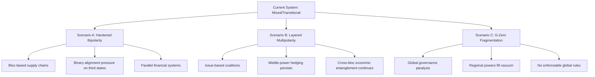

## Contested Futures: Multipolarity versus Renewed Bipolarity

### Definition and Conceptual Framing

**Multipolarity** describes an international system with three or more comparable centers of power (poles) that independently shape outcomes, none possessing hegemonic capacity to dictate terms to the others. **Bipolarity** describes a system dominated by two comparable poles whose relative power and alliance structures overshadow all other actors, historically exemplified by the US-Soviet Cold War (1947-1991).

"Renewed bipolarity" refers to the thesis that the post-Cold War unipolar/multipolar interregnum is consolidating into a US-China-centered bipolar structure, with other powers (EU, Russia, India, Japan) relegated to secondary or swing-state roles. This is contested terrain in international relations (IR) theory and applied geopolitical risk analysis, since the two structures imply materially different risk models, alliance dynamics, and forecasting assumptions.

### Why This Distinction Matters for Risk Analysis

The polarity assumption an analyst adopts drives:

- **Alliance risk modeling** — bipolar systems suggest binary bloc alignment pressure on third countries; multipolar systems suggest issue-based coalition flexibility.
- **Escalation dynamics** — bipolar rivalry (per structural realism) is theorized as more stable/predictable at the systemic level (fewer dyads to miscalculate) but with higher-stakes crises; multipolarity is theorized as less stable due to more potential conflict dyads and shifting coalitions.
- **Economic decoupling forecasting** — bipolar framing supports "bloc fragmentation" / friend-shoring scenarios; multipolar framing supports continued cross-bloc economic entanglement with selective de-risking.
- **Client-facing scenario construction** — sovereign risk, supply chain, and political risk deliverables need an explicit polarity assumption stated up front, since it silently conditions every downstream probability estimate.

### Core Theoretical Lineage

- **Kenneth Waltz (Theory of International Politics, 1979)** — argued bipolarity is inherently more stable than multipolarity because it simplifies threat perception and reduces the number of great-power dyads requiring management. [Widely cited, foundational neorealist claim]
- **John Mearsheimer (offensive realism)** — extends this logic, arguing unbalanced multipolarity (one especially powerful state among several) is the most war-prone configuration.
- **Karl Deutsch and J. David Singer (1964)** — countered Waltz, arguing multipolarity distributes attention and capabilities across more actors, reducing the intensity of any single rivalry and thus lowering war probability — a direct theoretical rebuttal that remains contested today.
- **Charles Krauthammer's "unipolar moment" (1990)** — the post-Cold War thesis that the system briefly became unipolar under US primacy; most current debate is about what structure succeeded that moment.

**Key Points**

- No consensus exists on which structure is more war-prone; this is an open empirical and theoretical debate, not settled science.
- Polarity is a structural (systemic-level) variable in neorealism; it says nothing directly about regime type, ideology, or economic interdependence, which other theoretical traditions (liberalism, constructivism) treat as independent, sometimes more decisive, variables.

### The Case for Renewed Bipolarity

Proponents point to a convergent set of indicators:

1. **Concentration of relative capability** — the US and China are the only two states with (a) blue-water naval projection at scale, (b) frontier semiconductor/AI ecosystems, (c) GDP (nominal or PPP) an order of magnitude above the next tier, and (d) global-reserve or near-global-reserve currency ambitions (USD vs. RMB internationalization efforts).
2. **Technology bifurcation** — export controls (US CHIPS Act, entity lists, Wassenaar-style multilateral controls) and Chinese self-sufficiency drives (semiconductor localization, indigenous EDA tools) are producing parallel, non-interoperable tech stacks — the clearest bipolar signal in the current system.
3. **Alliance bloc-hardening** — NATO enlargement/cohesion (particularly post-2022), QUAD, AUKUS, and Chinese-anchored structures (SCO expansion, BRICS+ enlargement) are read by proponents as evidence of consolidating blocs.
4. **Ideological framing by principals** — explicit US framing of "democracies vs. autocracies" (Biden administration rhetoric) and Chinese/Russian framing of a "multipolar world order" as a normative goal (paradoxically, Beijing's own preferred term) illustrate competing narrative projects layered atop the material structure.

### The Case for Continued/Deepening Multipolarity

Counter-evidence and arguments:

1. **Middle-power agency and hedging** — India, Turkey, Saudi Arabia, Indonesia, Brazil, and South Africa (the "Global South swing states") demonstrably refuse binary alignment: India buys Russian energy and US/French weapons systems simultaneously; Gulf states host US bases while deepening Chinese trade and Russian security ties. This behavior is inconsistent with a clean bipolar bloc model.
2. **Fragmented institutional landscape** — the EU (as an economic pole with limited unified hard power), Russia (degraded conventional capability but retained nuclear/energy leverage), Japan (economic/technological pole, constitutionally constrained military), and India (demographic and growing economic pole) each exercise independent agenda-setting power inconsistent with a two-pole model.
3. **Issue-based multipolarity** — poles vary by domain: the US and China dominate AI/tech; OPEC+ (Saudi-Russia coordination) dominates energy pricing; the EU dominates regulatory standard-setting (the "Brussels Effect") for data and product standards globally. A single global polarity metric may be conceptually inadequate when power is domain-specific.
4. **Economic interdependence persistence** — despite "decoupling" rhetoric, US-China bilateral trade and financial linkages remain substantial [Inference: exact figures fluctuate year to year and are contested in interpretation — decline in some categories coexists with growth in others, e.g., indirect trade via Vietnam/Mexico], undermining a clean bipolar bloc-separation model.

### A Synthesis Framework: Layered Polarity

A practical resolution used in applied risk analysis is to reject a single global polarity label and instead assess polarity **per domain**:

| Domain | Structure | Key Poles |
| --- | --- | --- |
| Military/hard power (global reach) | Bipolar-leaning | US, China |
| Nuclear deterrence | Multipolar | US, Russia, China, France, UK, India, Pakistan, Israel (undeclared), North Korea |
| Economic output | Multipolar, bipolar-trending | US, China, EU, India, Japan |
| Reserve currency/finance | Unipolar-leaning, contested | USD-dominant, RMB/multipolar-currency aspirations |
| Frontier technology (AI, semiconductors) | Bipolar-hardening | US (+allies), China |
| Energy production/pricing | Multipolar | US, Saudi Arabia, Russia, OPEC+ |
| Regulatory/normative standard-setting | Multipolar | EU, US, China |
| Regional security architecture (South Asia, Middle East, Africa) | Multipolar | Regional powers with limited great-power veto |

This layered approach lets an analyst avoid a false binary and instead state, precisely, "the technology domain is bipolarizing while the diplomatic-coalition domain remains multipolar" — a far more falsifiable and useful claim.

### Indicators and Metrics Used to Track Polarity Shifts

- **Composite Index of National Capability (CINC)** — Correlates of War project metric combining military expenditure/personnel, energy consumption, and population/urban population; used to track relative-power concentration over time.
- **GDP share (PPP and nominal) of top-N states** — concentration ratios (e.g., Herfindahl-Hirschman Index applied to national GDP shares) as a quantifiable multipolarity/bipolarity proxy.
- **Alliance portfolio analysis** — network analysis of defense pacts, arms transfer relationships (SIPRI Arms Transfers Database), and voting alignment (UN General Assembly voting-similarity indices) to detect bloc clustering empirically rather than rhetorically.
- **Trade and investment bloc mapping** — gravity-model deviations in bilateral trade (does trade fall below what economic size/distance would predict, indicating bloc-driven friction) and FDI flow bifurcation.
- **SWIFT/payment-system usage and alternative system growth** (China's CIPS, Russia's SPFS) as a proxy for financial bloc formation. [Inference: growth rates and displacement of SWIFT remain modest to date relative to rhetoric; treat headline claims of "de-dollarization" cautiously]

**Example**

An analyst assessing supply-chain risk for a semiconductor client would not ask "is the world bipolar?" generically. Instead: "In the advanced-node semiconductor domain specifically, capability concentration and export-control architecture indicate hardening bipolarity (US-aligned vs. China-aligned fabrication ecosystems), while in the mature-node/commodity chip domain, multipolar sourcing (Taiwan, South Korea, mainland China, emerging Indian and Vietnamese capacity) remains viable and should be modeled as such for diversification planning."

### Scenario Construction: Three Contested Futures

**Scenario A — Hardened Bipolarity ("New Cold War")**

- Full bloc bifurcation: parallel financial systems, technology stacks, and supply chains.
- Third countries forced into binary alignment on strategic goods (semiconductors, critical minerals, defense).
- Higher predictability of major-power behavior; lower predictability/higher volatility for swing states caught between blocs.
- Historical analogy: Cold War bloc structure, though disanalogous given far deeper US-China economic entanglement than existed between US-USSR.

**Scenario B — Complex/Layered Multipolarity**

- No clean bloc lines; issue-specific coalitions (climate, trade, security) with shifting membership.
- Middle powers retain meaningful agenda-setting power via minilateral groupings (QUAD, I2U2, various trilateral formats).
- Higher systemic unpredictability but potentially lower risk of direct great-power confrontation due to cross-cutting interests creating restraint.

**Scenario C — "G-Zero" / Non-polar Fragmentation**

- Distinct from both above: no pole (or pair of poles) is able to set and enforce global rules at all; global governance institutions (UN Security Council, WTO, IMF) are functionally paralyzed.
- Regional powers manage regional orders with minimal external great-power enforcement capacity.
- Associated with the "G-Zero" concept (Ian Bremmer) — [this is a named analytical framework, not a consensus forecast].

### Indicators to Monitor Going Forward

- **Taiwan Strait crisis trajectory** — a kinetic conflict or severe coercion short of war would be the strongest single accelerant toward Scenario A.
- **Export control scope creep or rollback** — whether US/allied technology controls broaden (more bipolar) or are calibrated/narrowed (more multipolar-compatible) over coming budget/policy cycles.
- **BRICS+ institutional deepening** — whether the New Development Bank, a potential BRICS payment mechanism, or expanded membership produces functional (not merely rhetorical) alternative institutions.
- **India's alignment trajectory** — as the largest genuine swing state, sustained Indian non-alignment behavior is the strongest evidence against clean bipolarity; a decisive Indian tilt toward either pole would be strong evidence for it.
- **EU strategic autonomy progress** — defense-industrial integration and reduced dependence on US security guarantees would indicate the EU consolidating as an independent pole rather than a US-bloc adjunct.

**Conclusion**

The multipolarity-versus-bipolarity debate is not resolvable with current evidence into a single clean answer, and geopolitical risk practitioners should treat "which structure are we in" as domain-dependent and time-variant rather than a fixed global label. The most defensible working model as of this writing is **asymmetric/layered transition**: hardening bipolar dynamics in the technology and hard-security domains, coexisting with genuine multipolar agency in economic, energy, and diplomatic domains. [Inference: this synthesis reflects the current balance of expert commentary and structural indicators rather than a settled academic consensus, and could shift materially with a major discontinuity such as a Taiwan crisis, a change in Indian alignment, or a US or Chinese domestic political shock.]

**Related Topics**

- Great power competition and the Thucydides Trap framework
- Middle powers and strategic hedging behavior (India, Turkey, Gulf states)
- Technology bifurcation and the "Splinternet"/parallel tech stacks
- De-dollarization: rhetoric versus empirical financial data
- BRICS+ expansion and alternative multilateral institutions
- Alliance cohesion metrics: NATO, QUAD, AUKUS, SCO
- The G-Zero world and global governance paralysis
- Composite Index of National Capability (CINC) and other power-measurement methodologies
- Regional order formation absent great-power enforcement (Middle East, Sahel, South Caucasus)