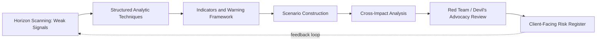

## Anticipating the Next Generation of Geopolitical Risks

### Purpose and Scope

This topic addresses methodology and substance for identifying, structuring, and forecasting geopolitical risks that are emergent, non-linear, or not yet fully captured by traditional country-risk frameworks. It combines (1) a substantive survey of candidate "next-generation" risk categories and (2) the analytical methods used to detect and forecast them before they mature into conventional, well-documented risks.

### Why Traditional Frameworks Are Insufficient

Legacy political risk models (expropriation risk, sovereign default probability, election-cycle instability indices) were built around **state-centric, discrete-event risks** with reasonably stable historical base rates. Next-generation risks frequently violate the assumptions those models depend on:

- **Non-state and networked actors** (transnational criminal organizations, hacktivist collectives, decentralized ideological movements) don't fit sovereign-risk scoring frameworks built around government actions.
- **Cross-domain contagion** — a cyber incident, a climate shock, and a financial crisis can now cascade into one another within a single event chain, defeating siloed single-domain models.
- **Thin or absent historical base rates** — many emergent risks (AI-enabled disinformation at scale, orbital/space-domain conflict, novel biotechnology misuse) have few or no historical precedents to calibrate probability estimates against.
- **Compressed timelines** — technology-enabled risks can escalate from emergence to crisis in weeks or months rather than the years typical of traditional political risk maturation (e.g., a currency crisis building over quarters).

**Key Points**

- The core analytical shift required is from *event-based* forecasting (will X happen) to *systemic/structural* monitoring (which underlying conditions are shifting, and toward what range of outcomes).
- Next-generation risk analysis should be treated as a discipline of **early-warning indicator design**, not point-prediction.

### Candidate Risk Categories

**1. Technology-Enabled Geopolitical Risk**

- **AI-enabled information operations** — generative AI lowering the cost of producing tailored disinformation/deepfakes at scale, complicating attribution and electoral-integrity risk assessment.
- **Autonomous weapons systems and AI-military integration** — the erosion of clear human decision loops in escalation chains, raising novel crisis-stability questions absent from Cold War-era deterrence theory.
- **Cyber-physical infrastructure risk** — attacks on power grids, water systems, and industrial control systems (ICS/SCADA) blur the line between criminal, terrorist, and state action, complicating attribution-dependent response frameworks (e.g., NATO Article 5 threshold ambiguity for cyber incidents).
- **Critical mineral and semiconductor chokepoints** — geographic concentration of lithium, cobalt, rare earths, and advanced fabrication capacity (Taiwan, DRC, specific Chinese processing facilities) creates supply risk exposures with limited historical precedent at this scale.

**2. Climate-Security Nexus Risk**

- **Climate-induced migration and resource stress** — as a *threat multiplier* (widely used framing in defense/intelligence community assessments) rather than a standalone risk category; interacts with existing governance fragility.
- **Arctic geopolitics** — ice melt opening new shipping routes (Northern Sea Route) and resource access, creating a genuinely novel contested space among Arctic Council states plus non-Arctic claimants (notably China's "near-Arctic state" framing).
- **Water stress and transboundary river disputes** — Nile Basin (GERD dispute), Indus, Mekong, and Central Asian basins as recurring flashpoints with climate change altering baseline hydrology.

**3. Biological and Health Security Risk**

- **Dual-use biotechnology proliferation** — declining cost and rising accessibility of gene-editing and synthetic biology tools raising bioweapon and accidental-release risk profiles distinct from Cold War-era state bioweapons programs.
- **Pandemic-driven geopolitical realignment** — post-COVID-19 lessons on supply chain nationalism, vaccine diplomacy as soft-power tool, and WHO/global health governance legitimacy contestation.

**4. Space and Orbital Domain Risk**

- **Anti-satellite (ASAT) weapons testing and debris fields** — Russian, Chinese, Indian, and US ASAT tests creating both direct conflict-escalation risk and shared-commons debris risk affecting all spacefaring actors.
- **Commercial space actor risk** — private constellations (Starlink and analogues) becoming de facto dual-use military infrastructure, raising novel questions about neutrality, targeting law, and corporate-state entanglement in conflict (documented in the Russia-Ukraine conflict context).

**5. Financial and Monetary System Risk**

- **Weaponization of financial infrastructure** — SWIFT exclusion, sanctions-driven reserve diversification, and central bank digital currency (CBDC) development as tools of and hedges against financial statecraft.
- **Sovereign debt distress concentrated in non-traditional creditor relationships** — Chinese bilateral lending opacity complicating traditional Paris Club-style debt restructuring mechanisms (documented in Zambia, Sri Lanka cases).

**6. Demographic and Social Risk**

- **Youth bulge / aging divergence** — sub-Saharan Africa and South Asia's youth bulges versus East Asian and European aging, reshaping long-run labor migration pressure, pension sustainability, and military recruitment capacity across a multi-decade horizon.
- **Algorithmic polarization and domestic political fragmentation** — social-media-driven polarization as a source of *internal* political risk with cross-border spillover (election interference vectors, diaspora radicalization).

### Methodologies for Anticipating Emergent Risk

**Horizon Scanning**

Systematic, wide-aperture environmental scanning (academic literature, patent filings, defense white papers, fringe/frontier online discourse) designed to surface weak signals before they become mainstream risk narratives. Distinguished from forecasting by its explicit goal of *breadth over precision* at the detection stage.

**Structured Analytic Techniques (SATs)**

Widely used in intelligence community tradecraft (per Richards Heuer's *Psychology of Intelligence Analysis* and the US IC's *Structured Analytic Techniques for Intelligence Analysis*):

- **Analysis of Competing Hypotheses (ACH)** — systematically evaluating evidence against multiple hypotheses simultaneously to counter confirmation bias.
- **Key Assumptions Check** — explicitly listing and interrogating the assumptions underlying a forecast before publishing it.
- **Indicators and Warning (I&W) frameworks** — pre-defining observable indicators tied to specific escalation pathways, so analysts can detect movement toward a scenario without needing to predict the scenario's exact timing.

**Scenario Planning and Cross-Impact Analysis**

- Building multiple internally consistent futures (not a single forecast) to stress-test client strategy against a range of plausible next-generation risk combinations.
- **Cross-impact analysis** explicitly models how the occurrence of one emergent risk (e.g., a major cyber incident) shifts the probability of others (e.g., financial contagion, alliance-cohesion strain) — critical for next-generation risks precisely because their defining feature is cross-domain cascading.

**Quantitative and Data-Driven Approaches**

- **Machine learning-based event detection** — using natural language processing (NLP) over news, social media, and grey literature to detect anomalous shifts in sentiment, mobilization language, or elite discourse patterns ahead of conventional media coverage. [Inference: efficacy varies significantly by domain and language coverage; false-positive rates remain a known operational challenge and should be disclosed to clients, not asserted as solved.]
- **Network analysis** applied to non-state actor structures, illicit financial flows, and alliance-portfolio shifts to detect structural realignment before it is politically announced.
- **Agent-based modeling (ABM)** — simulating micro-level actor behaviors (state, corporate, individual) under varying assumption sets to observe emergent macro-level outcomes not predictable from linear extrapolation alone.

**Red Teaming and Devil's Advocacy**

Dedicated adversarial review of an organization's own risk forecasts, structured to surface groupthink and challenge consensus base-rate assumptions — particularly important for next-generation risks where institutional priors are weakest and most likely to anchor on outdated frameworks.

**Example**

An analyst tasked with anticipating "the next Ukraine-scale conflict shock" would not attempt point prediction. Instead: (1) horizon-scan for weak signals across candidate flashpoints (Taiwan Strait, South China Sea, Correa/Guyana-Venezuela border, Sahel coup contagion); (2) build an I&W framework per flashpoint (military mobilization indicators, diplomatic rhetoric shifts, economic pre-positioning); (3) run cross-impact analysis on how each scenario would cascade into commodity markets, alliance cohesion, and financial sanctions architecture; (4) red-team the resulting risk register against the possibility that the actual next shock comes from an unlisted category entirely (e.g., a cyber-triggered financial crisis) — explicitly preserving space for genuine surprise.

### Building an Institutional Early-Warning Capability

1. **Signal repository** — maintain a continuously updated database of weak signals tagged by risk category, geography, and confidence level, distinct from the formal published risk register.
2. **Tripwire indicators** — for each tracked emergent risk, define specific, observable, falsifiable indicators that would suggest escalation (not vague directional statements).
3. **Regular reassessment cadence** — next-generation risks evolve faster than annual country-risk review cycles typically accommodate; quarterly or event-triggered review is standard practice for fast-moving categories (cyber, AI-related).
4. **Cross-disciplinary team composition** — effective next-generation risk anticipation typically draws on regional/political expertise plus technical domain specialists (cyber, climate science, public health, financial systems) rather than relying on generalist political analysts alone.
5. **Explicit uncertainty communication** — given thin historical base rates, next-generation risk products should communicate confidence levels and evidentiary basis explicitly (e.g., using standardized probability-language conventions such as those in the *Words of Estimative Probability* tradition) rather than presenting single-point forecasts as high-confidence conclusions.

### Common Pitfalls

- **Recency bias** — overweighting the most recent crisis type (e.g., over-indexing on cyber risk immediately after a high-profile breach) at the expense of balanced coverage across categories.
- **Historical analogy overreach** — forcing novel risks into Cold War-era or 20th-century analogies that obscure genuinely new dynamics (e.g., treating AI arms competition as a straightforward rerun of nuclear arms racing without accounting for diffusion speed and dual-use commercial availability differences).
- **False precision** — presenting emergent-risk forecasts with specific probabilities or dates when the underlying evidentiary base cannot support that granularity; better practice is qualitative confidence bands tied to explicit indicators.
- **Siloed analysis** — treating technology, climate, financial, and traditional political risk teams as separate workstreams when the defining feature of next-generation risk is cross-domain cascade.

**Conclusion**

Anticipating next-generation geopolitical risk is less about correctly naming which specific event will occur and more about building organizational and analytical infrastructure — horizon scanning, indicator frameworks, cross-impact modeling, and red-teaming — capable of detecting structural shifts before they crystallize into conventional, well-precedented risks. [Inference: given the genuinely thin historical base rates in several categories above (AI-enabled conflict escalation, orbital domain conflict, engineered biological risk), any specific probability or timeline estimate in this space should be treated as a working hypothesis subject to revision, not a settled forecast.]

**Related Topics**

- Structured Analytic Techniques (ACH, Key Assumptions Check) in applied intelligence tradecraft
- Cyber-physical infrastructure risk and attribution challenges
- Critical mineral supply chain chokepoints and de-risking strategies
- Arctic geopolitics and Northern Sea Route contestation
- Dual-use biotechnology governance and biosecurity risk
- Space domain security and anti-satellite weapons proliferation
- Financial statecraft: sanctions, SWIFT, and CBDC development
- Scenario planning and cross-impact analysis methodology
- Words of Estimative Probability and confidence-level communication standards