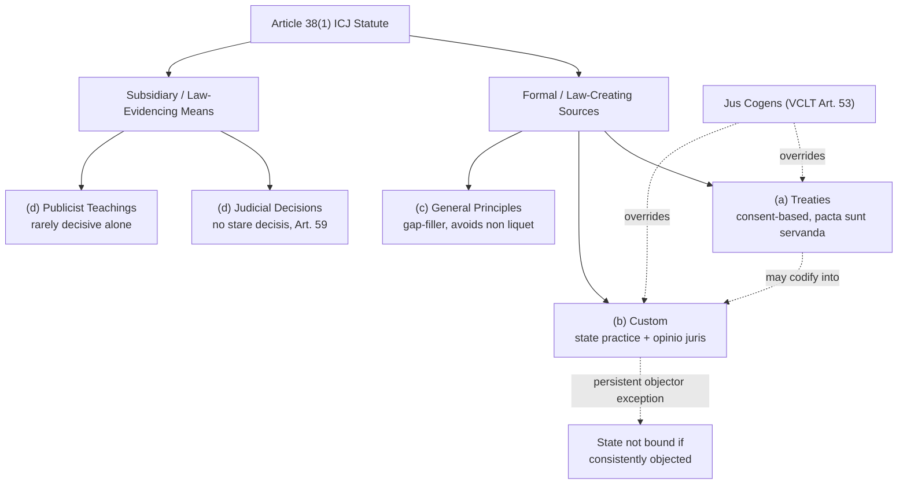

## Article 38(1) of the ICJ Statute and the Formal Enumeration of International Law's Sources

### The Doctrinal Problem: Identifying Law Without a Legislature

Domestic legal systems identify valid law through a clear pedigree: a statute is law because a constitutionally empowered legislature enacted it. International law has no world legislature, so it requires a different test for validity — a "rule of recognition," to use H.L.A. Hart's term, though Hart himself argued international law lacked a fully developed one. Article 38(1) of the Statute of the International Court of Justice (ICJ) functions as the closest thing the international system has to such a rule. It does not itself claim to be a general definition of international law; formally, it is only an instruction to the Court about what materials it may apply when deciding cases. In practice, because the ICJ is the principal judicial organ of the United Nations and its formula has been treated as authoritative by states, other tribunals, and scholars for nearly a century, Article 38(1) has become the near-universal starting point for identifying the sources of international law.

### Text and Structure of Article 38(1)

The provision reads, in relevant part, that the Court, whose function is to decide disputes submitted to it in accordance with international law, shall apply:

1. international conventions, whether general or particular, establishing rules expressly recognized by the contesting states;
2. international custom, as evidence of a general practice accepted as law;
3. the general principles of law recognized by civilized nations;
4. subject to the provisions of Article 59, judicial decisions and the teachings of the most highly qualified publicists of the various nations, as a subsidiary means for the determination of rules of law.

A second paragraph, Article 38(2), permits the Court to decide a case *ex aequo et bono* (according to what is equitable and good, rather than strictly by law) if the parties agree — a mechanism rarely invoked and analytically separate from the sources enumeration.

The provision is nearly verbatim from Article 38 of the Statute of the Permanent Court of International Justice (PCIJ), drafted in 1920 by an Advisory Committee of Jurists. Carrying it forward into the ICJ Statute in 1945 was a deliberate act of continuity, signaling that the new Court's law-identifying function was unchanged from its predecessor.

### Formal Sources vs. Subsidiary Means: The Structural Hierarchy

Article 38(1) draws an important internal distinction, though the text does not use these exact labels. Subparagraphs (a) through (c) — treaties, custom, and general principles — are commonly called the primary or formal sources: instruments through which international law is actually created. Subparagraph (d) — judicial decisions and scholarly writing — is expressly designated a "subsidiary means for the determination of rules of law." A subsidiary means does not create law; it provides evidence of what the law already is under (a), (b), or (c). This distinction matters practically: a scholarly consensus or a line of arbitral awards cannot by itself generate a binding obligation, but it can be cited as authoritative evidence that a treaty provision means X or that a customary rule Y exists.

**Key Points**

- (a)–(c) are law-creating; (d) is law-evidencing only.
- The ordering in the text is not an official hierarchy of legal force — treaty and custom are formally equal in status, with priority between them resolved by *lex specialis* (the more specific rule displaces the general one) and *lex posterior* (the later-in-time rule prevails between the same parties), not by their position in Article 38(1).
- One important exception to formal equality: *jus cogens* norms (peremptory norms of general international law from which no derogation is permitted, codified in Article 53 of the Vienna Convention on the Law of Treaties) sit above ordinary treaty and custom, and a treaty conflicting with a *jus cogens* norm is void.

### Source One: International Conventions (Treaties)

Article 38(1)(a) covers "international conventions, whether general or particular, establishing rules expressly recognized by the contesting states." A treaty binds only states that have consented to be bound — the foundational principle *pacta sunt servanda* (agreements must be kept), codified in Article 26 of the Vienna Convention on the Law of Treaties (VCLT), 1969. This consent-based structure is the clearest illustration of how international law binds sovereigns without a global enforcer: the obligation's source is the state's own will, expressed through signature, ratification, accession, or another means specified in the treaty. A "general" convention (e.g., the UN Charter, with near-universal membership) and a "particular" convention (e.g., a bilateral extradition treaty) are equally treaties for Article 38(1) purposes; the distinction affects scope of application, not legal character.

Treaties bind only parties (the principle of *pacta tertiis nec nocent nec prosunt* — a treaty neither harms nor benefits third parties, VCLT Article 34), with the significant exception that a treaty provision may simultaneously codify or crystallize a rule of customary international law, which then binds non-parties through the customary route rather than the treaty route. This was central to the ICJ's reasoning in *North Sea Continental Shelf* (Germany v. Denmark/Netherlands, 1969), discussed further below.

### Source Two: International Custom

Article 38(1)(b) identifies "international custom, as evidence of a general practice accepted as law." Despite the awkward phrasing (custom is not literally "evidence" of practice; practice plus acceptance constitutes custom), the provision is read as establishing a two-element test:

1. **State practice** — a general and consistent pattern of conduct by states (diplomatic acts, domestic legislation, military manuals, voting patterns in international organizations, official statements).
2. **Opinio juris sive necessitatis** ("opinion that it is law" or "opinion of necessity") — the subjective belief among states that the practice is followed out of a sense of legal obligation, not mere habit, courtesy, or political convenience.

Both elements are required; practice alone (however uniform) is not law without accompanying *opinio juris*, and asserted *opinio juris* without supporting practice is not law either. This is the doctrine's chief practical difficulty: distinguishing legally motivated conduct from politically or diplomatically motivated conduct that merely looks similar. The ICJ addressed the standard for *opinio juris* directly in *North Sea Continental Shelf*, holding that for a treaty rule to have passed into custom binding non-parties, state practice must be "extensive and virtually uniform" and, critically, states must have felt they were conforming to a legal obligation, not merely acting out of convenience or political expedience — the Court found this insufficiently shown for the equidistance principle in continental shelf delimitation.

A subsidiary doctrine, the **persistent objector rule**, allows a state that has consistently and openly objected to an emerging customary rule during its formation to avoid being bound by it once it crystallizes — an exception recognized in principle (e.g., referenced in the *Fisheries* case, UK v. Norway, 1951) though rarely successfully invoked in practice, since it requires objection from the rule's earliest emergence, not after the fact.

**[Unverified]** The precise quantum of state practice needed to satisfy "general" practice (how many states, over what duration, with what density) is not fixed by any authoritative formula and remains genuinely contested among scholars and in state practice itself.

### Source Three: General Principles of Law

Article 38(1)(c) refers to "the general principles of law recognized by civilized nations" — a phrase whose "civilized nations" wording is now understood as reflecting 1920s drafting convention rather than a substantive limitation, and which is functionally read today as principles common to the world's major legal systems. This source exists to prevent *non liquet* — a situation in which a tribunal cannot decide a case because no applicable treaty or custom exists. General principles are typically derived by comparative analysis of domestic legal systems and imported into the international plane: examples include good faith, *res judicata* (a matter already judged cannot be relitigated), estoppel, the principle that no one may benefit from their own wrong, and rules of evidence and procedure. General principles are used sparingly by the ICJ relative to treaty and custom, functioning as a gap-filling source rather than a primary generator of substantive obligations.

### Source Four (Subsidiary): Judicial Decisions

Article 38(1)(d) authorizes reliance on "judicial decisions," expressly "subject to the provisions of Article 59." Article 59 of the ICJ Statute states that a Court decision "has no binding force except between the parties and in respect of that particular case" — a formal rejection of *stare decisis* (binding precedent) as a doctrine of international law. There is no formal *rule* that the ICJ must follow its own prior reasoning. In practice, however, the Court cites and follows its own precedent with a high degree of consistency, and its judgments carry substantial persuasive authority precisely because Article 38(1)(d) designates them a recognized means of determining what the law is. "Judicial decisions" is read broadly to include not only ICJ and PCIJ judgments but also arbitral awards and, with appropriate weight, decisions of other international tribunals (e.g., the International Tribunal for the Law of the Sea, WTO panels, regional human rights courts) and, at times, domestic court decisions addressing international law questions.

### Source Four (Subsidiary): Publicist Teachings

The same subparagraph permits reliance on "the teachings of the most highly qualified publicists of the various nations." This reflects the historical reality that early international law was substantially a product of academic treatise-writing (Grotius, Vattel), and it remains formally available to the Court, though in modern practice the ICJ cites individual scholars only rarely and sparingly, typically to confirm a conclusion otherwise reached through treaty or custom analysis rather than as an independent basis for decision.

### Is Article 38(1) an Exhaustive and Closed List?

A significant theoretical debate concerns whether Article 38(1) is a complete and closed enumeration of international law's sources, or merely an illustrative snapshot reflecting 1920s legal thought.

**The traditional/positivist position** holds that Article 38(1) is exhaustive: because international law rests on state consent, and (a)–(c) capture the only recognized mechanisms by which states generate binding obligations (agreement, general practice with legal conviction, and principles common to domestic systems), nothing outside this list can bind a state without its consent.

**The revisionist/modernist position** argues the list is incomplete or outdated, pointing to phenomena Article 38(1) does not clearly accommodate:

- **Unilateral acts of states** (e.g., declarations capable of creating legal obligations, as the ICJ held regarding France's unilateral declaration in the *Nuclear Tests* cases, Australia/New Zealand v. France, 1974) do not fit neatly into any of (a)–(c).
- **Resolutions of international organizations**, particularly UN General Assembly resolutions, are not treaties and are not binding under the UN Charter, yet the ICJ has treated certain resolutions as evidence of, or catalysts for, emerging *opinio juris* (as discussed in its *Nicaragua* merits judgment, 1986, and its *Nuclear Weapons* Advisory Opinion, 1996) — a role that stretches (b) rather than sitting outside it, but illustrates the category's elasticity.
- **Soft law instruments** (non-binding codes of conduct, guidelines, declarations) increasingly influence state behavior and treaty negotiation without being law themselves, occupying an ambiguous pre-legal or quasi-legal space Article 38(1) does not name.

**[Inference]** The more defensible synthesis, reflected in mainstream scholarship (e.g., Crawford's revisions to Brownlie's *Principles of Public International Law*), is that Article 38(1) remains the correct *starting taxonomy* — every binding rule ultimately traces to treaty, custom, or general principles — while unilateral acts and organizational practice are best understood as specialized mechanisms operating through or alongside category (b) rather than as freestanding fourth and fifth sources.

### Why This Matters for a State Without a Global Enforcer

The absence of a centralized legislature and a compulsory global enforcement mechanism means international law's binding force rests on horizontal, decentralized mechanisms: state consent (treaty), demonstrated general practice coupled with legal conviction (custom), and reciprocity-based compliance incentives (reputational cost, countermeasures, diplomatic and economic consequences of an internationally wrongful act under the law of state responsibility). Article 38(1) does not solve the enforcement problem — it solves the *identification* problem, telling a court (and, by extension, states and their legal advisers) what counts as law in the first place, which is the logically prior question to any enforcement inquiry.

### Application to Philippine Interests: UNCLOS and the South China Sea Arbitration

The interplay of Article 38(1)'s categories is directly illustrated by the *South China Sea Arbitration* (Philippines v. China, PCA Case No. 2013-19, Award of 12 July 2016), constituted under Annex VII of the UN Convention on the Law of the Sea (UNCLOS). The case is instructive precisely because it shows treaty and custom operating in combination and in tension:

- **Treaty basis**: The Tribunal's jurisdiction and much of its substantive law derived directly from UNCLOS as a treaty under Article 38(1)(a) — specifically, provisions on the legal status of maritime features (Article 121, regime of islands) and the entitlement to maritime zones.
- **Custom in tension with treaty**: China's "nine-dash line" claim to historic rights within the relevant sea areas was assessed against UNCLOS. The Tribunal held that, to the extent China's claimed historic rights exceeded the entitlements UNCLOS itself allows, those claims were extinguished by UNCLOS's entry into force, since UNCLOS comprehensively allocates rights to maritime areas and superseded any earlier historic rights regime inconsistent with it — an application of treaty displacing an asserted (and contested) customary or historic claim between the same parties.
- **Subsidiary means**: The Tribunal drew on prior UNCLOS Annex VII awards and ICJ jurisprudence on island and rock status as persuasive authority under the logic of Article 38(1)(d), despite the formal absence of binding precedent.

The Award found that none of the features claimed by China in the Spratly Islands qualified as an "island" under UNCLOS Article 121(3) capable of generating an exclusive economic zone or continental shelf, and that China's large-scale land reclamation activities violated its obligations under UNCLOS provisions on protection of the marine environment. China did not participate in the proceedings and rejected the Award's validity, an illustration of the enforcement gap discussed above: the ruling was legally binding on the parties under UNCLOS Annex VII (Article 296; Annex VII Article 11) as a matter of treaty law, but its practical effect depended on diplomatic, political, and reputational pressure rather than any centralized enforcement mechanism.

### Diagram: Article 38(1) Source Hierarchy and Function

### Related Topics

- The two-element theory of customary international law: state practice and *opinio juris* in depth
- The Vienna Convention on the Law of Treaties (1969): formation, interpretation (Articles 31–33), and invalidity of treaties
- *Jus cogens* and *erga omnes* obligations
- The law of state responsibility and countermeasures as decentralized enforcement mechanisms
- UNCLOS dispute settlement under Part XV and Annex VII arbitration
- The *North Sea Continental Shelf* cases and the doctrine of treaty-to-custom crystallization
- Soft law and the legal status of UN General Assembly resolutions