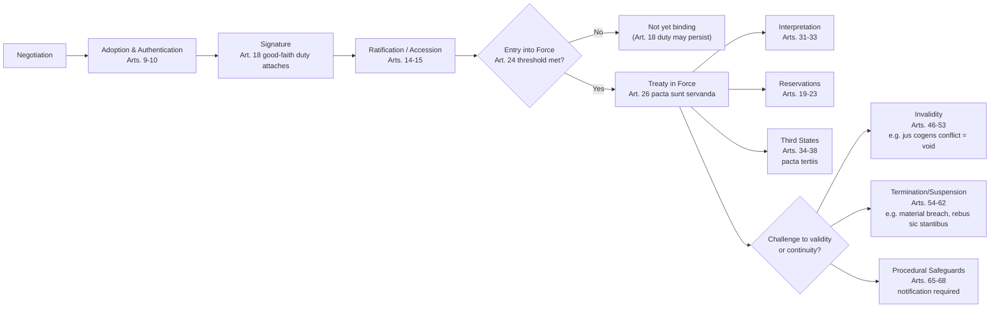

## Treaties as a Source of Law: The Vienna Convention on the Law of Treaties Framework

### Doctrinal Foundation: Why Treaties Bind

Recall that Article 38(1)(a) of the ICJ Statute identifies "international conventions" as the first formal source of international law, and that treaty obligations rest on state consent rather than any external legislative authority. The Vienna Convention on the Law of Treaties (VCLT), adopted 23 May 1969 and in force from 27 January 1980, is the "treaty on treaties" — a codification (with some progressive development) of customary international law governing the formation, interpretation, operation, and termination of treaties. The ICJ has repeatedly held that many VCLT provisions reflect pre-existing customary law and therefore bind even non-parties to the Convention itself, a point made explicit in *Namibia* (Advisory Opinion, 1971) regarding termination for breach, and reaffirmed regarding interpretation in numerous later cases. The Philippines is a VCLT party; so, notably, is China, making the VCLT framework directly applicable background law to instruments like UNCLOS in disputes such as the South China Sea Arbitration.

The VCLT's foundational principle is **pacta sunt servanda** — "agreements must be kept" — codified in Article 26: "Every treaty in force is binding upon the parties to it and must be performed by them in good faith." This is the doctrinal answer to how international law binds sovereigns absent a global enforcer: a state's obligation originates in its own prior act of consent, and the expectation of continued compliance is reinforced by the good-faith principle rather than by coercive sanction.

### Definition and Scope (Article 1–3)

Article 2(1)(a) defines a "treaty" for VCLT purposes as "an international agreement concluded between States in written form and governed by international law, whether embodied in a single instrument or in two or more related instruments and whatever its particular designation." Several elements of this definition carry doctrinal weight:

- **Between States**: The VCLT itself governs only state-to-state treaties; agreements involving international organizations are governed by the largely parallel 1986 Vienna Convention on the Law of Treaties between States and International Organizations or between International Organizations (not yet in force but reflective of customary practice).
- **Written form**: This is a definitional limitation of the VCLT's own scope, not a statement that oral agreements cannot bind states under general international law — Article 3 expressly preserves the legal force of non-written international agreements, only excluding them from the VCLT's specific rules.
- **Governed by international law**: An agreement between states governed by the domestic law of one party (a commercial contract, for instance) is not a treaty in this sense.
- **Whatever its particular designation**: Legal character does not depend on nomenclature. A "Convention," "Covenant," "Protocol," "Charter," "Exchange of Notes," or "Memorandum of Understanding" can each be a treaty if the substantive definition is met; conversely, an instrument styled a "treaty" that lacks the requisite intent to create binding legal obligations may not be one. Intent to be legally bound is the operative test, assessed objectively from the instrument's terms and circumstances of conclusion.

### Formation and Expression of Consent to Be Bound

**Key Points**

The VCLT structures treaty formation around a sequence of discrete legal acts, each carrying distinct consequences:

- **Adoption and authentication (Articles 9–10)**: The text is settled and fixed, typically by signature, initialing, or a formal act such as a conference vote (commonly two-thirds of states present and voting, per Article 9(2), absent agreement on a different procedure).
- **Signature**: Signature alone does not generally bind a state to the treaty's substantive obligations unless the treaty specifies that signature suffices for consent (Article 12) or the treaty is one of the narrower class intended to enter into force upon signature. Signature does, however, trigger an important interim obligation under **Article 18**: a signatory state must refrain from acts that would defeat the treaty's object and purpose pending ratification, unless it has made clear its intention not to become a party. The United States' signature-without-ratification of certain treaties (e.g., historically, aspects of its posture toward the Rome Statute) is frequently analyzed through this Article 18 lens.
- **Ratification, acceptance, approval, or accession (Articles 14, 15)**: These are the principal means by which a state formally expresses definitive consent to be bound, typically following domestic constitutional procedures (in the Philippines, Senate concurrence by a two-thirds vote under Article VII, Section 21 of the 1987 Constitution). Accession is the mechanical equivalent used by a state that did not participate in the original negotiation/signature process but wishes to become a party afterward.
- **Entry into force (Article 24)**: Governed by the treaty's own terms — commonly a fixed number of ratifications, or a set date, or immediate entry into force upon signature for simpler instruments. Until this threshold is met, the treaty does not yet bind even states that have completed ratification, though the Article 18 good-faith obligation may still apply to signatories.

### Reservations (Articles 19–23)

A **reservation** is a unilateral statement made by a state when signing, ratifying, or acceding to a treaty, purporting to exclude or modify the legal effect of certain provisions in their application to that state (Article 2(1)(d)). Reservations are the VCLT's principal mechanism for reconciling universal treaty participation with divergent state interests, and they are a frequent point of confusion for students because the underlying test is compatibility-based rather than simply "permitted or forbidden."

Article 19 establishes the baseline rule: a state may formulate a reservation unless (a) the treaty prohibits reservations altogether, (b) the treaty permits only specified reservations not including the one in question, or (c) the reservation is incompatible with the treaty's object and purpose. This last ground — the **object-and-purpose test** — was articulated by the ICJ in its landmark *Reservations to the Genocide Convention* Advisory Opinion (1951), which rejected the older customary rule requiring unanimous acceptance of a reservation by all other parties, replacing it with a more flexible compatibility standard suited to multilateral human-rights-type treaties with broad membership goals.

The legal effects of a valid reservation (Article 21) are: (i) it modifies the treaty provision as between the reserving state and any state that accepts the reservation, to the extent of the reservation; (ii) it modifies the same provision reciprocally as between the reserving state and an accepting state; and (iii) it does not modify the provision as between other parties to the treaty inter se. A state may formally **object** to another's reservation (Article 20–21); an objection does not prevent treaty entry into force between the two states unless the objecting state expressly indicates that intention.

**[Inference]** Human rights treaty bodies (e.g., the UN Human Rights Committee, in its General Comment No. 24) have argued that reservations incompatible with a treaty's object and purpose should simply be severed — leaving the reserving state bound by the full treaty — rather than invalidating that state's participation altogether; this position remains contested by states as an overreach of a monitoring body's competence relative to Article 19's state-consent-centered design.

### Interpretation (Articles 31–33)

Articles 31–33 codify what is widely regarded as customary international law on treaty interpretation and are cited routinely by the ICJ, WTO panels, and investor-state tribunals alike.

**Article 31(1) — the general rule**: "A treaty shall be interpreted in good faith in accordance with the ordinary meaning to be given to the terms of the treaty in their context and in the light of its object and purpose." This is a single, integrated rule combining textual, contextual, and teleological elements — not a hierarchy of methods to be applied sequentially, though in practice tribunals typically begin with ordinary meaning.

"Context" under Article 31(2) includes the treaty's text, preamble, and annexes, plus any agreement relating to the treaty made between all parties in connection with its conclusion, and any instrument made by one or more parties in connection with conclusion and accepted by the others as related to the treaty. Article 31(3) directs that context be read together with: (a) subsequent agreements between the parties regarding interpretation; (b) subsequent practice establishing agreement of the parties regarding interpretation; and (c) any relevant rules of international law applicable between the parties — the last of which is the textual hook for the principle of **systemic integration**, treating international law as a coherent legal system rather than isolated treaty silos.

**Article 32 — supplementary means**: Preparatory work (*travaux préparatoires*) and the circumstances of the treaty's conclusion may be used only to confirm the meaning resulting from Article 31, or to determine the meaning when Article 31 interpretation leaves the meaning ambiguous, obscure, or leads to a manifestly absurd or unreasonable result. This subordinate role for drafting history is a deliberate rejection of the more subjective, intent-of-the-parties-centered approach that dominated earlier eras of treaty interpretation, in favor of an objectified, text-centered method.

**Article 33 — plurilingual treaties**: Where a treaty is authenticated in two or more languages, each text is presumed equally authoritative unless the treaty provides that one text prevails; where comparison of texts reveals a difference in meaning not resolved by Articles 31–32, the meaning that best reconciles the texts, having regard to the treaty's object and purpose, is adopted.

### Third States (Articles 34–38)

Codifying the principle *pacta tertiis nec nocent nec prosunt*, Article 34 states the default rule: "A treaty does not create either obligations or rights for a third State without its consent." Articles 35–36 provide the narrow exceptions — a treaty may create an obligation for a third state only if the parties so intend and the third state expressly accepts that obligation in writing; a treaty may create a right for a third state if the parties so intend and the third state assents (assent is presumed unless indicated otherwise, for rights specifically). Article 38 separately preserves the possibility that a treaty rule may become binding on a third state as a matter of customary international law — the crystallization mechanism discussed in *North Sea Continental Shelf*, where a treaty provision that reflects, or gives rise to, a customary norm binds non-parties through the custom route rather than the treaty route.

### Invalidity, Termination, and Suspension (Articles 42–72)

The VCLT enumerates an exhaustive list of grounds on which a treaty's validity, continued operation, or a party's participation in it may be challenged — Article 42 establishes that these grounds are the *exclusive* bases for invalidity, termination, or suspension, precluding a state from inventing novel escape routes from treaty obligations. Grounds for **invalidity** (voidable or void ab initio):

- Violation of internal law regarding competence to conclude treaties, if manifest and concerning a rule of fundamental importance (Article 46);
- Error, if it relates to a fact or situation assumed by the state to exist at conclusion and formed an essential basis of consent (Article 48);
- Fraud (Article 49) or corruption of a state representative (Article 50);
- Coercion of a state representative personally (Article 51), or coercion of the state itself by the threat or use of force in violation of UN Charter principles (Article 52) — the latter renders the treaty void, not merely voidable;
- Conflict with a **peremptory norm (*jus cogens*)** of general international law at the time of conclusion (Article 53). Article 53 defines *jus cogens* as a norm "accepted and recognized by the international community of States as a whole as a norm from which no derogation is permitted and which can be modified only by a subsequent norm of general international law having the same character" — examples widely accepted as *jus cogens* include the prohibitions on genocide, slavery, torture, and aggressive use of force. A conflicting treaty is void, not merely terminable.

Grounds for **termination or suspension** include: consent of all parties (Article 54); material breach by another party (Article 60) — defined as a repudiation not sanctioned by the VCLT, or violation of a provision essential to the treaty's object and purpose, entitling the other party or parties to invoke termination or suspension subject to specific procedural conditions; supervening impossibility of performance (Article 61); and the doctrine of **fundamental change of circumstances**, or *rebus sic stantibus* (Article 62) — a narrowly construed ground requiring that the change be fundamental, unforeseen by the parties, and that the original circumstances constituted an essential basis of consent; Article 62(2) explicitly bars invoking this ground with respect to boundary treaties, or where the fundamental change results from the invoking party's own breach of an obligation. The ICJ applied Article 62 restrictively in the *Gabčíkovo-Nagymaros Project* case (Hungary/Slovakia, 1997), rejecting Hungary's *rebus sic stantibus* argument regarding changed political and environmental circumstances.

A procedural safeguard runs through this entire part of the VCLT: Articles 65–68 require a party invoking any of these grounds to notify the other parties of its claim and proposed action, and (absent objection followed by dispute settlement) allow the claim to proceed — a due-process constraint against unilateral treaty exit by mere assertion.

### Treaties and Domestic Law: Article 27

Article 27 codifies a rule of central importance to how international law binds sovereigns internally: "A party may not invoke the provisions of its internal law as justification for its failure to perform a treaty," subject to the narrow Article 46 exception above regarding manifest, fundamental competence violations. This provision forecloses a state from unilaterally excusing non-compliance by pointing to domestic constitutional limits, ordinary legislation, or judicial rulings — reinforcing that the international legal order treats the state as a single, unified obligor regardless of its internal constitutional architecture (monist or dualist).

### Diagram: Treaty Lifecycle Under the VCLT

### Related Topics

- Customary international law: the two-element test and its relationship to treaty crystallization
- *Jus cogens* and *erga omnes* obligations in depth
- State responsibility for internationally wrongful acts (ILC Articles, 2001)
- UNCLOS as a treaty instrument: structure, dispute settlement under Part XV, and its interaction with customary law of the sea
- Monism vs. dualism: domestic incorporation of treaty obligations
- The law of treaties between states and international organizations (1986 VCLT)