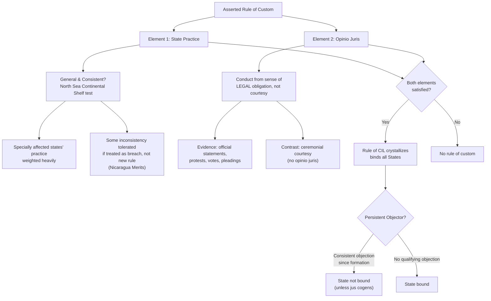

## Customary International Law: The State Practice and Opinio Juris Test

### Doctrinal Foundation

Recall that Article 38(1)(b) of the ICJ Statute identifies "international custom, as evidence of a general practice accepted as law" as a formal source of international law standing on equal footing with treaty law. Customary international law (CIL) is, historically and functionally, the older and more foundational of the two: it binds all states as such (not merely those that have consented to a particular instrument), and it fills the gaps left by the incomplete, fragmented web of bilateral and multilateral treaties. Because CIL binds without any signature or ratification, it poses the sharpest version of the question of how international law obligates sovereigns absent a global enforcer or legislature: a customary rule is said to emerge from the accumulated conduct and legal convictions of states themselves, making the international community simultaneously the law's creators and its subjects.

The ICJ has consistently affirmed a **two-element test** for establishing a rule of CIL, most authoritatively in *North Sea Continental Shelf* (Germany v. Denmark/Netherlands, 1969) and reaffirmed and elaborated by the International Law Commission's 2018 Draft Conclusions on Identification of Customary International Law:

1. **State practice** (the objective element) — a general and consistent pattern of conduct by states.
2. ***Opinio juris sive necessitatis*** (the subjective element) — a belief that the practice is rendered obligatory by the existence of a rule of law requiring it, as opposed to being followed from courtesy, convenience, or political expediency.

Both elements are cumulatively required. This is the doctrine's central analytical difficulty: state practice can usually be documented with reasonable objectivity, but *opinio juris* requires inferring an internal legal conviction from external conduct, and the two elements can be difficult to disentangle in practice — a problem often called the "chronological paradox" of custom, addressed further below.

### Element One: State Practice

**Key Points**

State practice consists of conduct generally attributable to a state in its international relations, regardless of whether the conduct occurs on the domestic or international plane. The ILC's 2018 Draft Conclusions (Conclusion 6) list an illustrative, non-exhaustive range of forms:

- Diplomatic acts and correspondence
- Conduct in connection with resolutions adopted by an international organization or at an intergovernmental conference
- Conduct in connection with treaties (including reservations and interpretive declarations)
- Executive conduct, including operational conduct "on the ground"
- Legislative and administrative acts
- Decisions of national courts

Both physical acts and verbal acts (statements, protests, claims) count as practice; inaction or abstention can also constitute practice where it is accompanied by an awareness of the choice involved and is not merely accidental. Practice must satisfy two qualitative thresholds, both articulated in *North Sea Continental Shelf*:

- **Generality/extensiveness**: Practice need not be universal, but must be sufficiently widespread and representative, including, critically, the practice of states whose interests are specially affected by the rule in question (a criterion the Court applied when assessing continental shelf delimitation practice among coastal states).
- **Consistency/uniformity**: The ICJ in *Asylum Case* (Colombia v. Peru, 1950) rejected Colombia's claimed regional customary rule of diplomatic asylum precisely because the practice invoked was "so much uncertainty and contradiction, so much fluctuation and discrepancy" that no constant and uniform usage could be established. Perfect uniformity is not required — in *Nicaragua* (Merits, 1986), the Court held that it is not necessary that practice be in absolutely rigorous conformity with the rule; instances of state conduct inconsistent with an asserted rule should generally be treated as breaches of that rule, not as evidence of a new rule, provided the state's own conduct is not treated by it (or by other states) as reflective of a new legal standard.

Duration is a related but distinct variable: CIL does not require a fixed passage of time and can, in principle, form rapidly given sufficiently dense and uniform practice — the ICJ acknowledged in *North Sea Continental Shelf* that "the passage of only a short period of time is not necessarily, or of itself, a bar" to formation, provided state practice is extensive and virtually uniform in the relevant period, including states specially affected.

### Element Two: Opinio Juris

*Opinio juris sive necessitatis* — "an opinion that [something is] law" or "of necessity" — is the requirement that states engage in the practice from a sense of legal obligation, not habit, comity, courtesy, or unilateral political convenience. The Court in *North Sea Continental Shelf* stated the standard precisely: states concerned must feel that they are conforming to what amounts to a legal obligation; the frequency or habitual character of acts is not enough. The classic illustration used to teach the distinction is the practice of according diplomats ceremonial honors: widespread and consistent, but performed as a matter of courtesy (*comitas gentium*) rather than legal obligation, and therefore not customary law.

Evidence of *opinio juris* is typically drawn from: official statements asserting a legal (not merely political or moral) basis for conduct; votes and explanations of vote on international resolutions; diplomatic protests characterizing another state's conduct as *unlawful* rather than merely undesirable; domestic legal opinions and government legal advisers' memoranda; and pleadings before international tribunals. The evidentiary overlap between practice and *opinio juris* is a recognized methodological feature rather than a flaw — the ILC's 2018 Draft Conclusions (Conclusion 3) accept that the same instances of conduct may simultaneously supply evidence of both elements, provided the assessment of each remains analytically distinct.

**[Unverified]** No authoritative formula fixes the precise density, duration, or geographic spread of practice-plus-conviction required for a rule to crystallize; tribunals and states apply the test case by case, and this indeterminacy is a genuine, unresolved feature of the doctrine rather than a gap awaiting future clarification.

### The Chronological Paradox

A frequently noted theoretical puzzle: if a rule of custom requires both practice and the antecedent belief that the practice is *already* legally required, it is difficult to explain how a genuinely new customary rule can ever originate, since by definition no such legal obligation yet exists when the first instances of practice occur. Scholars have offered various resolutions — some treat *opinio juris* as evolving gradually alongside practice rather than fully preceding it (a claim of legality that hardens into settled conviction as practice accumulates and goes unchallenged); others (notably in the "modern custom" strand of scholarship) argue that for human-rights- and humanitarian-law-type norms, tribunals in practice infer *opinio juris* heavily from multilateral declarations and resolutions with comparatively less rigorous independent proof of matching state practice — an approach in tension with the stricter *North Sea Continental Shelf* formulation. This tension between "traditional" custom (practice-driven, slow, bilateral-relations-oriented) and "modern" custom (declaration-driven, opinio-juris-heavy, oriented toward multilateral value-based norms such as human rights and self-determination) remains a live methodological divide, with the ICJ's own jurisprudence generally hewing closer to the traditional, practice-first model even as some other bodies apply a more permissive standard.

### General Custom vs. Regional and Bilateral Custom

CIL need not be universal. The ICJ has recognized the possibility of **regional custom** binding only a defined group of states — considered, though ultimately rejected on the facts, in the *Asylum Case* — and even **bilateral custom** binding only two states, accepted by the Court in *Right of Passage over Indian Territory* (Portugal v. India, 1960), where a localized practice between Portugal and India concerning passage to Portuguese enclaves was held capable of generating a bilateral customary right despite involving only two states. These variants require the same two-element analysis, simply applied to a narrower practice-community.

### The Persistent Objector Rule

A state that **consistently and openly objects** to an emerging rule of customary international law throughout the period of its formation may avoid being bound by that rule once it crystallizes, even though the rule binds other states generally. The doctrine's textual anchor is thin — it derives principally from the ICJ's reasoning in the *Fisheries Case* (UK v. Norway, 1951), where Norway's longstanding, consistent departure from a claimed rule regarding bay-closing lines was treated as relevant to whether that rule could be opposed to Norway — and from *Asylum Case* dicta. Structurally, the persistent objector rule is a significant qualification of the claim that custom binds *all* states regardless of consent: it preserves a narrow consent-adjacent escape valve, but only for objections raised from the rule's earliest emergence and maintained without interruption; a state cannot invoke persistent objector status retroactively once a rule has already crystallized, nor can a newly independent or newly formed state benefit from an objection it could not, chronologically, have made. **[Inference]** The doctrine's practical significance is narrower than its theoretical prominence in casebooks suggests, since successful invocations are rare and most alleged applications remain contested or unresolved on the facts.

An important limitation applies regardless of objector status: rules of *jus cogens* (peremptory norms, per VCLT Article 53) bind all states without exception, and no persistent objection can excuse a state from a peremptory norm such as the prohibitions on genocide or torture.

### Relationship to Treaty Law: Codification and Crystallization

Custom and treaty interact in three recognized modes, articulated by the ICJ in *North Sea Continental Shelf*:

1. **Declaratory effect**: A treaty provision may simply codify a rule of CIL that already existed independently of the treaty.
2. **Crystallizing effect**: A treaty provision, even if not declaratory of existing custom at the time of drafting, may crystallize an emerging customary rule that was in the process of formation.
3. **Generative (norm-creating) effect**: A treaty provision may, subsequent to the treaty's conclusion, generate a new rule of CIL through widespread and representative subsequent state practice (including by non-parties) undertaken with *opinio juris*, provided the provision is of a fundamentally norm-creating character.

This third pathway is the mechanism by which a treaty rule comes to bind states that never ratified the treaty — the customary rule, once crystallized, is independently binding under Article 38(1)(b), distinct from and not contingent upon the treaty instrument itself (VCLT Article 38 expressly preserves this possibility). This is analytically significant for instruments like UNCLOS, many of whose provisions on baselines, territorial sea breadth, and the exclusive economic zone are widely regarded as reflective of customary law binding even non-parties.

### Evidentiary Method: How Tribunals Establish Custom

The ILC's 2018 Draft Conclusions on Identification of Customary International Law, while not formally binding, represent an authoritative restatement of method widely relied upon by international courts and tribunals, including subsequent ICJ practice. Key methodological guidance includes: practice and *opinio juris* must each be separately ascertained (Conclusion 3); the practice of international organizations may count as state practice in certain circumstances, notably where states have transferred exclusive competence to the organization (Conclusion 4); inaction may count as practice (Conclusion 10); and treaties, resolutions of international organizations and conferences, and decisions of national and international courts may all serve as evidence of either element or both, depending on context (Conclusions 11–13).

### Application to Philippine Interests: Custom in the South China Sea Arbitration

The *South China Sea Arbitration* (Philippines v. China, 2016) illustrates the practical stakes of the state-practice/opinio-juris framework. China's assertion of "historic rights" within the nine-dash line was, in substantial part, a customary-law-type claim resting on assertions of long-standing practice and asserted acceptance. The Tribunal held that, even assuming some historical Chinese usage of the relevant waters, this fell short of establishing a customary or historic legal right to resources exclusive of other states, and that in any event any such customary claim was superseded by UNCLOS's comprehensive treaty allocation of maritime zones as between the parties — an application of the general principle that a later, more specific treaty framework displaces an inconsistent, less clearly established prior customary claim between treaty parties (*lex posterior* / *lex specialis* reasoning layered onto the custom-treaty interaction described above).

### Diagram: The Two-Element Test in Operation

### Related Topics

- The persistent objector rule: scope, limits, and its relationship to *jus cogens*
- General principles of law recognized by civilized nations (Article 38(1)(c))
- The ILC's 2018 Draft Conclusions on Identification of Customary International Law
- Treaty-custom interaction: codification, crystallization, and generative effect in depth
- *Jus cogens* and *erga omnes* obligations
- The *North Sea Continental Shelf*, *Nicaragua*, and *Asylum Case* judgments as doctrinal anchors