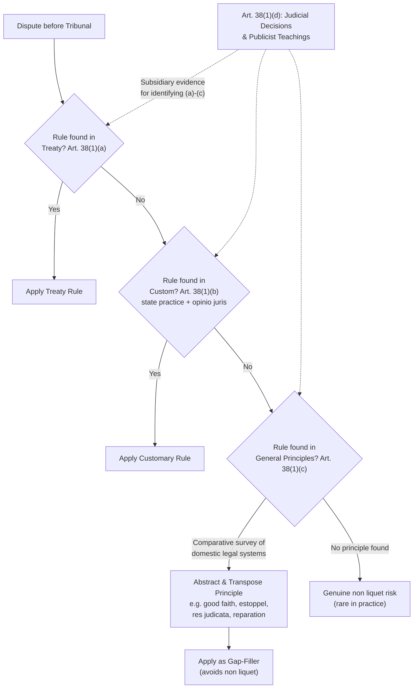

## General Principles of Law Recognized by Civilized Nations

### Doctrinal Foundation and Function

Recall that Article 38(1) of the ICJ Statute enumerates three formal, law-creating sources: treaties (Article 38(1)(a)), custom (Article 38(1)(b)), and, in subparagraph (c), "the general principles of law recognized by civilized nations." This third source occupies a distinctive structural position. Unlike treaty and custom, general principles do not derive their authority from an act of state consent (treaty ratification) or from an accumulated pattern of state conduct plus legal conviction (*opinio juris*). Instead, they derive from a comparative survey of the world's major domestic legal systems, on the premise that a legal concept found consistently across those systems reflects a juridical necessity inherent to any developed legal order, and is therefore available for transposition onto the international plane.

The doctrine's primary function is to prevent a **non liquet** — a situation in which a tribunal, having exhausted the applicable treaty and customary rules, finds no legal basis on which to decide a dispute and must therefore decline to rule (literally, "it is not clear"). The drafters of the 1920 PCIJ Statute, from which Article 38(1)(c) is carried forward nearly verbatim, intended general principles specifically as this residual, gap-filling mechanism, ensuring that the Court could always reach a decision rather than declare a matter legally unresolvable. This function is a direct answer to a structural weakness inherent in a decentralized legal order without a legislature: treaty and custom, being products of state consent and accumulated practice respectively, will inevitably leave gaps, particularly on procedural and evidentiary questions that no state has thought to negotiate a treaty over or build a practice around.

### The "Civilized Nations" Phrase: Drafting History and Modern Reading

The phrase "civilized nations" is a direct textual holdover from the 1920 Advisory Committee of Jurists that drafted the original PCIJ Statute, reflecting the Eurocentric international legal culture and colonial-era assumptions of that period, when international law's formal membership was understood as substantially limited to European and a small number of non-European states regarded as having reached a comparable stage of legal development. The phrase is now uniformly read by scholars and tribunals as devoid of any substantive discriminatory content and is treated as referring simply to the world's principal legal systems generally, reflecting the vastly expanded and formally equal membership of the international community following decolonization and the near-universal UN membership achieved by the late twentieth century. No tribunal today undertakes an inquiry into which nations qualify as "civilized" as a threshold matter; the operative inquiry is purely comparative-legal, asking whether a principle is common across representative legal systems (commonly including civil law, common law, and, increasingly, other legal traditions).

### Identifying a General Principle: Method

**Key Points**

Establishing a general principle of law under Article 38(1)(c) involves a distinct methodology from that used for custom (which examines the practice and conviction of *states in their international relations*) or treaty (which examines an instrument's text and the parties' consent). The characteristic method is:

1. **Comparative survey**: Examination of domestic legal systems — historically drawing heavily on Roman-law-derived civil law systems and English-derived common law systems, with growing attention to other traditions — to identify a rule or concept that recurs with sufficient consistency to be considered a shared juridical premise rather than an idiosyncratic feature of one legal culture.
2. **Abstraction**: The principle identified is typically abstracted to a level of generality suitable for application between states, rather than imported wholesale with all its domestic doctrinal detail (a domestic rule of contract formation, for instance, is not transplanted with every procedural nuance intact, but rather its underlying juridical logic).
3. **Transposition**: The abstracted principle is then applied as a rule of decision (or an interpretive aid) in the international legal dispute at hand, subject to any necessary adaptation to the structure of the international legal order (which, unlike domestic orders, lacks a centralized legislature, executive, or compulsory judiciary).

Because this method does not require proof of *opinio juris* or documented state practice, general principles can, in theory, be identified and applied by a tribunal without the extensive evidentiary record that custom demands — one of the doctrine's practical advantages as a gap-filler, though also a source of the criticism, discussed below, that it grants tribunals unusually wide interpretive latitude.

### Illustrative General Principles

The following are commonly cited as examples of general principles of law recognized across major legal systems and applied in international jurisprudence, though the scope and precise content of each remains subject to case-by-case elaboration:

- **Good faith (*bona fides*)**: Underlies numerous specific doctrines, including *pacta sunt servanda* itself (VCLT Article 26) and the prohibition on abuse of rights.
- ***Res judicata***: A matter already finally adjudicated by a competent tribunal may not be relitigated between the same parties — applied by the ICJ, for instance, in respecting the finality of its own prior judgments between the same parties on the same claim.
- **Estoppel**: A state that has, through its conduct or representations, led another state to rely on a particular position to its detriment may be precluded from later asserting a contrary position — invoked (though not always successfully) in boundary and territorial disputes.
- ***Ex injuria jus non oritur*** ("a legal right cannot arise from an unlawful act"): The principle that an illegal act cannot be the source of a legal entitlement, relevant to disputes over territory acquired by force or other unlawful means.
- **No one may benefit from their own wrong** (*nullus commodum capere potest de sua injuria propria*): A closely related principle limiting the ability of a wrongdoing state to invoke its own breach as the basis for a legal advantage — applied by the ICJ in *Gabčíkovo-Nagymaros Project* (Hungary/Slovakia, 1997) in assessing the parties' mutual conduct.
- **Circumstantial evidence and standards of proof**: General principles regarding the sufficiency of indirect or circumstantial evidence, drawn by analogy from domestic evidentiary practice, have been invoked by the ICJ, notably in the *Corfu Channel Case* (UK v. Albania, 1949), where the Court accepted that Albania's exclusive territorial control over the relevant waters justified a more liberal recourse to inferences of fact and circumstantial evidence in establishing its knowledge of the minefield.
- **Reparation for injury**: The principle that a breach of an international obligation entails a duty to make reparation, articulated by the PCIJ in the *Factory at Chorzów* case (Germany v. Poland, 1927) as a general principle of law and now also reflected in customary international law and codified in the ILC's Articles on State Responsibility.
- **Procedural and jurisdictional principles**: Rules concerning burden of proof, the independence and impartiality of adjudicators, the right to be heard, and *lis pendens* (the same dispute may not be simultaneously pursued in parallel proceedings) are frequently sourced to general principles, given the comparative absence of treaty or customary rules specifically addressed to international judicial procedure.

**[Inference]** Because general principles are typically invoked to resolve procedural, evidentiary, or remedial questions rather than to establish primary substantive obligations between states, they function in practice as an interstitial or supportive source — filling gaps around and between treaty and custom — rather than as a freestanding generator of major substantive rules of international law comparable to, for instance, the law of the sea or the law of armed conflict, which are overwhelmingly treaty- and custom-based.

### Relationship to Treaty and Custom: A Residual, Not Competing, Source

General principles do not compete with treaty or custom in the sense of offering an alternative, equally likely basis for any given rule; the accepted judicial practice, reflected in the structure of Article 38(1) itself, is to look first to applicable treaty law, then to customary international law, and to resort to general principles only where neither provides an answer — the non-liquet-avoidance function described above. This is not a strict textual hierarchy (Article 38(1)'s ordering is not, as previously noted, an official ranking of legal force among (a)–(c)), but it reflects the practical reality that tribunals invoke general principles sparingly, and typically only after treaty and custom have been canvassed and found not to resolve the specific question at hand — most often a procedural or remedial question ancillary to a dispute whose substantive law is otherwise governed by treaty or custom.

### Theoretical Debate: Legitimacy and Judicial Discretion

A genuine and continuing debate exists regarding the proper scope and legitimacy of general principles as a source, given the tension between the doctrine's gap-filling utility and concerns about judicial overreach in a state-consent-based legal order.

**The narrow/positivist view** holds that general principles should be confined strictly to principles genuinely common across representative domestic legal systems, established through a disciplined comparative-law exercise, and applied narrowly to procedural, evidentiary, and remedial gaps — preserving the doctrine's legitimacy by tying it to demonstrable commonality rather than to a tribunal's own sense of what justice requires. On this view, expansive use of "general principles" risks allowing international judges effectively to legislate new substantive obligations for states that never consented to them, undermining the consent-based foundation that (on the positivist account) is precisely what distinguishes international law's binding force from mere policy preference.

**The broader/naturalist-adjacent view** argues that Article 38(1)(c) should be read as authorizing recourse to general principles of justice or reason more broadly — not strictly limited to a rigorous, demonstrable comparative survey of domestic legal systems — particularly to address novel questions (emerging technologies, environmental harm, human rights protections) for which neither treaty nor custom has yet developed a clear answer and for which a purely positivist, consent-based methodology may be too slow or too indeterminate to supply an answer. Proponents of this broader view point to the doctrine's drafting history, noting that some members of the 1920 Advisory Committee of Jurists themselves invoked language suggesting principles of justice and equity, not merely comparative legal commonality.

**[Unverified]** There is no settled, authoritative resolution of this debate; the ICJ's own practice has generally hewed to the narrower, comparative-method approach in its actual invocations of general principles, while individual judges (in separate and dissenting opinions) and some scholars have argued for a more expansive reading — the doctrinal boundary between "identifying a genuinely common principle" and "a tribunal supplying its own preferred rule under the label of a general principle" remains a matter of legitimate methodological contestation rather than settled law.

### Distinguishing General Principles from Customary International Law

A recurring point of student confusion is the distinction between a "general principle of law" under Article 38(1)(c) and a rule of customary international law under Article 38(1)(b), since both are unwritten, non-treaty-based sources. The distinction lies in their derivation and object: custom derives from the practice **of states in their international relations**, coupled with *opinio juris* — the conduct examined is state-to-state conduct on the international plane. General principles derive from **domestic legal systems** — the conduct or doctrine examined is how municipal courts and legal orders have resolved a given juridical problem, which is then transposed to the international plane by analogy, without any requirement of proof that states have engaged in a pattern of international conduct reflecting that principle, still less that they did so from a sense of international legal obligation. A principle can be simultaneously supportable under both routes (for instance, good faith is arguably both a general principle and, in some of its applications, part of customary international law), but the evidentiary inquiry for each is analytically distinct.

### Application to Philippine Interests: General Principles in the South China Sea Arbitration

While the *South China Sea Arbitration* (Philippines v. China, 2016) was decided predominantly on UNCLOS treaty grounds (Article 38(1)(a)), with secondary recourse to customary international law regarding matters UNCLOS does not exhaustively regulate, the Tribunal's procedural and evidentiary reasoning throughout the proceedings — including its approach to assessing evidence in China's absence (China did not participate in the arbitration), and its treatment of the burden and standard of proof for the Philippines' claims — drew on general procedural principles of the kind associated with Article 38(1)(c), reflecting the doctrine's characteristic role as an interstitial source supporting the tribunal's exercise of its adjudicative function rather than as the primary source of the substantive maritime entitlements at issue, which were resolved principally under the UNCLOS treaty framework.

### Diagram: General Principles Within the Article 38(1) Framework

### Related Topics

- Article 38(1) of the ICJ Statute and the formal enumeration of international law's sources
- The law of state responsibility: reparation, attribution, and circumstances precluding wrongfulness
- Evidentiary and procedural rules before the ICJ and international arbitral tribunals
- *Jus cogens* and *erga omnes* obligations
- Judicial decisions and publicist teachings as subsidiary means (Article 38(1)(d))
- Equity in international law: *infra legem*, *praeter legem*, and *contra legem* applications