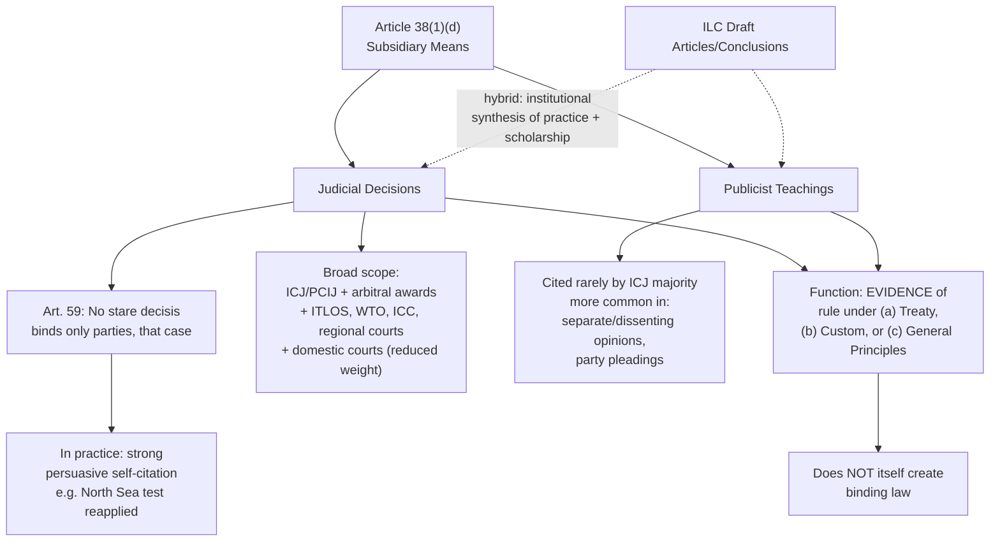

## Judicial Decisions and the Teachings of Publicists as Subsidiary Means

### Doctrinal Foundation and Structural Position

Recall that Article 38(1) of the ICJ Statute enumerates the sources the Court applies in deciding disputes, and that its four subparagraphs divide into two structurally distinct categories: (a) treaties, (b) custom, and (c) general principles of law are formal, law-*creating* sources, while (d) — "judicial decisions and the teachings of the most highly qualified publicists of the various nations" — is expressly designated "a subsidiary means for the determination of rules of law." This designation is doctrinally decisive: subparagraph (d) does not create binding international law. It provides *evidence* of what the law already is under (a), (b), or (c). A tribunal cannot ground a holding solely on the fact that a prior judgment or a scholar reached a particular conclusion; it must show that the judgment or scholarly writing correctly identifies a rule that independently exists in treaty, custom, or general principles. This is the conceptual key to understanding subparagraph (d)'s modest but pervasive role throughout international adjudication.

### Judicial Decisions: The Formal Rejection of Stare Decisis

**Article 59 of the ICJ Statute**, expressly cross-referenced in Article 38(1)(d) ("subject to the provisions of Article 59"), states that a decision of the Court "has no binding force except between the parties and in respect of that particular case." This is a deliberate, textually explicit rejection of ***stare decisis*** — the common law doctrine under which a court's prior decisions bind it, and lower courts, in subsequent cases involving different parties. There is no formal doctrine of binding precedent in international law: an ICJ judgment does not, as a matter of strict legal obligation, control the outcome of a later, unrelated case, even one raising an identical legal question.

**Key Points**

The practical significance of Article 59 diverges sharply from its formal severity:

- The ICJ **cites and follows its own prior reasoning with a high degree of consistency** in practice, notwithstanding the absence of a formal obligation to do so. This is partly a matter of judicial method (consistency serves legal certainty and the Court's own institutional credibility) and partly because Article 38(1)(d) itself designates judicial decisions a recognized means of *identifying* the law, giving prior judgments substantial persuasive — though not binding — authority.
- Article 59's limitation is *inter partes*: it confirms only that a judgment does not bind third states or control future disputes as a matter of formal legal obligation. It does not diminish the judgment's weight as evidence of the content of a treaty rule, a customary rule, or a general principle, which is precisely the function Article 38(1)(d) assigns to it.
- The distinction is sometimes summarized as: ICJ judgments have significant **persuasive authority** but no **binding precedential authority** outside the specific case decided.

"Judicial decisions" under Article 38(1)(d) is read broadly, encompassing more than ICJ and PCIJ judgments:

- **International arbitral awards** — including UNCLOS Annex VII tribunals (e.g., the *South China Sea Arbitration*), investor-state arbitration tribunals, and ad hoc interstate arbitrations — are routinely treated as judicial decisions for this purpose, notwithstanding their more decentralized institutional character compared to a standing court.
- **Decisions of other international tribunals** — the International Tribunal for the Law of the Sea (ITLOS), WTO dispute settlement panels and the Appellate Body, the International Criminal Court and ad hoc international criminal tribunals (ICTY, ICTR), and regional human rights courts (the European Court of Human Rights, the Inter-American Court of Human Rights) — are cited with weight calibrated to their relevance and the persuasiveness of their reasoning, though none binds the ICJ formally.
- **Domestic court decisions** addressing questions of international law may also serve, with appropriately reduced weight, as evidence of state practice (relevant to custom) or of a general principle (drawing on the domestic legal system's own doctrinal resolution of an analogous question) — an evidentiary role distinct from, though sometimes overlapping with, their citation as "judicial decisions" under (d) itself.

### The ICJ's Actual Practice of Self-Citation

Despite Article 59's formal disclaimer, the Court's jurisprudence displays substantial doctrinal continuity, with later judgments frequently restating and applying tests articulated in earlier ones. The two-element test for customary international law (state practice plus *opinio juris*) as formulated in *North Sea Continental Shelf* (1969) has been invoked and applied by the Court in numerous subsequent judgments spanning decades; the object-and-purpose compatibility test for treaty reservations, first articulated in the *Reservations to the Genocide Convention* Advisory Opinion (1951), remains the Court's touchstone despite having no binding force over later, unrelated disputes as a matter of Article 59. **[Inference]** This pattern of consistent self-citation functions, in practical effect, as something close to a *de facto* precedent system, even though it remains formally distinguishable from *stare decisis*: the Court is not legally bound to follow its earlier reasoning and has, on occasion, refined or qualified earlier formulations, but it treats departure from established reasoning as requiring justification rather than as a matter of unconstrained discretion.

### The Teachings of Publicists

The second limb of Article 38(1)(d) — "the teachings of the most highly qualified publicists of the various nations" — reflects the discipline's own history. Before the emergence of a dense treaty network and a body of international judicial decisions, international law was substantially the product of academic treatise-writing: figures such as Hugo Grotius (*De Jure Belli ac Pacis*, 1625), Emmerich de Vattel (*Le Droit des Gens*, 1758), and other early scholars did not merely describe an existing body of law but played a formative role in articulating the field's foundational concepts. Article 38(1)(d)'s inclusion of publicist teachings as a recognized subsidiary means is a direct institutional legacy of this history.

In modern ICJ practice, the Court itself cites individual scholars only **rarely and sparingly** in its judgments — far less frequently than it cites its own prior decisions or those of other tribunals. Scholarly writing more commonly performs an evidentiary and synthesizing role in the *background* of a case: in the pleadings and legal arguments of the parties, in the separate and dissenting opinions of individual judges (which cite scholarship considerably more freely than the Court's majority judgments), and in the work product of bodies such as the International Law Commission (ILC), whose codification and progressive-development work — itself frequently drawing on and synthesizing scholarly consensus — is in turn cited by the Court as persuasive evidence of customary international law or general principles.

**Qualifications on weight**: Not all scholarly writing carries equal persuasive value. Relevant factors include the writer's standing and expertise, the rigor and evidentiary grounding of the analysis (a treatise carefully documenting state practice carries more weight than one expressing a normative preference), and whether the view represents an isolated position or a broad scholarly consensus. The "various nations" qualifier signals that persuasive weight is enhanced where a position is shared across scholars from different legal traditions and national backgrounds, rather than reflecting a single national school of thought — analogous, in this respect, to the comparative-method logic underlying general principles of law.

### Institutional Bodies Bridging Judicial Decisions and Publicist Teachings

Certain institutional products occupy an intermediate position between formal judicial decision and individual scholarly opinion, and are cited by the ICJ and other tribunals with a weight reflecting this hybrid character:

- **The International Law Commission (ILC)**, established by the UN General Assembly to promote the progressive development and codification of international law, produces Draft Articles, Draft Conclusions, and commentaries (e.g., the 2001 Articles on State Responsibility, the 2018 Draft Conclusions on Identification of Customary International Law) that are not themselves binding treaty text or judicial decisions, but represent a carefully deliberated synthesis of state practice, judicial decisions, and scholarly opinion, and are treated by the ICJ as highly persuasive evidence of customary international law — in some instances cited as though restating settled law even prior to any formal state adoption.
- **Advisory opinions of the ICJ** occupy their own distinct category: formally non-binding (unlike contentious judgments, which bind the parties under Article 59 read together with Article 94 of the UN Charter), advisory opinions nonetheless carry substantial legal authority as authoritative statements of the Court's view on the law, and are cited and relied upon by states, other tribunals, and the Court itself in subsequent contentious cases in essentially the same manner as contentious judgments.

### Why Subsidiary Means Matter Despite Lacking Law-Creating Force

The practical importance of Article 38(1)(d) is disproportionate to its formally subordinate doctrinal status, for a structural reason tied back to the absence of a global legislature: unlike a domestic legal system, where a legislature can promptly clarify an ambiguous statute or a supreme court's ruling definitively settles a question for the entire jurisdiction, international law has no analogous mechanism for rapid, authoritative clarification. Judicial decisions and publicist teachings, precisely because tribunals and states treat them as reliable, well-reasoned articulations of what treaty or custom already requires, function as the practical mechanism through which uncertain or contested areas of international law achieve a working level of settled clarity — without ever converting the subsidiary means itself into a formal source of binding obligation. A rule "becomes settled" in international law substantially through the convergence of judicial reasoning and scholarly consensus around a particular reading of the underlying treaty or customary material, even though, formally, only that underlying treaty or custom is doing the law-creating work.

### Application to Philippine Interests: Subsidiary Means in the South China Sea Arbitration

The *South China Sea Arbitration* Tribunal (Philippines v. China, 2016), constituted under UNCLOS Annex VII, drew extensively on subsidiary means in reasoning toward its holdings on the UNCLOS treaty text. In addressing the legal status of maritime features under UNCLOS Article 121(3) — the "regime of islands" provision determining which features can generate an exclusive economic zone — the Tribunal engaged closely with prior arbitral and ICJ jurisprudence interpreting comparable maritime-feature questions, treating that jurisprudence as persuasive evidence of the proper interpretation of Article 121(3)'s text, consistent with the interpretive framework of VCLT Articles 31–32. The Tribunal also drew on the work of the ILC and on scholarly commentary addressing historic rights and their relationship to UNCLOS's comprehensive maritime zone allocation. None of this subsidiary material itself created the Tribunal's legal conclusions; it supported the Tribunal's interpretation of UNCLOS's treaty text and, where relevant, of customary international law — precisely the evidentiary function Article 38(1)(d) assigns to it. Because the arbitral Award itself carries no formal precedential force over future disputes under Article 59-type logic (a principle generally understood to extend by analogy to UNCLOS Annex VII tribunals), its influence on subsequent state practice and tribunal reasoning depends on the same persuasive-authority dynamic described above, rather than on any binding stare decisis effect.

### Diagram: Subsidiary Means Within the Article 38(1) Framework

### Related Topics

- Article 38(1) of the ICJ Statute and the formal enumeration of international law's sources
- The International Law Commission: mandate, codification vs. progressive development, and the 2001 Articles on State Responsibility
- Advisory opinions vs. contentious jurisdiction of the ICJ
- Customary international law: the state practice and *opinio juris* test
- General principles of law recognized by civilized nations
- The proliferation of international tribunals and the risk of fragmentation in international law