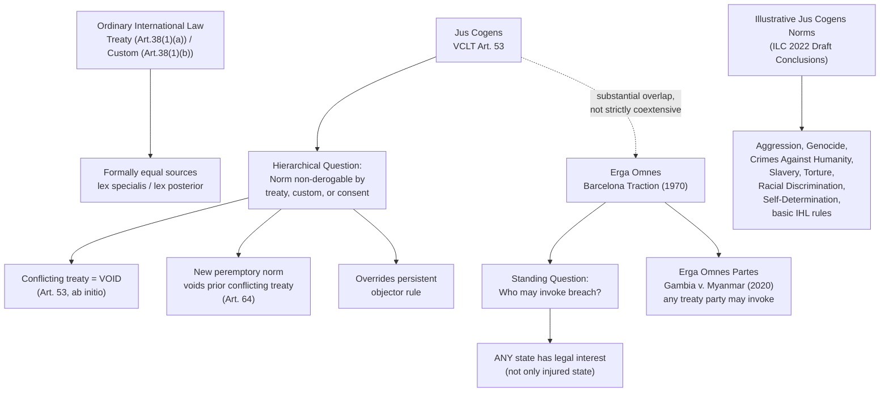

## Jus Cogens Peremptory Norms and Obligations Erga Omnes

### Doctrinal Foundation: Hierarchy in a Formally Non-Hierarchical System

Recall that Article 38(1) of the ICJ Statute enumerates treaties, custom, and general principles as formally equal sources of international law, with priority between conflicting rules ordinarily resolved through *lex specialis* (the more specific rule prevails) and *lex posterior* (the later rule prevails between the same parties) rather than through any fixed ranking of source-types. *Jus cogens* is the principal, and most significant, exception to this formal equality: it introduces genuine substantive hierarchy into international law, establishing a category of norms so fundamental that no treaty, custom, or unilateral state act may validly derogate from them. Obligations *erga omnes* is a related but analytically distinct concept concerning not the *hierarchical status* of a norm but the *scope of standing* to invoke a breach of it. The two doctrines substantially overlap in application — most recognized *jus cogens* norms also generate *erga omnes* obligations — but they answer different legal questions and must be kept conceptually separate.

### Jus Cogens: Definition and Textual Basis

The term ***jus cogens*** (Latin, "compelling law") refers to a peremptory norm of general international law. Its principal textual definition is codified in **Article 53 of the Vienna Convention on the Law of Treaties (VCLT, 1969)**: a peremptory norm is "a norm accepted and recognized by the international community of States as a whole as a norm from which no derogation is permitted and which can be modified only by a subsequent norm of general international law having the same character." This definition establishes three cumulative requirements:

1. **Acceptance and recognition by the international community of States as a whole** — not unanimity in the literal sense, but acceptance and recognition by a very large majority of states, cutting across the principal legal systems and regions of the world, such that a norm cannot be blocked from *jus cogens* status by the objection of a small number of states.
2. **Non-derogability** — no treaty, custom, or unilateral act may lawfully depart from the norm, even where the states concerned would otherwise be free, under ordinary consent-based principles, to contract out of an obligation as between themselves.
3. **Modifiability only by a subsequent norm of the same character** — a peremptory norm can be altered only by a new norm that itself independently achieves peremptory status, not by ordinary treaty or customary developments.

**Key Points**

The consequences of *jus cogens* status are significant and textually specified:

- **VCLT Article 53**: A treaty is **void** (not merely voidable) at the time of its conclusion if it conflicts with an existing peremptory norm — this is one of the very few grounds of *absolute* nullity in treaty law, distinguished from the merely voidable grounds (such as error or fraud) discussed in the VCLT framework, which require invocation by an affected party and can be cured by subsequent conduct.
- **VCLT Article 64**: If a **new** peremptory norm emerges after a treaty's conclusion, any existing treaty that conflicts with it "becomes void and terminates" — a rare instance of automatic, retroactively-operating supervening invalidity in treaty law.
- Peremptory status also overrides the **persistent objector rule** available in ordinary customary international law: a state cannot exempt itself from a *jus cogens* norm by having consistently objected to its formation, since the entire premise of peremptory status is that no state consent (or withholding of consent) can defeat the norm's binding force.

### Establishing Jus Cogens Status: Method and Evidentiary Threshold

The VCLT's Article 53 definition specifies the legal *consequence* and *conceptual test* for peremptory status but does not itself provide a list of which norms qualify, nor a detailed methodology for identifying new ones. The **International Law Commission's 2022 Draft Conclusions on Peremptory Norms of General International Law (*Jus Cogens*)**, adopted after extensive study, represents the most authoritative contemporary restatement of the identification methodology, and largely tracks and extends the VCLT Article 53 framework: a norm must first be established as a norm of general international law (typically customary international law, though the Draft Conclusions also contemplate treaty provisions and general principles as a possible basis), and it must then be shown that this norm is accepted and recognized by the international community of states as a whole as one from which no derogation is permitted. Evidentiary sources of such acceptance and recognition include treaties, resolutions of international organizations, statements by states, judicial decisions, and (with due caution) scholarly writing — an evidentiary structure closely paralleling, but not identical to, the general practice/opinio juris framework used to establish ordinary custom.

**[Unverified]** Beyond a comparatively short list of norms enjoying broad, largely uncontested acceptance as peremptory (enumerated below), the precise boundaries of *jus cogens* — which additional norms qualify, and the exact threshold of "acceptance and recognition by the international community as a whole" required — remain genuinely and actively contested among states and scholars, and no single authoritative, exhaustive list exists.

### The 2022 ILC Illustrative List

The ILC's 2022 Draft Conclusions include, in an annex, a **non-exhaustive illustrative list** of norms the Commission had previously referred to as having peremptory status in its work, without prejudice to the recognition of other norms as *jus cogens* in the future. The listed norms include:

- The prohibition of aggression
- The prohibition of genocide
- The prohibition of crimes against humanity
- The basic rules of international humanitarian law (the laws of armed conflict)
- The prohibition of racial discrimination and apartheid
- The prohibition of slavery
- The prohibition of torture
- The right to self-determination

This list reflects a broad, though not universally unanimous, scholarly and state consensus; some of these categorizations (particularly the precise scope of "basic rules" of international humanitarian law, and aspects of the right to self-determination) remain subject to more contested elaboration regarding their exact content and boundaries, even where the core prohibition is uncontroversial.

### Obligations Erga Omnes: Definition and Origin

***Erga omnes*** (Latin, "towards all" or "owed to all") describes an obligation owed by a state to the international community as a whole, rather than to one or more specific states individually. The doctrine's foundational articulation is the ICJ's *obiter dictum* in the ***Barcelona Traction* case** (Belgium v. Spain, Second Phase, 1970), where the Court distinguished between obligations owed to particular states in the context of diplomatic protection, and obligations "the performance of which is the concern of all States" — in respect of the latter, "all States can be held to have a legal interest in their protection." The Court gave, as examples, the outlawing of acts of aggression and genocide, and "principles and rules concerning the basic rights of the human person, including protection from slavery and racial discrimination."

The doctrinal significance of *erga omnes* status lies specifically in **standing**: an obligation *erga omnes* can, in principle, be invoked by *any* state — not merely a state that has itself suffered direct, particularized injury — because every state is considered to have a legal interest in the obligation's observance. This directly addresses a structural gap in the ordinary law of state responsibility, which traditionally required an injured state to demonstrate that it, specifically, had suffered harm from a breach in order to invoke another state's responsibility. *Erga omnes* obligations relax this requirement for a defined category of especially fundamental norms.

**Erga omnes partes** is a related but narrower variant, referring to an obligation owed to all parties of a particular multilateral treaty (rather than to the international community of states as a whole), such that any state party — not only one specially and individually injured — has standing to invoke a breach. The ICJ relied on this concept in *The Gambia v. Myanmar* (Provisional Measures, 2020), permitting The Gambia to institute proceedings under the Genocide Convention despite lacking any special, individualized injury from Myanmar's alleged conduct, on the basis that obligations under the Genocide Convention are owed *erga omnes partes* to all states party to that Convention.

### Jus Cogens and Erga Omnes: Distinct but Overlapping Concepts

**Key Points** — the doctrines answer different questions and must not be conflated:

- ***Jus cogens*** is about the **hierarchical status and non-derogability** of a substantive norm — it governs whether a conflicting treaty or act is valid at all.
- ***Erga omnes*** is about the **scope of standing** to invoke a breach — it governs who may bring a claim or assert a legal interest in a norm's observance, independent of the norm's hierarchical rank.

In practice these categories substantially overlap: most norms recognized as *jus cogens* (genocide, aggression, slavery, torture, racial discrimination) are also treated as generating *erga omnes* obligations, since a norm important enough to be non-derogable by consent is typically also one in which every state is considered to have a legal interest. However, the categories are not coextensive as a matter of strict logic — the ICJ's *Barcelona Traction* enumeration of *erga omnes* obligations was framed independently of, and indeed predates by several decades, the ILC's more systematic 2022 work specifically identifying *jus cogens* norms, and a norm could in principle be recognized as generating broad standing to invoke its breach (*erga omnes*) without necessarily having achieved the more demanding, non-derogability-focused threshold required for peremptory status, or vice versa. **[Inference]** The prevailing scholarly view treats *jus cogens* status as generally sufficient, though perhaps not strictly necessary, to establish that a norm also carries *erga omnes* character, given that the underlying rationale for both — the norm's protection of interests fundamental to the international community as a whole — is closely related.

### Practical and Enforcement Significance

The *jus cogens*/*erga omnes* framework is directly relevant to the recurring analytical problem of how international law binds sovereign states without a centralized global enforcer. Ordinary treaty and customary obligations are enforced substantially through bilateral, reciprocity-based mechanisms — a breach by State A typically permits countermeasures or claims only by states specifically injured by that breach, under the law of state responsibility. The *jus cogens*/*erga omnes* framework partially escapes this bilateral, injury-based logic for a narrow category of the most fundamental norms: because every state has a recognized legal interest in these norms' observance, any state (or, for *erga omnes partes* obligations, any treaty party) may invoke a breach even absent direct injury to itself, broadening the practical pool of states capable of bringing international legal proceedings or asserting responsibility claims. This does not solve the underlying enforcement gap — a favorable judgment still depends on diplomatic, political, and reputational pressure rather than compulsory execution — but it meaningfully expands who has legal standing to try.

The ILC's 2001 **Articles on State Responsibility** (not a binding treaty but a highly influential codification) reflect the *jus cogens*/*erga omnes* distinction in Articles 40–41, which impose *additional* obligations specifically arising from a "serious breach" of an obligation arising under a peremptory norm: all states have a duty to cooperate to bring the breach to an end through lawful means, and to refrain from recognizing as lawful a situation created by such a breach, or from rendering aid or assistance in maintaining it.

### Application to Philippine Interests: Peremptory Norms in Context

While the *South China Sea Arbitration* (Philippines v. China, 2016) did not turn on *jus cogens* or *erga omnes* questions — its subject matter (maritime zone entitlements, historic rights, and marine environmental obligations under UNCLOS) falls outside the narrow category of currently recognized peremptory norms — the broader *jus cogens*/*erga omnes* framework remains relevant to the region's legal landscape in adjacent contexts, including the prohibition of the use of force (a recognized peremptory norm under the UN Charter Article 2(4) and customary international law) as background law constraining the conduct of all states with interests in the South China Sea, regardless of their status as parties to any particular bilateral or multilateral instrument governing the dispute.

### Diagram: Jus Cogens and Erga Omnes Within the International Legal Order

### Related Topics

- Article 38(1) of the ICJ Statute and the formal enumeration of international law's sources
- The Vienna Convention on the Law of Treaties: grounds of invalidity and termination in depth
- The ILC Articles on State Responsibility (2001): attribution, breach, and consequences of serious breaches
- Customary international law: the state practice and *opinio juris* test
- The *Barcelona Traction*, *Genocide Convention* (Gambia v. Myanmar), and *Nicaragua* judgments
- The prohibition on the use of force under UN Charter Article 2(4) and its exceptions