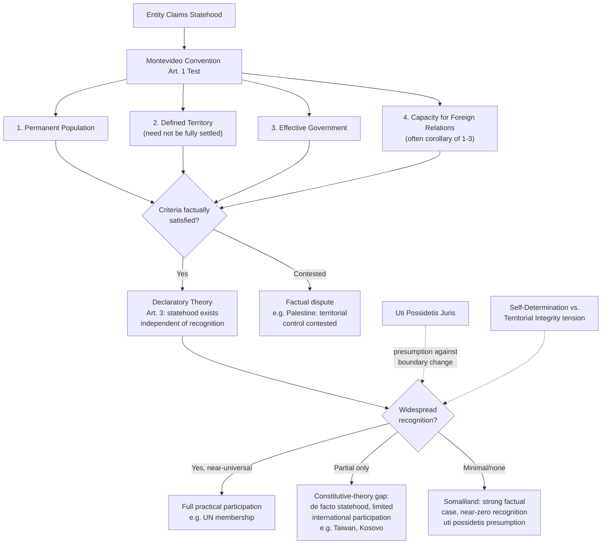

## The Montevideo Convention Criteria for Statehood and Contested Recognition Cases

### Doctrinal Foundation: Statehood as a Threshold Question

International law's primary subjects are states, and before any body of substantive doctrine — treaty law, the law of the sea, the law of armed conflict — can attach to an entity, that entity must first qualify as a **state**. The question of what makes an entity a state, and who decides, is therefore logically prior to almost every other inquiry in international law, and it is a question the international legal order answers in a strikingly decentralized way, without a central registry or global authority empowered to certify statehood. The **1933 Montevideo Convention on the Rights and Duties of States**, a regional instrument concluded at the Seventh International Conference of American States, supplies the most widely cited formal enumeration of statehood's constitutive elements, and Article 1's four criteria are treated, well beyond the Convention's own limited membership, as reflective of customary international law on the requirements for statehood.

### The Montevideo Criteria: Article 1

Article 1 of the Montevideo Convention provides that the state as a person of international law should possess the following qualifications:

1. **A permanent population**
2. **A defined territory**
3. **Government**
4. **Capacity to enter into relations with other states**

**Key Points** on each element:

- **Permanent population**: Requires a stable community of people habitually resident in the territory; the criterion does not impose a minimum population threshold, and does not require ethnic, religious, or cultural homogeneity — numerous existing states have small, diverse, or non-homogeneous populations.
- **Defined territory**: Requires territory with a reasonable degree of consistency and identifiability, but does **not** require settled, undisputed boundaries in every respect. States with ongoing border disputes (a common condition — Israel is a frequently cited example, though itself a contested-recognition case in other respects, as is the case with numerous African states whose colonial-era boundaries remain subject to some dispute) are not thereby disqualified from statehood; the requirement is generally read as a sufficiently coherent territorial base over which effective control is exercised, not geometric or legal finality of every boundary segment.
- **Government**: Requires an effective governmental authority capable of exercising control over the population and territory, maintaining internal order, and representing the entity externally. This criterion is closely related to, but distinct from, the doctrine of **effectiveness** in general international law — the principle that legal consequences (including, in some contexts, territorial title) attach to a genuinely effective exercise of authority rather than to a merely nominal or de jure claim unaccompanied by actual control.
- **Capacity to enter into relations with other states**: Often treated less as an independent, freestanding fourth criterion and more as a **consequence or corollary** of the first three — an entity possessing a permanent population, defined territory, and effective government will, as a practical matter, typically possess this capacity. Some scholars read this criterion as importing an **independence** requirement: the entity must not be subject to the authority of another state in the conduct of its foreign relations, distinguishing a state from a non-sovereign territory, protectorate, or federal subdivision lacking independent treaty-making capacity.

### The Declaratory vs. Constitutive Theories of Recognition

A foundational theoretical divide concerns the legal *effect* of other states' recognition once the Montevideo criteria are (arguably) satisfied — a question the Montevideo Convention itself addresses directly in **Article 3**: "The political existence of the state is independent of recognition by other states." This provision embodies the **declaratory theory** of recognition, under which statehood is a matter of objective fact, arising automatically once the Article 1 criteria are met; recognition by other states merely *acknowledges* (declares) a pre-existing legal fact and creates no new legal status.

The competing **constitutive theory** holds that recognition by other states is not merely evidentiary but **legally constitutive** of statehood itself — an entity does not become a state, as a matter of international law, until and unless other states recognize it as such, regardless of how fully it satisfies the factual Montevideo criteria.

**[Inference]** The declaratory theory is generally regarded as the doctrinally dominant position, both because it is the position the Montevideo Convention itself expressly adopts and because the constitutive theory faces a serious logical difficulty: if statehood depended entirely on recognition, an entity recognized by some states but not others would be simultaneously a state and not a state, an incoherent result under a unified conception of legal personality. In practice, however, the distinction is considerably softer than the two pure theoretical positions suggest: an entity that satisfies the Montevideo criteria but receives little or no international recognition faces severe practical limitations on its ability to function as a state (treaty-making, UN membership, diplomatic relations, access to international financial institutions), such that widespread recognition remains, as a *practical* — if not strictly *legal* — matter, close to indispensable to full participation in the international legal order. This gap between the declaratory theory's formal position and the practical necessity of recognition is precisely what generates the recurring category of "contested" states discussed below.

### Recognition of Governments vs. Recognition of States

A related but analytically distinct question concerns the **recognition of a government** (as opposed to recognition of a state), which arises when an existing state undergoes an unconstitutional change of government (coup, revolution) and other states must decide whether to continue treating the new government as the legitimate representative of that (undisputed) state. This is governed by a largely separate, more discretionary body of practice — historically influenced by doctrines such as the **Estrada Doctrine** (under which a state simply continues or discontinues relations without issuing formal statements of recognition or non-recognition of a new government, treating recognition of governments as an inappropriate judgment on another state's internal affairs) and the older, now largely abandoned **Tobar Doctrine** (which conditioned recognition on the new government having come to power through constitutional, democratic means). Government recognition is conceptually distinct from state recognition: the underlying state's legal personality persists across a change of government (or even non-recognition of a particular government), and most modern state practice treats government recognition questions as governed primarily by the **effectiveness** of the new government's control, rather than by an assessment of the legitimacy of the means by which it came to power — though this remains an area of continued political, rather than strictly legal, contestation.

### Contested Recognition Case Studies

The gap between the declaratory theory's formal position and the practical significance of recognition is best illustrated through entities whose Montevideo-criteria status is asserted but contested:

**Taiwan (Republic of China)**: Taiwan exercises effective, independent government over a defined territory and permanent population, and by most accounts satisfies the Montevideo criteria as a factual matter. Its international status remains contested primarily due to the **"One China" policy** maintained by the People's Republic of China (PRC) and accepted, in varying formulations, by the large majority of UN member states as a condition of maintaining diplomatic relations with the PRC — meaning most states do not extend formal diplomatic recognition to Taiwan as a separate state, notwithstanding its apparent factual satisfaction of the Montevideo criteria. Taiwan is not a UN member and lost its UN seat (formerly held as "China") to the PRC following UN General Assembly Resolution 2758 (1971). **[Inference]** Taiwan is frequently cited in scholarship as the paradigm illustration of the practical gap between the declaratory theory's formal position (statehood as objective fact) and the constitutive weight recognition carries in practice, since Taiwan's effective governmental control is not seriously disputed, yet its capacity to participate as a state in most international fora remains severely constrained by the recognition practices of other states.

**Kosovo**: Kosovo declared independence from Serbia in 2008 following a period of UN administration after the 1999 NATO intervention. Kosovo has been recognized by roughly 100 states (including the United States and most, though not all, EU member states) but is not recognized by Serbia, Russia, China, or a substantial number of other UN member states, and is not itself a UN member (Security Council action being blocked by opposition from permanent members). The ICJ, in its **2010 Advisory Opinion on the Accordance with International Law of the Unilateral Declaration of Independence in respect of Kosovo**, addressed a narrower legal question than Kosovo's statehood as such — the Court was asked only whether the declaration of independence itself violated international law, and held that **general international law contains no prohibition on declarations of independence**, without ruling on the separate question of Kosovo's statehood or the legal effect of the recognitions Kosovo had received.

**Palestine**: Palestine is recognized as a state by roughly three-quarters of UN member states and holds **non-member observer state status** at the United Nations (UN General Assembly Resolution 67/19, 2012), a status short of full UN membership (which requires Security Council recommendation, where U.S. opposition has been a recurring obstacle) but reflecting broad international recognition. Palestine's satisfaction of the Montevideo criteria is contested on multiple grounds, including disputed and non-contiguous territorial control (the West Bank and Gaza, with significant portions of the West Bank under Israeli administrative or military control) and questions regarding the exercise of effective, independent government, particularly given the continued Israeli occupation and control over significant aspects of Palestinian territory and population movement.

**Somaliland**: Somaliland declared independence from Somalia in 1991 and has since maintained a functioning, relatively stable government, its own currency, and effective control over a defined territory — arguably satisfying the Montevideo criteria as well as, or better than, some universally recognized states — yet has received **no formal state recognition** from any UN member state, illustrating starkly the practical weight of the African Union's and the broader international community's strong general presumption against altering colonial-era boundaries (reflected in the **doctrine of *uti possidetis juris***, discussed further below) and its resulting reluctance to recognize secession from an existing, internationally recognized state (Somalia) even where the seceding entity's factual claim to statehood is comparatively strong.

**Abkhazia and South Ossetia**: Both declared independence from Georgia and are recognized by a small number of states, principally Russia and a handful of others, following the 2008 Russia-Georgia conflict; the overwhelming majority of the international community, including the UN General Assembly, has treated both as remaining part of Georgia's sovereign territory, illustrating a case where recognition by a very small number of states (including, notably, a permanent Security Council member) has not been treated by the broader international community as establishing statehood, underscoring that recognition by an isolated subset of states does not, by itself, resolve contested statehood questions in the eyes of the wider community.

### The Doctrine of Uti Possidetis Juris

A recurring background principle shaping contested statehood and secession disputes, particularly in the post-colonial and post-Soviet contexts, is ***uti possidetis juris*** ("as you possess under law") — the principle that new states emerging from decolonization or the dissolution of a larger state inherit the administrative boundaries that existed at the moment of independence or dissolution, rather than boundaries being redrawn along ethnic, linguistic, or other lines. The ICJ applied and elaborated this principle in the **Frontier Dispute case** (Burkina Faso/Mali, 1986), treating it as a general principle of law (Article 38(1)(c)) applicable well beyond its original Latin American origins, aimed at preserving stability by avoiding the disruption that would follow from unsettling inherited administrative boundaries upon independence. This doctrine substantially explains the strong international reluctance to recognize secessionist entities such as Somaliland even where factual statehood criteria appear satisfied, since recognition would depart from the *uti possidetis* baseline of respecting existing, internationally recognized state boundaries.

### Self-Determination and Its Tension with Territorial Integrity

Contested recognition cases frequently implicate an unresolved tension between two recognized principles of international law: the **right to self-determination of peoples** (reflected in UN Charter Article 1(2), Common Article 1 of the two 1966 International Covenants, and recognized by the ICJ and the 2022 ILC Draft Conclusions as a *jus cogens* norm in at least its core, anti-colonial application) and the principle of **territorial integrity** of existing states (UN Charter Article 2(4), and reflected in instruments such as the 1970 Declaration on Principles of International Law Concerning Friendly Relations). International law's general position — reflected in the ICJ's cautious approach in the Kosovo Advisory Opinion, which avoided pronouncing on a general right to "remedial secession" — is that self-determination is clearly established as a right to internal self-governance and, in the colonial context, to independence, but a broader right of *unilateral secession* from an existing, non-colonial state (sometimes termed "remedial secession," theorized as available in cases of severe, sustained oppression) remains, at most, an unsettled and contested extension of the doctrine rather than a clearly established rule. **[Unverified]** Whether international law recognizes any general right of remedial secession outside the colonial context remains among the most actively disputed questions in contemporary statehood doctrine, with state practice showing no clear, consistent pattern either affirming or foreclosing the possibility.

### UN Membership as Distinct from Statehood

A final structural point: **UN membership is not the same question as statehood**, though the two are closely related in practice. UN Charter Article 4 conditions membership on being a "peace-loving state" willing and able to carry out Charter obligations, admission requiring a Security Council recommendation (subject to the veto of any permanent member) followed by a two-thirds General Assembly vote. An entity may satisfy the Montevideo criteria and receive substantial bilateral recognition (as with Palestine and, to a lesser degree, Kosovo) without achieving UN membership, typically due to Security Council-level political obstruction rather than any authoritative international determination that the entity fails to qualify as a state; conversely, UN membership itself is sometimes treated in practice as strong evidence of, though not formally identical to, widespread international acceptance of an entity's statehood.

### Diagram: Assessing Contested Statehood Claims

### Related Topics

- Recognition of governments: the Estrada and Tobar Doctrines
- The right to self-determination as a *jus cogens* norm and the unresolved doctrine of remedial secession
- The doctrine of *uti possidetis juris* and the *Frontier Dispute* case (Burkina Faso/Mali)
- UN membership procedure under Charter Article 4 and the Security Council veto
- State succession: continuity, dissolution, and treaty obligations upon a change in statehood
- Subjects of international law beyond states: international organizations, individuals, and insurgent/belligerent entities