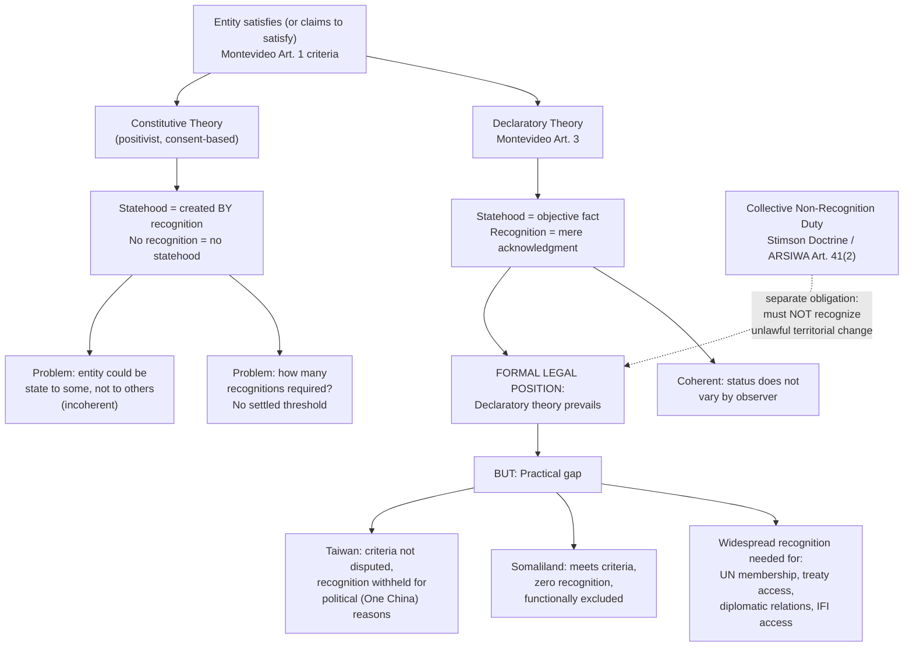

## Declaratory Versus Constitutive Theories of State Recognition

### The Core Doctrinal Question

Recall that statehood under international law is conventionally assessed against the four criteria set out in Article 1 of the 1933 Montevideo Convention: a permanent population, a defined territory, an effective government, and the capacity to enter into relations with other states. A separate and analytically distinct question follows once an entity plausibly satisfies these factual criteria: **what legal work, if any, does recognition by other states actually perform?** Does recognition merely confirm a legal status the entity already possesses as a matter of objective fact, or does recognition itself bring that legal status into being? This is the question the declaratory and constitutive theories of recognition answer in opposite ways, and it sits at the center of international law's broader difficulty in identifying binding legal facts (such as the existence of a new legal person) in a system without any central authority empowered to issue an authoritative determination.

### The Declaratory Theory

The **declaratory theory** holds that statehood is a matter of objective legal fact, arising automatically once an entity satisfies the applicable criteria for statehood (conventionally, the Montevideo criteria), independent of whether, or how many, other states choose to recognize it. On this view, an act of recognition by another state is not a legally constitutive act creating a new status; it is merely a **declaration or acknowledgment** of a status that already exists as a matter of law. A non-recognizing state does not thereby deny the *legal reality* of the new state's existence — it merely declines, as a matter of its own bilateral policy, to establish formal relations with it.

**Textual basis**: The declaratory theory finds direct textual support in **Article 3 of the Montevideo Convention**, which states: "The political existence of the state is independent of recognition by the other states. Even before recognition the state has the right to defend its integrity and independence, to provide for its conservation and prosperity, and consequently to organize itself as it sees fit..." This provision is widely treated as reflective of customary international law on the question, notwithstanding the Montevideo Convention's formally regional (Latin American) origin and limited treaty membership.

**Rationale**: The declaratory theory's principal doctrinal strength is logical coherence within a legal system premised on the notion that legal facts should hold uniformly rather than varying by observer. If statehood depended entirely on recognition, a single entity could simultaneously be a state (vis-à-vis the states that recognize it) and not a state (vis-à-vis those that do not) — a status that is not merely contested but *logically inconsistent*, since statehood is conventionally treated as a unitary legal status rather than one that exists differently depending on which other legal person is assessing it. The declaratory theory avoids this incoherence by locating the legal test entirely in the entity's own factual characteristics, which do not vary depending on the observer.

### The Constitutive Theory

The **constitutive theory**, most closely associated with 19th- and early 20th-century positivist scholarship (notably associated with writers such as Lassa Oppenheim in early editions of his treatise, though the theory's precise attribution and the degree to which it was ever the clearly dominant position is itself a matter of some scholarly dispute), holds that recognition by other states is not merely evidentiary but **legally constitutive** — an entity does not become a state as a matter of international law until and unless it is recognized as such by existing states, or by a sufficiently substantial number of them. On this view, satisfaction of factual statehood criteria (population, territory, government, capacity) is a necessary but not independently sufficient condition; the missing, decisive ingredient is the act of recognition itself, which "admits" the new entity into the community of international legal persons.

**Rationale**: The constitutive theory's underlying logic reflects a strongly **consent-based** conception of international law, consistent with the broader positivist premise (discussed in relation to treaty and custom) that international legal obligations and status generally trace back to state consent. On this reasoning, existing states cannot be bound to treat a new entity as a fellow state, with all attendant rights (territorial sovereignty, treaty capacity, immunities) and correlative duties (non-intervention, respect for territorial integrity) that this status entails, without their own consent — and recognition is precisely the mechanism through which that consent is given.

**Criticisms**: The constitutive theory faces the coherence problem noted above (an entity being simultaneously a state and not a state, depending on the observer) as its most significant theoretical weakness. It also faces a practical difficulty: the theory offers no clear answer to **how many** recognitions are required for statehood to be constituted — unanimous recognition by all existing states, a majority, or some other threshold — and state practice provides no consistent, settled answer to this question, leaving the constitutive theory analytically underdetermined in a way the declaratory theory's factual test is not.

### Reconciling the Theories: The Practical Middle Ground

**Key Points**

Contemporary doctrine and state practice do not treat the two theories as a clean binary in which one is simply "correct" and the other "incorrect." The prevailing position, reflected in the drafting choice embodied in Montevideo Convention Article 3 and endorsed by the substantial weight of modern scholarship, favors the **declaratory theory as the formally correct statement of the law** — but this formal position coexists with an acknowledgment that recognition carries substantial **practical**, even if not strictly *constitutive*, significance:

- **Evidentiary function**: Widespread recognition by other states is treated as strong evidence that the Montevideo criteria have, in fact, been satisfied — recognition does not create statehood, but the pattern of other states' recognition decisions is itself relevant data bearing on whether the underlying factual criteria are met, particularly for the more evaluative criteria such as "effective government."
- **Functional/practical necessity**: An entity that satisfies the Montevideo criteria but receives little or no recognition faces severe, often crippling, practical limitations: it cannot easily conclude treaties with non-recognizing states, cannot access UN membership (which requires Security Council recommendation and General Assembly approval, effectively requiring recognition or acquiescence by key states), cannot access many international financial institutions or dispute-resolution mechanisms premised on state party status, and cannot maintain formal diplomatic relations with non-recognizing states. **Somaliland** — which arguably satisfies the Montevideo criteria as well as, or better than, several universally recognized states, yet has received recognition from no UN member state — illustrates this gap starkly: its *legal* status as a state under the declaratory theory is a matter states are formally free to accept or dispute independently of recognition, yet its complete lack of recognition leaves it functionally excluded from the ordinary institutional life of the international community in a way that closely resembles what the pure constitutive theory would predict.
- **Recognition as a bilateral political act, not a legal determination**: Because recognition remains, under the declaratory theory, a matter of each recognizing state's own discretionary political judgment rather than a legally compelled response to an objectively verified fact, individual recognition decisions are frequently driven by political considerations (alliance relationships, precedent-setting concerns about secessionist movements within the recognizing state's own territory, geopolitical strategy) rather than by a rigorous, good-faith assessment of whether the Montevideo criteria are genuinely satisfied — a further source of the doctrine's practical unpredictability. **Taiwan** illustrates this dynamic: the great majority of states withhold formal diplomatic recognition not because they dispute, as a factual matter, that Taiwan exercises effective, independent government over a defined territory and population, but because recognition would conflict with the "One China" policy those states have adopted as a condition of maintaining relations with the People's Republic of China — a plainly political calculation layered on top of, rather than displacing, the underlying factual analysis the declaratory theory would otherwise require.

**[Inference]** The most defensible synthesis, reflected in the mainstream of contemporary scholarship, is that the declaratory theory correctly states the formal legal position — recognition does not, as a matter of law, create statehood — while the constitutive theory correctly identifies an important practical reality: that recognition functions, in the actual operation of the international system, as a substantially necessary (if not formally sufficient, and not formally law-creating) condition for an entity's effective participation as a state. This is sometimes summarized as recognition being **legally declaratory but practically close to constitutive**.

### Effects of Non-Recognition: The Stimson Doctrine and Collective Non-Recognition

A distinct but related body of doctrine addresses the international legal consequences of a **collective policy of non-recognition** directed at a territorial situation created by a serious violation of international law, most prominently the unlawful use of force. The **Stimson Doctrine**, articulated by U.S. Secretary of State Henry Stimson in response to Japan's 1931-32 creation of the puppet state of Manchukuo in Manchuria, holds that states should not recognize territorial or other gains acquired through means contrary to international law (particularly the prohibition on the unlawful use of force). This principle was subsequently generalized and now finds reflection in the **ILC's 2001 Articles on State Responsibility, Article 41(2)**, which provides that no state shall recognize as lawful a situation created by a serious breach of an obligation arising under a peremptory norm (*jus cogens*), nor render aid or assistance in maintaining that situation.

This doctrine of **collective (or mandatory) non-recognition** has been applied by the UN Security Council and General Assembly in several instances, including the non-recognition of South Africa's Bantustan "homelands" during apartheid, Turkey's Turkish Republic of Northern Cyprus (following the 1974 invasion), Iraq's attempted annexation of Kuwait in 1990, and, more recently, Russia's purported annexation of Crimea (2014) and additional Ukrainian territories (2022). The ICJ addressed a closely related non-recognition obligation in its **2004 Advisory Opinion on the Wall in the Occupied Palestinian Territory**, finding that all states are under an obligation not to recognize the illegal situation resulting from the construction of the wall, and not to render aid or assistance in maintaining that situation. This body of doctrine functions as a distinct exception layered on top of the ordinary declaratory-theory framework: it is not that recognition *constitutes* an unlawful territorial change into a lawful one, but rather that international law imposes an affirmative **duty of non-recognition** as a specific legal consequence flowing from certain categories of serious, peremptory-norm-violating unlawful conduct — reinforcing, rather than undermining, the general declaratory position that legal status is a matter of objective fact not alterable by the political act of recognition (in this instance, working in the opposite direction: non-recognition cannot be overridden by even widespread, but individually unlawful-conduct-tainted, recognition).

### Recognition De Facto and De Jure

A further practical refinement, cutting across both theoretical positions, distinguishes **de facto recognition** from **de jure recognition**. De facto recognition is a more limited, often provisional or qualified acknowledgment that an entity exercises effective control over a territory, frequently extended where a recognizing state has doubts about the long-term stability or ultimate legal legitimacy of the entity's position, without committing to the fuller legal and diplomatic consequences of de jure recognition (formal diplomatic relations, full treaty capacity as between the two states, immunities). De jure recognition represents the fuller, formal acknowledgment of an entity's legal status as a state. This distinction, while less prominent in contemporary practice than in earlier 20th-century diplomatic practice, remains occasionally significant in analyzing gradations of state response to contested statehood situations such as Kosovo or Abkhazia and South Ossetia.

### Application to Philippine Interests

The Philippines, as with most UN member states, maintains formal diplomatic relations reflecting the "One China" policy with respect to Taiwan — declining formal state recognition while maintaining substantial unofficial economic, trade, and people-to-people relations through informal representative offices, a pattern common among states balancing recognition-policy constraints against practical bilateral interests, and itself a useful illustration of how declaratory-theory logic (Taiwan's underlying factual characteristics as an entity exercising effective government are not seriously disputed) coexists with constitutive-theory-adjacent practical consequences (the absence of formal recognition meaningfully constrains the legal form, though not the practical substance, of the relationship).

### Diagram: Declaratory and Constitutive Theories Compared

### Related Topics

- The Montevideo Convention criteria for statehood and contested recognition cases
- Recognition of governments: the Estrada and Tobar Doctrines
- The ILC Articles on State Responsibility: serious breaches of peremptory norms (Articles 40–41)
- The ICJ's 2004 Advisory Opinion on the Wall in the Occupied Palestinian Territory
- State succession and the continuity of statehood through governmental change
- Self-determination and the unresolved doctrine of remedial secession