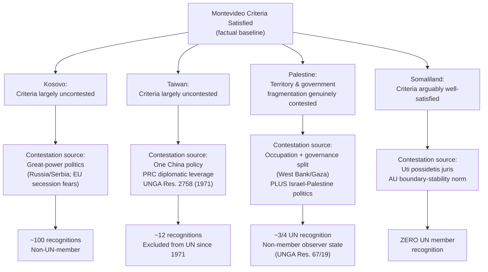

## Contested Statehood in Practice: Kosovo, Taiwan, Palestine, and Somaliland

### Analytical Framework

Recall that statehood under international law is conventionally assessed against the four criteria enumerated in Article 1 of the 1933 Montevideo Convention — a permanent population, a defined territory, an effective government, and the capacity to enter into relations with other states — and that the **declaratory theory** of recognition, codified in Montevideo Convention Article 3, treats statehood as an objective legal fact existing independently of other states' recognition, even though recognition carries substantial practical, if not strictly law-creating, significance. This item applies that framework comparatively across four entities whose statehood claims are contested to markedly different degrees and for markedly different legal reasons, illustrating how the same formal doctrinal test produces divergent practical outcomes depending on the political, historical, and institutional context surrounding each claim. The comparative method is deliberate: each case isolates a different variable in the statehood analysis — territorial control, great-power politics, occupation, and the *uti possidetis* presumption against secession — allowing the underlying doctrine to be tested against distinct fact patterns.

### Kosovo

**Background**: Kosovo declared independence from Serbia on 17 February 2008, following nearly a decade of UN administration (under UN Security Council Resolution 1244, 1999) that had itself followed the 1999 NATO air campaign against the Federal Republic of Yugoslavia during the Kosovo conflict.

**Montevideo analysis**: Kosovo exercises effective, independent government over a reasonably defined territory with a permanent population, satisfying the core factual elements with comparatively little dispute regarding effectiveness of control, distinguishing it from cases (such as Palestine, below) where effective governmental control is itself contested.

**Recognition status**: Approximately 100 states recognize Kosovo, including the United States and most (though not all) EU member states — Spain, Slovakia, Romania, Cyprus, and Greece notably withhold recognition, largely reflecting concerns about setting precedent for their own internal separatist movements (Catalonia, for Spain, being the most frequently cited domestic parallel). Serbia, Russia, and China do not recognize Kosovo. Kosovo is not a UN member, Security Council action being foreclosed by the opposition of Russia (and, separately, China) as permanent members.

**The ICJ's 2010 Advisory Opinion**: The UN General Assembly requested an advisory opinion on a **narrowly framed question**: whether the unilateral declaration of independence was in accordance with international law — not whether Kosovo qualified as a state, and not on the legal effect of the recognitions Kosovo had received. The ICJ held that **general international law contains no applicable prohibition on declarations of independence**, reasoning that the practice of the international community does not indicate the emergence of a new rule of customary international law prohibiting such declarations. The Court's answer was deliberately narrow and avoided pronouncing on the separate, more contested question of whether a right to "remedial secession" exists under international law in cases of sustained oppression — a question the Court characterized as beyond the scope of the request before it.

**Doctrinal significance**: Kosovo illustrates a case where the factual Montevideo criteria are comparatively uncontroversial, and where the principal source of contestation is *recognition itself*, driven substantially by great-power politics (the Russia-Serbia relationship, and Russia's own strategic interest in resisting precedent supportive of unilateral secession, later relevant to its own conduct regarding Crimea, Abkhazia, and South Ossetia) rather than by any serious factual dispute about Kosovo's exercise of effective governmental authority.

### Taiwan (Republic of China)

**Background**: Taiwan (formally the Republic of China) has exercised continuous, effective, independent government over its territory since the Chinese Civil War concluded with the Communist victory on the mainland in 1949, following which the Republic of China government relocated to Taiwan while the newly established People's Republic of China (PRC) asserted itself as the sole legitimate government of "China," including Taiwan.

**Montevideo analysis**: Taiwan is widely regarded by scholars as satisfying the Montevideo criteria as a factual matter — it possesses a permanent population, clearly defined territory, and a government exercising full, effective, independent authority, including an independently functioning military, currency, and legal system, with no meaningful dispute regarding the *effectiveness* of its governmental control.

**Recognition status**: Only a small number of states (roughly a dozen, predominantly in Latin America, the Pacific, and Africa) maintain formal diplomatic recognition of Taiwan. The great majority of UN member states, including the United States, adhere in varying formulations to a **"One China" policy**, under which formal diplomatic relations with the PRC are conditioned on not extending formal diplomatic recognition to Taiwan as a separate state — though many states, including the U.S. under the Taiwan Relations Act, maintain extensive unofficial, substantive relations (trade, informal diplomatic representation, defense-related cooperation in the U.S. case) alongside formal non-recognition.

**UN status**: Taiwan lost its UN seat (which it had held, as "China," since the UN's founding) to the PRC pursuant to **UN General Assembly Resolution 2758 (1971)**, which recognized the representatives of the PRC government as "the only legitimate representatives of China to the United Nations." Taiwan is not a UN member and has made no recent formal claim to independent UN membership, its political status remaining formally ambiguous (neither a declared independent state under its own constitutional framework, which continues to nominally assert claims over mainland China, nor formally part of the PRC).

**Doctrinal significance**: Taiwan is the paradigm illustration of the **practical gap between the declaratory theory's formal position and the constitutive weight of recognition**: its factual satisfaction of the Montevideo criteria is not seriously disputed by the great majority of states withholding recognition, yet the political constraint imposed by the One China policy — itself a product of the PRC's diplomatic leverage and the practical importance most states attach to maintaining relations with the PRC — has produced a durable equilibrium in which near-universal *de facto* acknowledgment of Taiwan's effective governance coexists with near-universal formal non-recognition.

### Palestine

**Background**: The Palestine Liberation Organization declared the State of Palestine in 1988; the Palestinian Authority was subsequently established under the 1993–95 Oslo Accords as an interim self-governing body, without the Accords themselves resolving Palestine's final status.

**Montevideo analysis**: Palestine's satisfaction of the Montevideo criteria is contested on more substantial factual grounds than Kosovo's or Taiwan's:

- **Territory**: Palestinian-claimed territory (the West Bank and Gaza) is non-contiguous, and significant portions of the West Bank remain under full or partial Israeli administrative and/or military control under the Oslo Accords' Area A/B/C division, complicating the "defined territory" analysis, though (as previously noted regarding the Montevideo criteria generally) unsettled or contested boundaries do not automatically disqualify a statehood claim.
- **Effective government**: The Palestinian Authority's governing capacity is constrained by continued Israeli occupation and control over significant aspects of movement, borders, and security in the West Bank, and Gaza has since 2007 been under separate governance by Hamas, distinct from the Fatah-led Palestinian Authority administering West Bank areas — a governmental fragmentation that complicates the "effective government" criterion in a manner distinct from either Kosovo or Taiwan.

**Recognition status**: Approximately three-quarters of UN member states formally recognize the State of Palestine. Palestine holds **non-member observer state status** at the United Nations, granted by **UN General Assembly Resolution 67/19 (2012)**, upgrading its prior "entity" observer status. This status permits participation in UN proceedings and access to certain UN bodies and treaties (including, notably, the Rome Statute of the International Criminal Court, which Palestine acceded to in 2015) without conferring full UN membership, which would require a Security Council recommendation — an outcome the United States has indicated it would oppose.

**Doctrinal significance**: Palestine illustrates a case combining **both** major sources of contestation seen separately in Kosovo and Taiwan — genuine factual dispute regarding the "defined territory" and "effective government" criteria (driven by occupation and governmental fragmentation) **and** significant political contestation over recognition (driven by the Israeli-Palestinian conflict's broader geopolitical stakes) — making it, in relative terms, the most doctrinally complex of the four cases, since disaggregating factual insufficiency from purely political non-recognition is considerably harder than in the Kosovo or Taiwan examples.

### Somaliland

**Background**: Somaliland, formerly British Somaliland, briefly existed as an independent state for several days in 1960 before voluntarily uniting with the former Italian-administered Somalia to form the Somali Republic. Following the collapse of the Somali central government amid civil war in 1991, Somaliland declared a **restoration** of its independence (a framing deliberately distinct from a claim of new secession, invoking its brief 1960 period of separate statehood as a legal predicate) and has since maintained a functioning, comparatively stable government, its own currency, its own security forces, and periodic multiparty elections.

**Montevideo analysis**: Somaliland is frequently cited by scholars as arguably satisfying the Montevideo criteria **as well as, or better than**, several universally recognized states — it exercises effective, stable governmental control over a defined territory with a permanent population, with a degree of institutional stability and electoral governance that compares favorably to federal Somalia itself (whose central government has, at various points since 1991, exercised only limited effective control over much of its nominal territory).

**Recognition status**: Somaliland has received **formal recognition from no UN member state**, notwithstanding its comparatively strong factual claim.

**Why no recognition despite strong factual claim**: The near-total absence of recognition is substantially explained by the doctrine of ***uti possidetis juris*** (discussed in relation to the *Frontier Dispute* case, Burkina Faso/Mali, 1986) and the strong institutional presumption, particularly within the African Union, against altering colonial-era administrative boundaries or legitimizing secession from an existing, internationally recognized state (Somalia). The African Union in particular has historically treated the stability of inherited post-colonial boundaries as a paramount organizing principle, given the continent-wide risk that legitimizing one secession could unsettle numerous other latent separatist claims across a large number of member states — a systemic concern distinct from any doubt about Somaliland's specific factual claim to effective statehood.

**Doctrinal significance**: Somaliland is the clearest illustration among the four cases of the **declaratory theory's formal position diverging most sharply from practical reality** — its case for satisfying the objective Montevideo criteria is, by many accounts, comparatively strong, yet the complete absence of recognition leaves it functionally excluded from virtually all forms of international participation reserved to states, demonstrating that even a factually compelling declaratory-theory claim can be practically nullified by a sufficiently strong, broadly shared external presumption (here, *uti possidetis*) against recognition.

### Comparative Synthesis

**Key Points**

| Entity | Primary source of contestation | Effective government disputed? | UN status |
| --- | --- | --- | --- |
| Kosovo | Recognition politics (Russia/Serbia, EU internal-secession concerns) | No | Non-member; ~100 bilateral recognitions |
| Taiwan | "One China" policy; PRC diplomatic leverage | No | Excluded since 1971 (Res. 2758); ~12 bilateral recognitions |
| Palestine | Both factual (territory/government fragmentation) and political (Israel-Palestine conflict) | Yes, partially | Non-member observer state (Res. 67/19); ~3/4 of UN recognize |
| Somaliland | *Uti possidetis* presumption; AU boundary-stability concern | No | Zero UN member recognition |

**[Inference]** Read together, these four cases suggest that international recognition practice, notwithstanding its formal subordination to the declaratory theory's objective-fact test, is driven substantially by systemic and geopolitical considerations — precedent-setting concerns for other secessionist movements, great-power alignment, and regional organizational policy — that operate largely independently of, and in Somaliland's case starkly contrary to, the strength of an entity's underlying factual claim to satisfy the Montevideo criteria. This supports the broader synthesis that recognition functions as formally declaratory but practically close to constitutive: none of these four entities' international standing can be adequately explained by the Montevideo criteria alone, without reference to the surrounding political architecture of recognition.

### Diagram: Comparative Contestation Sources

### Related Topics

- The Montevideo Convention criteria for statehood and contested recognition cases
- Declaratory versus constitutive theories of state recognition
- The doctrine of *uti possidetis juris* and the *Frontier Dispute* case (Burkina Faso/Mali)
- Self-determination and the unresolved doctrine of remedial secession
- UN membership procedure under Charter Article 4 and the Security Council veto
- The ICJ's 2010 Kosovo Advisory Opinion and its limited scope