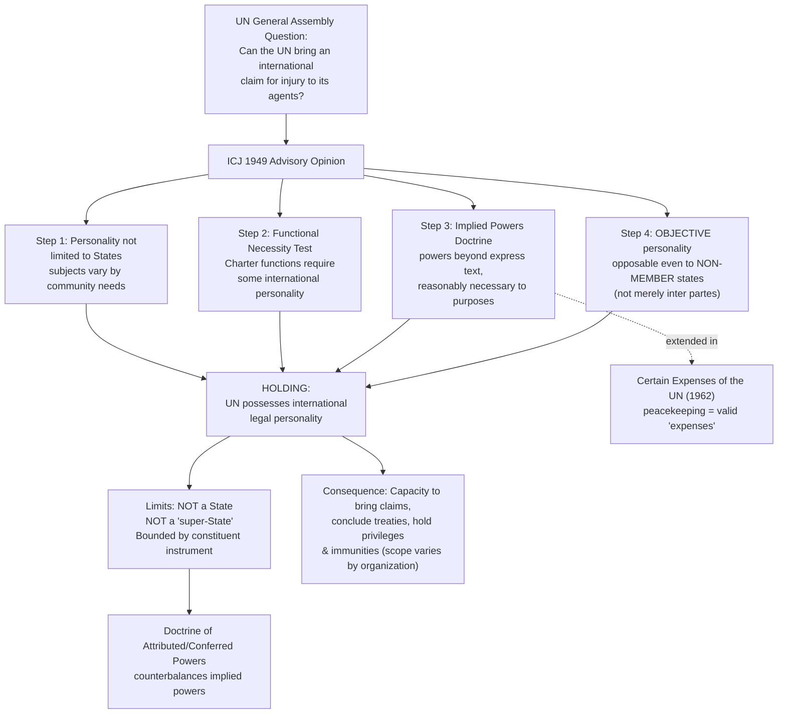

## International Legal Personality of International Organizations and the Reparation for Injuries Advisory Opinion

### Doctrinal Foundation: Beyond States as the Only Subjects

Recall that states are the primary subjects of international law, conventionally assessed against the Montevideo Convention's four criteria of statehood. For much of international law's classical history, states were treated as effectively the *only* subjects capable of holding international rights and duties — a position consistent with a strictly consent-based, state-centric conception of the international legal order. The rise of permanent international organizations in the twentieth century, beginning with the League of Nations and accelerating with the establishment of the United Nations and its specialized agencies, forced a doctrinal reckoning: could an entity that is not itself a state — created by states, but institutionally and functionally distinct from any of them — hold international legal rights and obligations of its own? The **ICJ's 1949 Advisory Opinion in *Reparation for Injuries Suffered in the Service of the United Nations*** is the foundational authority answering this question, and it remains the starting point for any analysis of international organizations' legal personality.

### The Reparation for Injuries Advisory Opinion: Facts and Question Posed

The Advisory Opinion arose from the assassination of Count Folke Bernadotte, the UN's mediator in Palestine, and other UN personnel in 1948 while in the service of the United Nations. The UN General Assembly requested an advisory opinion asking, in substance: does the United Nations, as an organization, have the capacity to bring an international claim against a responsible state (whether or not that state is a UN member) to obtain reparation for damage caused to the UN itself, and for damage suffered by the victim or persons entitled through the victim? This was not a straightforward question under the pre-existing state-centric model, since traditionally only states possessed the standing to bring international claims against other states, and the UN Charter itself did not expressly confer upon the Organization a general capacity to bring such claims.

### The Court's Holding: Objective International Legal Personality

**Key Points**

The ICJ held that the United Nations **does possess international legal personality**, reasoning through several distinct steps that together remain the template for analyzing the legal personality of international organizations generally:

- **Personality is not limited to states**: The Court rejected the premise that only states can be subjects of international law, holding that "the subjects of law in any legal system are not necessarily identical in their nature or in the extent of their rights, and their nature depends upon the needs of the community." This is the Opinion's most foundational doctrinal move — it explicitly opens the category of international legal personality beyond the state-centric model, without dictating in advance what other kinds of entities might qualify or on what basis.
- **The functional necessity test**: The Court reasoned that the UN Charter had entrusted the Organization with functions and responsibilities — maintaining international peace and security, among others — of such character and scope that they could not be discharged effectively unless the Organization possessed some degree of international legal personality and the capacity to operate on the international plane, including the capacity to bring claims. The Court stated that the Organization "was intended to exercise and enjoy, and is in fact exercising and enjoying, functions and rights which can only be explained on the basis of the possession of a large measure of international personality and the capacity to operate upon an international plane." This reasoning is often summarized as the **doctrine of implied powers**: an international organization possesses not only those powers expressly conferred by its founding instrument, but also those powers reasonably necessary to the effective exercise of its express functions and purposes, even absent explicit textual authorization.
- **Personality as a matter of objective fact, not merely inter partes agreement**: Perhaps the Opinion's most doctrinally significant and, at the time, most contested holding was that the UN's personality was **"objective"** — that is, opposable not only to UN member states (who had, through the Charter, arguably consented to recognize the Organization's personality as between themselves) but also to **non-member states**. The Court reasoned that fifty states, representing "the vast majority of the members of the international community," had the power, in conformity with international law, to bring into being an entity possessing objective international personality, and not merely personality recognized by themselves alone. This holding is significant precisely because it represents a departure from a purely consent-based, bilateral conception of legal personality (of the kind more characteristic of the constitutive theory of state recognition) — the UN's personality does not depend on each individual state's separate act of recognition, but exists as an objective legal fact opposable to the entire international community, including states that never joined the Organization.

### Scope and Limits of an International Organization's Personality

**International legal personality is not unlimited or state-equivalent**. The Court was explicit that the UN's personality is "not the same thing as being a State," and does not entail that the Organization is "a super-State, whatever that expression may mean." The UN does not possess general territorial sovereignty, does not possess the full range of rights and duties a state possesses, and its personality and capacities are, in the Court's formulation, defined and limited by the purposes and functions specified or implied in its constituent instrument (here, the UN Charter) and developed in practice — a principle now generally described as the **doctrine of attributed (or conferred) powers**, operating as the necessary counterpart to the doctrine of implied powers: an organization's powers, whether express or implied, are always bounded by reference to its constituent instrument's purposes, unlike a state's inherent, general international legal capacity.

This has an important comparative consequence: **each international organization's specific legal personality and capacities must be assessed individually**, by reference to its own constituent treaty, its stated purposes and functions, and its subsequent institutional practice — there is no single, uniform template of "international organization personality" applicable identically to every organization. A narrowly mandated technical or regional organization will possess a correspondingly narrower set of implied powers than the United Nations itself, whose Charter purposes (international peace and security, human rights, economic and social cooperation) are exceptionally broad.

### The Doctrine of Implied Powers Beyond Reparation for Injuries

The implied powers doctrine articulated in *Reparation for Injuries* has been applied and refined in subsequent ICJ jurisprudence addressing the scope of various international organizations' authority. The Court's later Advisory Opinion in ***Certain Expenses of the United Nations*** (1962) extended this reasoning to hold that UN peacekeeping expenditures (for operations in the Congo and the Middle East) constituted "expenses of the Organization" within the meaning of UN Charter Article 17(2), even though peacekeeping is not expressly mentioned in the Charter, on the basis that such expenditures were reasonably connected to the UN's Charter purposes. **[Inference]** The cumulative effect of this jurisprudential line has been to establish implied powers analysis as the standard methodological tool for resolving disputes over whether a given international organization has authority to act in a manner not expressly specified in its founding treaty, a recurring question given that constituent instruments, negotiated at a fixed historical moment, cannot anticipate every function an organization may later need to perform.

### Types and Sources of International Organization Personality

International organizations' personality can be analyzed along two related but distinct axes:

- **International legal personality** (opposable on the international plane, vis-à-vis states and, in principle, other international legal persons) — the subject of the *Reparation for Injuries* holding, generally grounded in the functional necessity/implied powers reasoning described above, and increasingly also reflected in **express personality clauses** now commonly included in the constituent instruments of modern international organizations (the UN Charter itself, in Article 104, provides that the Organization "shall enjoy in the territory of each of its Members such legal capacity as may be necessary for the exercise of its functions," addressing personality specifically within member states' domestic legal orders).
- **Domestic (municipal) legal personality** — the capacity to hold property, enter contracts, and sue and be sued within a state's domestic legal system, typically addressed through specific headquarters agreements, privileges and immunities conventions (such as the 1946 Convention on the Privileges and Immunities of the United Nations), and domestic implementing legislation in host and member states, distinct from, though often coextensive with, the organization's international-plane personality.

### Consequences of International Legal Personality: Capacities Recognized

Once an international organization is recognized as possessing international legal personality, several practical legal capacities typically follow, subject always to the specific scope conferred (expressly or by implication) under its constituent instrument:

- **Capacity to conclude treaties** (*jus tractatuum*) — reflected in the 1986 Vienna Convention on the Law of Treaties between States and International Organizations or between International Organizations, which extends much of the ordinary VCLT treaty-law framework to organizations possessing this capacity.
- **Capacity to bring and be subject to international claims** — the specific capacity at issue in *Reparation for Injuries* itself, encompassing both "functional protection" of the organization's own agents (analogous to, but institutionally distinct from, a state's diplomatic protection of its nationals) and claims for direct injury to the organization.
- **Privileges and immunities** — typically including immunity from the jurisdiction of domestic courts for official acts, inviolability of premises and archives, and personal immunities for certain categories of officials, generally established through specific privileges-and-immunities agreements rather than flowing automatically from international legal personality as such.
- **Capacity to maintain permanent missions and receive accredited representatives** from member states, and in some cases from non-member states and other organizations.

### Distinguishing International Organizations from Non-Governmental Organizations and Multinational Corporations

The *Reparation for Injuries* framework applies specifically to **intergovernmental organizations** — entities established by treaty among states (or among states and other international organizations) — and does not extend, without more, to non-governmental organizations (NGOs) or multinational corporations, which, however significant their practical influence on international affairs, are not generally treated as possessing international legal personality of the kind recognized for the UN and comparable bodies, precisely because they lack the state-conferred constituent-treaty basis and functional-necessity reasoning underlying the *Reparation for Injuries* holding. **[Unverified]** Whether and to what extent multinational corporations should be recognized as bearing direct international legal obligations (as opposed to obligations mediated through domestic law and, increasingly, through emerging business-and-human-rights soft law frameworks) remains an actively contested and doctrinally unsettled question, distinct from, though sometimes discussed alongside, the settled question of intergovernmental organizations' personality.

### Application to Philippine Interests

The Philippines, as a UN member state and a member of numerous other international organizations (including ASEAN, the World Bank Group, and the WTO), operates within a legal framework substantially shaped by the *Reparation for Injuries* personality doctrine — for instance, the Philippines' relations with UN specialized agencies operating within its territory, and questions of those agencies' privileges and immunities under domestic Philippine law, trace directly back to the framework the Advisory Opinion established for analyzing an international organization's legal capacity to act, hold rights, and bear obligations on the international plane, distinct from the capacities of its individual member states.

### Diagram: The Reparation for Injuries Reasoning Structure

### Related Topics

- The Montevideo Convention criteria for statehood and contested recognition cases
- The doctrine of implied and attributed powers in international institutional law
- The 1986 Vienna Convention on the Law of Treaties between States and International Organizations
- Privileges and immunities of international organizations and their officials
- Individuals as subjects of international law: human rights and international criminal responsibility
- The *Certain Expenses of the United Nations* Advisory Opinion (1962)