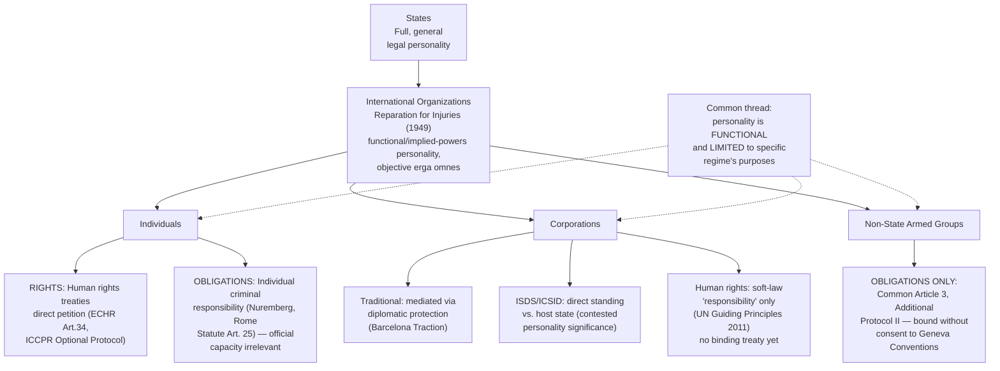

## Individuals, Corporations, and Non-State Actors as Limited Subjects of International Law

### Doctrinal Foundation: Expanding Beyond the State-Organization Duopoly

Recall that the *Reparation for Injuries* Advisory Opinion (1949) established that international legal personality is not confined to states, holding that "the subjects of law in any legal system are not necessarily identical in their nature or in the extent of their rights, and their nature depends upon the needs of the community," and that an international organization can possess objective international personality where functional necessity requires it. This item extends that inquiry further, to entities considerably more heterogeneous than intergovernmental organizations: natural persons (individuals), corporations, and a residual category of non-state actors including armed opposition groups and international NGOs. The organizing doctrinal concept for all of these is **limited** or **partial** international legal personality — none of these categories possesses the general, comprehensive bundle of rights and duties a state holds, but each has, in specific and often narrowly defined contexts, been recognized as a direct bearer of international rights, obligations, or both, without full assimilation into the state-centric model of subjecthood.

### The Traditional Positivist Objection

**Key Points**

Classical positivist international law, dominant through the nineteenth and early twentieth centuries, held that individuals were solely **objects**, not **subjects**, of international law — they could be *affected* by international law (as when a treaty regulated the treatment of a state's own nationals), but any resulting protection was understood as a right belonging to the individual's *state*, exercised through the mechanism of diplomatic protection, not a right the individual held directly and could invoke on their own international legal standing. On this view, an individual injured by a foreign state's wrongful act had no direct international legal claim; only that individual's state of nationality could bring an international claim, and only as an exercise of the state's *own* right (the fiction, associated with the *Mavrommatis Palestine Concessions* case, PCIJ 1924, being that in espousing a national's claim, "a State is in reality asserting its own right"). The twentieth century's expansion of individual rights and duties under international law represents a sustained, if still incomplete and contested, departure from this purely objects-only conception.

### Individuals as Bearers of International Rights

**International human rights law** represents the most extensive body of international law conferring rights directly upon individuals, rather than upon states as intermediaries. Instruments such as the International Covenant on Civil and Political Rights (ICCPR) and the International Covenant on Economic, Social and Cultural Rights (ICESCR), together with regional instruments (the European Convention on Human Rights, the American Convention on Human Rights), articulate rights held by individuals as such, and — critically for the question of legal personality — many of these instruments establish **individual petition mechanisms** allowing a person to bring a claim directly against their own state before an international body, without needing their state of nationality (which, in a human rights context, is typically the *respondent*, not the claimant's sponsor) to espouse the claim. The European Court of Human Rights, under Article 34 of the European Convention, and the UN Human Rights Committee, under the ICCPR's (Second) Optional Protocol, are prominent examples of mechanisms through which individuals assert international legal rights in their own name and legal standing, marking a clear structural departure from the *Mavrommatis*-era diplomatic-protection-only model.

**[Inference]** This individual-petition architecture is best understood as recognizing individuals as possessing a genuine, if procedurally and substantively **limited**, form of international legal personality: limited because it is confined to the specific rights and procedural mechanisms a given treaty establishes, does not extend to a general capacity to participate in international law-making, and depends entirely on the individual's state (or, for regional systems, a defined set of states) having accepted the relevant treaty and any optional individual-complaint mechanism.

### Individuals as Bearers of International Obligations: International Criminal Law

The clearest and most doctrinally significant recognition of individuals as **direct addressees of international legal obligation** (not merely rights-holders) arises in international criminal law, where individuals can be held **directly criminally responsible** under international law, independent of any domestic criminal law basis and independent of the individual's official state position.

**The Nuremberg foundation**: The International Military Tribunal at Nuremberg (1945–46), prosecuting major Nazi war criminals, articulated the foundational principle in terms that remain the touchstone for individual criminal responsibility under international law: "Crimes against international law are committed by men, not by abstract entities, and only by punishing individuals who commit such crimes can the provisions of international law be enforced." This directly rejected the defense argument that only states, not individuals, could bear responsibility for violations of international law — establishing that an individual can be held liable under international law itself, not merely under domestic law implementing an international standard.

**The irrelevance of official capacity**: A closely related principle, also articulated at Nuremberg and now well-established, holds that an individual's official position — including as head of state or government official — does not exempt that individual from international criminal responsibility, nor automatically mitigate punishment (the defense of "superior orders" is similarly limited, generally available, if at all, only as a mitigating factor rather than a full defense, under most modern international criminal law instruments including the Rome Statute).

**The Rome Statute and the International Criminal Court**: The 1998 Rome Statute, establishing the International Criminal Court (ICC), codifies individual criminal responsibility for genocide, crimes against humanity, war crimes, and the crime of aggression (Rome Statute Article 5), and Article 25 expressly provides that the Court has jurisdiction over **natural persons**, and that a person who commits a crime within the Court's jurisdiction "shall be individually responsible and liable for punishment." The principle of **complementarity** (Rome Statute Article 17) — a term of art referring to the ICC's jurisdiction being complementary to, not a substitute for, national criminal jurisdictions — provides that the ICC may exercise jurisdiction over a case only where the state with primary jurisdiction is unwilling or genuinely unable to investigate or prosecute, reflecting the Statute's structural preference for domestic accountability where domestic systems function adequately, with the ICC operating as a backstop rather than a primary enforcement mechanism.

**[Unverified]** The question of the ICC's jurisdictional reach over nationals of non-party states in specific contested situations (a matter that has arisen in several ICC investigations) remains subject to ongoing legal and political contestation, turning on complex questions of territorial versus nationality jurisdiction under the Rome Statute that are beyond a single settled rule.

### Individual Criminal Responsibility and State Responsibility as Parallel, Non-Exclusive Tracks

A structurally important point: individual criminal responsibility under international law and **state responsibility** for internationally wrongful acts (governed by the ILC's 2001 Articles on State Responsibility) operate as **parallel, non-exclusive** legal tracks, not as alternatives between which only one may be pursued. The same underlying conduct — for instance, genocide committed by state organs or agents — can simultaneously generate individual criminal liability for the perpetrators under international criminal law **and** state responsibility for the state whose organs committed or were complicit in the conduct, the two forms of responsibility addressing different legal persons (the individual perpetrator; the state) and typically pursued through entirely different institutional mechanisms (international criminal tribunals for individuals; the ICJ, or other interstate dispute mechanisms, for state responsibility claims). The ICJ addressed this relationship, among other issues, in the *Bosnian Genocide* case (Bosnia and Herzegovina v. Serbia and Montenegro, 2007), which concerned Serbia's state responsibility for genocide, decided separately from and without displacing the individual criminal prosecutions concurrently proceeding before the International Criminal Tribunal for the former Yugoslavia (ICTY).

### Corporations and Multinational Enterprises

Corporations — and multinational corporations (MNCs) in particular, given their frequent capacity to operate across numerous jurisdictions with resources and practical influence exceeding that of many states — present a doctrinally unresolved and actively contested category.

**The traditional position**: Corporations are not generally recognized as possessing international legal personality comparable to that of states, international organizations (under the *Reparation for Injuries* framework), or individuals (under human rights and international criminal law). A corporation's international legal existence is, on the traditional view, mediated entirely through domestic law: a corporation is a creature of the domestic legal system under which it is incorporated, and its international-plane interests are protected, if at all, through the mechanism of **diplomatic protection** exercised by its state of nationality (generally the state of incorporation, subject to refinements articulated by the ICJ in the *Barcelona Traction* case, Belgium v. Spain, 1970, concerning the circumstances in which a shareholder's state, as distinct from the corporation's state of incorporation, may exercise protection).

**Investor-state dispute settlement as a partial departure**: A significant practical, though doctrinally contested, departure from the traditional position has emerged through the network of bilateral investment treaties (BITs) and multilateral investment instruments that establish **investor-state dispute settlement (ISDS)** mechanisms, most prominently arbitration under the International Centre for Settlement of Investment Disputes (ICSID) Convention. These mechanisms allow a corporation (or other foreign investor) to bring an international arbitration claim **directly against a host state**, in the corporation's own name and without requiring its home state to espouse the claim diplomatically — structurally analogous to the individual-petition mechanisms of human rights law, and representing a comparable, if narrower and more commercially oriented, expansion of direct international standing to a non-state actor. **[Inference]** Whether ISDS access should be understood as conferring genuine (if narrow) international legal personality on the corporate investor, or should instead be understood merely as a procedural mechanism created by treaty without altering the corporation's underlying legal-personality status, remains a matter of doctrinal debate, though the practical effect — direct standing to bring an international claim without state espousal — closely parallels the personality-relevant features of the human rights individual-petition model.

**Direct human rights obligations on corporations**: Whether corporations themselves bear **direct** obligations under international human rights law (as opposed to obligations mediated entirely through domestic law implementing international standards) remains genuinely unsettled. The UN Human Rights Council-endorsed **Guiding Principles on Business and Human Rights (2011)**, associated with UN Special Representative John Ruggie, articulate a widely referenced framework built on a state duty to protect, a corporate **responsibility** to respect human rights, and access to remedy — but this framework is explicitly **soft law**, deliberately framed in terms of corporate "responsibility" rather than binding international legal "obligation," reflecting the absence of consensus supporting direct, binding corporate obligations under international law as it currently stands. **[Unverified]** Ongoing negotiations toward a binding UN treaty on business and human rights (the proposed "Business and Human Rights Treaty," under discussion in an open-ended intergovernmental working group since 2014) remain unresolved, and their eventual outcome — and specifically whether any resulting instrument would impose obligations directly on corporations as opposed to obligations on states to regulate corporations domestically — cannot be predicted with confidence.

### Non-State Armed Groups and Insurgents

Organized non-state armed groups — insurgents, rebel movements, and parties to non-international armed conflicts — occupy a further distinct category of limited international legal personality, most concretely under **international humanitarian law (IHL)**. **Common Article 3** to the four 1949 Geneva Conventions, applicable to armed conflicts "not of an international character," imposes minimum humanitarian obligations (prohibiting violence to life and person, cruel treatment, torture, and outrages upon personal dignity, among others) that bind **all parties** to such a conflict, including organized non-state armed groups, not merely the state party. This is doctrinally significant because it represents international law imposing direct legal obligations on an entity that is, by definition, not a state, is not (absent recognition of belligerency) a subject possessing general international legal personality, and did not participate in negotiating the Geneva Conventions themselves — a departure from the ordinary consent-based model of how international legal obligations typically arise. Additional Protocol II (1977) extends and elaborates these obligations for non-international armed conflicts meeting a higher threshold of organization and territorial control.

**[Inference]** The doctrinal basis for binding non-consenting non-state armed groups to IHL obligations negotiated by states is most commonly explained either as an application of the general principle that IHL obligations bind "all parties to the conflict" as an inherent feature of the applicable customary and treaty framework governing the conflict itself, or, more controversially, through a theory that such groups inherit or derive their IHL obligations indirectly through the territorial state's own prior consent to be bound — this theoretical question remains a matter of some continued scholarly discussion rather than a single, universally agreed doctrinal account.

### Synthesis: A Spectrum, Not a Binary

**Key Points**

The overall picture that emerges from *Reparation for Injuries* through individuals, corporations, and non-state armed groups is best understood not as a binary (subject/non-subject) but as a **spectrum of limited, functionally-defined personality**, in which each category of non-state entity possesses only those specific rights and/or obligations that a particular body of international law has extended to it, calibrated to that body of law's particular functional needs:

- **International organizations**: Broad, functionally-defined personality, objectively opposable, grounded in implied powers necessary to constituent-instrument purposes.
- **Individuals**: Direct rights under human rights treaties (with individual petition mechanisms in some systems); direct criminal obligations under international criminal law; no general law-making or treaty-making capacity.
- **Corporations**: Narrow, practically significant direct standing under investment treaty arbitration; contested and largely unsettled direct human rights obligations, presently framed as soft-law "responsibility" rather than binding duty.
- **Non-state armed groups**: Direct IHL obligations under Common Article 3 and, where applicable, Additional Protocol II; no corresponding general rights or standing to participate in international law-making.

This functionally calibrated, non-uniform model of personality is itself consistent with the *Reparation for Injuries* Opinion's foundational insight that the nature and extent of legal subjecthood "depends upon the needs of the community" — a principle that has proven considerably more expansive in its later application than the 1949 Court, addressing only the discrete question of UN claims capacity, could have fully anticipated.

### Diagram: The Spectrum of Limited International Legal Personality

### Related Topics

- International legal personality of international organizations and the *Reparation for Injuries* Advisory Opinion
- The ILC Articles on State Responsibility and the relationship between state and individual responsibility
- The Rome Statute of the International Criminal Court: jurisdiction, admissibility, and complementarity
- International human rights law: treaty bodies, individual petition mechanisms, and regional systems
- The UN Guiding Principles on Business and Human Rights and the proposed binding treaty process
- Common Article 3 and the law of non-international armed conflict