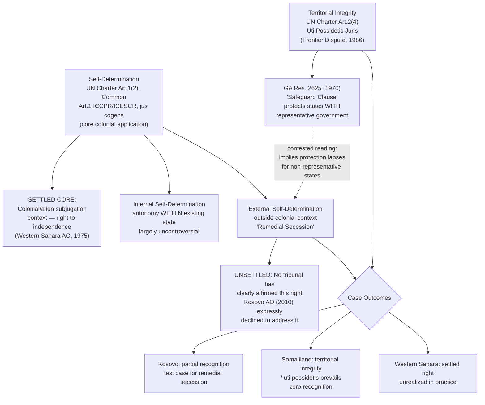

## Self-Determination as a Legal Principle and Its Tension with Territorial Integrity

### Doctrinal Foundation: Two Competing Organizing Principles

Recall that statehood is conventionally assessed against the Montevideo Convention's four factual criteria, and that contested statehood cases (Kosovo, Taiwan, Palestine, Somaliland) frequently arise precisely where an entity's claim to independent statehood collides with an existing state's continued assertion of sovereign authority over the same territory. That collision is the practical manifestation of a deeper doctrinal tension between two principles that international law recognizes as legally significant but has never fully reconciled: the **right to self-determination of peoples** and the **principle of territorial integrity** of existing states. Both principles enjoy genuine, well-established legal status; neither is simply subordinate to the other as a general matter; and international law's failure to specify a clear priority rule between them — rather than any gap in either principle's own content — is the central source of the recurring, unresolved character of secession and self-determination disputes.

### The Right to Self-Determination: Textual and Doctrinal Basis

**Key Points**

Self-determination's legal foundations are multiple and mutually reinforcing:

- **UN Charter Article 1(2)** lists, among the UN's purposes, developing "friendly relations among nations based on respect for the principle of equal rights and self-determination of peoples."
- **Common Article 1** of the two 1966 International Covenants (the ICCPR and the ICESCR) provides, in identical language in both instruments, that "All peoples have the right of self-determination. By virtue of that right they freely determine their political status and freely pursue their economic, social and cultural development" — a formulation notable for appearing in the opening article of both principal human-rights covenants, signaling self-determination's foundational status relative to the individual rights the remainder of each instrument protects.
- **UN General Assembly Resolution 1514 (1960)**, the Declaration on the Granting of Independence to Colonial Countries and Peoples, and **Resolution 2625 (1970)**, the Declaration on Principles of International Law Concerning Friendly Relations, elaborate the principle's content and its relationship to decolonization specifically.
- **ICJ jurisprudence**: The Court has repeatedly affirmed self-determination's status as a rule of international law with *erga omnes* character — an obligation owed to the international community as a whole, recall, such that all states have a legal interest in its observance — most notably in *East Timor* (Portugal v. Australia, 1995) and the *Western Sahara* Advisory Opinion (1975). The **2022 ILC Draft Conclusions on Peremptory Norms (*Jus Cogens*)** include self-determination on their non-exhaustive illustrative list of recognized peremptory norms, at least in its core, anti-colonial application.

### The Settled Core: Self-Determination in the Colonial Context

**The clearest and least contested application of self-determination is the right of peoples under colonial domination or alien subjugation to achieve independence.** This "external" dimension of self-determination — the right to determine a people's international political status, including through independence from a colonial power — achieved broad, largely uncontested acceptance through the decolonization movement of the 1950s–1970s, reflected in the rapid expansion of UN membership as former colonies achieved independence pursuant to this principle. The ICJ's *Western Sahara* Advisory Opinion (1975) confirmed the applicability of self-determination to the decolonization of Western Sahara specifically, rejecting Morocco's and Mauritania's claims of pre-colonial territorial sovereignty as a basis for overriding the Sahrawi people's self-determination rights, though the Opinion's practical effect on Western Sahara's ultimate status remains, decades later, unresolved as a matter of political fact.

### The Contested Periphery: Internal Self-Determination and Remedial Secession

Beyond this settled colonial core, self-determination doctrine extends — with progressively less doctrinal certainty — into two further, more contested dimensions:

**Internal self-determination**: Widely accepted as encompassing a people's right to meaningful political participation, autonomy, and self-governance *within* an existing state, without requiring or implying a right to independence or secession. This dimension is comparatively uncontroversial: it is generally understood as compatible with, rather than threatening to, the territorial integrity of existing states, since it operates entirely within the existing state's boundaries (through federalism, devolution, minority-rights protections, or other autonomy arrangements) rather than seeking to alter them.

**External self-determination outside the colonial context ("remedial secession")**: The genuinely unsettled question is whether a people within an **existing, non-colonial, internationally recognized state** possesses a right to unilateral secession — external self-determination in the fullest sense — where that state has failed to provide meaningful internal self-determination, particularly in cases of sustained, severe oppression. This theorized doctrine of **"remedial secession"** would treat a right to external self-determination as arising only as a last-resort remedy for a denial of internal self-determination, rather than as a freestanding entitlement available to any sufficiently identifiable "people." **[Unverified]** No authoritative international tribunal has clearly affirmed the existence of a general right of remedial secession as settled international law; state practice is genuinely inconsistent, and the doctrine's proponents and skeptics remain in a state of substantial, unresolved disagreement regarding both whether such a right exists and, if it does, what threshold of oppression or denial of internal self-determination would be required to trigger it.

### The ICJ's Kosovo Advisory Opinion: A Deliberately Narrow Non-Answer

Recall that the ICJ's **2010 Advisory Opinion on the Kosovo declaration of independence** was framed narrowly by the UN General Assembly's request: whether the declaration of independence itself violated international law. The Court held that **general international law contains no prohibition on declarations of independence**, reasoning that state practice does not support the existence of such a prohibition as a matter of customary international law. Critically, however, the Court **expressly declined** to address the separate, broader question of whether Kosovo (or any people in comparable circumstances) possessed a positive **right** to secede, still less whether a doctrine of remedial secession exists — the Court characterized this broader question as falling outside the scope of what had actually been asked of it. This deliberate narrowness is frequently misunderstood in casual treatments of the case: the Opinion establishes that unilateral declarations of independence are not *per se unlawful* under international law, which is a meaningfully different and considerably narrower proposition than establishing that an entity has an affirmative international legal *right* to secede and achieve independent statehood. The Opinion is best read as leaving the underlying tension between self-determination and territorial integrity essentially where it found it — unresolved as a matter of positive international law, at least outside the settled colonial core.

### The Principle of Territorial Integrity

Territorial integrity is protected through several converging doctrinal strands:

- **UN Charter Article 2(4)**, prohibiting the threat or use of force against the territorial integrity or political independence of any state — directed primarily at inter-state aggression, but frequently invoked more broadly in support of the general proposition that existing state boundaries merit strong legal protection.
- **UN General Assembly Resolution 2625 (1970)**, the Declaration on Friendly Relations, contains language often described as a **"safeguard clause"**: while affirming self-determination, the Declaration also states that nothing in its self-determination provisions shall be construed as authorizing or encouraging any action which would dismember or impair, totally or in part, the territorial integrity or political unity of sovereign and independent states conducting themselves in compliance with the principle of equal rights and self-determination and thus possessed of a government representing the whole people belonging to the territory without distinction. This clause is frequently cited by proponents of remedial secession as *implicitly* supporting the doctrine, precisely because it protects territorial integrity only for states that are "conducting themselves in compliance with" self-determination and possess a genuinely representative government — arguably implying that this protection *lapses*, and some form of external self-determination becomes available, where a state fails to meet that condition. This reading remains contested rather than settled; skeptics of remedial secession read the clause more narrowly, as a savings provision addressing an interpretive ambiguity rather than as itself creating an affirmative secession right.
- **The doctrine of *uti possidetis juris*** — the principle that new states emerging from decolonization or dissolution inherit existing administrative boundaries rather than having them redrawn along ethnic or other lines, applied by the ICJ in the *Frontier Dispute* case (Burkina Faso/Mali, 1986) as a general principle of law extending well beyond its Latin American origins — functions as a further, independent reinforcement of the territorial-integrity side of the tension, particularly relevant to African and post-colonial contexts, and substantially explains international reluctance to recognize secessionist claims (Somaliland being the paradigm example) even where the seceding entity's factual claim to effective statehood is comparatively strong.

### Why the Tension Remains Structurally Unresolved

**[Inference]** The persistence of this tension is not best understood as a temporary gap in international law awaiting future clarification, but as reflecting two genuinely competing and, at the margins, structurally incompatible values that the international legal order has embedded simultaneously without establishing a clear priority rule between them: self-determination protects the interests of peoples in determining their own political future, while territorial integrity protects the stability of the existing state system against the potentially unlimited fragmentation that would follow from treating self-determination as available, without qualification, to any sufficiently identifiable sub-national group. A rule clearly favoring self-determination over territorial integrity in all cases would risk legitimizing indefinite fragmentation of existing states; a rule clearly favoring territorial integrity in all cases would risk validating indefinite denial of self-governance to oppressed populations within unwilling states. State practice reflects this structural ambivalence: states are frequently self-determination-supportive rhetorically while simultaneously territorial-integrity-protective in their own specific national contexts, particularly regarding their own internal separatist movements — explaining, for instance, why several EU states withhold recognition of Kosovo specifically because of concerns about validating precedent relevant to their own domestic secessionist movements (Spain and Catalonia being the most frequently cited illustration).

### Comparative Application: How the Tension Plays Out

The four contested statehood cases surveyed previously each illustrate a different facet of this tension:

- **Kosovo**: The clearest post-*Kosovo Advisory Opinion* test case for remedial secession reasoning — proponents of Kosovo's independence frequently invoke the sustained, serious human rights violations preceding the 1999 NATO intervention as grounds for treating Kosovo's case as falling within a remedial-secession framework, while the ICJ's own Opinion pointedly avoided endorsing this reasoning.
- **Palestine**: Involves the clearest overlap with the *settled* colonial/alien-subjugation core of self-determination doctrine, given the recognized applicability of self-determination principles to peoples under occupation, though complicated by Palestine's fragmented territorial and governmental situation.
- **Somaliland**: Illustrates territorial integrity and *uti possidetis* prevailing decisively over a comparatively strong factual self-determination-adjacent claim, given the African Union's strong institutional presumption against altering Somalia's internationally recognized boundaries.
- **Western Sahara**: Remains the clearest unresolved instance of the *settled* decolonization-era right recognized by the ICJ in 1975 nonetheless failing, decades later, to translate into an actual exercise of self-determination on the ground — illustrating that even the doctrinally settled core of self-determination does not guarantee practical realization absent the political will of relevant states.

### Diagram: The Self-Determination / Territorial Integrity Tension

### Related Topics

- Contested statehood in practice: Kosovo, Taiwan, Palestine, and Somaliland
- The doctrine of *uti possidetis juris* and the *Frontier Dispute* case (Burkina Faso/Mali)
- The ICJ's 2010 Kosovo Advisory Opinion and its limited scope
- *Jus cogens* peremptory norms and obligations *erga omnes*
- The *Western Sahara* Advisory Opinion (1975) and unresolved decolonization
- UN Charter Article 2(4) and the prohibition on the use of force against territorial integrity