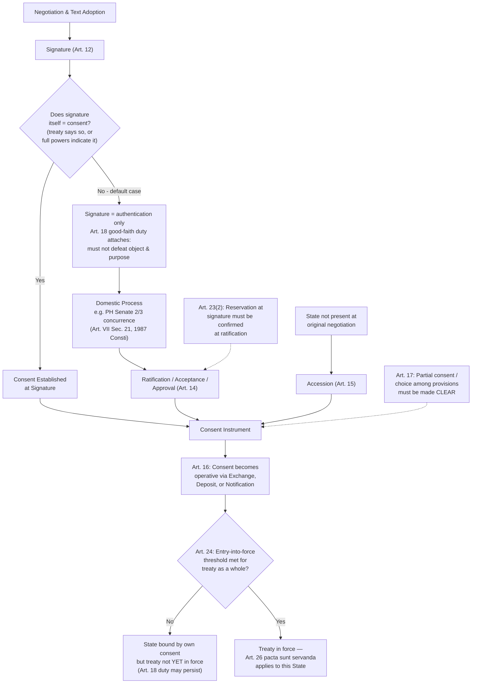

## Treaty Formation and Consent to Be Bound Under VCLT Articles 11 to 17

### Doctrinal Foundation: Consent as the Binding Mechanism

Recall that the Vienna Convention on the Law of Treaties (VCLT, 1969) codifies the customary international law framework governing treaties, and that treaty obligations rest on **state consent** rather than any external legislative authority — the foundational principle *pacta sunt servanda* (VCLT Article 26) binds a state precisely because, and only because, that state has consented to be bound. Articles 11 through 17 of the VCLT supply the operative legal machinery for that consent: they specify the discrete legal acts by which a state's consent to be bound by a treaty is formally expressed, and the specific legal consequences that flow from each. This is not a merely procedural or formalistic body of doctrine — because consent is the *entire* basis of a treaty's binding force on a given state, the precise mechanism by which that consent is manifested, and the moment at which it becomes legally operative, are questions of substantive legal consequence, not mere administrative detail.

### Article 11: The Means of Expressing Consent

**Article 11** establishes the general principle that "the consent of a State to be bound by a treaty may be expressed by signature, exchange of instruments constituting a treaty, ratification, acceptance, approval or accession, or by any other means if so agreed." This provision performs two functions: it enumerates the principal recognized mechanisms (elaborated individually in Articles 12–16), and it signals that this enumeration is **not exhaustive** — the parties to a particular treaty remain free to agree upon any other means of expressing consent, reflecting the VCLT's generally residual, default-rule character (parties can and frequently do depart from the VCLT's default provisions by express agreement in the treaty itself).

### Article 12: Consent Expressed by Signature

**Key Points**

Signature does **not**, as a general default rule, itself constitute consent to be bound by a treaty's substantive obligations. Article 12 specifies the narrower circumstances in which signature *does* suffice for consent:

1. The treaty **provides that signature shall have that effect** — common for simpler, bilateral, or technical agreements not requiring extended domestic ratification processes;
2. It is otherwise established that the **negotiating States were agreed** that signature should have that effect; or
3. The intention of the State to give that effect to signature **appears from the full powers** of its representative or was expressed during the negotiation.

Where none of these conditions is met — the ordinary case for major multilateral treaties, particularly those requiring domestic constitutional processes such as legislative concurrence — signature functions instead as an act of **authentication** of the treaty text (confirming that the signing state's representative regards the negotiated text as final and accurate) and as a signal of the state's intention to proceed toward ratification, without yet constituting definitive consent to be bound.

### Article 18: The Interim Good-Faith Obligation

Though technically situated outside the Articles 11–17 cluster, **Article 18** operates as the necessary doctrinal companion to signature-without-ratification and must be understood alongside it: a state that has signed a treaty (but not yet expressed full consent to be bound, where signature alone does not suffice under Article 12) is obligated to **refrain from acts which would defeat the object and purpose of the treaty**, until it has made clear its intention not to become a party. This is a distinctly limited obligation — it does not require compliance with the treaty's substantive terms, only abstention from conduct that would undermine the treaty's core purpose before the state has completed its own domestic process for deciding whether to ratify. The interim character of this obligation reflects a considered balance: full substantive compliance cannot fairly be demanded before a state has completed its own constitutionally required decision-making process, but signature is not treated as entirely without legal consequence either, given the reasonable expectations signature generates among the other negotiating states.

### Article 13: Consent Expressed by Exchange of Instruments

**Article 13** addresses the specific, comparatively streamlined mechanism by which consent may be expressed through an **exchange of instruments constituting a treaty** — a common device for simpler bilateral agreements, where the treaty itself consists of, for instance, two corresponding diplomatic notes rather than a single signed document. Consent is established through this exchange where the instruments provide that their exchange shall have that effect, or it is otherwise established that the states concerned were so agreed.

### Article 14: Consent Expressed by Ratification, Acceptance, or Approval

**Article 14** identifies the circumstances in which consent to be bound must be expressed through **ratification** (or, functionally equivalently for VCLT purposes, "acceptance" or "approval" — terms used somewhat interchangeably in modern treaty practice, with the choice among them often reflecting no substantive legal distinction but rather drafting convention or domestic procedural preference):

1. The treaty **provides for such consent to be expressed by means of ratification**;
2. It is otherwise established that the negotiating States were agreed that ratification should be required;
3. The representative of the State has **signed the treaty subject to ratification**; or
4. The intention of the State to sign the treaty subject to ratification appears from the full powers of its representative or was expressed during the negotiation.

**Ratification is a distinct, second-stage act from signature**, and this two-stage structure — signature followed by a separate act of ratification — is the VCLT's default model for treaties of significant substantive weight, precisely because it accommodates the reality that many states' domestic constitutional systems require a separate, internal approval process (frequently legislative) between the negotiating executive's initial signature and the state's final, binding commitment. This two-stage structure directly addresses a structural feature of how international law binds sovereign states: it allows the treaty-making function (typically an executive prerogative) to be checked by a domestic constitutional process (typically legislative) before the state's international commitment becomes final and binding — a domestic separation-of-powers safeguard layered onto the international consent mechanism, without which executive officials could bind their states to major international obligations without any corresponding domestic democratic check.

**Philippine constitutional application**: Under **Article VII, Section 21 of the 1987 Philippine Constitution**, "No treaty or international agreement shall be valid and effective unless concurred in by at least two-thirds of all the Members of the Senate" — a direct domestic-law illustration of the ratification mechanism Article 14 contemplates: the President (or an authorized representative) signs a treaty in the exercise of executive treaty-making authority, but the Philippines' international consent to be bound (its ratification, in VCLT terms) does not become final until the required Senate concurrence is obtained, reflecting the same two-stage, constitutionally-checked structure Article 14 accommodates as a general default.

### Article 15: Consent Expressed by Accession

**Article 15** addresses **accession** — the mechanism by which a state that did **not** sign a treaty during the original negotiation and adoption process may nonetheless become a party to it after the fact. Accession is available where the treaty so provides, where it is otherwise established that the negotiating states were agreed that consent may be expressed by that state through accession, or where all the parties have subsequently agreed that consent may be so expressed. Accession is functionally the mechanism through which a treaty's membership can expand over time beyond the states that participated in its original negotiation — a structurally important feature for treaties intended to achieve broad, potentially universal or near-universal participation over an extended period (major multilateral treaties such as the UN Charter itself, or human rights conventions, typically remain open to accession by states not present at, or not yet in existence during, the original negotiation).

### Article 16: The Moment of Exchange, Deposit, or Notification

**Article 16** specifies, as a default rule (again subject to contrary agreement by the treaty parties), that instruments of ratification, acceptance, approval, or accession **establish the consent of a State to be bound** upon: (a) their exchange between the contracting states; (b) their deposit with the depositary; or (c) their notification to the contracting states or to the depositary, if so agreed. This provision resolves a question of considerable practical importance for multilateral treaties with numerous parties: rather than requiring direct bilateral exchange among every pair of states (impractical for treaties with dozens or hundreds of potential parties), modern multilateral treaty practice typically designates a single **depositary** (often the UN Secretary-General, or the host state of the negotiating conference) with whom each state's ratification instrument is deposited, the depositary then notifying all other parties — a centralized administrative mechanism that Article 16(b) and (c) directly accommodate.

### Article 17: Consent to Be Bound by Part of a Treaty or a Choice Between Differing Provisions

**Article 17** addresses two more specialized situations: consent to be bound by only **part** of a treaty, which is effective only if the treaty so permits or the other contracting states so agree; and consent to be bound by a treaty that permits a **choice between differing provisions**, which is effective only if it is made clear to which of the provisions the consent relates. This provision reflects the VCLT's general insistence on **clarity and certainty** regarding the precise scope of a state's consent — the international legal order, lacking centralized mechanisms to resolve ambiguity after the fact through binding authoritative interpretation of one state's intentions, places a correspondingly greater premium on unambiguous, clearly specified consent at the point of treaty formation.

### Distinguishing Consent to Be Bound from Entry into Force

**A critical distinction, frequently conflated by students**: a state's own act of expressing consent to be bound (through any Article 11–17 mechanism) is **analytically distinct** from the treaty's **entry into force**, governed separately by **VCLT Article 24**. A state may complete ratification, yet the treaty as a whole may not yet be in force if it has not yet satisfied whatever entry-into-force threshold the treaty specifies (commonly, a minimum number of ratifications, or a fixed date, or both). Until that threshold is met, even a state that has fully completed its own domestic ratification process is not yet bound by the treaty's substantive obligations, though the good-faith obligation under Article 18 may continue to apply if that state remains a signatory pending the treaty's eventual entry into force. Article 24 further specifies that where a treaty does not itself indicate a date or mechanism for entry into force, it enters into force as soon as consent to be bound has been established for all the negotiating states — the residual default in the absence of an express provision.

### Reservations as a Qualification Attaching to Consent

Recall that a **reservation** — a unilateral statement made by a state when signing, ratifying, or acceding to a treaty, purporting to exclude or modify the legal effect of certain provisions in their application to that state (VCLT Article 2(1)(d)) — attaches specifically to the moment of expressing consent under Articles 12–15. A reservation formulated at signature must, where the treaty requires ratification, generally be formally confirmed at the time of ratification (VCLT Article 23(2)) to have legal effect, illustrating the close doctrinal interdependence between the reservations framework and the consent-to-be-bound mechanisms addressed here: a reservation is not a freestanding unilateral act but is legally anchored to, and takes effect through, one of the specific Article 11–17 consent mechanisms.

### Application to Philippine Interests: UNCLOS Ratification

The Philippines' participation in the UN Convention on the Law of the Sea (UNCLOS) illustrates the full Article 11–17 sequence in practice: the Philippines signed UNCLOS in 1982 and subsequently ratified it in 1984, with ratification requiring, under the Philippine constitutional framework described above, the requisite Senate concurrence — the treaty's substantive obligations, including the dispute-settlement mechanisms under UNCLOS Part XV and Annex VII that were later invoked in the *South China Sea Arbitration* (Philippines v. China, 2016), became binding on the Philippines only once this domestic ratification process was completed and validly communicated in accordance with the treaty's own deposit provisions, consistent with the Article 14/16 framework — not upon the Philippines' earlier signature alone.

### Diagram: The Consent-to-Be-Bound Sequence Under VCLT Articles 11–18

### Related Topics

- Treaties as a source of law: the Vienna Convention on the Law of Treaties framework
- Reservations to treaties under VCLT Articles 19–23
- Treaty interpretation under VCLT Articles 31–33
- Invalidity, termination, and suspension of treaties under VCLT Articles 42–72
- Philippine constitutional treaty-making procedure and Senate concurrence
- UNCLOS as a treaty instrument and its dispute-settlement framework under Part XV