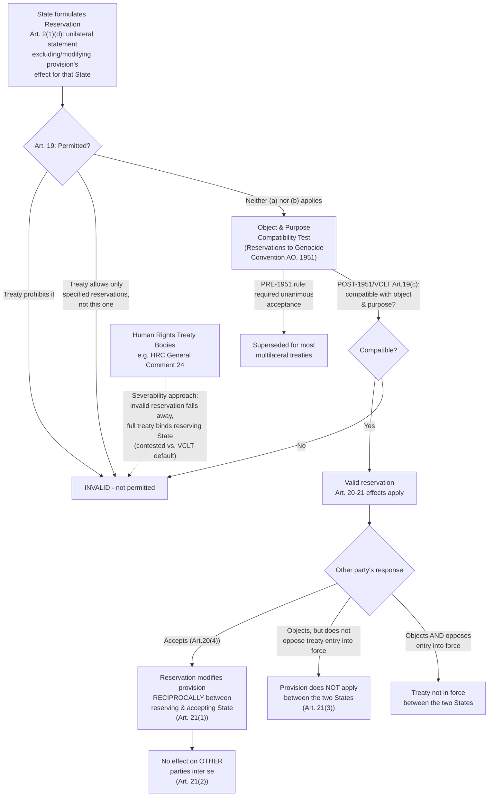

## Reservations and Objections, and the Reservations to the Genocide Convention Advisory Opinion

### Doctrinal Foundation: Reconciling Universality with Diversity of Interest

Recall that a state's consent to be bound by a treaty is expressed through the mechanisms specified in VCLT Articles 11–17 (signature, ratification, accession, and related acts). Reservations address a distinct but closely related problem: what happens when a state wishes to become a party to a treaty but objects to one or more of its specific provisions? Without some mechanism to accommodate partial dissent, a treaty's drafters would face a stark binary — a state must accept the treaty in its entirety or not join at all — a rigidity poorly suited to multilateral treaties with large, diverse memberships, where requiring unanimous agreement on every provision's exact application to every state would make broad participation practically unattainable. The **reservation** is international law's principal mechanism for reconciling the goal of broad, even universal, treaty participation with the reality that individual states retain differing interests, domestic legal constraints, and policy positions on specific provisions.

### Definition: VCLT Article 2(1)(d)

**Article 2(1)(d)** of the VCLT defines a reservation as "a unilateral statement, however phrased or named, made by a State, when signing, ratifying, accepting, approving or acceding to a treaty, whereby it purports to exclude or to modify the legal effect of certain provisions of the treaty in their application to that State." Three elements of this definition carry doctrinal weight:

- **Unilateral**: A reservation is an act of the reserving state alone, not requiring the agreement of other parties to be validly *formulated* (though, as discussed below, its *legal effect* depends significantly on other states' responses).
- **However phrased or named**: The legal character of a statement as a reservation depends on its **substantive effect** — excluding or modifying the legal effect of a treaty provision as applied to the reserving state — not on the label the reserving state attaches to it. A state cannot avoid the reservations framework's procedural requirements (such as the incompatibility test discussed below) merely by calling its statement something else, such as an "understanding" or "declaration," if its actual legal effect is to exclude or modify a provision's application.
- **Excludes or modifies legal effect "in their application to that State"**: A reservation operates only as between the reserving state and other parties — it does not alter the treaty's text or its application as between other parties inter se, a point elaborated in Article 21's provisions on legal effects, discussed below.

A related but distinct category is the **interpretive declaration** — a unilateral statement purporting only to clarify or specify a state's understanding of a provision's meaning, without purporting to exclude or modify its legal effect. The distinction matters because interpretive declarations are not subject to the reservations framework's compatibility test or objection mechanism; however, determining whether a given unilateral statement is genuinely an interpretive declaration or is, in substantive effect, a disguised reservation is itself a recurring source of interpretive difficulty, resolved by examining the statement's actual legal effect rather than its self-description.

### Article 19: When Reservations Are Permitted

**Key Points**

**Article 19** establishes the baseline default rule: a state may formulate a reservation when signing, ratifying, accepting, approving, or acceding to a treaty, **unless**:

1. The reservation is **prohibited by the treaty**;
2. The treaty provides that **only specified reservations**, which do not include the reservation in question, **may be made**; or
3. In cases not falling under (a) or (b), the reservation is **incompatible with the object and purpose of the treaty**.

The first two grounds are straightforward textual questions, resolved by examining the treaty's own terms. The third ground — the **object-and-purpose compatibility test** — is considerably more open-textured and has generated the most significant doctrinal development, most importantly through the *Reservations to the Genocide Convention* Advisory Opinion discussed below.

### The Reservations to the Genocide Convention Advisory Opinion (1951)

**Background**: The 1948 Convention on the Prevention and Punishment of the Crime of Genocide did not contain an express provision addressing whether reservations were permitted, and by the time the Convention had gathered a substantial number of ratifications, several states had attached reservations to specific provisions (notably Article IX, concerning ICJ jurisdiction over disputes relating to the Convention's interpretation, application, or fulfillment), while other states objected to those reservations. The UN General Assembly requested an ICJ advisory opinion addressing the legal consequences of a state making a reservation to which other parties had objected.

**The pre-existing customary rule**: Prior to this Advisory Opinion, the traditional customary international law rule — reflecting a strongly consent-based, contract-like conception of multilateral treaties, treating them as a bundle of essentially bilateral relationships requiring precise, uniform mutual consent — required that a reservation be accepted by **all** other parties to the treaty for the reserving state to become a party at all; unanimous acceptance was the threshold condition for the reservation's validity and, correspondingly, for the reserving state's participation.

**The Court's departure**: The ICJ rejected strict application of this unanimity rule for the Genocide Convention specifically, reasoning that the Convention's particular character justified a more flexible standard. The Court reasoned that the Genocide Convention was intended to be **universal in scope**, aimed at condemning and punishing genocide as "a crime under international law" contrary to the spirit and aims of the United Nations, and that the contracting states did not have any individual advantages or disadvantages, nor interests of their own, but rather **a common interest** — the accomplishment of the Convention's high purposes. Given this humanitarian, universally-oriented character, the Court held that the traditional, contract-based unanimity rule was **not appropriate**, and that instead, a state making a reservation to which one or more, but not all, parties objected could nonetheless be regarded as a party to the Convention **if the reservation is compatible with the object and purpose of the Convention**; if not, that state cannot be regarded as a party.

**The compatibility (object-and-purpose) standard articulated**: The Court thus introduced a **substantive, compatibility-based test** in place of the older **unanimity-based, procedural test** — reservations are to be assessed not by whether every other party accepts them, but by whether they are compatible with the treaty's object and purpose, a standard subsequently codified, in materially similar terms, in VCLT Article 19(c) as the general default rule applicable to treaties generally (not merely the Genocide Convention specifically), reflecting the Advisory Opinion's substantial influence on the VCLT's eventual drafting.

**[Inference]** The Advisory Opinion's reasoning reflects a broader jurisprudential shift, visible across several strands of mid-twentieth-century international law, away from treating multilateral treaties as simple aggregations of bilateral contractual relationships and toward recognizing that certain multilateral instruments — particularly those addressing humanitarian or broadly community-oriented concerns rather than reciprocal state-to-state exchanges of narrow interest — merit a distinct interpretive and structural approach, prioritizing the treaty's broad participation and integrity over the older, more rigid model of uniform, individually-negotiated consent.

### Article 20 and 21: Acceptance, Objection, and Legal Effects

**Article 20** governs acceptance of and objection to reservations. As a default rule, a reservation expressly authorized by the treaty does not require subsequent acceptance by other contracting states (Article 20(1)) unless the treaty so provides. Where the number of negotiating states and the treaty's object and purpose indicate that application of the treaty in its entirety between all parties is an essential condition of consent, a reservation requires acceptance by **all** parties (Article 20(2)) — a narrow exception preserving something like the older unanimity rule, but only for treaties where integral, uniform application is genuinely essential to the bargain (a narrower category than ordinary multilateral treaties generally). For the ordinary case, Article 20(4) establishes the operative default: acceptance by another contracting state constitutes the reserving state a party to the treaty in relation to that other state (once the treaty is in force, or upon its entry into force) once at least one other party has accepted the reservation; an objection by another contracting state does **not** preclude entry into force of the treaty as between the objecting and reserving states, **unless** a contrary intention is definitely expressed by the objecting state.

**Article 21** specifies the resulting legal effects, tracking directly from the Advisory Opinion's underlying logic of preserving broad participation while respecting individual dissent:

1. A valid reservation, as established between the reserving state and any accepting party, **modifies** the reserved provision to the extent of the reservation **for the reserving state in its relations with that other party**, and modifies the same provision to the same extent for that other party in its relations with the reserving state (i.e., the modification operates **reciprocally**).
2. The reservation **does not modify** the provision for the **other parties to the treaty inter se** — a state's reservation affects only its own bilateral relationship with each accepting party, leaving the treaty's application among all other parties fully intact.
3. When a state objecting to a reservation has **not** opposed the entry into force of the treaty between itself and the reserving state, the provision to which the reservation relates **does not apply as between the two states** to the extent of the reservation.

This structure produces a characteristic feature of modern multilateral treaty practice: a single treaty can, in effect, apply with **slightly different content as between different pairs of parties**, depending on each party's own reservations and each other party's response (acceptance or objection) to them — a complexity the strict, contract-based unanimity model would have avoided by simply excluding any reserving state whose reservation was not universally accepted, but at the cost of the broader participation the Advisory Opinion's more flexible approach was specifically designed to preserve.

### Human Rights Treaty Bodies and the Severability Debate

**[Inference]** A distinct and continuing controversy has emerged specifically regarding **human rights treaties**, where treaty monitoring bodies have at times taken positions in tension with the VCLT's own reservations framework as codified in Articles 19–21. The UN Human Rights Committee, in its **General Comment No. 24 (1994)**, addressing reservations to the ICCPR, took the position that where a reservation is incompatible with a human rights treaty's object and purpose, the appropriate remedy is **severance** — the reservation is treated as invalid and simply falls away, leaving the reserving state bound by the **entire** treaty (including the provision it had sought to reserve against) — rather than the VCLT's own Article 20/21 framework, under which an incompatible reservation would more conventionally be understood to preclude the reserving state from becoming a party to the treaty at all (or at least as against objecting states), consistent with Article 19(c)'s framing of an incompatible reservation as simply impermissible.

This **severability approach** has been criticized by a number of states and scholars as an overreach of a treaty monitoring body's competence relative to the VCLT's state-consent-centered design — the objection being that severance effectively imposes upon a reserving state obligations it never actually consented to accept (since the state's consent was conditioned specifically on the reservation being effective), a result seemingly in tension with the consent-based foundation of treaty law generally. **[Unverified]** Whether severability represents the correct approach specifically for human rights treaties, as a special category meriting departure from the VCLT's general default framework, or whether it represents an unauthorized deviation from settled treaty law, remains an unresolved and actively contested question, with state practice showing no uniform, consistently applied resolution.

### Practical Significance: Reservations as a Consent-Calibration Mechanism

The reservations framework, read as a whole, functions as a mechanism allowing states to **calibrate the precise scope of their own consent** to a multilateral instrument without foreclosing their participation in the broader treaty regime altogether — directly serving the underlying goal, articulated in the *Reservations to the Genocide Convention* Advisory Opinion, of maximizing the practical universality of treaties addressing matters of broad common interest, while still respecting the fundamentally consent-based structure of treaty obligation described throughout the law of treaties: a state is never bound, even under the more flexible compatibility-based framework, to a provision it has validly and effectively excluded through reservation as against any state that has accepted (or not objected to) that reservation.

### Diagram: The Reservations Framework Following the Genocide Convention Opinion

### Related Topics

- Treaties as a source of law: the Vienna Convention on the Law of Treaties framework
- Treaty formation and consent to be bound under VCLT Articles 11 to 17
- Treaty interpretation under VCLT Articles 31–33
- The Genocide Convention (1948): substantive obligations and the *Bosnian Genocide* and *Gambia v. Myanmar* cases
- Human rights treaty bodies and their interpretive authority
- Invalidity, termination, and suspension of treaties under VCLT Articles 42–72