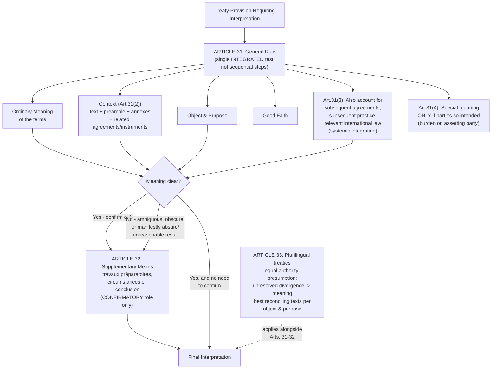

## Treaty Interpretation Under VCLT Articles 31 and 32 and the Role of Travaux Préparatoires

### Doctrinal Foundation: Interpretation as a Distinct Legal Problem

Recall that a treaty's binding force rests on state consent, expressed through the mechanisms specified in VCLT Articles 11–17, and that the treaty's substantive content is fixed at the point of adoption and authentication. A separate problem arises once a treaty is in force: what does its text actually *require* in a given situation? Treaty language, like any legal or natural language, is frequently general, ambiguous, or silent on circumstances the drafters did not foresee, and because international law lacks a centralized authority empowered to issue a single, universally binding interpretation, the *method* by which any given interpreter — a tribunal, a state's own legal advisers, or another party — is expected to derive meaning from treaty text carries substantial practical weight. **Articles 31 through 33** of the VCLT codify what is now overwhelmingly regarded as **customary international law** on treaty interpretation, cited routinely not only by the ICJ but by WTO panels and the Appellate Body, investor-state arbitral tribunals, regional human rights courts, and domestic courts construing treaty obligations — making this framework one of the most widely and consistently applied bodies of doctrine in the entire international legal system.

### Article 31(1): The General Rule — A Single Integrated Test

**Key Points**

**Article 31(1)** states: "A treaty shall be interpreted in good faith in accordance with the ordinary meaning to be given to the terms of the treaty in their context and in the light of its object and purpose."

The single most important methodological point about this provision, frequently misunderstood by students trained in domestic legal interpretive traditions that separate "textualist," "purposive," and "contextual" approaches into competing schools of thought, is that **Article 31(1) does not establish a hierarchy or sequence of separate interpretive methods to be applied one after another**. It establishes a **single, integrated rule** combining textual, contextual, and teleological (purpose-oriented) elements simultaneously. The provision's structure — good faith, ordinary meaning, context, and object and purpose, all within one sentence — reflects the drafters' deliberate rejection of any strict ranking among these elements. In practice, however, tribunals typically *begin* their analysis with the ordinary meaning of the text, using context and object and purpose to confirm, refine, or resolve ambiguity in that initial textual reading — a practical sequencing that should not be mistaken for a formal doctrinal hierarchy.

- **Good faith**: Draws on the same foundational principle underlying *pacta sunt servanda* (Article 26) — an interpreter (and, in the first instance, each treaty party interpreting its own obligations) must approach the text honestly, seeking its genuine meaning rather than a reading strategically selected to serve a predetermined outcome.
- **Ordinary meaning**: The words used are to be given their normal, natural sense as they would be understood by a reasonably informed reader, not a strained, unusual, or purely technical meaning unless the parties intended a specialized term of art (a possibility Article 31(4), discussed below, expressly accommodates).
- **Context**: Defined precisely in Article 31(2) (below) — not simply "the surrounding circumstances" in a loose sense, but a specifically enumerated set of textual materials.
- **Object and purpose**: The treaty's overall aims and goals, generally derived from the treaty's preamble, its title, and its substantive structure read as a whole — the same "object and purpose" standard central to the reservations-compatibility test under Article 19(c) and the *Reservations to the Genocide Convention* Advisory Opinion, illustrating the concept's recurring doctrinal importance across multiple distinct areas of treaty law.

### Article 31(2): The Defined Scope of "Context"

**Article 31(2)** specifies precisely what counts as "context" for purposes of the general rule: the treaty's **text, including its preamble and annexes**, together with (a) any agreement relating to the treaty which was made between all the parties in connection with the conclusion of the treaty, and (b) any instrument which was made by one or more parties in connection with the conclusion of the treaty and accepted by the other parties as an instrument related to the treaty. This is a comparatively narrow, textually-anchored definition — it does not extend to the negotiating history broadly, nor to materials never formally connected to the treaty's conclusion by mutual agreement or acceptance; those broader categories of material are addressed separately, and with lesser interpretive weight, under Article 32's supplementary means, discussed below.

### Article 31(3): Subsequent Agreements, Practice, and Systemic Integration

**Article 31(3)** directs that context, so defined, be read together with three further categories, "to be taken into account":

- **(a) Subsequent agreements** between the parties regarding the treaty's interpretation or the application of its provisions;
- **(b) Subsequent practice** in the application of the treaty which establishes the agreement of the parties regarding its interpretation;
- **(c) Any relevant rules of international law applicable in the relations between the parties**.

Subparagraph (c) is the textual anchor for what scholars term the principle of **systemic integration**: treaty interpretation should not proceed in isolation, treating a given treaty as a hermetically sealed instrument disconnected from the broader body of international law, but should instead account for other applicable rules of international law bearing on the relationship between the parties — a principle of particular significance given the proliferation of specialized treaty regimes (trade law, investment law, environmental law, human rights law) that has raised concerns, discussed further below, about the fragmentation of international law into disconnected, potentially conflicting sub-systems. Subparagraph (b), on subsequent practice, has been of particular importance in ICJ jurisprudence addressing how a treaty's meaning may evolve or be clarified through the parties' own consistent conduct in applying it over time, distinct from, though related to, the doctrine of subsequent treaty amendment.

### Article 31(4): Special Meaning

**Article 31(4)** provides a narrow exception to the ordinary-meaning default: "A special meaning shall be given to a term if it is established that the parties so intended." This places the burden of proof on the party asserting that a specialized, technical, or otherwise non-ordinary meaning was intended, rather than treating specialized meaning as a default assumption — reinforcing the ordinary-meaning starting point as the operative baseline.

### Article 32: Supplementary Means of Interpretation

**Article 32** addresses the role of materials **outside** the Article 31 framework: "Recourse may be had to supplementary means of interpretation, including the **preparatory work of the treaty and the circumstances of its conclusion**," but only in two specifically defined circumstances:

1. **To confirm** the meaning resulting from the application of Article 31; or
2. **To determine** the meaning when interpretation according to Article 31 leaves the meaning **ambiguous or obscure**, or leads to a result which is **manifestly absurd or unreasonable**.

This structure establishes a **clearly subordinate role for *travaux préparatoires*** (the French term, commonly used even in English-language international legal writing, for a treaty's preparatory work — negotiating records, drafting committee reports, conference proceedings, and similar historical materials documenting the treaty's formation) relative to the primary Article 31 interpretive exercise. *Travaux* cannot be the *starting point* of interpretation, and cannot be invoked to displace a clear meaning otherwise properly derived under Article 31 — their function is strictly confirmatory (reinforcing a meaning already reached) or, in the narrower category of genuinely ambiguous, obscure, or absurd-result cases, as a last-resort tool for resolving what Article 31 alone cannot settle.

**Doctrinal significance of this subordination**: This structure represents a deliberate rejection of the more subjective, drafter's-intent-centered approach to treaty interpretation that had been influential in earlier eras of international law (and remains, to varying degrees, influential in some domestic legal interpretive traditions), in favor of a more **objectified, text-centered method**. The underlying rationale is one of practical fairness and legal certainty: a treaty's negotiating history is frequently voluminous, may not be equally accessible to all parties (particularly newer parties acceding well after the original negotiation, who had no participation in and often limited access to detailed records of that history), and may reflect the negotiating positions or private intentions of specific delegations rather than the shared, mutual understanding the final treaty text was designed to embody. Privileging accessible, objectively verifiable text over potentially inaccessible or contested historical drafting materials better serves a treaty regime's predictability and its capacity to bind states — including states acceding long after the original negotiation — on a genuinely common, textually-grounded basis.

**[Inference]** This subordination of *travaux* is frequently identified by scholars as one of the most significant differences between the VCLT's interpretive method and certain domestic statutory-interpretation traditions (particularly some strands of U.S. legislative-history-heavy interpretive practice), reflecting international law's distinct institutional context: unlike a domestic legislature whose specific intent might be given greater interpretive weight given clearer institutional authority and more centralized, accessible archives, an international treaty's negotiating history is the product of numerous, often divergent, national delegations, none of which can straightforwardly be treated as embodying "the" drafters' singular collective intent in the way a unified domestic legislative body more plausibly might.

### Article 33: Interpretation of Treaties Authenticated in Two or More Languages

**Article 33** addresses **plurilingual treaties** — a practically significant issue given that major multilateral treaties are frequently authenticated in multiple official languages (the UN's six official languages, for UN-sponsored instruments, being a common example). The default rule is that where a treaty has been authenticated in two or more languages, the text is **equally authoritative in each language**, unless the treaty itself provides, or the parties agree, that a particular text shall prevail in case of divergence. Terms are **presumed to have the same meaning** in each authentic text. Where comparison of the authentic texts discloses a difference of meaning which the application of Articles 31 and 32 does not resolve, Article 33(4) directs that **the meaning which best reconciles the texts, having regard to the object and purpose of the treaty, shall be adopted** — a distinctly purposive, harmonizing default rule for resolving genuine cross-linguistic textual divergence that survives the ordinary interpretive process.

### The Interpretive Sequence in Practice

**Key Points**, summarizing how a tribunal applying Articles 31–33 typically proceeds:

1. Begin with the **ordinary meaning** of the treaty terms (Article 31(1)), read together with their **context** as specifically defined (Article 31(2)) and any subsequent agreements or practice, and relevant applicable international law (Article 31(3)).
2. Assess this reading against the treaty's **object and purpose** as a confirming or clarifying (not independently overriding) consideration within the same integrated Article 31(1) test.
3. Where the treaty is authenticated in multiple languages, cross-check for divergence under Article 33, resolving any unresolved divergence through the harmonizing, purpose-oriented default.
4. Only where this process leaves the meaning **ambiguous, obscure, or leads to a manifestly absurd or unreasonable result** — or simply to **confirm** an already-clear Article 31 meaning — may the tribunal turn to **Article 32 supplementary means**, including *travaux préparatoires* and the circumstances of the treaty's conclusion.

### Application to Philippine Interests: Interpretive Method in the South China Sea Arbitration

The *South China Sea Arbitration* Tribunal (Philippines v. China, 2016), interpreting UNCLOS provisions including Article 121(3)'s "regime of islands" (determining which maritime features can generate an exclusive economic zone) and provisions concerning historic rights and marine environmental protection, applied precisely this Article 31–32 framework, beginning its analysis with the ordinary meaning of the relevant UNCLOS text read in context and in light of UNCLOS's object and purpose (the comprehensive, universal allocation of maritime zones and rights), and drawing on UNCLOS's own extensive negotiating history and the practice of other UNCLOS tribunals and the ICJ as persuasive, confirmatory, and (where genuinely needed to resolve interpretive difficulty) supplementary aids — consistent with the subordinate, confirmatory-or-last-resort role Article 32 assigns to such materials relative to the primary text-context-purpose analysis under Article 31.

### Diagram: The VCLT Interpretive Hierarchy

### Related Topics

- Treaties as a source of law: the Vienna Convention on the Law of Treaties framework
- Treaty formation and consent to be bound under VCLT Articles 11 to 17
- Reservations and objections, and the *Reservations to the Genocide Convention* Advisory Opinion
- The fragmentation of international law and systemic integration under VCLT Article 31(3)(c)
- The *South China Sea Arbitration* and UNCLOS Article 121(3) interpretation
- Invalidity, termination, and suspension of treaties under VCLT Articles 42–72