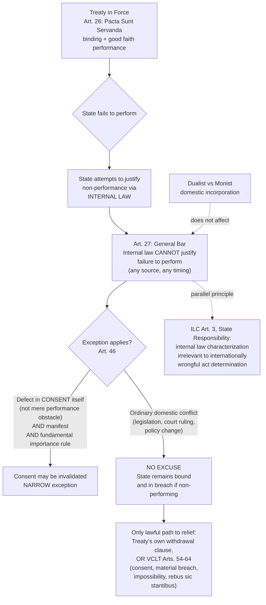

## Pacta Sunt Servanda and the Bar on Invoking Internal Law to Justify Non-Performance

### Doctrinal Foundation: The Central Pillar of Treaty Law

Recall that the entire edifice of treaty law — formation and consent under VCLT Articles 11–17, reservations under Articles 19–23, interpretation under Articles 31–33 — ultimately serves a single underlying purpose: establishing when and how a state becomes bound, and to what content, by an instrument it has consented to. ***Pacta sunt servanda*** ("agreements must be kept") is the principle that supplies the *consequence* of that consent: once a state is bound, it must actually comply. Codified in **VCLT Article 26** — "Every treaty in force is binding upon the parties to it and must be performed by them in good faith" — this is frequently described as the single most important rule in the entire law of treaties, and indeed one of the most fundamental principles in international law as a whole, because without it, the elaborate consent-based machinery of treaty formation would produce obligations with no binding consequence.

*Pacta sunt servanda* is widely regarded as reflecting not merely treaty law specifically, but a broader **general principle of law** (in the Article 38(1)(c) sense) and a rule of customary international law independently of the VCLT, meaning it binds even states that are not VCLT parties. Some scholars and tribunals have gone further, characterizing it as approaching the status of a foundational **meta-norm** of the international legal system — not merely one rule among others, but the structural premise on which the very concept of a binding international agreement depends.

### Why Pacta Sunt Servanda Is the Doctrinal Answer to the Enforcement Gap

**Key Points**

Recall the recurring analytical question underlying this entire course of study: how does international law bind sovereign states in the absence of a global enforcer comparable to a domestic state's executive and judicial enforcement apparatus? *Pacta sunt servanda* is the doctrine's most direct answer for the specific case of treaty obligations. Because a treaty obligation's ultimate source is the state's own prior consent, compliance is understood not as submission to an external, coercively imposed authority, but as the state **honoring its own antecedent commitment** — a structurally different, and in principle more durable, foundation for compliance than coercive enforcement, since it appeals to the state's own consistency and reputational interest rather than requiring an external enforcement mechanism to compel behavior contrary to the state's own prior will.

This does not mean *pacta sunt servanda* is self-enforcing in practice — states do, as an empirical matter, breach treaty obligations, and the international legal order's mechanisms for responding to breach (countermeasures, the law of state responsibility, dispute settlement mechanisms where available, reputational and diplomatic consequences) remain considerably weaker and more decentralized than domestic enforcement mechanisms. **[Inference]** The doctrine's significance lies less in guaranteeing compliance than in supplying the *normative baseline against which non-compliance is judged as unlawful* — without *pacta sunt servanda* as the governing default, there would be no coherent legal basis for characterizing a state's departure from its treaty commitments as a *breach* at all, as opposed to simply a permissible change of policy.

### The Good Faith Requirement Within Article 26

Article 26's requirement that treaties "must be performed... in good faith" extends *pacta sunt servanda* beyond mere technical or minimal compliance with a treaty's literal text. Good faith performance requires a party to perform its obligations in a manner consistent with the treaty's underlying purpose, not merely in a manner that technically satisfies the narrowest possible reading of specific textual language while defeating the treaty's broader object — a principle closely related to, though analytically distinct from, the good-faith element embedded in the Article 31(1) interpretive rule, and to the pre-ratification good-faith obligation under Article 18 (which requires a signatory state to refrain from defeating a treaty's object and purpose even before it has completed ratification). The good faith principle thus operates across multiple distinct stages of a treaty's lifecycle — signature, interpretation, and performance — as a unifying thread reinforcing that treaty obligations are to be approached with genuine fidelity to their purpose, not exploited through narrow technical evasion.

### Article 27: The Bar on Invoking Internal Law

**Article 27** of the VCLT supplies the doctrine's most consequential specific application: "A party may not invoke the provisions of its internal law as justification for its failure to perform a treaty." This is stated as a general rule "subject to article 46" — the narrow exception for manifest violations of a fundamentally important rule of internal law regarding treaty-making competence, discussed below.

**The doctrinal function of Article 27**: This provision addresses directly a structural feature of how international law binds sovereigns that might otherwise create a significant loophole in *pacta sunt servanda*'s practical force. Every state has its own domestic constitutional order — a constitution, statutes, judicial precedents, administrative regulations — governing its internal legal life. If a state could simply point to some feature of its own domestic law (a constitutional provision it had overlooked, a statute subsequently enacted that conflicts with the treaty, a domestic court ruling holding the treaty unconstitutional under domestic law) as an excuse for non-performance of its *international* obligations, the practical reliability of any treaty commitment would be severely undermined: every treaty partner would face the persistent risk that the other party's own unilateral, internally-controlled domestic legal developments could excuse non-compliance, without any corresponding international-law check on whether that domestic justification was legitimate. Article 27 forecloses this possibility as a general rule, treating the state as a **single, unified obligor** on the international plane, regardless of its internal constitutional architecture.

**Key Points** — practical scope of Article 27:

- The bar applies regardless of the **source** of the internal law invoked — constitutional provisions, ordinary legislation, judicial decisions (including a domestic supreme or constitutional court's own ruling that the treaty is unconstitutional under domestic law), or executive/administrative action.
- The bar applies regardless of **when** the internal law came into existence — a state cannot excuse non-performance either by pointing to internal law that existed but was allegedly overlooked at the time of ratification, or by pointing to internal law enacted subsequently that conflicts with a pre-existing treaty obligation; in the latter case, the state's international obligation continues notwithstanding the later domestic legal development, and the state's remedy, if it wishes to be released from the obligation, lies in the treaty's own termination or withdrawal provisions (or the VCLT's general termination framework under Articles 54 and following) — not in unilateral domestic legislative override.
- **Domestic non-performance does not affect international validity**: A treaty remains fully valid and binding as a matter of international law even where a state's own domestic legal system, for whatever reason, fails to give it direct effect internally (a consequence of the **dualist** approach to the relationship between international and domestic law, under which international treaty obligations do not automatically become part of domestic law without a separate act of domestic incorporation, as contrasted with a **monist** approach under which international law is automatically part of the domestic legal order). Article 27 operates independently of this monism/dualism distinction: regardless of how a given state's domestic constitutional order chooses to (or fails to) incorporate a treaty domestically, that state's *international* legal obligation to perform the treaty persists unaffected, and any domestic-law gap in implementation is, from the standpoint of international law, simply a failure the state must remedy (through domestic legislative or other action) rather than a valid excuse for non-performance.

### The Narrow Article 46 Exception

**Article 46** provides the VCLT's single, narrowly circumscribed exception to Article 27's general bar. A state may invoke the fact that its consent to be bound was expressed **in violation of a provision of its internal law regarding competence to conclude treaties** as invalidating its consent, but only where that violation was **manifest** and concerned a rule of internal law **of fundamental importance**. Article 46(2) further specifies that a violation is "manifest" if it would be objectively evident to any state conducting itself in the matter in accordance with normal practice and in good faith.

This exception is deliberately narrow along several distinct dimensions:

- It addresses only a **defect in the state's own consent-conferring competence** (for instance, a treaty concluded by an official who manifestly lacked constitutional authority to bind the state at all, such as an official acting without any color of authorization, or in flagrant disregard of a clear and well-known constitutional requirement such as legislative ratification), not any and every domestic legal obstacle to *performance* of an otherwise validly concluded treaty.
- The "manifest" requirement means the defect must be objectively obvious to other states dealing with the state in good faith — an obscure, technical, or genuinely disputable question of domestic constitutional law does not qualify, since other treaty partners cannot reasonably be expected to have independently verified the fine details of another state's internal constitutional arrangements before relying on that state's apparent consent.
- The "fundamental importance" requirement further narrows the exception to genuinely foundational competence rules (such as a constitutional requirement of legislative ratification for treaties of a certain category), not minor or merely procedural domestic requirements.

**[Inference]** The cumulative effect of these two cumulative qualifications — manifest **and** of fundamental importance — is that Article 46 operates as a genuinely narrow safety valve, protecting the reasonable reliance interests of other treaty parties who dealt with a state's apparent consent in good faith, rather than as a broad opening through which states could routinely escape treaty obligations by retrospectively discovering domestic legal irregularities in their own consent process. This narrow construction is consistent with, and reinforces, the general policy underlying Article 27: the international legal order places the burden of ensuring domestic constitutional compliance squarely on the state itself, at the point of expressing consent, rather than allowing that burden to be shifted onto treaty partners after the fact.

### Article 27 and the Doctrine of State Responsibility

Article 27's bar on invoking internal law connects directly to the broader **law of state responsibility**, codified in the ILC's 2001 Articles on State Responsibility, which similarly treats a state's internal law as **irrelevant** to the characterization of conduct as an internationally wrongful act — Article 3 of the ILC Articles provides that the characterization of an act as internationally wrongful is governed by international law, and is not affected by the characterization of the same act as lawful under internal law. This is the state-responsibility-law parallel to VCLT Article 27, applying the same underlying principle (the irrelevance of domestic law's characterization to international legal consequences) beyond the specific treaty-performance context to the broader question of state responsibility for internationally wrongful conduct generally, reinforcing that this is a structural feature of the international legal system as a whole, not a rule idiosyncratic to treaty law alone.

### Practical Illustration: Domestic Constitutional Conflict

A frequently discussed illustrative scenario, useful for consolidating the doctrine: a state ratifies a treaty in full compliance with its domestic constitutional treaty-making procedures (for the Philippines, for instance, Senate concurrence under Article VII, Section 21 of the 1987 Constitution). Some years later, the state's domestic legislature enacts a statute, or its highest court issues a ruling, that conflicts with the treaty's requirements — perhaps because domestic political circumstances have changed, or because a domestic court, applying domestic constitutional interpretive principles, concludes the treaty (or the statute implementing it) is unconstitutional under domestic law. **Under Article 27, none of this excuses the state's international obligation to perform the treaty.** The state remains internationally bound and, if it fails to perform, is in breach — exposing it to whatever consequences the treaty itself specifies (dispute settlement mechanisms, if any) and to the general law of state responsibility (potentially including lawful countermeasures by injured parties). The state's *only* international-law-consistent path to being relieved of the obligation is to use the treaty's own withdrawal or termination provisions, or to invoke one of the VCLT's own recognized grounds for termination or suspension under Articles 54–64 (mutual consent, material breach by another party, supervening impossibility, or the narrowly-construed *rebus sic stantibus* doctrine) — not simply to point to the domestic legal conflict itself as a self-executing excuse.

### Application to Philippine Interests

The Philippine Supreme Court has, in various contexts, addressed the relationship between international treaty obligations and domestic constitutional law, generally operating within a framework consistent with Article 27's underlying logic: the Philippines' international obligations under a validly ratified treaty (such as UNCLOS, ratified in 1984 following the constitutionally required Senate concurrence) persist as binding international commitments regardless of subsequent domestic legal or political developments, with domestic implementation questions addressed through the Philippines' own separate constitutional and legislative processes for giving domestic effect to treaty obligations, consistent with the Philippines' generally dualist approach to the incorporation of international treaty law, without those domestic implementation questions in themselves affecting the underlying international validity or binding character of the treaty obligation itself.

### Diagram: Pacta Sunt Servanda and the Internal Law Bar

### Related Topics

- Treaties as a source of law: the Vienna Convention on the Law of Treaties framework
- Treaty formation and consent to be bound under VCLT Articles 11 to 17
- Invalidity, termination, and suspension of treaties under VCLT Articles 42–72
- The ILC Articles on State Responsibility: attribution and the irrelevance of internal law
- Monism and dualism: domestic incorporation of international treaty obligations
- Philippine constitutional treaty-making procedure and Senate concurrence