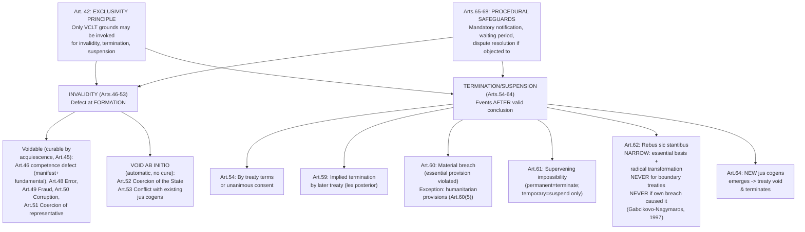

## Treaty Invalidity, Termination, and Suspension Under VCLT Articles 42 to 64

### Doctrinal Foundation: The Exclusivity Principle of Article 42

Recall that *pacta sunt servanda* (VCLT Article 26) establishes that a treaty in force binds its parties and must be performed in good faith, and that Article 27 bars a state from invoking its own internal law to justify non-performance. A state's international commitments would offer little practical value, however, if states could invent arbitrary, unpredictable grounds for escaping them whenever performance became inconvenient. **Article 42(1)** addresses this directly: "The validity of a treaty or of the consent of a State to be bound by a treaty may be impeached only through the application of the present Convention" — meaning the grounds enumerated in the VCLT (Articles 46–53) are the **exclusive** bases for challenging a treaty's validity; no other ground, however plausible it might seem to the invoking state, is available. **Article 42(2)** applies parallel exclusivity to termination, denunciation, withdrawal, and suspension: these may take place only as a result of the application of the treaty's own provisions or of the Convention, foreclosing unilateral invention of novel escape routes there as well. This exclusivity principle is the structural key to the entire Articles 42–64 framework: rather than leaving states to argue for whatever justification for non-performance seems convenient in a given dispute, the VCLT closes the list, requiring that any challenge fit within one of its specifically defined categories.

### The Conceptual Distinction: Invalidity vs. Termination/Suspension

**Key Points**

Before surveying individual grounds, the analytical distinction between **invalidity** and **termination/suspension** must be kept clear, since students frequently conflate them:

- **Invalidity** (Articles 46–53) concerns a **defect existing at the treaty's formation** — the treaty (or a state's consent to it) was never validly concluded in the first place, due to a flaw present from the outset (a competence defect, error, fraud, coercion, or conflict with a peremptory norm). A successful invalidity claim means the treaty (or the affected state's participation in it) is treated, in principle, as if it never validly existed.
- **Termination and suspension** (Articles 54–64) concern a **treaty validly concluded and initially binding**, whose continued operation is subsequently brought to an end (termination) or temporarily halted (suspension) due to events or circumstances arising **after** conclusion — mutual agreement, breach by another party, supervening impossibility, or fundamentally changed circumstances.

This distinction carries a further important structural consequence, addressed in **Article 44** (separability): as a general default rule, a ground for invalidity, termination, withdrawal, or suspension may be invoked with respect to the **treaty as a whole**, not merely specific clauses, except in defined circumstances where the relevant clauses are separable from the remainder of the treaty and it appears the parties did not intend acceptance of those clauses to be an essential basis of consent to the treaty as a whole — a further illustration of the VCLT's general preference for treaty integrity and predictability over piecemeal, unilaterally-selected partial escape from specific inconvenient provisions.

### Grounds of Invalidity (Articles 46–53)

**Voidable grounds** — requiring invocation by the affected state, and capable of being cured by that state's subsequent conduct (Article 45 specifies that a state loses its right to invoke a ground of invalidity, termination, withdrawal, or suspension if, after becoming aware of the facts, it has expressly agreed the treaty is valid or, by its conduct, must be considered as having acquiesced in the treaty's validity or continuance):

- **Article 46 — Internal law violation regarding competence**: As discussed in relation to Article 27, a state may invoke a violation of its internal law regarding competence to conclude treaties only where the violation was **manifest** (objectively evident to any state acting in good faith and in accordance with normal practice) and concerned a rule of **fundamental importance** — a narrowly construed exception, discussed in depth elsewhere in this chapter.
- **Article 48 — Error**: A state may invoke an error in a treaty as invalidating its consent if the error relates to a fact or situation which that state assumed to exist at the time the treaty was concluded and which formed an **essential basis** of its consent. Article 48(2) excludes errors relating merely to the wording of a treaty text (addressed instead under Article 79's corrections procedure) and excludes an error where the state's own conduct contributed to the error, or where the circumstances were such as to put that state on notice of a possible error.
- **Article 49 — Fraud**: A state induced to conclude a treaty by the **fraudulent conduct** of another negotiating state may invoke the fraud as invalidating its consent.
- **Article 50 — Corruption of a state representative**: Where a state's consent has been procured through the **corruption** of its representative, directly or indirectly, by another negotiating state, that consent may be invalidated.
- **Article 51 — Coercion of a state representative**: Consent procured by the **coercion of a state's representative personally**, through acts or threats directed against that individual representative, is **without any legal effect** — notably, unlike the other voidable grounds, this ground is framed in terms suggesting automatic nullity rather than merely voidability, reflecting the especially serious character of directly coercing an individual negotiator.

**Void ab initio grounds** — operating automatically, without regard to acquiescence, reflecting the exceptional seriousness of the underlying defect:

- **Article 52 — Coercion of the state itself by threat or use of force**: A treaty is **void** if its conclusion has been procured by the threat or use of force in violation of the principles of international law embodied in the UN Charter. This addresses coercion of the *state* as a whole (through, for instance, an armed invasion compelling capitulation to a territorial or other treaty), as distinguished from Article 51's narrower concern with coercion targeting an individual representative personally.
- **Article 53 — Conflict with a peremptory norm (*jus cogens*)**: A treaty is **void** if, at the time of its conclusion, it conflicts with a peremptory norm of general international law — recall the Article 53 definition of *jus cogens* as a norm accepted and recognized by the international community of states as a whole as one from which no derogation is permitted and modifiable only by a subsequent norm of the same character. This is doctrinally the most far-reaching invalidity ground, since it operates regardless of the consent or acquiescence of any party and reflects the substantive hierarchy *jus cogens* introduces into an otherwise formally non-hierarchical system of sources.

### Grounds of Termination and Suspension (Articles 54–64)

- **Article 54 — Termination or withdrawal under the treaty's own terms, or by consent of all parties**: The most straightforward ground — a treaty may be terminated, or a party may withdraw, in accordance with the treaty's own provisions, or at any time by consent of all the parties after consultation with the other contracting states.
- **Article 56 — Termination or withdrawal from a treaty containing no provision on the subject**: Where a treaty contains no express termination or withdrawal clause, denunciation or withdrawal is generally **not permitted**, unless it is established that the parties intended to admit the possibility, or a right of denunciation or withdrawal may be implied by the nature of the treaty — a comparatively narrow, default-against-unilateral-exit rule reflecting the VCLT's general preference for treaty stability.
- **Article 59 — Implied termination through a later treaty**: Where all parties to an earlier treaty conclude a later treaty relating to the same subject matter, the earlier treaty is considered terminated (or its operation suspended) if the later treaty so provides, or it appears from the later treaty (or is otherwise established) that the parties intended the matter to be governed by it, or the provisions of the two treaties are so far incompatible that they cannot be applied simultaneously — a specific application of the general *lex posterior* principle within the VCLT's own codified framework.
- **Article 60 — Material breach**: A **material breach** of a bilateral treaty by one party entitles the other to invoke the breach as a ground for terminating the treaty or suspending its operation in whole or in part. For multilateral treaties, the rules are more complex: other parties, by unanimous agreement, may suspend or terminate the treaty as between themselves and the defaulting state, or as between all parties; a party specially affected by the breach may invoke it as a ground for suspension between itself and the defaulting state; and any party other than the defaulting state may invoke the breach as a ground for suspending the treaty's operation with respect to itself if the treaty is of such a character that a material breach by one party radically changes the position of every party regarding further performance. Article 60(3) defines a **material breach** as either a repudiation of the treaty not sanctioned by the VCLT, or the violation of a provision **essential to the accomplishment of the object or purpose of the treaty** — a comparatively demanding threshold, excluding minor or technical breaches from triggering the termination/suspension remedy. Article 60(5) carves out an important exception: these material-breach termination/suspension provisions do **not** apply to provisions relating to the protection of the human person contained in treaties of a humanitarian character, particularly provisions prohibiting reprisals against protected persons — preventing, for instance, one party's breach of humanitarian obligations from being used by another party as a justification for its own reciprocal suspension of humanitarian protections, given the fundamentally non-reciprocal character of humanitarian obligations.
- **Article 61 — Supervening impossibility of performance**: A party may invoke impossibility of performance as a ground for terminating or withdrawing from a treaty if the impossibility results from the **permanent disappearance or destruction of an object indispensable** for the treaty's execution (the classic illustration being the submergence of an island, or the drying up of a river, central to a treaty's subject matter). If the impossibility is **temporary**, it may be invoked only as a ground for **suspending** operation. Article 61(2) excludes reliance on this ground where the impossibility results from the invoking party's own breach of an obligation under the treaty or owed to any other party.
- **Article 62 — Fundamental change of circumstances (*rebus sic stantibus*)**: Perhaps the most narrowly and cautiously constructed ground in the entire framework, reflecting deep drafting-era concern about its potential for abuse as a pretext for unilateral treaty exit. A fundamental change of circumstances **may not** be invoked as a ground for terminating or withdrawing from a treaty **unless**: (a) the existence of those circumstances constituted an **essential basis** of the parties' consent to be bound, **and** (b) the change **radically transforms the extent of obligations** still to be performed under the treaty. Article 62(2) imposes two further, absolute exclusions: this ground may **never** be invoked with respect to a treaty establishing a **boundary**, and may never be invoked if the fundamental change results from the invoking party's **own breach** of an obligation under the treaty or owed to any other party. The ICJ applied this framework restrictively in ***Gabčíkovo-Nagymaros Project*** (Hungary/Slovakia, 1997), rejecting Hungary's argument that changed political circumstances (the end of the Cold War and associated political transformation) and evolving environmental knowledge constituted a fundamental change justifying termination of the underlying dam-construction treaty, the Court emphasizing the doctrine's narrow, exceptional character and holding that the changes invoked, however significant politically, did not so radically transform the extent of the obligations still to be performed as to satisfy Article 62's demanding threshold.
- **Article 64 — Emergence of a new peremptory norm**: If a **new** peremptory norm of general international law emerges after a treaty's conclusion, any existing treaty which conflicts with that norm **becomes void and terminates** — the temporal counterpart to Article 53's rule for pre-existing conflicts, extending *jus cogens*'s overriding, hierarchy-establishing effect to treaties that were validly concluded at the time but subsequently come into conflict with a newly crystallized peremptory norm.

### Procedural Safeguards: Articles 65–68

**Key Points**

A recurring theme across Articles 46–64 is that none of these grounds operates through the invoking state's own unilateral, self-executing assertion alone. **Articles 65 through 68** impose a mandatory procedural framework: a party invoking a defect in consent, or a ground for terminating, withdrawing from, or suspending a treaty, must **notify** the other parties of its claim, indicating the measure proposed and the reasons for it. If, after a specified period (not less than three months, absent special urgency), no party has raised an objection, the invoking party may proceed with the measure it proposed. If an objection **is** raised, the parties are directed to seek a solution through the peaceful means indicated in UN Charter Article 33 (negotiation, mediation, arbitration, judicial settlement, and similar mechanisms). This procedural architecture functions as a **due-process constraint** against purely unilateral, unverified treaty exit: it does not require prior third-party adjudication before any measure can be taken, but it does require transparent notification and creates a structured opportunity for other parties to contest the claim, embedding a measure of accountability and predictability into what would otherwise be an entirely unilateral determination by the invoking state.

### Synthesis: How This Framework Reinforces Pacta Sunt Servanda

**[Inference]** Read as a whole, the Articles 42–68 framework should be understood not as undermining *pacta sunt servanda* by providing numerous exit routes, but as **reinforcing** it precisely through its narrowness and procedural rigor: by closing the list of available grounds (Article 42's exclusivity principle), construing each ground restrictively (particularly the *rebus sic stantibus* doctrine under Article 62, and the "manifest" and "fundamental importance" qualifiers under Article 46), and requiring transparent, structured notification before any measure takes effect (Articles 65–68), the VCLT ensures that treaty obligations remain genuinely reliable and predictable, resistant to opportunistic unilateral evasion, while still providing legitimate, narrowly-defined mechanisms for addressing the comparatively rare cases where a treaty's continued binding force would be genuinely unjust or impossible — striking a considered balance between the stability *pacta sunt servanda* is meant to secure and the recognition that no legal rule should operate with absolute, exceptionless rigidity regardless of genuinely extraordinary circumstances.

### Application to Philippine Interests

The restrictive construction of grounds such as *rebus sic stantibus* under Article 62 is directly relevant to the durability of instruments such as UNCLOS as applied to Philippine maritime interests: the *Gabčíkovo-Nagymaros* precedent's demanding threshold for fundamental change of circumstances means that neither shifting geopolitical alignments in the South China Sea region nor evolving scientific understanding of maritime environments would, without more, provide a state party a viable basis for unilaterally terminating or suspending its UNCLOS obligations — reinforcing the treaty framework's stability as the governing legal basis for resolving Philippine maritime disputes, consistent with the outcome and reasoning of the *South China Sea Arbitration* itself.

### Diagram: The Articles 42–68 Framework

### Related Topics

- Pacta sunt servanda and the bar on invoking internal law to justify non-performance
- *Jus cogens* peremptory norms and obligations *erga omnes*
- The *Gabčíkovo-Nagymaros Project* case and the doctrine of *rebus sic stantibus*
- Treaty formation and consent to be bound under VCLT Articles 11 to 17
- The law of state responsibility and countermeasures in response to treaty breach
- Reservations and objections, and the *Reservations to the Genocide Convention* Advisory Opinion