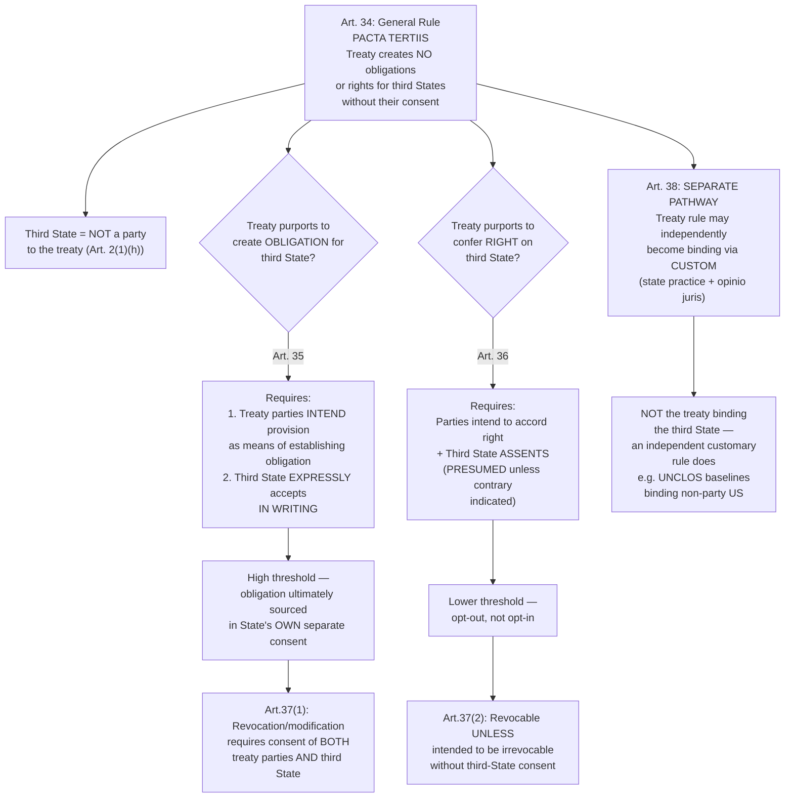

## Third States and Treaties: The Pacta Tertiis Principle and Its Exceptions

### Doctrinal Foundation: The Privity Logic of Consent-Based Obligation

Recall that treaty obligations rest entirely on state consent, expressed through the mechanisms of VCLT Articles 11–17, and bind a party through *pacta sunt servanda* (Article 26). A directly related, and equally consent-driven, question follows: what effect, if any, does a treaty have on states that were **not** party to its negotiation and did **not** express consent to be bound by it? The governing principle — ***pacta tertiis nec nocent nec prosunt*** ("agreements neither harm nor benefit third parties") — answers this with the same consent-based logic that underlies the entire law of treaties: since a treaty's binding force derives exclusively from the consenting parties' own will, it follows naturally that the treaty cannot, as a general matter, impose obligations or confer rights upon a state that never participated in that consensual act. This is treaty law's direct analog to a familiar principle of contract law in many domestic legal systems (privity of contract), transposed onto the state-to-state plane, and it reflects the same sovereignty-protective logic that runs through the broader law of treaties: no state can be bound without its own consent.

### Article 34: The General Rule

**Article 34** of the VCLT states the baseline default with clarity: "A treaty does not create either obligations or rights for a third State without its consent." A **"third State,"** as used throughout this part of the VCLT (defined in Article 2(1)(h)), is simply a state that is **not a party** to the treaty in question. Article 34 is deliberately symmetrical — it bars a treaty from imposing obligations on a non-consenting third state, **and** equally bars a treaty from conferring rights on a third state, absent that state's own consent (though, as discussed below, the consent threshold differs meaningfully between the obligation and rights scenarios). This symmetry might seem counterintuitive at first: why would a state need to affirmatively consent merely to **receive a benefit** it did not ask for? The VCLT's answer, elaborated in Article 36 below, reflects a considered judgment that even the conferral of a right should not be imposed on a state without at least its assent, out of respect for that state's own sovereign prerogative to decide, for itself, what legal relationships it wishes to enter — though the threshold of consent required is calibrated differently for rights than for obligations, reflecting the comparatively lower risk a mere right (as opposed to a binding obligation) poses to the third state's sovereignty.

### Article 35: Treaties Providing for Obligations of Third States

**Key Points**

**Article 35** specifies the precise conditions under which a treaty **may** create an obligation for a third state: "An obligation arises for a third State from a provision of a treaty if the parties to the treaty intend the provision to be the means of establishing the obligation and the third State expressly accepts that obligation in writing."

This provision imposes a **demanding, cumulative two-part test**:

1. **Intent of the treaty parties**: The states party to the treaty must have specifically intended the relevant provision to function as the vehicle for establishing an obligation on the third state — not merely intended the provision to describe, regulate, or reference the third state's conduct incidentally.
2. **Express written acceptance by the third state**: The third state must **expressly** accept the obligation, **in writing** — a considerably higher threshold than mere silence, acquiescence, or informal or implied acceptance would satisfy. This heightened formality requirement reflects the seriousness with which the VCLT treats the imposition of a binding legal obligation on a state that was not party to the treaty's original negotiation: informal or ambiguous conduct is not sufficient to bind a third state to an obligation it did not itself negotiate.

**[Inference]** The practical effect of Article 35's demanding threshold is that a treaty's obligations essentially **never** bind third states through the treaty mechanism alone — in practice, this provision is invoked comparatively rarely, since it requires what amounts to a **separate act of consent** by the third state (express, written acceptance), meaning the "obligation" ultimately still traces back to that state's own independent consent rather than to the original treaty's binding force being extended to it involuntarily. This is consistent with, rather than an exception to, the underlying consent-based logic of *pacta tertiis*: Article 35 does not actually allow a treaty to bind a non-consenting state; it merely describes the formal mechanism by which a third state's own subsequent, express consent (given in writing, referencing the specific treaty provision) can create an obligation functionally sourced in that provision.

### Article 36: Treaties Providing for Rights of Third States

**Article 36** addresses the conferral of **rights**, applying a **meaningfully lower threshold** than Article 35's obligation framework: "A right arises for a third State from a provision of a treaty if the parties to the treaty intend the provision to accord that right either to the third State, or to a group of States to which it belongs, or to all States, and the third State assents thereto." Critically, Article 36(1) then specifies: "Its assent shall be **presumed** so long as the contrary is not indicated, unless the treaty otherwise provides."

**Key Points** — the asymmetry between Articles 35 and 36 is doctrinally significant:

- **Obligations require express written acceptance** (Article 35) — an opt-in mechanism, reflecting the seriousness of imposing a binding duty.
- **Rights require only assent, which is presumed absent contrary indication** (Article 36) — effectively an **opt-out mechanism**: the third state is treated as having accepted the benefit unless it affirmatively indicates otherwise.

This asymmetry reflects a considered, and readily defensible, policy judgment: conferring a right on a third state poses comparatively little risk to that state's sovereignty or interests (a state can simply decline to exercise a right it does not want, at essentially no cost), whereas imposing an obligation directly constrains the third state's freedom of action and therefore warrants the heightened, express-written-consent threshold Article 35 requires. A treaty establishing, for instance, a right of transit or navigation for the benefit of a group of states, or for all states, functions under this more permissive Article 36 framework, with the presumption of assent operating unless a given third state affirmatively objects. Article 36(2) further specifies that a state exercising a right under this provision must comply with the conditions for its exercise provided for in the treaty, or established in conformity with the treaty — the right, once accepted (or presumptively assented to), is not unconditional but is subject to whatever terms the treaty itself attaches to it.

### Article 37: Revocation or Modification of Third-State Obligations and Rights

**Article 37** addresses the separate question of how an obligation or right, once established for a third state under Articles 35 or 36, may subsequently be revoked or modified:

- **Obligations** (Article 37(1)): An obligation arising for a third state under Article 35 may be **revoked or modified only with the consent of the parties to the treaty and of the third State**, unless it is established that they had otherwise agreed — reflecting the same heightened protection the express-written-consent threshold for creating the obligation in the first place already signaled: once a third state has bound itself, that binding character cannot simply be unilaterally altered by the original treaty parties without the third state's own continuing consent.
- **Rights** (Article 37(2)): A right arising for a third state under Article 36 may **not** be revoked or modified by the parties **if it is established that the right was intended not to be revocable or subject to modification without the consent of the third State** — a more qualified rule than the obligation scenario, turning on whether irrevocability was the parties' original intent, rather than imposing an absolute requirement of third-state consent to every subsequent modification in every case.

### Article 38: The Distinct Pathway of Custom

**Article 38** preserves an entirely separate, and analytically distinct, mechanism through which a rule set out in a treaty may come to bind (or benefit) states that never became parties to that treaty at all: "Nothing in articles 34 to 37 precludes a rule set forth in a treaty from becoming binding upon a third State as a customary rule of international law, recognized as such." This is not an exception to *pacta tertiis* properly understood — it does not involve the *treaty itself* binding the third state — but rather reflects the entirely independent operation of **customary international law formation**, discussed at length in relation to the two-element test (state practice plus *opinio juris*) and the ICJ's *North Sea Continental Shelf* framework for treaty-to-custom crystallization. Recall that a treaty provision may, through subsequent widespread and representative state practice (including practice by non-parties) undertaken with the requisite *opinio juris*, generate an independent rule of customary international law — and it is *that* customary rule, not the treaty instrument itself, that then binds even non-party (third) states. Article 38 is best understood as a clarifying reminder that the *pacta tertiis* principle governs only the treaty's own direct legal effect; it does not, and cannot, foreclose the entirely separate possibility that the same substantive rule might independently achieve binding force on non-parties through the customary international law pathway, a possibility governed by Article 38(1)(b) of the ICJ Statute rather than by treaty law at all.

### Distinguishing True Exceptions from Apparent Exceptions

**[Inference]** A careful reading of Articles 34–38 reveals that the VCLT framework does not actually create genuine *exceptions* to the *pacta tertiis* principle in the sense of allowing a treaty to bind a non-consenting third state against its will. Each provision, properly analyzed, preserves rather than undermines the underlying consent-based logic:

- Article 35's obligation mechanism requires the third state's own **separate, express, written consent** — the obligation's ultimate source remains that state's consent, not the original treaty parties' unilateral will.
- Article 36's rights mechanism relies on **presumed assent**, which, while a lower threshold than Article 35's express-consent requirement, still preserves the third state's capacity to decline the benefit through an affirmative indication to the contrary, and even presumed assent is itself a (weaker) form of consent, not its absence.
- Article 38's customary-law pathway does not involve the treaty binding the third state at all — it operates through an entirely separate source of obligation (custom), to which the ordinary two-element test (state practice plus *opinio juris*) fully applies.

This consistency across all three provisions reinforces that *pacta tertiis*, properly understood, is not merely a rule about treaties specifically but an expression of the more fundamental, foundational premise underlying the entire international legal order as addressed throughout this course: **no state is bound by a rule of international law without some form of its own consent** — whether that consent is expressed through treaty ratification (Articles 11–17), through express written acceptance of a third-state obligation (Article 35), through presumed assent to a third-state right (Article 36), or through the accumulated practice and legal conviction that generates customary international law (Article 38(1)(b) of the ICJ Statute).

### Application to Philippine Interests: UNCLOS and Non-Parties

UNCLOS itself provides a useful illustration of the *pacta tertiis* framework in operation. UNCLOS, as a treaty, formally binds only its parties (the Philippines and China both being parties, which is why UNCLOS's Annex VII arbitration mechanism was available in the *South China Sea Arbitration*). However, many of UNCLOS's core provisions — including baseline rules, the territorial sea's breadth, and aspects of the exclusive economic zone regime — are widely regarded as reflecting **customary international law** independently of the treaty itself, meaning these rules bind even the small number of states that are not UNCLOS parties (notably, the United States, which has not ratified UNCLOS but generally treats its core navigational and territorial provisions as binding customary law) — a direct illustration of the Article 38 pathway: it is not UNCLOS *as a treaty* that binds a non-party state such as the United States to these specific rules, but rather the independent customary international law status those particular UNCLOS provisions have achieved through widespread state practice and *opinio juris*, entirely consistent with, rather than as an exception to, the *pacta tertiis* principle's core logic.

### Diagram: The Pacta Tertiis Framework

### Related Topics

- Treaties as a source of law: the Vienna Convention on the Law of Treaties framework
- Customary international law: the state practice and *opinio juris* test
- Treaty formation and consent to be bound under VCLT Articles 11 to 17
- Treaty invalidity, termination, and suspension under VCLT Articles 42 to 64
- UNCLOS as a treaty instrument and the status of its provisions as customary international law
- The *North Sea Continental Shelf* cases and the doctrine of treaty-to-custom crystallization