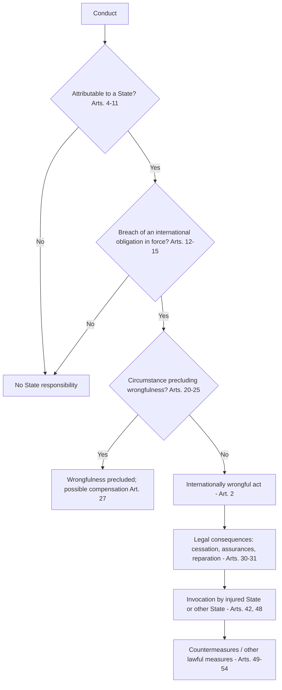
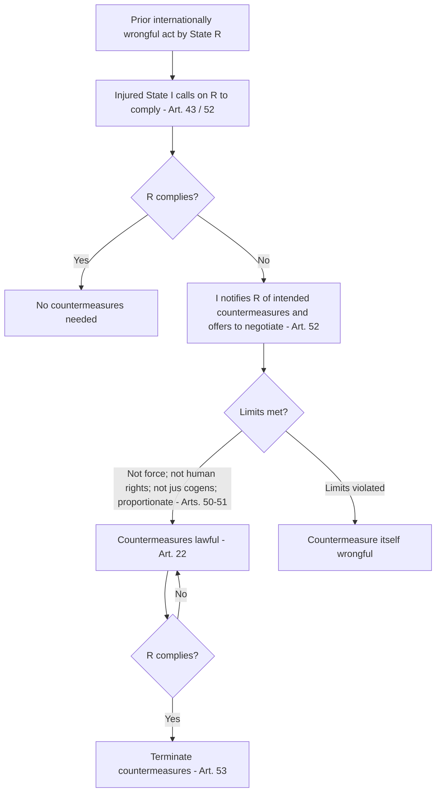

## The ILC Articles on Responsibility of States for Internationally Wrongful Acts

### Overview and Legal Status

The **Articles on Responsibility of States for Internationally Wrongful Acts (ARSIWA)** were adopted by the International Law Commission (ILC) in 2001 after nearly five decades of codification work. They are the principal statement of the *secondary rules* of international law: the rules that determine when a breach of an international obligation has occurred, to whom it is attributed, what consequences follow, and who may invoke them.

The distinction between primary and secondary rules is central to the ILC's method. It is drawn from the work of H.L.A. Hart and adapted by the Commission's Special Rapporteur Roberto Ago:

- **Primary rules** are the substantive obligations binding states (e.g., the prohibition on the use of force in UN Charter Article 2(4), or the obligation to respect the territorial sea under UNCLOS).
- **Secondary rules** govern the existence, breach, and consequences of primary rules, regardless of their content. ARSIWA contains only secondary rules.

**Legal status.** ARSIWA is not a treaty. The UN General Assembly in Resolution 56/83 (12 December 2001) "took note of" the Articles and "commended them to the attention of Governments" without adopting them as a convention. Subsequent General Assembly resolutions (notably 59/35, 62/61, 65/19, 71/133, 74/180) have repeated this, and states have discussed whether to convene a diplomatic conference to conclude a treaty without reaching agreement. Consequently:

- Many articles are accepted as reflecting **customary international law**. The International Court of Justice (ICJ) has repeatedly treated specific articles as codifying custom, for example Article 4 in *Application of the Genocide Convention (Bosnia and Herzegovina v. Serbia and Montenegro)* (2007) and Article 8 in the same judgment.
- Some provisions, especially in Part Two Chapter III (serious breaches of peremptory norms) and Part Three (implementation by non-injured states), are widely described as **progressive development** rather than codification, and their customary status is contested.

**Key Points**

- ARSIWA has 59 articles in four Parts, plus commentaries that courts treat as authoritative interpretive material.
- It applies to all internationally wrongful acts of states, whatever the subject matter.
- Article 55 preserves *lex specialis*: special rules (e.g., in the WTO or human rights treaties) can displace the general rules.
- Article 56 preserves rules of customary law that continue to govern matters not regulated by the Articles.

### Historical Development

| Period | Development |
| --- | --- |
| 1930 | Hague Codification Conference fails to conclude a convention on state responsibility for damage to aliens |
| 1949 | ILC lists state responsibility as a topic for codification |
| 1953-1961 | Special Rapporteur F.V. García Amador focuses on responsibility for injuries to aliens |
| 1962-1979 | Roberto Ago reorients the project toward general secondary rules |
| 1980 | First reading of Part One (origin of responsibility) completed |
| 1997 | Special Rapporteur James Crawford appointed; work on Parts Two and Three accelerates |
| 2001 | Second reading completed; General Assembly takes note of the Articles |

The shift from García Amador to Ago was decisive. Rather than codifying the substantive law on treatment of foreigners, which would have entangled the project in disputes over the minimum standard of treatment, Ago separated general rules of responsibility from the content of primary obligations.

### Structure of the Articles

- **Part One (Arts. 1-27):** The internationally wrongful act of a state (existence, attribution, breach, circumstances precluding wrongfulness)
- **Part Two (Arts. 28-41):** Content of international responsibility (cessation, reparation, serious breaches)
- **Part Three (Arts. 42-54):** Implementation of responsibility (invocation, countermeasures)
- **Part Four (Arts. 55-59):** General provisions (*lex specialis*, relation to the UN Charter, and so on)

### Part One: The Internationally Wrongful Act

#### Article 1: The Basic Principle

Article 1 provides: "Every internationally wrongful act of a State entails the international responsibility of that State." This principle was applied by the Permanent Court of International Justice (PCIJ) in *Phosphates in Morocco* (1938) and by the ICJ in *Corfu Channel (United Kingdom v. Albania)* (Merits, 1949). In the *Factory at Chorzów* (Jurisdiction, 1927), the PCIJ described it as a principle of international law that breach of an engagement involves an obligation to make reparation.

#### Article 2: Elements of an Internationally Wrongful Act

An internationally wrongful act exists when conduct consisting of an action or omission:

1. **Is attributable to the State** under international law; and
2. **Constitutes a breach of an international obligation** of the State.

Two features deserve emphasis:

- **No requirement of damage or fault as a general rule.** Whether damage or culpability (intent or negligence) is required depends on the primary rule. The breach of a strict-liability rule is wrongful without fault, while some primary rules (e.g., due diligence obligations) embed a standard of care.
- **Characterisation is governed by international law (Art. 3).** The classification of conduct as wrongful is not affected by its characterisation as lawful under domestic law. A state cannot invoke its internal law as justification for failure to comply with its international obligations. This mirrors Article 27 of the Vienna Convention on the Law of Treaties (VCLT) and was applied in *Free Zones of Upper Savoy and the District of Gex* (PCIJ, 1932).

#### Omissions

Wrongful conduct may consist of an omission. In *Corfu Channel*, the ICJ held Albania responsible for failing to warn British warships of the presence of mines in its territorial waters, an omission in breach of "elementary considerations of humanity" and the principle that a state must not knowingly allow its territory to be used for acts contrary to the rights of other states.

### Attribution of Conduct to the State (Articles 4-11)

Attribution is the legal process of associating conduct with a state as a legal person. A state can act only through natural persons and entities, so international law needs rules to determine whose conduct counts as the state's. Attribution is a normative, not causal, operation.

#### Article 4: Conduct of Organs of the State

The conduct of **any state organ** is attributable to the state, whether it exercises legislative, executive, judicial or other functions, whatever position it holds in the organisation of the state, and whatever its character as an organ of the central government or of a territorial unit. Article 4(2) defines an organ as including any person or entity having that status under the internal law of the state.

- **Federal and sub-national units:** A federal state cannot avoid responsibility by pleading its constitutional distribution of powers. See *LaGrand (Germany v. United States)* (ICJ, 2001), where the United States was held responsible for the acts of state authorities in Arizona.
- **Judicial organs:** Judicial decisions can constitute wrongful acts. In *Immunities and Criminal Proceedings (Equatorial Guinea v. France)* and related cases, courts' conduct has been treated as state conduct.
- **Ultra vires acts of organs (Art. 7):** Conduct is attributable even if the organ exceeded its authority or contravened instructions, provided it acted in an official capacity. In *Caire Claim* (France v. Mexico, 1929), Mexican officers who extorted money from a French national were held to have acted in their official capacity, so Mexico was responsible.

#### Article 5: Persons or Entities Exercising Elements of Governmental Authority

A person or entity that is not a state organ but is empowered by domestic law to exercise elements of governmental authority is attributed to the state when acting in that capacity. Examples include privatised prison operators, private security companies exercising police powers, and airlines granted immigration control functions. The commentary notes that the concept of "governmental authority" varies by society and history.

#### Article 6: Organs Placed at the Disposal of a State by Another State

Conduct of an organ placed at the disposal of State A by State B is attributed to State A if the organ acts in the exercise of elements of the governmental authority of the receiving state. The test is one of **exclusive direction and control** by the receiving state; mere assistance or cooperation is insufficient.

#### Article 8: Conduct Directed or Controlled by a State

The conduct of a person or group is attributable to a state "if the person or group of persons is in fact acting on the instructions of, or under the direction or control of, that State in carrying out the conduct."

This article generates the most contested doctrine in the law of attribution:

- **Effective control test (ICJ):** In *Military and Paramilitary Activities in and against Nicaragua (Nicaragua v. United States)* (Merits, 1986), the ICJ held that the United States was not responsible for all acts of the *contras* despite heavy funding, training and supply, because it had not exercised **effective control** over the specific operations in which the alleged violations occurred. Participation in general planning and support was insufficient.
- **Overall control test (ICTY):** In *Prosecutor v. Tadić* (Appeals Chamber, 1999), the ICTY proposed a less demanding test of **overall control** for determining whether an armed conflict was international, focusing on whether a state has a role in organising, coordinating, or planning military actions in addition to financing and equipping the group.
- **ICJ reaffirmation:** In *Bosnia and Herzegovina v. Serbia and Montenegro* (2007), the ICJ rejected the Tadić test as a general standard of attribution for state responsibility, holding that it "stretches too far, almost to breaking point, the connection which must exist between the conduct of a state's organs and its international responsibility." It reaffirmed effective control while noting that Tadić's test may be appropriate for the different question of classifying conflicts.

**Strongest form of each position.** Proponents of effective control argue that state responsibility must track a genuine causal-normative link between the state and the specific act, preserving the principle that states answer only for their own conduct and preventing overbroad liability. Proponents of overall control argue that effective control creates an accountability gap, allowing states to use proxies for deniable violations of fundamental norms while remaining insulated from responsibility. The ICJ's approach prevails in the law of state responsibility.

#### Article 9: Conduct Carried Out in the Absence or Default of Official Authorities

Attribution applies where a person or group exercises governmental authority in the absence or default of official authorities in circumstances calling for that exercise (e.g., a revolution or armed conflict where the ordinary government has collapsed).

#### Article 10: Insurrectional or Other Movements

- The conduct of an insurrectional movement that becomes the new government of a state is attributed to that state (Art. 10(1)).
- The conduct of a movement that succeeds in establishing a new state in part of the territory of a pre-existing state or in a territory under its administration is attributed to the new state (Art. 10(2)).

#### Article 11: Conduct Acknowledged and Adopted by a State as Its Own

Conduct not otherwise attributable becomes attributable if and to the extent that the state acknowledges and adopts it as its own. The ICJ applied this in *United States Diplomatic and Consular Staff in Tehran (United States v. Iran)* (1980). The seizure of the U.S. embassy by militants was initially not attributable to Iran, but became so after Ayatollah Khomeini's endorsement and the state's decision to perpetuate the occupation and hostage-taking.

**Example: Attribution analysis**

Suppose State A funds a militia in State B, supplies weapons, and provides intelligence, and the militia commits atrocities against civilians.

1. *Article 4?* The militia is not a formal organ of State A.
2. *Article 5?* It is not empowered by A's law to exercise governmental authority.
3. *Article 8?* Under the ICJ's effective control test, State A is responsible only if it directed or controlled the specific operations. General funding, arming, and training do not suffice.
4. *Article 11?* If State A publicly endorses the militia's acts and continues them, adoption may make the conduct attributable.
5. *Separate wrongs:* Even if the militia's acts are not attributable, State A may bear responsibility for its own conduct, for instance aiding or assisting (Art. 16), or breaching the prohibition on intervention or the use of force through its support (*Nicaragua*).

**Key Points**

- Attribution is exhaustive: conduct not attributable under Articles 4-11 does not engage state responsibility as the state's own act.
- The conduct of private persons is generally not attributable, but a state may incur responsibility for its *own* failure to prevent or punish (e.g., breach of due diligence obligations).
- Attribution under ARSIWA is distinct from the question of whether a primary rule is violated.

### Breach of an International Obligation (Articles 12-15)

#### Article 12: Existence of a Breach

A breach occurs "when an act of that State is not in conformity with what is required of it by that obligation, regardless of its origin or character." This covers obligations arising under treaty, custom, general principles, or unilateral acts. The *Rainbow Warrior* arbitration (New Zealand v. France, 1990) confirmed that the source of the obligation does not affect the applicable law of responsibility.

#### Article 13: International Obligation in Force for the State at the Time of the Act

This codifies the principle of **intertemporal law**. An act does not constitute a breach unless the state is bound by the obligation at the time the act occurs. It applies the doctrine articulated by Judge Max Huber in the *Island of Palmas* arbitration (Netherlands v. United States, 1928).

#### Article 14: Extension in Time of the Breach

- **Instantaneous acts (Art. 14(1)):** A breach not having a continuing character occurs at the moment the act is performed, even if effects continue.
- **Continuing acts (Art. 14(2)):** A breach having a continuing character extends over the entire period during which the act continues and remains not in conformity with the obligation. Examples include unlawful occupation of territory and enforced disappearance.
- **Obligations of prevention (Art. 14(3)):** A breach occurs when the event occurs and extends over the whole period during which the event continues.

The distinction has practical effects on jurisdiction *ratione temporis* and on limitation periods. In *Rainbow Warrior*, the tribunal treated France's failure to keep two officers on Hao Island as a continuing breach.

#### Article 15: Composite Acts

A breach consisting of a series of actions or omissions defined in aggregate as wrongful (e.g., genocide, apartheid, systematic acts of discrimination) occurs when the action or omission occurs that, taken with the other actions or omissions, is sufficient to constitute the wrongful act. The breach extends over the entire period from the first of the actions or omissions in the series.

### Responsibility in Connection with the Act of Another State (Articles 16-19)

Chapter IV establishes derivative or accessorial responsibility. The responsible state is answerable for **its own conduct** in relation to another state's wrongful act.

| Article | Situation | Requirements |
| --- | --- | --- |
| 16 | Aid or assistance | (a) State knows the circumstances of the internationally wrongful act; (b) the act would be internationally wrongful if committed by the assisting state |
| 17 | Direction and control | Directs and controls another state in the commission of a wrongful act, with knowledge of the circumstances; and the act would be wrongful if committed by the directing state |
| 18 | Coercion | Coerces another state to commit an act that, but for the coercion, would be wrongful for the coerced state; and the coercing state acts with knowledge |

Article 16 was applied by the ICJ in *Bosnia and Herzegovina v. Serbia and Montenegro* (2007) as reflecting customary international law, in assessing complicity in genocide. The Court distinguished complicity (Art. III(e) of the Genocide Convention) from the general rule and found that Serbia had not been shown to have acted with the requisite knowledge of the specific intent of the perpetrators at Srebrenica.

**Debate on Article 16 intent.** The commentary to Article 16 states that the aid or assistance must be given "with a view to facilitating the commission of the wrongful act," implying a purpose or intent requirement. Critics argue that a purpose requirement is too demanding and should be replaced by knowledge alone or by a standard of reasonable foreseeability, particularly in relation to arms transfers. Defenders answer that a lower threshold would render routine lawful cooperation (trade, intelligence sharing, arms transfers) unmanageably risky and would blur the line between complicity and primary due diligence duties. The ICJ has not definitively resolved whether purpose or knowledge is required.

#### Article 19: Without Prejudice to Responsibility of Others

Chapter IV does not prejudice the international responsibility of the state that commits the act in question or of any other state.

### Circumstances Precluding Wrongfulness (Articles 20-27)

These are **justifications or excuses** that render otherwise wrongful conduct lawful for as long as the circumstance persists. They do not extinguish the obligation; the obligation remains in force, but its breach is excused (Art. 27).

| Article | Circumstance | Core conditions |
| --- | --- | --- |
| 20 | **Consent** | Valid consent of the state to the act, within the limits of that consent |
| 21 | **Self-defence** | Lawful measure of self-defence under the UN Charter |
| 22 | **Countermeasures** | Countermeasures taken in conformity with Part Three, Chapter II |
| 23 | **Force majeure** | Irresistible force or unforeseen event, beyond the state's control, making performance materially impossible; the state has not contributed to the situation |
| 24 | **Distress** | The author of the act has no other reasonable way to save the author's life or those in the author's care; the act does not endanger comparable or greater peril |
| 25 | **Necessity** | Only way to safeguard an essential interest against a grave and imminent peril; does not seriously impair an essential interest of the state(s) owed the obligation or of the international community; the state has not contributed to the situation; the obligation does not exclude necessity |
| 26 | **Compliance with peremptory norms** | No circumstance precludes wrongfulness of an act that is not in conformity with an obligation arising under a peremptory norm |
| 27 | **Consequences** | Invocation is without prejudice to (a) compliance with the obligation if the circumstance no longer exists; (b) the question of compensation for material loss |

#### Necessity in Detail (Article 25)

Necessity is the most contested circumstance and is framed restrictively. The ICJ recognised it as a customary rule in *Gabčíkovo-Nagymaros Project (Hungary/Slovakia)* (1997). Hungary invoked "ecological necessity" to justify suspending work on a dam project; the Court accepted that safeguarding the environment can be an essential interest but held that the peril was not sufficiently imminent, and that Hungary had other means available and had contributed to the situation.

Article 25 is framed **negatively**: "Necessity may not be invoked by a State as a ground for precluding wrongfulness *unless*" the conditions are met. The negative formulation signals that it is exceptional and cannot be invoked where the treaty itself excludes it or where the state contributed to the situation.

The Argentine financial crisis cases before ICSID tribunals (e.g., *CMS Gas Transmission v. Argentina*, *LG&E v. Argentina*, *Enron v. Argentina*) produced divergent applications of Article 25 (and of the treaty-based non-precluded-measures clause in the U.S.-Argentina BIT), illustrating the difficulty of translating the customary standard into investor-state disputes. [Inference] The divergence arises in part from tribunals' different characterisations of whether the treaty clause operates as a *lex specialis* separate from the customary doctrine.

#### Distinguishing Precluding Circumstances from Related Concepts

| Concept | Effect |
| --- | --- |
| Circumstance precluding wrongfulness | Conduct is not wrongful; obligation continues |
| Termination or suspension of a treaty (VCLT Arts. 60-62) | Obligation itself ceases or is suspended |
| Admissibility or jurisdictional objections | Tribunal will not hear the claim, but the wrong is not erased |

**Key Points**

- Article 26 makes clear that no circumstance can justify breach of a *jus cogens* norm. *Jus cogens* (peremptory norms) are norms accepted and recognised by the international community of states as a whole as norms from which no derogation is permitted (VCLT Art. 53).
- Consent must be valid, prior or contemporaneous, and cannot cover *jus cogens* violations.
- Countermeasures (Art. 22) are lawful only if procedural and substantive conditions in Articles 49-54 are met.

### Part Two: Content of International Responsibility

#### Article 28 and General Principles

The commission of an internationally wrongful act entails legal consequences. These are **new legal relations** between the responsible state and the injured state (or states), without affecting the continuing duty of performance (Art. 29).

#### Article 30: Cessation and Non-Repetition

The responsible state is under an obligation:

- (a) **To cease** the act, if it is continuing; and
- (b) **To offer appropriate assurances and guarantees of non-repetition**, if circumstances so require.

Cessation applies only to continuing wrongful acts. In *Rainbow Warrior*, the tribunal considered cessation. In *LaGrand*, the ICJ held that a "guarantee of non-repetition" in the form of a firm undertaking and compliance programme sufficed as an assurance in the consular notification context. In the *Arrest Warrant* case (*Democratic Republic of the Congo v. Belgium*, 2002), the Court ordered Belgium to cancel the wrongfully issued warrant.

#### Article 31: Reparation

The responsible state must make **full reparation** for the injury caused. Injury includes any damage, whether material or moral, caused by the internationally wrongful act (Art. 31(2)). The foundational statement is from *Factory at Chorzów* (Merits, PCIJ, 1928):

> Reparation must, as far as possible, wipe out all the consequences of the illegal act and reestablish the situation which would, in all probability, have existed if that act had not been committed.

There must be a **causal link** between the wrongful act and the injury. ARSIWA Article 31 states the injury must be "caused by" the wrongful act, and the commentary excludes damage that is too remote. The ICJ in *Bosnia and Herzegovina v. Serbia* required a "sufficiently direct and certain causal nexus" for compensation, and declined compensation for failure to prevent the Srebrenica genocide because it could not be shown that the genocide would in fact have been averted.

#### Article 32: Irrelevance of Internal Law

The responsible state may not rely on its domestic law as justification for failure to comply with its obligations of cessation and reparation.

#### Article 33: Scope of the International Obligations Set Out in This Part

- Obligations may be owed to **another state, several states, or the international community as a whole** (Art. 33(1)).
- The Part is without prejudice to rights that accrue directly to any person or entity other than a state (Art. 33(2)), which preserves rights of individuals under human rights law and investment treaties.

#### Forms of Reparation (Articles 34-37)

Article 34 lists three forms, which may be used singly or in combination.

| Form | Article | Content | Limits |
| --- | --- | --- | --- |
| **Restitution** | 35 | Re-establish the situation that existed before the wrongful act | Only to the extent that it is (a) not materially impossible; (b) not involving a burden out of all proportion to the benefit deriving from restitution instead of compensation |
| **Compensation** | 36 | Compensate for damage caused to the extent it is not made good by restitution; covers financially assessable damage including loss of profits insofar as established | Must be financially assessable |
| **Satisfaction** | 37 | Cures injury not made good by restitution or compensation, e.g., acknowledgement of the breach, an expression of regret, a formal apology, or other appropriate modality | Must not be out of proportion to the injury and may not take a form humiliating to the responsible state |

**Restitution** has priority as the primary form in principle, but in practice compensation is most frequent. In *Pulp Mills on the River Uruguay (Argentina v. Uruguay)* (2010), the ICJ declined to order dismantling of a mill because the breach was procedural, and held that a declaration of breach was appropriate satisfaction.

**Compensation** in the ICJ's practice was awarded in *Corfu Channel* (Assessment of Compensation, 1949), *Ahmadou Sadio Diallo (Republic of Guinea v. Democratic Republic of the Congo)* (Compensation, 2012), and *Certain Activities Carried Out by Nicaragua in the Border Area (Costa Rica v. Nicaragua)* (Compensation, 2018), the last being the first case where the Court applied an ecosystem-services approach to environmental damage.

**Satisfaction** was applied in *Corfu Channel* where the Court held that its own declaration constituted appropriate satisfaction for the violation of Albanian sovereignty by British mine-sweeping.

#### Article 38: Interest

Interest on any principal sum due is payable when necessary to ensure full reparation. The rate and mode of calculation are set to achieve that result. Interest runs from the date when the principal sum should have been paid until the obligation is fulfilled.

#### Article 39: Contribution to the Injury

In determining reparation, account is taken of the contribution to the injury by wilful or negligent action or omission of the injured state or any person or entity in relation to whom reparation is sought.

#### Serious Breaches of Peremptory Norms (Articles 40-41)

Chapter III applies to **serious breaches** of obligations arising under **peremptory norms of general international law**. A breach is serious if it involves a gross or systematic failure by the responsible state to fulfil the obligation (Art. 40(2)).

Article 41 imposes consequences on **all states**:

1. States shall cooperate to bring to an end through lawful means any serious breach (Art. 41(1)).
2. No state shall recognise as lawful a situation created by a serious breach, nor render aid or assistance in maintaining that situation (Art. 41(2)).
3. The Article is without prejudice to other consequences under international law (Art. 41(3)).

The **duty of non-recognition** was confirmed by the ICJ in *Legal Consequences for States of the Continued Presence of South Africa in Namibia* (Advisory Opinion, 1971) and *Legal Consequences of the Construction of a Wall in the Occupied Palestinian Territory* (Advisory Opinion, 2004), where the Court found that all states are under an obligation not to recognise the illegal situation resulting from the construction of the wall and not to render aid or assistance. The ICJ's *Legal Consequences arising from the Policies and Practices of Israel in the Occupied Palestinian Territory, including East Jerusalem* (Advisory Opinion, 2024) also addressed the obligations of third states in relation to the illegality of the occupation.

**Debate: Whether Article 41 reflects custom.** The duty of non-recognition is widely regarded as established in custom. The **duty to cooperate** through lawful means in Article 41(1) is more contested, and the ILC itself described it in the commentary as reflecting, at least in part, progressive development. Sceptics argue that no general duty of positive cooperation has crystallised in state practice, and that the vagueness of "lawful means" renders it difficult to enforce. Supporters respond that the ICJ's *Wall* opinion treated a duty of cooperation as flowing from the *erga omnes* character of the norms breached, and that Article 41 simply articulates the corollary of that status.

### Part Three: Implementation of Responsibility

#### Invocation by an Injured State (Articles 42-43)

**Article 42** defines an **injured state** as one entitled to invoke the responsibility of another state when the obligation breached is owed to:

- (a) That state individually (e.g., bilateral treaty or specially affected state); or
- (b) A group of states including that state, or the international community as a whole, and the breach:
  - (i) Specially affects that state; or
  - (ii) Is of such a character as radically to change the position of all the other states to which the obligation is owed with respect to the further performance of the obligation (so-called "integral" or "interdependent" obligations, such as disarmament treaties).

**Article 43** requires an injured state that invokes responsibility to give notice of its claim to the responsible state, specifying the conduct required for cessation and the form reparation should take.

#### Admissibility of Claims (Article 44)

A claim is inadmissible if:

- (a) It is not brought in accordance with any applicable rule relating to **nationality of claims** (the genuine link requirement for diplomatic protection); or
- (b) The claim is one to which the rule of **exhaustion of local remedies** applies and any available and effective local remedy has not been exhausted.

The nationality and exhaustion rules are elaborated in the ILC's separate 2006 Articles on Diplomatic Protection. *Barcelona Traction, Light and Power Company, Limited (Belgium v. Spain)* (Second Phase, 1970) and *Elettronica Sicula S.p.A. (ELSI) (United States v. Italy)* (1989) are leading authorities.

#### Loss of the Right to Invoke Responsibility (Article 45)

Responsibility cannot be invoked if the injured state has **validly waived** the claim, or is to be considered as having, by reason of its conduct, **validly acquiesced** in the lapse of the claim. *Certain Phosphate Lands in Nauru (Nauru v. Australia)* (Preliminary Objections, 1992) addressed the effect of delay and acquiescence, where the Court rejected the argument that Nauru's claim was inadmissible on grounds of delay, applying its own analysis of whether the delay caused prejudice to Australia.

#### Invocation by States Other Than the Injured State (Article 48)

Article 48 extends standing beyond injured states, and is the most significant provision of Part Three for the enforcement of collective interests. A state other than an injured state is entitled to invoke the responsibility of another state if:

- (a) The obligation breached is owed to a **group of states** and is established for the **protection of a collective interest of the group** (*erga omnes partes* obligations); or
- (b) The obligation breached is owed to the **international community as a whole** (*erga omnes* obligations).

**Erga omnes** obligations are obligations owed to the international community as a whole, in whose protection all states have a legal interest. The classic dictum is *Barcelona Traction* (1970), which cited the prohibition of aggression and genocide, and protection from slavery and racial discrimination, as examples.

**Erga omnes partes** obligations are owed to all parties to a treaty regime designed to protect a collective interest.

The ICJ applied this in two major judgments:

- ***Questions relating to the Obligation to Prosecute or Extradite (Belgium v. Senegal)*** (2012): the Court held that Belgium had standing to invoke Senegal's responsibility for breach of the Convention against Torture, because the obligations under the Convention are owed *erga omnes partes*, even though Belgium was not specially affected.
- ***Application of the Convention on the Prevention and Punishment of the Crime of Genocide (The Gambia v. Myanmar)*** (Preliminary Objections, 2022): the Court rejected Myanmar's objection that The Gambia lacked standing and confirmed that any state party may invoke the responsibility of another party for breach of Genocide Convention obligations.

The states entitled under Article 48 may claim (Art. 48(2)):

- (a) Cessation and assurances of non-repetition; and
- (b) Performance of the obligation of reparation **in the interest of the injured state or the beneficiaries of the obligation breached**.

**Debate on third-state countermeasures.** Article 54 leaves open whether states other than the injured state may take **lawful measures** (including countermeasures) against a responsible state for breaches of collective obligations. The ILC deliberately declined to resolve this. Proponents of collective countermeasures argue that, since Article 48 recognises standing to invoke responsibility for erga omnes obligations, enforcement would be illusory if only the specially affected state could respond, and they point to state practice such as sanctions adopted in response to the invasion of Ukraine in 2022 and earlier measures against apartheid South Africa. Opponents argue that permitting third-party countermeasures invites abuse by powerful states, is not supported by sufficiently uniform practice, and risks escalation; some maintain that the more appropriate framework is institutional (UN Security Council or regional bodies). The matter remains unsettled.

### Countermeasures (Articles 49-54)

**Countermeasures** are measures that would otherwise be unlawful but are taken by an injured state in response to a prior internationally wrongful act by another state in order to induce it to comply with its obligations. The terminology replaced the older "reprisals." The customary status of the doctrine was established by the *Naulilaa* arbitration (Portugal v. Germany, 1928), the *Air Services Agreement* arbitration (United States v. France, 1978), and the ICJ in *Gabčíkovo-Nagymaros*, which set out conditions for lawful countermeasures, including that they be proportionate.

#### Article 49: Object and Limits

- Injured state may only take countermeasures against a state responsible for an internationally wrongful act **in order to induce that state to comply** with its obligations under Part Two (Art. 49(1)).
- Countermeasures are limited to the **non-performance** of international obligations of the injured state toward the responsible state for the time being (Art. 49(2)).
- Countermeasures shall, as far as possible, be taken in such a way as to permit resumption of performance of the obligations in question (Art. 49(3)).

The purpose is **instrumental**, not punitive.

#### Article 50: Obligations Not Affected by Countermeasures

Countermeasures shall not affect:

- (a) The obligation to refrain from the **threat or use of force** as embodied in the UN Charter;
- (b) Obligations for the **protection of fundamental human rights**;
- (c) Obligations of a **humanitarian character prohibiting reprisals**;
- (d) Other obligations under **peremptory norms** of general international law.

Also protected: obligations under any dispute settlement procedure applicable between the injured and responsible states, and obligations to respect the inviolability of diplomatic or consular agents, premises, archives, and documents (Art. 50(2)).

#### Article 51: Proportionality

Countermeasures must be **commensurate with the injury suffered**, taking into account the gravity of the internationally wrongful act and the rights in question. *Air Services* arbitration held that proportionality must be assessed by considering not only the quantum of harm but also the significance of the principles involved. In *Gabčíkovo-Nagymaros*, the ICJ held Slovakia's diversion of the Danube (Variant C) was not a proportionate countermeasure because it deprived Hungary of its right to an equitable and reasonable share of the river's resources.

#### Article 52: Conditions Relating to Resort to Countermeasures

Before taking countermeasures, the injured state must:

- (a) Call upon the responsible state to fulfil its obligations (Art. 43);
- (b) **Notify** the responsible state of any decision to take countermeasures and **offer to negotiate**.

The injured state may nonetheless take **urgent countermeasures** as are necessary to preserve its rights (Art. 52(2)). Countermeasures must be suspended if the wrongful act has ceased and the dispute is pending before a court or tribunal with authority to make binding decisions (Art. 52(3)).

#### Article 53: Termination of Countermeasures

Countermeasures must be terminated as soon as the responsible state has complied with its obligations in relation to the internationally wrongful act.

#### Article 54: Measures Taken by States Other Than an Injured State

Part Three, Chapter II "does not prejudice the right of any State, entitled under article 48, paragraph 1, to invoke the responsibility of another State, to take lawful measures against that State to ensure cessation of the breach and reparation in the interest of the injured State or of the beneficiaries of the obligation breached." The wording of "lawful measures" (rather than "countermeasures") was an intentional compromise; the article leaves open the legality of collective countermeasures.

### Part Four: General Provisions

| Article | Content |
| --- | --- |
| 55 | *Lex specialis*: the Articles do not apply where and to the extent that the conditions for the existence of an internationally wrongful act, or the content or implementation of responsibility, are governed by special rules of international law |
| 56 | Questions of state responsibility not regulated by the Articles continue to be governed by applicable rules of international law |
| 57 | The Articles are without prejudice to any question of the responsibility under international law of an international organisation, or of any state for the conduct of an international organisation |
| 58 | The Articles are without prejudice to individual responsibility under international law of any person acting on behalf of a state |
| 59 | The Articles are without prejudice to the Charter of the United Nations |

**Article 55 and *lex specialis*.** The relevance of *lex specialis* is significant. For example, the law of the World Trade Organization (Dispute Settlement Understanding), the European Convention on Human Rights, and the law of the sea each contain special regimes on remedies. Whether such regimes are "self-contained" (entirely displacing the general law of responsibility) is disputed. The ICJ in *United States Diplomatic and Consular Staff in Tehran* observed that diplomatic law is a "self-contained regime" in that it provides its own remedies, but that it does not exclude all recourse to general international law. The ILC's Study Group on Fragmentation (2006) concluded that a truly self-contained regime is very rare and that general law persists as a fall-back.

**Article 57 and international organisations.** Recognising the difference in the responsible entities, the ILC subsequently adopted the separate **Articles on the Responsibility of International Organizations (ARIO)** in 2011, largely modelled on ARSIWA.

### Application to Philippine Interests: The South China Sea

The **South China Sea Arbitration (Philippines v. China)**, PCA Case No. 2013-19, Award of 12 July 2016, under Annex VII of UNCLOS, illustrates how the secondary rules interact with primary obligations.

- **Primary rules breached:** The Tribunal found that China had violated Philippine sovereign rights in its exclusive economic zone (UNCLOS Arts. 56, 58, 77, 81), had violated navigation-safety obligations (Art. 94 and COLREGS), and had breached obligations concerning protection and preservation of the marine environment (Arts. 192, 194(5), 206).
- **Attribution (ARSIWA Art. 4):** Conduct of Chinese government vessels, including China Marine Surveillance and Fisheries Law Enforcement Command vessels, was conduct of organs of the state. The Tribunal did not need to rely on Article 8 for conduct of PLA Navy or maritime law enforcement vessels because these are state organs.
- **State organs and environmental harm:** The Tribunal held that China's state-supported dredging and island-building at seven reefs in the Spratly Islands caused severe harm to coral reef ecosystems, and that fishermen from China who harvested endangered species, tolerated by Chinese authorities, gave rise to responsibility for failure to exercise due diligence, in the sense of failing to prevent and punish. This reflects the distinction between attributable conduct and the state's own breach of a due diligence duty concerning private conduct.
- **Aggravation of the dispute:** The Tribunal found that China's activities during the proceedings aggravated the dispute, engaging the obligation not to aggravate or extend a dispute pending resolution.
- **Non-compliance and Part Three:** China rejected the Award as "null and void" and non-binding. Under UNCLOS Annex VII Art. 11 and Article 296, decisions of a tribunal constituted under Part XV are final and binding on the parties, and non-participation does not prevent the proceedings from continuing (Annex VII, Art. 9). Under ARSIWA Articles 30 and 31, the continuing wrongful conduct triggers obligations of **cessation** and **reparation**, and Article 32 bars China from relying on its domestic law or its rejection of the Award as justification for non-compliance. Enforcement options for the Philippines are constrained by the absence of a compulsory enforcement mechanism, so measures rely on diplomatic protest, invocation of responsibility (Art. 43), and possible use of lawful measures. [Inference] Because obligations under UNCLOS concerning the marine environment may be characterised as *erga omnes partes*, other UNCLOS parties may have standing under Article 48 to invoke the responsibility of China, though no state has yet pursued such a claim before a court or tribunal.

### Comparative Illustration: Applying the Framework

**Example**

State X's coast guard, acting on orders from a ministry, rams and sinks a fishing vessel flagged to State Y in State Y's exclusive economic zone (EEZ), killing three crew members.

1. **Existence of a wrongful act (Art. 2):**
   - *Attribution:* Coast guard vessels are state organs (Art. 4); attribution is established.
   - *Breach:* Violation of State Y's sovereign rights and obligations concerning the use of force in law enforcement (UNCLOS Arts. 56, 58, 73 and customary requirements for limited and proportionate force, see *M/V "Saiga" (No. 2)*, ITLOS, 1999); breach of the right to life under applicable human rights law if binding on X.
2. **Circumstances precluding wrongfulness (Arts. 20-25):** X claims self-defence. There was no armed attack; the claim fails under Article 21 and UN Charter Article 51.
3. **Consequences (Part Two):**
   - Cessation and guarantees of non-repetition (Art. 30)
   - Full reparation (Art. 31): compensation for the vessel and the loss of life (Art. 36), plus satisfaction such as apology (Art. 37), interest (Art. 38)
4. **Implementation (Part Three):**
   - Y invokes responsibility by notice of claim (Art. 43); exhaustion of local remedies is not relevant to direct state-to-state claims in respect of injury to the state itself, but may be required where the claim is for injury to nationals (diplomatic protection; Art. 44)
   - Countermeasures by Y are possible (Art. 49) if proportionate (Art. 51), preceded by notice and offer to negotiate (Art. 52), and not affecting excluded obligations (Art. 50)
   - Dispute settlement under UNCLOS Part XV is available

### Common Misconceptions

- **"State responsibility requires damage."** Not as a general rule. Whether damage is required depends on the primary rule.
- **"A state is responsible for everything private persons do in its territory."** Incorrect. Private conduct is generally not attributable; the state is responsible for its *own* failure to take due diligence measures where the primary rule requires.
- **"Countermeasures are a form of punishment."** Incorrect. Their function is to induce compliance (Art. 49), and they must be reversible as far as possible and terminated upon compliance.
- **"A circumstance precluding wrongfulness terminates the treaty."** Incorrect. The obligation persists; the wrongfulness is precluded only while the circumstance exists (Art. 27).
- **"ARSIWA is a binding treaty."** It is not; its binding force derives from customary international law to the extent individual articles reflect custom.

### Conclusion

The ILC Articles provide the general framework by which international law converts a breach of an obligation into legal consequences, without any central enforcer. Their significance lies in the architecture: a two-element definition of wrongful acts (attribution plus breach), a closed catalogue of excuses, a consequences regime built on the *Chorzów Factory* principle of full reparation, and a decentralised enforcement model in which injured and, in limited cases, non-injured states invoke responsibility and may resort to countermeasures. Areas of continuing debate include the attribution standard in Article 8, the mental element in Article 16, the customary status of Article 41 duties, and the legality of third-state countermeasures under Article 54. Because the Articles remain a soft-law text endorsed by General Assembly resolution, their authority rests on the continuing practice and jurisprudence of states and international courts.

**Related Topics**

- Articles on Responsibility of International Organizations (ARIO, 2011)
- ILC Articles on Diplomatic Protection (2006) and the nationality-of-claims and exhaustion-of-local-remedies rules
- Peremptory norms (*jus cogens*) and the ILC Conclusions on Identification and Legal Consequences (2022)
- *Erga omnes* and *erga omnes partes* obligations and standing before the ICJ
- Attribution tests: effective control versus overall control
- Countermeasures and unilateral sanctions, including third-party measures
- Reparation and compensation in ICJ and investment arbitration practice
- Due diligence obligations and state responsibility for private conduct
- Jurisdictional immunities of states and their relationship to the law of state responsibility
- Enforcement of the 2016 South China Sea Arbitration Award and UNCLOS Part XV dispute settlement