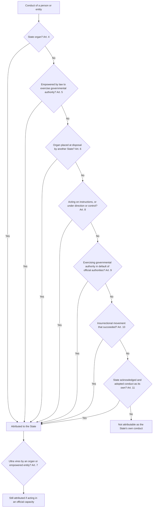
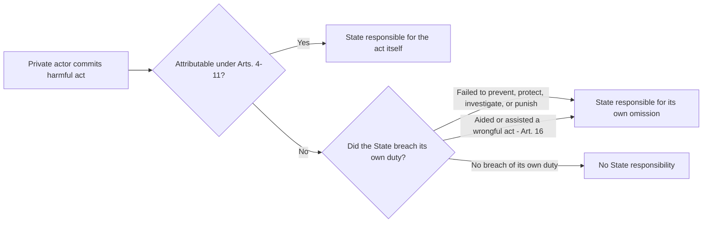

## Attribution of Conduct to the State under ILC Articles 4 to 11

### The Problem Attribution Solves

A state is an abstract legal person. It has no body, no will, and no hands; it acts only through human beings and institutions. International law therefore requires a set of rules that determine **whose conduct counts as the conduct of the state** for the purposes of international responsibility. These rules are called the law of **attribution** (sometimes "imputability").

The governing text is Chapter II of Part One of the **Articles on Responsibility of States for Internationally Wrongful Acts (ARSIWA)**, adopted by the International Law Commission (ILC) in 2001 and commended to states by General Assembly Resolution 56/83. ARSIWA is not a treaty, but many of its provisions, including the attribution rules in Articles 4 to 11, are treated by the International Court of Justice (ICJ) as reflecting customary international law.

Recall that under Article 2 of ARSIWA, an internationally wrongful act has two cumulative elements: (a) conduct consisting of an action or omission that is **attributable to the state** under international law, and (b) that conduct constitutes a **breach of an international obligation** of the state. Attribution is the first element. It is logically separate from breach: attribution asks *whose act is this?*, while breach asks *was the act unlawful?*

**Key Points**

- Attribution is a **normative operation** of law, not a factual finding of causation. The question is whether international law assigns the conduct to the state, not whether the state "caused" it.
- The attribution rules are found in **Articles 4 to 11**; the catalogue is generally treated as exhaustive of the bases on which conduct becomes the state's own conduct (subject to *lex specialis* under Article 55).
- Attribution is governed by **international law**, not domestic law. Domestic law is relevant evidence (for example, to determine whether an entity is an organ), but it is not decisive (Article 4(2) and Article 3).
- Conduct of **private persons** is, as a default, not attributable. The state may nevertheless be responsible for its *own* conduct in relation to private acts, such as failing to prevent them (see the section on due diligence below).

### Article 4: Conduct of Organs of a State

#### The Rule

Article 4(1) provides that the conduct of **any State organ** shall be considered an act of that state under international law, whether the organ exercises legislative, executive, judicial or any other functions, whatever position it holds in the organisation of the state, and whatever its character as an organ of the central government or of a territorial unit of the state.

Article 4(2) states that an organ **includes any person or entity which has that status in accordance with the internal law of the State**.

The ICJ has confirmed the customary status of Article 4. In *Difference Relating to Immunity from Legal Process of a Special Rapporteur of the Commission on Human Rights* (Advisory Opinion, 1999), the Court described it as a "well-established rule of international law" that the conduct of any organ of a state must be regarded as an act of that state. This was repeated in *Application of the Genocide Convention (Bosnia and Herzegovina v. Serbia and Montenegro)* (Merits, 2007) (the *Bosnian Genocide* case).

#### Key Features

| Feature | Content |
| --- | --- |
| **Unity of the state** | The state is treated as a single unit in international law regardless of its internal division of powers |
| **Function-neutral** | Legislative, executive, judicial and other organs are all covered |
| **Hierarchy-neutral** | Senior officials and subordinate agents alike; no minimum rank |
| **Territorial units** | Federal units, provinces, municipalities, and autonomous regions are included |
| **Domestic law not exclusive** | An entity may be an organ under international law even if domestic law does not classify it as one |

#### The Question of "De Facto" Organs

Article 4(2) refers to status under internal law, but the commentary and the ICJ recognise that domestic classification is not the end of the inquiry. In *Nicaragua v. United States* (Merits, 1986), the ICJ considered whether the *contras* could be treated as *de facto* organs of the United States. It held that persons, groups or entities may be equated with state organs even where that status does not follow from internal law, but only where they act in **"complete dependence"** on the state, of which they are ultimately merely the instrument. The Court found that the contras did not meet this threshold despite heavy US funding, training, and supply.

In the *Bosnian Genocide* case (2007), the ICJ applied the same test to the Bosnian Serb army (VRS) and the paramilitary "Scorpions," finding that the VRS did not act in complete dependence on the Federal Republic of Yugoslavia (FRY) despite extensive financial and logistical support. The **complete dependence test is deliberately demanding**: it requires a relationship so strong that the entity has no real autonomy, so that treating it as separate from the state would be a legal fiction.

#### Legislative and Judicial Organs

- **Legislative conduct:** Enacting a statute that is incompatible with an international obligation can itself constitute a breach. In *Certain German Interests in Polish Upper Silesia* (PCIJ, 1926), the Permanent Court of International Justice observed that municipal laws are facts that express the will and constitute the activities of states, in the same manner as judicial decisions or administrative measures.
- **Judicial conduct:** A court's decision may be attributable and may breach international obligations. In *LaGrand (Germany v. United States)* (Merits, 2001), the ICJ found the United States responsible for the conduct of its state and federal courts (the procedural default rule as applied to foreign nationals denied consular notification).

#### Federal States and Territorial Units

Article 4 makes clear that a state cannot avoid responsibility by pointing to its internal constitutional division of powers. Federal states are responsible for the acts of constituent units. In *LaGrand*, the ICJ rejected any argument that the Arizona authorities' conduct fell outside US responsibility, and in *Avena and Other Mexican Nationals (Mexico v. United States)* (Merits, 2004), it treated conduct of state authorities in several US states as attributable to the United States. This is the international-law counterpart to Article 27 of the Vienna Convention on the Law of Treaties (VCLT): a state may not invoke its internal law as justification for failure to perform a treaty.

**Key Points**

- Attribution under Article 4 depends on **capacity**, not personal identity: conduct of an official is attributed even if the individual is a low-ranking employee.
- Conduct of organs acting **in a private capacity** is not attributed, which is why Article 7 (discussed below) is important for the boundary case.
- Where organs of a state act **abroad** (for example, embassy officials, military forces, intelligence officers), their conduct remains attributable to the sending state.

### Article 5: Persons or Entities Exercising Elements of Governmental Authority

#### The Rule

Article 5 attributes to the state the conduct of a person or entity which is **not** an organ under Article 4 but which is **empowered by the law of that State to exercise elements of governmental authority**, provided the person or entity is **acting in that capacity** in the particular instance.

The provision recognises that modern states delegate public functions to **parastatal entities** and private bodies. Without Article 5, states could avoid responsibility by outsourcing governmental functions.

#### Elements

1. The entity is **not** an organ of the state under Article 4.
2. It is **empowered by the law of the state** (domestic law provides the empowerment, unlike Article 8, which is about facts).
3. It exercises **elements of governmental authority**.
4. It is acting **in that capacity** at the time of the conduct.

#### What Counts as "Governmental Authority"

The ILC's commentary explains that this notion varies according to the particular society, its history, and its traditions, and gives no fixed list. Typical examples include:

- Private security firms empowered to detain persons, operate prisons, or control immigration
- A privatised airline empowered to exercise immigration or quarantine functions
- State-authorised regulatory bodies with public powers
- Parastatal entities exercising police or customs powers

**Example**

A state contracts a private company to operate an immigration detention centre and authorises its guards under domestic legislation to use reasonable force and detain persons. If guards use excessive force in violation of the prohibition on torture or cruel, inhuman or degrading treatment, the conduct is attributable to the state under Article 5, even though the guards are employees of a private firm. By contrast, if the same firm's employees commit theft in their private capacity while off duty, the conduct is not attributed.

Where the entity acts outside its empowered capacity, the analysis moves to Article 7 (ultra vires acts) if it was still acting in an apparently official capacity.

#### The Boundary with Commercial Activity

Article 5 applies only to elements of **governmental** authority. Purely commercial activities of state-owned enterprises do not fall within Article 5 merely because the state owns the entity. The ICJ and arbitral tribunals have generally refused to attribute the ordinary commercial conduct of state-owned companies to the state absent proof of the elements of Article 5 or Article 8. This distinction matters for investor-state arbitration. In *Jan de Nul N.V. v. Egypt* (ICSID, 2008), the tribunal considered whether the conduct of the Suez Canal Authority, a state-owned entity, was attributable to Egypt, and it applied the Article 5 analysis to the Authority's exercise of public powers. This case is often cited on the distinction between governmental and commercial functions. [Unverified] Tribunals differ in how strictly they apply the governmental-authority requirement to state-owned enterprises, and the analysis is fact-specific.

### Article 6: Conduct of Organs Placed at the Disposal of a State by Another State

Article 6 attributes to the **receiving state** the conduct of an organ placed at its disposal by another state, if the organ is acting in the exercise of elements of the governmental authority of the receiving state.

#### The Critical Test

The test is whether the organ is **genuinely under the exclusive direction and control** of the receiving state, not merely acting in co-ordination with the sending state or in the interests of both states. The ILC commentary offers as examples a section of the health service or a team of surgeons of one state put at the disposal of another state to assist in coping with an epidemic or a natural disaster, or a judge of one state sitting in the courts of another, for example the Privy Council.

Where the organ continues to act on the sending state's instructions or as its own organ (for example, a foreign military contingent under national command that merely coordinates with allies), Article 6 does not apply. This distinction matters in multinational operations.

#### Relevance to Peace Operations

Attribution in the context of UN peacekeeping is dealt with by the separate **Articles on the Responsibility of International Organizations (ARIO)** (2011), Article 7 of which concerns organs placed at the disposal of an international organisation, using an **effective control** test. In *Behrami and Saramati v. France, Germany and Norway* (European Court of Human Rights (ECtHR), Grand Chamber, 2007), the ECtHR attributed the conduct of Kosovo Force (KFOR) contingents and the UN Interim Administration Mission in Kosovo (UNMIK) to the UN, adopting an "ultimate authority and control" test. *Al-Jedda v. United Kingdom* (ECtHR, Grand Chamber, 2011) took a different approach, attributing UK detention conduct in Iraq to the United Kingdom because the UN Security Council had neither effective control nor ultimate authority over the acts. The difference between these approaches is an ongoing point of tension in the law of attribution, and the reasoning in *Behrami* has been widely criticised as conflating attribution to organisations with the question of the state's own exercise of jurisdiction. [Inference] Subsequent ECtHR case law suggests a retreat from the *Behrami* standard toward effective-control reasoning.

### Article 7: Excess of Authority or Contravention of Instructions

#### The Rule

The conduct of an organ of a state, or of a person or entity empowered to exercise elements of governmental authority, **shall be considered an act of the State under international law if the organ, person or entity acts in that capacity, even if it exceeds its authority or contravenes instructions.**

Article 7 is not a separate basis of attribution. It is a **qualification** that attaches to Articles 4, 5 and 6. Its function is to prevent states from escaping responsibility by pleading that an official acted contrary to law or orders.

#### The Official Capacity Requirement

The critical limitation is that the person must be acting **in that capacity** (an official capacity). The distinction is between:

- **Ultra vires acts in an apparently official capacity:** attributable. The official uses state authority, equipment, uniforms, or the cloak of office.
- **Purely private acts of an official:** not attributable. The official acts as a private individual, without connection to state functions.

The standard was established in the *Caire Claim* (France v. Mexico) (French-Mexican Claims Commission, 1929). Mexican officers demanded money from a French national, Caire, and shot him dead when he refused. The Commission held Mexico responsible, on the ground that the officers had acted at least under the "apparent authority" of their office and had used means placed at their disposal by virtue of their official position. Earlier arbitrations such as *Youmans Claim* (United States v. Mexico) (1926), where Mexican soldiers who had been sent to protect Americans instead participated in a mob that killed them, reached the same result.

The Inter-American Court of Human Rights articulated similar reasoning in *Velásquez Rodríguez v. Honduras* (Merits, 1988), holding that a state is responsible for acts of its agents that exceed their authority or violate internal law where those acts are done under the cover of official status.

**Example: Applying the official-capacity test**

| Scenario | Attributable? | Reason |
| --- | --- | --- |
| A soldier on patrol, contrary to orders, tortures a detainee | Yes | Acting under cover of official status, using state-conferred power |
| A police officer, off duty and out of uniform, assaults a neighbour over a personal dispute | Generally no | Private motive, no exercise of state power, no cloak of office |
| A border guard demands a bribe to allow crossing | Yes | Uses official position as the mechanism |
| A police officer uses his service weapon in a domestic dispute | Contextual | Depends on whether the circumstances show exercise of official authority; the use of the state-issued weapon is relevant but not decisive |

#### The Human Rights Dimension

For obligations such as the prohibition on torture and the right to life, the state's obligation includes both a duty to refrain and a duty to take preventive and investigative measures. The two lines of responsibility can overlap: even where a private act is not attributable, the state may still be in breach of its **own** positive obligation to prevent, investigate, and punish.

### Article 8: Conduct Directed or Controlled by a State

#### The Rule

Article 8 attributes to the state the conduct of a person or group of persons **if the person or group is in fact acting on the instructions of, or under the direction or control of, that State in carrying out the conduct**.

Article 8 addresses the situation of **de facto agents** who lack formal status under domestic law. It is the primary mechanism used against states that operate through militias, proxies, paramilitaries, or hired private actors.

#### Three Alternative Formulations

The disjunctive language yields three alternative bases:

1. **Instructions:** The state issued specific instructions for the conduct.
2. **Direction:** The state directed the operation.
3. **Control:** The state controlled the operation.

The commentary emphasises that the conduct must be attributable **in relation to the specific operation** in question, not merely that the actor generally enjoys state support.

#### The Effective Control Standard (ICJ)

In *Nicaragua v. United States* (1986), the ICJ considered whether US conduct toward the *contras* engaged Article 8-type attribution for the contras' alleged violations of international humanitarian law. The Court held:

- The United States had financed, organised, trained, supplied and equipped the contras and helped select military and paramilitary targets.
- Nevertheless, attribution of specific violations required proof that the United States **had effective control of the military or paramilitary operations in the course of which the alleged violations were committed**.
- General control over the force, however extensive, was insufficient.

The Court thus separated (a) the United States' **own responsibility** for its acts (training, funding, arming the contras, which breached the non-intervention principle and the prohibition on the use of force) from (b) **attribution to the United States of the contras' acts** themselves (which was denied).

#### The Overall Control Alternative (ICTY) and the ICJ's Rejection

In *Prosecutor v. Tadić* (Appeals Chamber, 1999), the International Criminal Tribunal for the former Yugoslavia (ICTY) considered whether the armed conflict in Bosnia was international by reason of the FRY's relationship with Bosnian Serb forces. The Appeals Chamber criticised the ICJ's *Nicaragua* test and proposed that, for **organised and hierarchically structured groups**, a state's **overall control** (going beyond mere financing and equipping, and involving participation in the planning and supervision of military operations) suffices for attribution of the group's acts.

In the *Bosnian Genocide* case (2007), the ICJ directly addressed the *Tadić* test and rejected it as a general test of attribution under the law of state responsibility. The Court reasoned that:

- The ICTY was addressing a different question (the classification of a conflict as international), which is not a matter of general international law.
- The overall control test **"stretches too far, almost to breaking point, the connection which must exist between the conduct of a State's organs and its international responsibility."**
- The effective control test, reflected in Article 8, remained the applicable standard.

The Court noted that the overall control test may well be suitable for the different question of characterising an armed conflict as international, without deciding that point.

**The strongest form of each position:**

- **Effective control (ICJ):** Supporters argue that responsibility should follow the state's genuine participation in the specific wrongful conduct. A looser test would make states answerable for acts they neither directed nor could stop, dilute the fundamental principle that a state answers only for its own conduct, and expose states to liability for the autonomous decisions of groups they merely support. It also preserves the clarity of Article 2 by keeping attribution rooted in a real link between state and act.
- **Overall control (ICTY):** Supporters argue that effective control leaves an **accountability gap**. A state can organise, finance, equip and strategically direct a group while carefully avoiding operation-level orders, thereby securing plausible deniability for grave violations of humanitarian law and human rights. They contend that the standard should scale to the reality of contemporary proxy warfare, where operation-level orders are rarely documented.

The ICJ's approach is the settled position under the law of state responsibility. However, states with proxy relationships remain exposed to responsibility under **other** rules: the primary prohibition on the use of force, the principle of non-intervention, and Article 16 (aid or assistance).

#### Practical Consequences

| Situation | Analysis |
| --- | --- |
| A state provides funding, weapons and training to a rebel group | Own responsibility for breach of non-intervention and possibly the use of force; acts of the group attributable only under effective control |
| A state directs a group to carry out a specific assassination abroad | Attributed under Article 8 (instructions) |
| A state coordinates a cyber operation through private hackers who follow its instructions | Attributed under Article 8 if instructions or effective control are shown; evidentiary threshold is the main obstacle |

Cyber operations pose a particular challenge because proof of state involvement is technically difficult. The Tallinn Manual 2.0 on the International Law Applicable to Cyber Operations (2017), a non-binding expert study, applies Article 8 to cyber operations and follows the effective control standard. [Inference] The persuasive force of the Tallinn Manual is high among practitioners but it does not bind states.

### Article 9: Conduct Carried Out in the Absence or Default of the Official Authorities

#### The Rule

Article 9 attributes to the state the conduct of a person or group of persons **if the person or group is in fact exercising elements of the governmental authority in the absence or default of the official authorities and in circumstances such as to call for the exercise of those elements of authority**.

This rule addresses **exceptional situations** in which ordinary state machinery has collapsed, for example during revolution, armed conflict, or occupation, and in which persons spontaneously assume public functions.

#### Elements

1. The person or group is **actually exercising** elements of governmental authority.
2. This happens **in the absence or default** of the official authorities (they have collapsed, been removed, or are unable to function).
3. The **circumstances call for** the exercise of those functions (there is a genuine need for order, protection, or public administration).

The classic illustration used by the ILC comes from the Iranian Revolution. In *Yeager v. Islamic Republic of Iran* (Iran-United States Claims Tribunal, 1987), the Tribunal attributed to Iran the conduct of revolutionary guards (*komitehs*) who were exercising police and customs functions at Tehran airport in the aftermath of the revolution, in the absence of the official authorities. The Tribunal applied a rule of attribution corresponding to what was later codified as Article 9, finding that the guards were acting on behalf of the new regime in performing governmental functions.

Article 9 is narrowly drawn. It does not cover self-appointed groups that use force merely because they can, or private vigilantes acting in circumstances where official authorities remain functional.

### Article 10: Conduct of an Insurrectional or Other Movement

#### The Rule

Article 10 addresses the attribution of conduct of movements that **later succeed** in taking power or establishing a new state. It has two paragraphs:

1. **Article 10(1):** The conduct of an insurrectional movement which **becomes the new government of a State** is attributed to that State.
2. **Article 10(2):** The conduct of a movement, insurrectional or other, which succeeds in **establishing a new State** in part of the territory of a pre-existing State or in a territory under its administration, is attributed to the new State.

#### The Underlying Logic

As a matter of general principle, the conduct of an insurrectional movement is **not** attributable to the state whose government it is challenging, because the movement is in opposition to the state and its organs. That default is preserved (Article 10(3) makes this explicit for conduct otherwise attributable under Articles 4 to 9). However, once the movement succeeds, there is **continuity** between the movement and the new government or new state. Article 10 attributes the movement's earlier conduct to the new authority, so that the successful group answers for the wrongs committed in the course of the struggle.

**Example**

An armed opposition movement seizes and destroys foreign-owned property during a civil war and later defeats the incumbent government and forms a new government. Injured foreign investors can, under Article 10(1), attribute the movement's earlier conduct to the state now governed by the successor. If the movement had failed, the destruction would not have been attributed to the state (though the state might still be liable for failing to protect aliens under the applicable standard of due diligence).

#### Historical Basis

The rule is drawn from arbitral practice, for example the *Bolivar Railway Company Case* (Great Britain v. Venezuela) (British-Venezuelan Mixed Claims Commission, 1903), in which the tribunal stated that the nation is responsible for the obligations of a successful revolution from its beginning, because in theory it represented the national will from the beginning. The Iran-United States Claims Tribunal case law and the *Short v. Iran* decision (1987) confirm that a successful revolutionary government may be responsible for acts committed by revolutionary groups before assuming power, while distinguishing which acts belonged to the movement and which to the pre-existing state.

#### Limits

- The rule applies only where the movement **succeeds**. Unsuccessful movements are not attributed to any state.
- It concerns attribution only. Whether the conduct was **wrongful** depends on which primary obligations bound the movement at the time, which is a distinct and difficult question, since movements do not automatically inherit treaty obligations. Article 10 attributes the conduct to the state, and breach requires a primary obligation binding the state at that time; [Inference] the ILC commentary suggests that the state is treated as continuing the movement's conduct so that obligations of the state apply to it, but this remains a point on which commentators diverge.

### Article 11: Conduct Acknowledged and Adopted by a State as Its Own

#### The Rule

Article 11 provides that conduct which is **not attributable to a state under the preceding articles** shall nevertheless be considered an act of that state under international law **if and to the extent that the State acknowledges and adopts the conduct in question as its own**.

Article 11 is a **retrospective** basis of attribution. Unlike Articles 4 to 10, which look at the relationship between the state and the actor at the time of the conduct, Article 11 attributes conduct because of the state's **later** attitude toward it.

#### The Threshold: Acknowledgement Plus Adoption

Mere approval, verbal endorsement, or expression of support is not sufficient. The ILC commentary stresses that **"acknowledges and adopts... as its own"** requires more than general approval: the state must identify the conduct and make it its own, in the way that is unequivocal. This threshold was set with the *Tehran Hostages* case in mind.

#### Leading Authority: *United States Diplomatic and Consular Staff in Tehran*

In *United States Diplomatic and Consular Staff in Tehran (United States v. Iran)* (Merits, 1980), the ICJ analysed two phases:

| Phase | Event | Attribution |
| --- | --- | --- |
| **First phase** | Militants seized the US embassy on 4 November 1979 and took the diplomatic staff hostage | The seizure itself was not attributable to Iran, since the militants were not shown to be state agents or acting on state instructions. Iran was, however, responsible for its own **failure to protect** the embassy as required by the Vienna Convention on Diplomatic Relations (VCDR) |
| **Second phase** | Ayatollah Khomeini and other Iranian authorities publicly endorsed the seizure, and the state decided to maintain the occupation and the hostage-taking as an instrument of policy | The Court held that the approval and decision to perpetuate the situation **transformed the militants' acts into acts of the Iranian State**, so that the continuing occupation and detention became directly attributable to Iran |

The Court reasoned that the "approval given to these facts by the Ayatollah Khomeini and other organs of the Iranian State, and the decision to perpetuate them, translated continuing occupation of the Embassy and detention of the hostages into acts of that State."

#### Other Authorities and Limits

- The *Lighthouses Arbitration between France and Greece* (1956) attributed to Greece the conduct of Crete's autonomous government by reason of Greece's adoption of the conduct after Crete's annexation.
- Article 11 attributes only "**if and to the extent**" adopted. A state may adopt only part of the conduct, and the attribution is limited accordingly.
- The concept is distinct from **ratification** or approval under domestic law and from **estoppel** or acquiescence, although the boundary with acquiescence is unsettled. [Inference] Silence or failure to condemn is generally not enough, and tribunals require some positive act of acknowledgement and adoption.

### Comparative Table: Articles 4 to 11

| Article | Actor | Key requirement | Leading authority |
| --- | --- | --- | --- |
| **4** | State organs | Organ status (domestic law non-exclusive); any function or level | *Difference Relating to Immunity* (1999); *Bosnian Genocide* (2007); *LaGrand* (2001) |
| **5** | Empowered entities | Empowered by state law to exercise governmental authority; acting in that capacity | ILC commentary; arbitral practice (e.g., *Jan de Nul v. Egypt*) |
| **6** | Organs placed at disposal | Under exclusive direction and control of receiving state | ILC commentary; contrast ECtHR practice on peacekeeping |
| **7** | Ultra vires acts | Official capacity retained despite excess or contravention | *Caire Claim* (1929); *Youmans Claim* (1926); *Velásquez Rodríguez* (1988) |
| **8** | De facto agents | Instructions, direction, or effective control over the specific operation | *Nicaragua* (1986); *Bosnian Genocide* (2007); contrast *Tadić* (1999) |
| **9** | Persons in default of authority | Exercise of governmental functions where official authorities are absent and circumstances call for it | *Yeager v. Iran* (1987) |
| **10** | Successful insurrectional movements | Movement becomes new government or forms a new state | *Bolivar Railway Co.* (1903); Iran-US Claims Tribunal practice |
| **11** | Adopted conduct | Acknowledgement and adoption "as its own" | *Tehran Hostages* (1980) |

### Attribution versus the State's Own Wrongful Conduct

A central conceptual point is the distinction between:

1. **Attribution of another's conduct** to the state (Articles 4 to 11), and
2. The **state's own breach** of an obligation *in relation to* conduct by others.

Where private conduct is not attributable, the state may still be responsible on the second basis. Typical examples:

- **Due diligence and positive obligations:** In *Corfu Channel* (Merits, 1949), the ICJ held Albania responsible not for laying the mines (which was not established as Albanian conduct) but for its own **knowledge and failure to warn** of their presence in its territorial waters. In *Tehran Hostages*, Iran was responsible in the first phase for its own failure to protect the embassy. In the *Bosnian Genocide* case, the ICJ held that Serbia breached its obligation to **prevent** genocide (Article I of the Genocide Convention) at Srebrenica, even though the killings were not attributable to it, because it had the capacity to influence the perpetrators and knew of the serious risk.
- **Aid or assistance (ARSIWA Article 16), direction and control (Article 17), and coercion (Article 18):** A state supporting another state's wrongful act bears responsibility for its own conduct in providing assistance.
- **Failure to investigate and punish:** Many human rights treaties impose procedural obligations that are breached by the state's own inaction toward private violations.

### Worked Example: Multi-Layered Attribution Analysis

**Example**

State A recruits, funds, and equips a militia, "Group M," operating in neighbouring State B. During an operation, Group M members destroy a hospital in State B, which violates international humanitarian law. In a separate incident, a private security contractor employed by State A's ministry of defence to guard a State A military base abroad shoots and kills a civilian trespasser. In a third incident, a group of citizens of State A acting spontaneously burn the consulate of State C in State A's capital, and State A's president subsequently praises the act and refuses to prosecute.

**Analysis**

1. **Group M's destruction of the hospital**
   - *Article 4:* Group M is not a formal organ. The *de facto* organ test (complete dependence) is not met by funding and equipping alone.
   - *Article 8:* Attribution requires that State A gave instructions for, or exercised effective control over, the hospital operation specifically. General support is insufficient (*Nicaragua*; *Bosnian Genocide*).
   - *Outcome:* Absent evidence of operational control, the act is not attributed to State A. However, State A is responsible for its **own** conduct: breach of the principle of non-intervention and possibly the prohibition on the use of force (*Nicaragua*), and potentially responsibility under Article 16 for aiding or assisting violations of international humanitarian law with knowledge of the circumstances, plus common Article 1 of the 1949 Geneva Conventions, which obliges states to ensure respect for the Conventions.
2. **The private security contractor's shooting**
   - *Article 5:* If domestic law empowers the contractor to exercise elements of governmental authority (armed force protection of a military installation) and the contractor was acting in that capacity, the conduct is attributable.
   - *Article 7:* If the contractor exceeded rules of engagement or contravened instructions, attribution persists so long as the contractor acted in an official capacity.
   - *Outcome:* Attributable to State A. Whether the shooting is *wrongful* depends on the applicable primary rule (for example, the right to life).
3. **The burning of the consulate**
   - *Initial burning:* Spontaneous private conduct is not attributable under Articles 4 to 10.
   - *State A's own breach:* Failure to protect consular premises under Article 31 of the Vienna Convention on Consular Relations (VCCR), an obligation of due diligence.
   - *Article 11:* The president's praise and refusal to prosecute may be an acknowledgement, but under the *Tehran Hostages* standard, a positive decision to adopt the conduct as the state's own is required. Verbal approval alone may fall short unless combined with a decision to perpetuate the situation (for example, continued occupation of the premises).
   - *Outcome:* State A is responsible at minimum for its own failure to protect. Attribution of the burning itself depends on whether its conduct amounts to genuine adoption.

### Common Misconceptions

- **"A state is responsible for anything its citizens do."** Incorrect. Nationality of the actor is irrelevant to attribution. Attribution turns on the relationship between the actor and the state's organs, authority, direction, or adoption.
- **"Funding a group makes the state responsible for all the group's actions."** Under the ICJ's standard, funding, arming, and training are insufficient without effective control over the specific conduct, although the state may be responsible for its own support.
- **"Attribution and breach are the same inquiry."** They are distinct. Conduct can be attributable but lawful, or unlawful but not attributable.
- **"An official's unauthorised act is not the state's act."** Incorrect if the official acted in an official capacity (Article 7).
- **"Domestic law decides who is an organ."** Domestic law is relevant (Article 4(2)) but not exhaustive, since international law recognises *de facto* organs and entities in complete dependence.

### Areas of Continuing Debate

- **Standard for proxy attribution:** Effective control (ICJ) versus overall control (ICTY). The ICJ's position governs state responsibility, but scholarly and policy criticism continues, especially regarding cyber operations, private military and security companies, and hybrid warfare.
- **The scope of Article 5 in the privatisation era:** How far the concept of "elements of governmental authority" reaches for entities such as state-owned enterprises, sovereign wealth funds, and private contractors.
- **Attribution in multinational operations:** The relationship between attribution to states under ARSIWA and to international organisations under the ARIO, particularly the divergence between the ECtHR's *Behrami* and *Al-Jedda* approaches.
- **Article 11 and silence:** Whether prolonged failure to disavow conduct, or ambiguous endorsement, can amount to adoption.
- **Evidence and standards of proof:** The ICJ applies a demanding standard for attribution of serious allegations (in the *Bosnian Genocide* case, "fully conclusive" evidence for allegations of exceptional gravity), which practically shapes the outcome of Article 8 claims.

### Conclusion

Articles 4 to 11 of ARSIWA form a structured catalogue of the ways in which the conduct of individuals and entities becomes the conduct of the state in international law. The core organisational principle is that the state answers for those who act *as* the state (organs, empowered entities, and agents acting in an official capacity), for those it *directs or controls* on specific operations, for those who fill a governmental vacuum, for movements that *become* the state, and for conduct it *adopts*. Outside these categories, private conduct is not the state's own, but the state may still incur responsibility for its own breaches of duties to prevent, protect, investigate, or refrain from assisting. The doctrinal tension between the effective control and overall control tests reflects a deeper debate about how far the law should adapt to proxy warfare, and the ICJ has so far preserved a demanding standard of attribution.

**Related Topics**

- The two elements of an internationally wrongful act (ARSIWA Article 2) and the separate inquiry into breach (Articles 12 to 15)
- Responsibility in connection with the act of another state: aid or assistance, direction and control, and coercion (ARSIWA Articles 16 to 18)
- Due diligence obligations and state responsibility for the acts of private persons
- Attribution in the law of international organisations (ARIO) and peacekeeping operations
- Attribution of cyber operations and evidentiary standards
- Circumstances precluding wrongfulness (ARSIWA Articles 20 to 25)
- Content of international responsibility: cessation, reparation, and satisfaction (ARSIWA Articles 28 to 39)
- Jurisdictional immunities of the state and the relationship between attribution and immunity from suit
- Private military and security companies and the Montreux Document
- Attribution before investor-state tribunals and state-owned enterprises