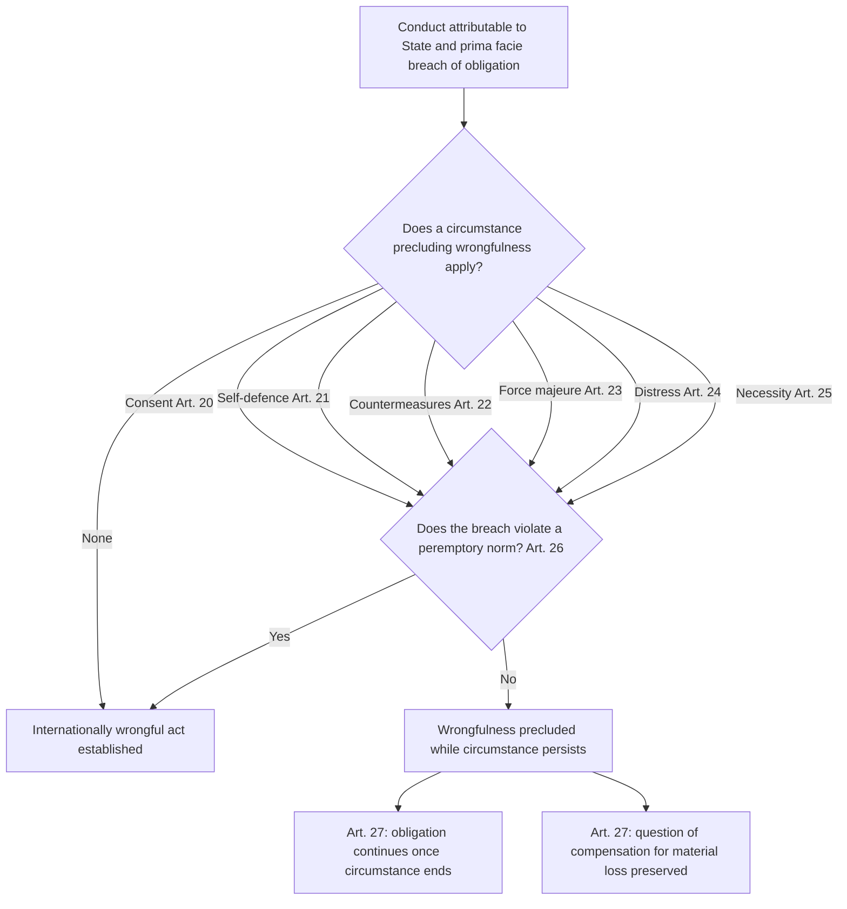
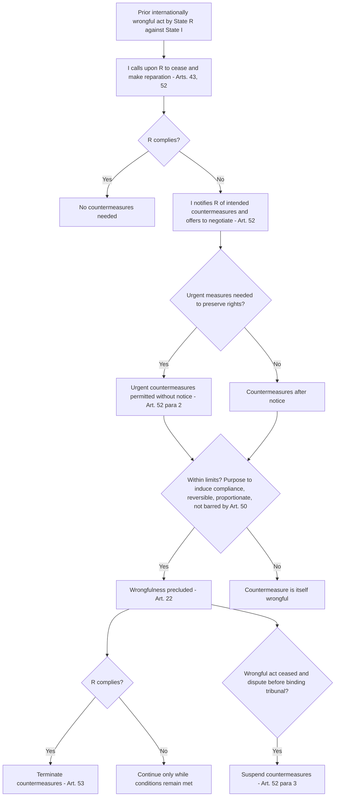

## Circumstances Precluding Wrongfulness: Necessity, Self-Defense, Countermeasures, and Force Majeure

### The Conceptual Problem

International law contains a set of doctrines under which conduct that would ordinarily breach an international obligation is **not wrongful**, because of the circumstances in which it occurs. These are called **circumstances precluding wrongfulness**. They are codified in Chapter V of Part One of the **Articles on Responsibility of States for Internationally Wrongful Acts (ARSIWA)**, adopted by the International Law Commission (ILC) in 2001 (Articles 20 to 27).

Recall that under ARSIWA Article 2, an internationally wrongful act has two cumulative elements: (a) conduct attributable to the state, and (b) a breach of an international obligation of that state. Circumstances precluding wrongfulness operate **after** those elements appear to be satisfied. They function as **defences**: the conduct is prima facie a breach, but the circumstance excludes the wrongfulness of the act for as long as, and to the extent that, the circumstance exists.

ARSIWA is not a treaty (the General Assembly took note of it in Resolution 56/83 and commended it to governments), but the International Court of Justice (ICJ) has treated several of the provisions in this Chapter, most notably Article 25 on necessity, as reflecting customary international law.

**Key Points**

- Circumstances precluding wrongfulness are **excuses or justifications** that operate on the *wrongfulness* element, not on attribution.
- They do **not terminate or suspend the underlying obligation**. The obligation continues to bind the state; it is merely not breached while the circumstance persists (Article 27(a)).
- They are distinct from the **termination or suspension of treaties** under the Vienna Convention on the Law of Treaties (VCLT) Articles 60 to 62, which affect the obligation itself.
- They must be distinguished from the **primary rules** that themselves contain built-in exceptions (for example, the derogation clauses in human rights treaties).
- No circumstance can preclude the wrongfulness of an act that violates a **peremptory norm** (*jus cogens*) (Article 26).

### The Architecture of Chapter V

| Article | Circumstance | Core content |
| --- | --- | --- |
| 20 | Consent | Valid consent of the state whose right is affected |
| 21 | Self-defence | Lawful measure of self-defence under the UN Charter |
| 22 | Countermeasures | Measures in response to a prior wrongful act, taken in conformity with Part Three, Chapter II |
| 23 | Force majeure | Irresistible force or unforeseen event beyond the state's control, making performance materially impossible |
| 24 | Distress | Act necessary to save lives entrusted to the actor's care |
| 25 | Necessity | Only means to safeguard an essential interest against a grave and imminent peril |
| 26 | Compliance with peremptory norms | No circumstance justifies breach of *jus cogens* |
| 27 | Consequences | Effects of invoking a circumstance: continued duty of performance and possible compensation |

This item concentrates on four of these: **necessity** (Article 25), **self-defence** (Article 21), **countermeasures** (Article 22), and **force majeure** (Article 23). Consent (Article 20) and distress (Article 24) are treated only where they clarify boundaries. Article 26 and Article 27 are treated because they govern all the circumstances.

### General Principles Governing All Circumstances

#### Wrongfulness Precluded, Not Obligation Extinguished

Article 27 provides that the invocation of a circumstance precluding wrongfulness is without prejudice to:

- **(a)** Compliance with the obligation in question, **if and to the extent that the circumstance precluding wrongfulness no longer exists**; and
- **(b)** The **question of compensation for any material loss** caused by the act in question.

The first limb reflects the temporary character of the excuse. The ICJ articulated this in *Gabčíkovo-Nagymaros Project (Hungary/Slovakia)* (Judgment, 1997), holding that even if a state of necessity had existed, that would not permit the termination of the 1977 Treaty; as soon as the state of necessity ceases to exist, the obligation to comply with treaty obligations revives. The Court's dictum is that a state of necessity may excuse non-performance but does not itself terminate the treaty, and the treaty may be ineffective only if it is terminated on the basis of the law of treaties.

The second limb, on compensation, is a **policy compromise**. The ILC commentary states that Article 27(b) does not create an obligation of compensation, and that the question is left to be resolved by the primary rule, the parties' relations, or the circumstances (for example, the recognised approach for the injured innocent state in necessity cases). The commentary is deliberately non-committal on whether compensation is owed for lawful acts, which some scholars treat as an issue of liability for lawful acts rather than state responsibility. [Inference] The practical effect is that a state relying on necessity or force majeure should anticipate a claim for compensation for material loss, particularly where the injured state is itself innocent.

#### Burden and Standard of Proof

The state invoking a circumstance bears the burden of establishing that its conditions are met. Tribunals interpret the conditions **strictly**, treating circumstances precluding wrongfulness as exceptional. In the *Rainbow Warrior* arbitration (New Zealand v. France) (Arbitral Tribunal, 1990), the tribunal examined the French defences of *force majeure*, distress and necessity and rejected them on the facts, applying the ILC's then-draft articles as reflecting customary law.

#### The Bar on Circumstances Precluding Wrongfulness for Peremptory Norms (Article 26)

Article 26 states that nothing in Chapter V precludes the wrongfulness of any act of a state that is not in conformity with an obligation arising under a **peremptory norm of general international law**.

A **peremptory norm (*jus cogens*)** is a norm accepted and recognised by the international community of states as a whole as a norm from which no derogation is permitted and which can be modified only by a subsequent norm of the same character (VCLT Article 53). Examples widely accepted include the prohibitions on aggression, genocide, slavery, torture, and racial discrimination, and the right to self-determination.

The ILC's rationale is that a state cannot rely on necessity, consent, or countermeasures to justify, for example, an act of genocide. The provision is, in one respect, a restatement rather than an independent rule, since *jus cogens* norms by definition admit no derogation. The commentary notes that the self-defence rule in Article 21 is itself consistent with the peremptory prohibition on the use of force, as lawful self-defence is not a violation of that prohibition in the first place.

### Necessity (Article 25)

#### Definition

**Necessity** (sometimes "state of necessity") is a customary doctrine under which a state may, in exceptional circumstances, breach an international obligation where that is the **only way to safeguard an essential interest against a grave and imminent peril**.

It must be distinguished from *force majeure* (Article 23) in a decisive respect: in force majeure, the state has **no real choice** because performance is materially impossible, whereas in necessity the state makes a **deliberate choice** to breach in order to protect an interest.

#### The Text of Article 25

Article 25(1) frames necessity **negatively**:

> Necessity may not be invoked by a State as a ground for precluding the wrongfulness of an act not in conformity with an international obligation of that State unless the act:
>
> (a) is the only way for the State to safeguard an essential interest against a grave and imminent peril; and
>
> (b) does not seriously impair an essential interest of the State or States towards which the obligation exists, or of the international community as a whole.

Article 25(2) then lists two **absolute bars**. Necessity may not be invoked if:

- **(a)** The international obligation in question **excludes the possibility of invoking necessity**; or
- **(b)** The State has **contributed to the situation of necessity**.

The negative phrasing ("may not be invoked... unless") is deliberate: it signals that necessity is exceptional, to be admitted only on strict conditions, and that it is not a general license to override obligations.

#### Analytical Breakdown of the Conditions

| Condition | Content | Key considerations |
| --- | --- | --- |
| **Essential interest** | An interest of the state (or the international community) of fundamental importance | Not limited to survival or territorial integrity; may include the ecological preservation of the territory, the preservation of the state's economic and financial stability, or public health. The assessment is contextual. |
| **Grave peril** | Serious threat to the essential interest | The threat must be to the interest itself, not merely a difficulty or inconvenience |
| **Imminent** | The peril must be clearly established on the basis of evidence, and proximate | *Imminence* is compatible with a long-term peril if it is certain and inevitable (per *Gabčíkovo*), but a merely possible or speculative peril is insufficient |
| **Only way** | No other lawful means available, even if more costly or less convenient | If any alternative lawful measure exists, necessity fails |
| **No serious impairment of others' essential interests** | Balancing: the interest protected must outweigh the interest impaired | The impaired interest may belong to the injured state or the international community as a whole |
| **No exclusion by the obligation** | The primary rule may itself exclude necessity (for example, by explicit provision or by its nature) | Rules of international humanitarian law, for example, are generally understood to be framed with military necessity already taken into account and therefore not open to further necessity claims |
| **No contribution by the state** | The state must not have contributed to the situation | Contribution must be **sufficiently substantial and not merely incidental or peripheral** according to the ILC commentary |

#### The Leading Case: *Gabčíkovo-Nagymaros Project*

In 1977 Hungary and Czechoslovakia concluded a treaty on the construction of a system of locks on the Danube. In 1989 Hungary suspended and subsequently abandoned works, invoking a "state of ecological necessity" arising from environmental risks. The ICJ (1997) acknowledged that the concept of necessity is well established in customary law as a ground for precluding wrongfulness, and that it is reflected in what was then draft Article 33 of the ILC's draft (now Article 25). The Court accepted that the safeguarding of the environment is an **essential interest** of a state. However, it rejected Hungary's plea because:

1. The **perils were not sufficiently "imminent"**: the risks alleged were long-term and uncertain, and Hungary had not established that they were in fact grave and imminent at the time it suspended work.
2. Hungary had **other means available** (the "only way" condition failed): it could have responded to the environmental risks through other measures.
3. Hungary had **helped bring about** the state of necessity by its own conduct (having earlier agreed to the project and having then behaved in a way that contributed to the situation).

The Court's summary of the strict character of the doctrine is influential: the state of necessity is a ground **"recognized by customary international law for precluding the wrongfulness of an act not in conformity with an international obligation"**, but it can be accepted **"only on an exceptional basis"**, and **"the state concerned is not the sole judge of whether those conditions have been met."**

That last point matters for every circumstance in Chapter V: invocation by a state is a **claim**, not a self-judging entitlement, and it is subject to review by a competent tribunal.

#### Necessity in Investor-State Arbitration: The Argentine Cases

In the wake of Argentina's 2001-2002 financial crisis, Argentina invoked necessity (customary Article 25) and the non-precluded measures (NPM) clause of the Argentina-United States bilateral investment treaty (BIT), in a series of arbitrations before the International Centre for Settlement of Investment Disputes (ICSID). Tribunals reached divergent conclusions:

| Case | Holding on necessity (summary) |
| --- | --- |
| *CMS Gas Transmission Co. v. Argentina* (ICSID, 2005) | Rejected necessity: Argentina's conduct contributed to the crisis, and other means were available |
| *LG&E v. Argentina* (ICSID, 2006) | Accepted the NPM clause as applicable for a limited period during the height of the crisis, treating the BIT provision as a distinct treaty basis |
| *Enron v. Argentina* (ICSID, 2007) | Rejected necessity, on grounds including that Argentina contributed to the situation |
| *Sempra v. Argentina* (ICSID, 2007) | Rejected necessity, similar reasoning to CMS and Enron |

The divergence stems in part from two related questions:

1. Whether the treaty **NPM clause** is a self-standing *lex specialis* (with its own test) or is to be interpreted by reference to the customary necessity doctrine in Article 25.
2. How **strictly** the "contribution" and "only way" conditions apply to macroeconomic crises.

CMS, Enron and Sempra were annulment-reviewed: the *CMS* annulment committee (2007) found that the tribunal had confused the treaty exception and the customary defence, though it declined to annul on that ground alone, while the *Sempra* award was later annulled (2010) for a failure to apply the correct law. This history illustrates how difficult it is to apply the customary standard to economic emergencies. [Inference] The proliferation of divergent awards has prompted more recent BITs and free trade agreements to define essential security interests and public-interest exceptions more precisely.

**Example: Necessity analysis**

State Z has an obligation under a bilateral treaty to allow foreign vessels innocent passage through a strait within its territorial sea. A vessel carrying a highly toxic cargo runs aground and threatens to release its cargo into a delicately balanced ecosystem that supports the livelihoods of coastal communities. State Z, to prevent the release, closes the strait to all vessels for two weeks and destroys the vessel with controlled explosives.

1. **Essential interest:** Environmental integrity and the livelihoods of coastal populations plausibly qualify (per *Gabčíkovo*).
2. **Grave and imminent peril:** A well-documented risk of imminent release, supported by expert evidence, would satisfy this. A generalised environmental concern would not.
3. **Only way:** If salvage operations, controlled towing, or containment measures were technically feasible, necessity would fail. The state must show that alternatives were considered and unavailable.
4. **Balancing (Art. 25(1)(b)):** The impairment of the flag state's rights and of international navigation must not be more serious than the interest protected.
5. **Bars (Art. 25(2)):** No exclusion in the treaty; the state must not have contributed (for example, by failing to maintain navigational aids).

If any condition fails, the defence fails in its entirety.

**Key Points**

- Necessity applies to **any** international obligation, unless excluded, but is available only in the most exceptional cases.
- The phrase "essential interest" is not defined by a list; the ILC commentary says the interest's essential character depends on the circumstances.
- Necessity cannot be invoked to justify the **use of armed force** contrary to the UN Charter, since that would breach a peremptory norm (Article 26) and would circumvent the exhaustive Charter regime. [Inference] The prevailing view is that necessity is not available as a justification for humanitarian intervention without Security Council authorisation, though the position is contested by proponents of a doctrine of humanitarian necessity.

### Self-Defence (Article 21)

#### The Rule

Article 21 provides that the wrongfulness of an act of a state is precluded **if the act constitutes a lawful measure of self-defence taken in conformity with the Charter of the United Nations**.

Article 21 is essentially a **cross-reference**. It does not define self-defence. Its function is to signal that conduct that would otherwise breach the prohibition on the use of force (UN Charter Article 2(4)) is not wrongful where it meets the conditions of UN Charter Article 51 and customary international law.

#### The Substantive Law of Self-Defence

The content of the rule is found outside ARSIWA. **Article 51 of the UN Charter** preserves the "inherent right of individual or collective self-defence if an armed attack occurs against a Member of the United Nations, until the Security Council has taken measures necessary to maintain international peace and security." Measures taken in self-defence must be immediately reported to the Security Council.

The ICJ set out the customary conditions in *Military and Paramilitary Activities in and against Nicaragua* (Merits, 1986) and *Oil Platforms (Islamic Republic of Iran v. United States)* (Judgment, 2003):

| Requirement | Content | Authority |
| --- | --- | --- |
| **Armed attack** | The right arises only in response to an armed attack, which is the gravest form of the use of force. Lesser uses of force do not trigger it | *Nicaragua* (1986); *Oil Platforms* (2003) |
| **Necessity** | Force must be necessary: no reasonable alternative means of averting the attack | *Nicaragua*; *Legality of the Threat or Use of Nuclear Weapons* (Advisory Opinion, 1996) |
| **Proportionality** | Force must be proportionate to the attack being repelled, in scale and effects | *Nicaragua*; *Oil Platforms* |
| **Reporting** | Immediate report to the UN Security Council (Article 51) | *Nicaragua* (treated as relevant evidence of a state's belief but not a condition of legality) |
| **Request for assistance (collective self-defence)** | The victim state must declare itself attacked and request assistance | *Nicaragua* |

The **"necessity" and "proportionality"** requirements in the law of self-defence are separate from the necessity in Article 25. Necessity in Article 25 is the general doctrine of essential interests; "necessity" in self-defence is an internal requirement of the right of self-defence (whether force is required to repel the attack). The two concepts share a name but are governed by different rules.

#### Scope: What Article 21 Precludes

Article 21 precludes the wrongfulness of the **use of force** against the aggressor state. It may also extend to breaches of other obligations towards the aggressor that are incidental to the defensive action, such as the obligation to respect the aggressor's territorial integrity, but it does not permit violations of obligations that are **non-derogable** in armed conflict or that protect third states. In particular:

- Self-defence does not relieve a state of its obligations under **international humanitarian law** (*jus in bello*), which apply equally to all parties. This is the principle of the **equality of belligerents** under the law of armed conflict: *jus ad bellum* (the law on resort to force) and *jus in bello* (the law governing conduct in hostilities) are separate.
- Self-defence does not preclude wrongfulness towards **third states** not responsible for the armed attack, except where the force is used against them on some other lawful basis. This is a subject of debate in relation to defensive action against non-state actors located in third states (see below).

#### Contested Questions in Self-Defence

1. **Armed attack by non-state actors.** Does an armed attack require attribution to a state? The ICJ in *Legal Consequences of the Construction of a Wall in the Occupied Palestinian Territory* (Advisory Opinion, 2004) and *Armed Activities on the Territory of the Congo (Democratic Republic of the Congo v. Uganda)* (Judgment, 2005) took a restrictive view, treating Article 51 as applying to armed attacks by one state against another and finding no need to consider self-defence against attacks by irregular forces not attributable to a state. After the 11 September 2001 attacks, Security Council Resolutions 1368 and 1373 acknowledged a right of self-defence in response to terrorist attacks, and state practice has moved toward accepting force against non-state actors, at least where the host state is "unwilling or unable" to suppress the threat. **The "unwilling or unable" doctrine** is supported by a number of states and scholars but has not been endorsed by the ICJ and is disputed by others who consider it inconsistent with the Charter's territorial-integrity protections. Proponents argue that an absolute attribution requirement would leave victim states without any right of self-defence against groups operating from ungoverned territory. Opponents argue that the doctrine lowers the threshold for cross-border force, risks abuse by powerful states, and lacks sufficiently uniform state practice and *opinio juris*.
2. **Anticipatory or pre-emptive self-defence.** Article 51 speaks of "if an armed attack occurs." A minority position holds that the "inherent right" preserves the customary right to act against an imminent attack, traditionally traced to the *Caroline* incident (1837) formulation of "instant, overwhelming, leaving no choice of means, and no moment for deliberation." Expansive doctrines of **pre-emptive** action against non-imminent threats have been widely rejected. The "imminence" standard remains contested, especially in relation to new forms of attack (cyber, missile).
3. **Accumulation of events.** Whether a series of smaller attacks may cumulatively constitute an armed attack. The ICJ left the question open in *Nicaragua* and *Oil Platforms*, and some states, notably Israel and the United States, support the accumulation theory.

#### Self-Defence and the Security Council

Article 51 states that the right continues "until the Security Council has taken measures necessary to maintain international peace and security." Self-defence is therefore, in principle, **provisional**, though in practice the Council's action has rarely been sufficient to displace it.

**Example**

State X is subjected to a large-scale invasion by State Y across its land border. State X's armed forces strike military targets on State Y's territory to repel the invasion and immediately report to the Security Council. The strikes are attributable to State X and, by their nature, breach State Y's territorial integrity and the prohibition on the use of force. Under Article 21, the wrongfulness of the strikes is precluded if the conditions of Article 51 are met: there was an armed attack, the strikes were necessary and proportionate to repelling it, and the report was made. If X's forces also intentionally target civilian hospitals, self-defence does not preclude the wrongfulness of that conduct: those acts violate international humanitarian law, and the equal application of that law is unaffected by the legality of the resort to force.

**Key Points**

- Article 21 is a **renvoi** to the UN Charter and customary law on self-defence; the content of the doctrine comes from *Nicaragua*, *Oil Platforms*, and state practice.
- Self-defence requires an **armed attack**, **necessity**, and **proportionality**.
- Compliance with *jus in bello* is independent of the legality of the resort to force.

### Countermeasures (Article 22)

#### Definition and Function

A **countermeasure** is an act that would ordinarily be unlawful, but which is taken by an **injured state** in response to a **prior internationally wrongful act** of another state, in order to **induce that state to comply** with its obligations of cessation and reparation. Countermeasures were historically called "reprisals," but the ILC replaced the term to avoid confusion with belligerent reprisals in the law of armed conflict.

Article 22 states: "The wrongfulness of an act of a State not in conformity with an international obligation towards another State is precluded if and to the extent that the act constitutes a countermeasure taken against the latter State in accordance with chapter II of Part Three."

Article 22 is thus a **cross-reference** to the conditions in Part Three, Chapter II (Articles 49 to 54). The conditions are treated in detail below.

#### Authorities

- ***Naulilaa* Arbitration (Portugal v. Germany)** (Special Arbitral Tribunal, 1928): a leading early authority holding that reprisals require a prior wrongful act, an unsuccessful demand for redress, and proportionality. The tribunal found the German reprisal disproportionate.
- ***Air Services Agreement of 27 March 1946 (United States v. France)** (Arbitral Tribunal, 1978): countermeasures are permitted in the absence of an effective third-party dispute settlement mechanism, and must be proportionate, assessed by reference not only to the quantum of injury but also to the importance of the principles at stake.
- ***Gabčíkovo-Nagymaros* (ICJ, 1997):** the Court set out four conditions for lawful countermeasures: (1) they must be taken in response to a previous internationally wrongful act of another state and directed against that state; (2) the injured state must have called upon the offending state to discontinue its wrongful conduct or to make reparation; (3) the effects must be commensurate with the injury suffered, taking account of the rights in question; and (4) the measures must be taken for the purpose of inducing the wrongdoing state to comply with its obligations, and must therefore be reversible. The Court found that Czechoslovakia's unilateral diversion of the Danube (Variant C) was not a proportionate countermeasure because it deprived Hungary of its right to an equitable and reasonable share of the river's natural resources.

#### The Conditions (ARSIWA Articles 49 to 54)

**Substantive limits**

| Article | Condition | Content |
| --- | --- | --- |
| **49(1)** | Purpose | Countermeasures may be taken only to **induce the responsible state to comply** with its obligations under Part Two (cessation, reparation). They are **instrumental, not punitive** |
| **49(2)** | Scope | Limited to the **non-performance of international obligations** of the injured state towards the responsible state for the time being |
| **49(3)** | Reversibility | As far as possible, taken so as to permit **resumption of performance** of the obligations in question |
| **50(1)** | Prohibited measures | Countermeasures shall not affect (a) the obligation to refrain from the **threat or use of force** as embodied in the UN Charter; (b) obligations for the **protection of fundamental human rights**; (c) obligations of a **humanitarian character** prohibiting reprisals; (d) other obligations under **peremptory norms** |
| **50(2)** | Preserved obligations | Countermeasures do not relieve the injured state of obligations under any applicable **dispute settlement procedure** between the injured and the responsible state, or to respect the **inviolability of diplomatic or consular agents, premises, archives and documents** |
| **51** | Proportionality | Must be **commensurate with the injury suffered**, taking into account the gravity of the wrongful act and the rights in question |

**Procedural conditions (Article 52)**

Before taking countermeasures, the injured state must:

- **(a)** Call upon the responsible state to fulfil its obligations of cessation and reparation (Article 43 notice); and
- **(b)** **Notify** the responsible state of any decision to take countermeasures and **offer to negotiate**.

The injured state may take **urgent countermeasures** as are necessary to preserve its rights without prior notice (Article 52(2)). Countermeasures must be **suspended** if the wrongful act has ceased and the dispute is pending before a court or tribunal with authority to make binding decisions (Article 52(3)), unless the responsible state fails to implement dispute-settlement procedures in good faith (Article 52(4)).

**Termination (Article 53)**

Countermeasures must be **terminated** as soon as the responsible state has complied with its obligations in relation to the wrongful act.

#### Countermeasures by States Other Than the Injured State (Article 54)

Article 54 preserves, without resolving, the question whether states **other than the injured state** may take lawful measures against a responsible state where the obligation breached is owed to the international community as a whole (*erga omnes*) or to a group of states for a collective interest (*erga omnes partes*) and the state is entitled to invoke responsibility under Article 48.

Recall that **erga omnes obligations** are obligations owed to the international community as a whole, in whose protection all states have a legal interest (*Barcelona Traction, Light and Power Company, Limited (Belgium v. Spain)*, Second Phase, 1970). The wording of Article 54, "lawful measures", rather than "countermeasures", was a deliberate compromise.

**The strongest form of each side of the debate:**

- **Supporters of collective countermeasures** argue that, since Article 48 gives non-injured states standing to invoke responsibility for breaches of collective obligations, denying them the ability to take enforcement measures would render that standing largely illusory, particularly given the frequent paralysis of the Security Council. They point to state practice: sanctions imposed on **apartheid South Africa**, on **Uganda** (1978 to 1979), and on **Argentina** in the Falklands conflict (1982), and the extensive economic measures imposed on **Russia** following its 2022 invasion of Ukraine.
- **Opponents** argue that recognising a general right of third-party countermeasures invites abuse by powerful states, risks escalation and lacks sufficiently uniform state practice and *opinio juris* to establish a customary rule. They note that many measures imposed in practice are characterised by their authors as **retorsion** (lawful but unfriendly acts, such as the severing of diplomatic relations or the withdrawal of aid, which do not breach any international obligation and therefore require no justification), and that where measures are justified under an institutional framework (such as the Security Council under Chapter VII of the UN Charter or regional organisations), third-party countermeasure doctrine is unnecessary.

The position remains **unsettled** in general international law.

#### Countermeasures Distinguished from Related Concepts

| Concept | Nature | Requires prior wrongful act? | Justification needed? |
| --- | --- | --- | --- |
| **Countermeasure** | Otherwise unlawful act, taken to induce compliance | Yes | Yes (Article 22) |
| **Retorsion** | Lawful but unfriendly act (for example, expelling diplomats, imposing an embargo where no treaty prevents it) | No | No |
| **Sanction (institutional)** | Measure authorised by an international organisation (e.g., UN Security Council under Chapter VII) | Not necessarily | Grounded in the organisation's constituent instrument |
| **Belligerent reprisal** | Otherwise unlawful act in armed conflict, taken in response to an enemy's violation of the laws of war | Yes | Strictly limited by international humanitarian law |

#### Countermeasures and the Law of the World Trade Organization

Within the WTO, the Dispute Settlement Understanding (DSU) provides its own regime of authorised retaliation (Article 22 DSU, "suspension of concessions"). The relationship between WTO retaliation and general countermeasures is governed by *lex specialis* (ARSIWA Article 55), and WTO members have generally been understood to be bound to use the DSU mechanism rather than take unilateral measures for violations of WTO law. [Inference] The general law of countermeasures may nonetheless remain available for breaches of non-WTO obligations even where the countermeasure affects WTO commitments, though this position is not settled in WTO jurisprudence.

**Example: Lawful countermeasure**

State R unlawfully seizes and refuses to return a vessel belonging to State I, in breach of a bilateral treaty guaranteeing free access to R's ports.

1. **Prior wrongful act:** R's unlawful seizure (attributable and in breach).
2. **Demand (Art. 52(1)(a)):** I calls upon R to release the vessel and make reparation.
3. **Notice and offer to negotiate (Art. 52(1)(b)):** R refuses. I notifies R that it will suspend R's rights under a separate bilateral customs-preference treaty, and offers to negotiate.
4. **Countermeasure:** I suspends customs preferences for R's exports. This is otherwise a breach of the customs treaty, but is justified as a countermeasure under Article 22.
5. **Limits check:** The measure is proportionate to the value of the vessel and the treaty rights lost (Article 51); it is reversible (Article 49(3)); it does not involve force, human rights, or peremptory norms (Article 50).
6. **Termination (Art. 53):** Once R releases the vessel and compensates I, I must restore the customs preferences.

If I had instead denied R's citizens medical treatment in I's hospitals, the measure would violate Article 50(1)(b) and would not qualify.

**Key Points**

- Countermeasures are **instrumental**: their object is to induce compliance, not to punish.
- They must be **reversible as far as possible**, **proportionate**, and preceded by **demand, notice, and an offer to negotiate**, except in the case of urgent measures.
- They can never affect the prohibition of the **use of force**, **fundamental human rights**, **humanitarian obligations**, or **peremptory norms**.
- They may be taken only by an **injured state** (the position of other states is unresolved).
- A state taking countermeasures assumes the **risk** that its assessment of the prior breach is wrong; if there was no prior wrongful act, the countermeasure is itself wrongful.

### Force Majeure (Article 23)

#### Definition

**Force majeure** (literally "superior force") is a circumstance in which a state's conduct that would otherwise breach an obligation is **involuntary**, because the state has been overtaken by an event outside its control that makes performance materially impossible.

Article 23(1) provides:

> The wrongfulness of an act of a State not in conformity with an international obligation of that State is precluded if the act is due to force majeure, that is the occurrence of an irresistible force or of an unforeseen event, beyond the control of the State, making it materially impossible in the circumstances to perform the obligation.

#### Elements

| Element | Content |
| --- | --- |
| **Irresistible force or unforeseen event** | Natural events (earthquakes, floods, storms, drought) or human events (loss of control over part of territory through insurrection or foreign intervention) |
| **Beyond the control of the state** | The state must not have been able to prevent or avoid the event |
| **Material impossibility** | Performance must be **materially impossible**, not merely more difficult, burdensome, or expensive |
| **In the circumstances** | Assessed in the particular context |

The Chapter uses a disjunctive formulation: "irresistible force" or "unforeseen event." Either is sufficient if the other elements are met.

#### Limits (Article 23(2))

Force majeure **does not apply** if:

- **(a)** The situation is due, either alone or in combination with other factors, to the **conduct of the state invoking it**; or
- **(b)** The state has **assumed the risk** of that situation occurring.

Limb (a) reflects the principle that a state cannot benefit from its own wrong. The commentary notes that the state's contribution must be **substantial**; a minor or incidental contribution does not bar the plea (contrast the corresponding necessity bar, where the commentary uses "sufficiently substantial" and not merely incidental or peripheral). Limb (b) covers situations in which the state, expressly or by implication, accepted the risk of the event as part of the obligation, for example by an undertaking to perform regardless of certain contingencies.

#### Authorities

- ***Rainbow Warrior* (New Zealand v. France)** (Arbitral Tribunal, 1990): the tribunal held that force majeure requires **absolute and material impossibility**, and that "circumstances rendering performance more difficult or burdensome do not constitute force majeure." France had argued that it could not fulfil an obligation to keep two agents on Hao Island because of medical emergencies; the tribunal held that the plea was not established for one agent whose condition was not shown to make performance impossible.
- ***Case Concerning the Payment of Various Serbian Loans Issued in France* (France v. Kingdom of the Serbs, Croats and Slovenes)** (Permanent Court of International Justice (PCIJ), 1929): the court held that the First World War did not, in the circumstances, make payment impossible in the sense required for force majeure, since the debtor's difficulties were economic rather than material.
- ***Lighthouses Arbitration* (France v. Greece)** (1956) and the *Gill Case* (Britain v. Mexico) (1931): earlier arbitral practice applying the concept of force majeure to situations of inability to control forces on territory.
- **The classic instance:** the accidental intrusion of a military aircraft into foreign airspace due to a storm or navigation failure. An example from practice is the 1946 and 1953 incidents in which aircraft of one state strayed into the airspace of another because of weather, and which were treated as attributable to distress or *force majeure* rather than deliberate violations.

#### Distinguishing Force Majeure from Related Concepts

| Concept | Difference from force majeure |
| --- | --- |
| **Distress (Article 24)** | In distress the actor has a choice but that choice is between breach and the loss of life (of the actor or persons in their care); it applies to individuals, such as ship captains or pilots, acting in a personal capacity of state authority. Force majeure involves no meaningful choice |
| **Necessity (Article 25)** | Necessity involves a deliberate choice to protect an essential interest; the impossibility is not material. Necessity is subject to a balancing test; force majeure is not |
| **Supervening impossibility of performance (VCLT Article 61)** | Article 61 concerns the **termination or suspension of a treaty** when the object needed to perform it disappears or is destroyed permanently (or temporarily, for suspension); force majeure precludes **wrongfulness of an act** and leaves the treaty in force |
| **Fundamental change of circumstances (VCLT Article 62, *rebus sic stantibus*)** | Applies to the treaty's termination where the change transforms the extent of obligations still to be performed; it does not concern the wrongfulness of a specific act |
| **Economic hardship** | Financial difficulty, however severe, is not force majeure; it may at most support a necessity plea |

#### Force Majeure and Human Rights and Investment Law

In the context of investment arbitration, force majeure has been pleaded in relation to civil unrest and natural disasters. In *Continental Casualty Company v. Argentina* (ICSID, 2008), the tribunal treated the Argentine crisis as, at most, an economic difficulty and considered the non-precluded-measures clause of the BIT rather than force majeure. In *Total S.A. v. Argentina* (ICSID, 2010), and other cases, economic crises were consistently held not to satisfy the "material impossibility" threshold. [Unverified] Where tribunals have used the language of *force majeure* in civil-unrest cases, they have often done so in relation to treaty-specific standards (for example, "most constant protection and security") rather than the customary defence.

**Example**

A state's naval vessel, in compliance with all applicable navigation obligations, is thrown off course by an unforecast hurricane and enters the territorial sea of a neighbouring state without authorisation, in breach of that state's sovereignty. The crew cannot restore control of the vessel due to storm damage. The intrusion is due to an irresistible force beyond the state's control, making compliance with the obligation to respect the territorial sea materially impossible in the circumstances. Wrongfulness is precluded under Article 23, provided the state did not cause or assume the risk of the situation (for example, by knowingly sending an unseaworthy vessel into a forecast storm). Under Article 27(a), once the vessel regains control, the obligation to leave the territorial sea applies again; failure to do so would constitute a fresh breach. Under Article 27(b), the flag state may still be asked to compensate for material loss caused by the intrusion.

**Key Points**

- Force majeure requires **material impossibility**: hardship or difficulty is insufficient.
- The state must not have **caused** the situation or **assumed the risk** of it.
- Unlike necessity, force majeure involves **no deliberate choice** and no balancing of interests.
- Economic and financial crises typically fail the material-impossibility test and are pleaded as necessity instead.

### Comparative Analysis of the Four Circumstances

| Feature | Necessity (Art. 25) | Self-defence (Art. 21) | Countermeasures (Art. 22) | Force majeure (Art. 23) |
| --- | --- | --- | --- | --- |
| **Nature** | Deliberate breach to protect an essential interest | Lawful response to an armed attack | Response to a prior wrongful act to induce compliance | Involuntary, due to irresistible force or unforeseen event |
| **Trigger** | Grave and imminent peril to an essential interest | Armed attack | Prior internationally wrongful act by the target state | Occurrence of an event beyond state's control |
| **Choice involved** | Yes | Yes | Yes | No (or no meaningful choice) |
| **Directed at** | Any state to which the obligation is owed (often an innocent state) | Aggressor (and possibly third states in limited circumstances) | Responsible state only | Not directed at anyone |
| **Key limits** | Only way; no serious impairment of others' essential interests; no contribution; not excluded by the obligation | Necessity and proportionality; Charter compliance; reporting | Proportionality; reversibility; procedural conditions; Article 50 exclusions | Material impossibility; no contribution; no assumption of risk |
| **Compensation issue (Art. 27(b))** | Live; compensation for material loss likely to be claimed | Generally not, if lawful | Generally not, if lawful | Live, for material loss |
| **Peremptory norm bar (Art. 26)** | Applies | Not applicable to lawful self-defence itself; applies to violations of *jus cogens* not authorised by Article 51 | Applies (Article 50(1)(d)) | Applies |
| **Leading authority** | *Gabčíkovo-Nagymaros* (1997) | *Nicaragua* (1986); *Oil Platforms* (2003) | *Naulilaa* (1928); *Air Services* (1978); *Gabčíkovo-Nagymaros* | *Rainbow Warrior* (1990) |

### Interaction and Common Analytical Errors

- **Conflating necessity with military necessity.** "Military necessity" in international humanitarian law is a principle built into the primary rules of the law of armed conflict and permits measures required to achieve a legitimate military purpose that are not otherwise prohibited. It is not the same as the Article 25 defence, and it cannot be invoked to override rules of humanitarian law that were formulated with military necessity already in mind.
- **Conflating the necessity condition in self-defence with Article 25.** Each is governed by its own rules, as explained above.
- **Treating countermeasures as available against any breach by anyone.** They are available to an **injured** state against the **responsible** state, and only in accordance with Part Three, Chapter II.
- **Assuming that a circumstance excuses the whole conduct.** Article 22 states that wrongfulness is precluded "if and to the extent that" the act is a countermeasure; each circumstance operates only to the extent of the conditions met.
- **Assuming that invoking a circumstance ends the obligation.** Article 27(a): the obligation revives when the circumstance ends.

### Relevance to Philippine Interests

Several themes connect to Philippine practice, particularly in the South China Sea:

- **Self-defence and armed attack thresholds:** The 1951 Mutual Defense Treaty between the Philippines and the United States (Article IV) provides that each party recognises that an armed attack in the Pacific area on either party would be dangerous to its own peace and safety and that it would act to meet the common danger in accordance with its constitutional processes. Whether particular incidents at sea, such as water-cannon use, ramming, or blockade of resupply missions, constitute an **"armed attack"** under Article 51 and the customary threshold set out in *Nicaragua* is a matter of continuing legal debate. [Inference] The prevailing view of the ICJ's case law suggests that the threshold is high, distinguishing armed attacks (the gravest forms of force) from less grave uses of force, so that incidents falling short of an armed attack may justify lawful non-forcible responses (such as countermeasures, retorsion, and dispute-settlement steps) but not a claim of self-defence.
- **Countermeasures as a lawful response to prior wrongful acts:** The *South China Sea Arbitration (Philippines v. China)* (PCA Case No. 2013-19, Award of 12 July 2016) found that China had breached obligations under the United Nations Convention on the Law of the Sea (UNCLOS) concerning the Philippines' exclusive economic zone (EEZ), navigation safety, and the marine environment. These findings establish a prior wrongful act, which is a precondition to any Philippine countermeasures. Any countermeasure would have to satisfy the requirements of proportionality, reversibility, notice, and offer to negotiate, and could not involve the use of force (Article 50(1)(a)).
- **Necessity and environmental protection:** The *Gabčíkovo-Nagymaros* recognition of environmental preservation as an "essential interest" may be relevant to state responses to large-scale destruction of coral reef ecosystems, but the demanding conditions of grave and imminent peril and the "only way" requirement would apply.
- **Force majeure and maritime incidents:** Weather-related or mechanical incidents leading to vessels straying into another state's maritime zones may raise Article 23 issues, particularly where the vessel's own navigational conduct is scrutinised.
- **China's non-acceptance of the Award:** China's position that the Award is "null and void" does not alter its binding character under UNCLOS Annex VII Article 11, and under ARSIWA Article 32 a state may not rely on its internal law as justification for non-compliance with obligations of cessation and reparation. However, no circumstance in Chapter V has been recognised by any tribunal as excusing non-compliance with the Award.

### Common Misconceptions

- **"Necessity lets a state do whatever is needed to protect its interests."** Incorrect. It is available only in the most exceptional cases, on strict cumulative conditions, and the state is not the sole judge of whether they are met.
- **"Self-defence permits any force in response to any hostile act."** Incorrect. Self-defence requires an armed attack, necessity, and proportionality.
- **"Countermeasures are punishment."** Incorrect. They are aimed at inducing compliance and must be reversible and terminated upon compliance.
- **"A financial crisis is force majeure."** Generally incorrect. Economic difficulty does not satisfy material impossibility.
- **"Invoking a circumstance means the state owes nothing."** Incorrect. Article 27(b) preserves the question of compensation for material loss.
- **"Any state may take countermeasures against a human rights violator."** Unsettled. The law on third-state countermeasures is unresolved (Article 54).

### Conclusion

The four circumstances examined in this item occupy different positions on a spectrum of voluntariness and function. Force majeure removes wrongfulness because the state had no real choice; necessity accommodates the rare case in which breach is the only way to protect a fundamental interest; self-defence integrates the *jus ad bellum* into the law of responsibility; and countermeasures decentralise the enforcement of international obligations in the absence of a central enforcer. Each operates within tight limits, each is subject to third-party review rather than unilateral state determination, and none may justify the violation of a peremptory norm. The doctrinal controversies (the scope of necessity in economic crises, self-defence against non-state actors, and the availability of third-party countermeasures) reflect deeper tensions in the international legal order between the protection of state sovereignty, the enforcement of collective interests, and the risk of abuse by powerful states.

**Related Topics**

- Consent as a circumstance precluding wrongfulness (ARSIWA Article 20) and distress (Article 24)
- Peremptory norms (*jus cogens*) and the ILC Conclusions on Identification and Legal Consequences of Peremptory Norms (2022)
- The prohibition on the use of force (UN Charter Article 2(4)) and the law of self-defence (Article 51)
- Invocation of responsibility by injured and non-injured states (ARSIWA Articles 42 to 48)
- Countermeasures and unilateral economic sanctions
- Non-precluded measures clauses and essential security exceptions in investment treaties
- Termination and suspension of treaties under the Vienna Convention on the Law of Treaties (Articles 60 to 62)
- Content of international responsibility: cessation, reparation, and satisfaction (ARSIWA Articles 28 to 39)
- International humanitarian law, military necessity, and belligerent reprisals
- The 2016 South China Sea Arbitration and the enforcement of UNCLOS Part XV awards