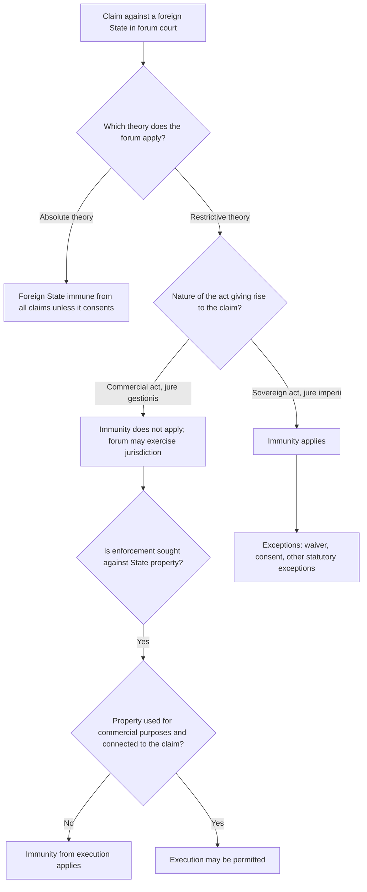

## Sovereign Immunity: The Absolute versus Restrictive Theory and the Commercial-Activity Exception

### The Conceptual Problem

**Sovereign immunity** (also called **state immunity** or **jurisdictional immunity**) is the rule of international law under which a state is, in certain circumstances, immune from the jurisdiction of the courts of another state. It is a **procedural** rule: it determines whether a foreign court may adjudicate a claim or enforce a judgment against a foreign state. It does not decide whether the foreign state acted lawfully.

The doctrine must be distinguished from **state responsibility**. Recall that state responsibility is the body of secondary rules (codified in the Articles on Responsibility of States for Internationally Wrongful Acts (ARSIWA), adopted by the International Law Commission (ILC) in 2001) under which a state incurs legal consequences for an internationally wrongful act. Immunity operates at the level of **forum access**, not at the level of substantive liability. A state may therefore have committed a wrongful act, and bear responsibility for it under international law, while remaining immune from suit in a particular national court. The International Court of Justice (ICJ) drew this line sharply in *Jurisdictional Immunities of the State (Germany v. Italy: Greece intervening)* (Judgment, 2012).

Two questions structure the entire subject:

1. **Does the forum state have jurisdiction to adjudicate** (immunity from jurisdiction, or immunity *ratione personae/materiae* in the sense of adjudicative immunity)?
2. **Can any judgment be executed against the foreign state's property** (immunity from execution, or from enforcement measures)?

These are governed by **separate rules**. A state that loses its immunity from jurisdiction does not thereby lose its immunity from execution. This point is fundamental to the practical value of any judgment.

**Key Points**

- Sovereign immunity is **procedural**, not substantive. It bars adjudication or enforcement, not liability.
- The dominant modern approach is the **restrictive theory**, under which immunity covers sovereign acts (*acta jure imperii*) but not commercial acts (*acta jure gestionis*).
- **Immunity from jurisdiction** and **immunity from execution** are separate; the latter is more strongly protected.
- The rule flows from the principle of **sovereign equality of states** (UN Charter Article 2(1)), summarised in the maxim *par in parem non habet imperium* ("an equal has no authority over an equal").

### The Legal Foundations

#### Sovereign Equality and *Par in Parem*

The rationale for state immunity is usually traced to two ideas:

- **Sovereign equality**: All states are equal in law. If courts of State A could sit in judgment on the acts of State B, State A would be asserting authority over an equal.
- **Comity and functional necessity**: Immunity protects the ability of states to perform public functions without being subject to foreign litigation, and it preserves peaceful international relations.

The ICJ in *Jurisdictional Immunities* (2012) treated state immunity as a rule of **customary international law** derived from the principle of sovereign equality, and emphasised its **procedural** character.

#### Sources of the Modern Law

| Source | Status |
| --- | --- |
| **Customary international law** | Primary source; consists of state practice (national legislation and judicial decisions) and *opinio juris* |
| **UN Convention on Jurisdictional Immunities of States and Their Property (2004)** | Adopted by General Assembly Resolution 59/38; **not yet in force** (it requires 30 ratifications). Widely regarded as reflecting, in substantial part, customary law; the ICJ in *Jurisdictional Immunities* (2012) treated some provisions as reflecting custom while noting that the Convention was not in force |
| **European Convention on State Immunity (Basel, 1972)** | In force among a small number of European states; includes an additional protocol establishing a European tribunal |
| **National legislation** | United States: Foreign Sovereign Immunities Act 1976 (FSIA); United Kingdom: State Immunity Act 1978; Canada: State Immunity Act 1985; Australia: Foreign States Immunities Act 1985; Singapore, Pakistan, South Africa and others have similar statutes |

Recall that **customary international law** requires two elements: consistent state practice, and *opinio juris* (the belief that the practice is followed out of a sense of legal obligation). The customary status of the restrictive theory rests on a convergence of national legislation and judicial decisions across many states, though some states have resisted it (see the section on divergent state positions).

### The Absolute Theory

#### Statement of the Doctrine

Under the **absolute theory** of immunity, a foreign state is immune from the jurisdiction of the forum state's courts in respect of **all** its activities, regardless of their nature. No distinction is drawn between public (sovereign) and private (commercial) acts. The only exceptions are those in which the state has consented to jurisdiction.

#### Historical Development

The absolute theory dominated from the nineteenth century through the first half of the twentieth. Its leading early authority is ***The Schooner Exchange v. McFaddon*** (US Supreme Court, 1812). Chief Justice Marshall held that a public armed vessel of a foreign sovereign in a friendly port was exempt from the jurisdiction of US courts, by reason of an implied licence based on the "perfect equality and absolute independence of sovereigns" and the common interest in mutual intercourse. The decision rested on **comity** and implied consent, not on a rule of international law in the strict sense, though it became the foundation of the doctrine.

English courts adopted a similarly broad approach. In ***The Parlement Belge*** (Court of Appeal, 1880), a mail packet owned by the King of the Belgians and carrying cargo as well as mail was held immune, though the vessel was engaged partly in trade. The decision extended immunity to a vessel used for commercial purposes, on the ground of the sovereign's ownership and public service.

#### Rationale and Limits

The rationale for absolute immunity was that any exercise of jurisdiction over a foreign state, even in commercial matters, is an affront to its dignity and independence. Its limits became clear when states began to engage extensively in commerce.

The **decline** of the absolute theory was driven by three developments:

1. The **expansion of state trading** after the First World War, and later the rise of state-owned enterprises and centrally planned economies.
2. The unfairness to private parties who dealt with state entities on commercial terms but had no forum in which to enforce their contracts.
3. The emergence of a **restrictive** alternative in the practice of several states.

### The Restrictive Theory

#### Statement of the Doctrine

Under the **restrictive theory**, immunity is confined to a state's **sovereign or governmental acts** (*acta jure imperii*), whereas it does not extend to **private or commercial acts** (*acta jure gestionis*). A state that enters the marketplace and acts as a private party may be sued in the courts of another state on the same footing as a private party.

Recall the two terms:

- ***Acta jure imperii***: acts done in the exercise of sovereign authority (for example, legislating, conducting foreign relations, military activity, expropriation, police operations, and issuing diplomatic instructions).
- ***Acta jure gestionis***: acts of a private-law or commercial character (for example, buying goods, borrowing money, chartering vessels, entering commercial contracts).

#### Historical Development

The restrictive approach emerged first in the continental jurisdictions.

| Jurisdiction | Development |
| --- | --- |
| **Italy and Belgium** | Late nineteenth-century courts began denying immunity for commercial acts of foreign states (for example, Italian Court of Cassation decisions in the 1880s) |
| **Switzerland, Austria, France, Germany** | Progressive adoption of the distinction during the first half of the twentieth century |
| **United States** | The **Tate Letter** (1952): the US State Department's Acting Legal Adviser, Jack B. Tate, announced that the Department would follow the restrictive theory in recommending immunity determinations to the courts. Codified in the **Foreign Sovereign Immunities Act 1976 (FSIA)** |
| **United Kingdom** | The English courts moved to the restrictive theory in the 1970s in ***The Philippine Admiral*** (Privy Council, 1976) and ***Trendtex Trading Corporation v. Central Bank of Nigeria*** (Court of Appeal, 1977); codified in the **State Immunity Act 1978** |
| **Canada, Australia, Singapore, South Africa, Pakistan, and others** | Enacted statutes modelled in various respects on the FSIA and the UK Act during the 1980s |

In ***Trendtex***, the English Court of Appeal held that a rule of customary international law had changed and that English courts, applying the doctrine of **incorporation** (customary international law forms part of the common law, subject to statute), should follow the change. Lord Denning's judgment treated international law as evolving through state practice and applied the new restrictive rule without waiting for legislation.

The Philippine Admiral case, decided in the Privy Council on appeal from Hong Kong, held that a state-owned trading vessel was not immune in an *in rem* action, distinguishing between a state's public and commercial vessels. The decision was a significant early indicator that the restrictive approach was accepted in the common law world.

#### Comparison of the Two Theories

| Feature | Absolute theory | Restrictive theory |
| --- | --- | --- |
| **Scope of immunity** | All acts of a foreign state | Only sovereign acts (*jure imperii*) |
| **Commercial activity** | Immune | Not immune |
| **Foundation** | Sovereign equality read as complete independence; comity | Sovereign equality limited by fairness to private parties dealing with the state |
| **Access for private parties** | Very limited; depends on waiver | Available for commercial and certain other disputes |
| **Typical exponents historically** | *The Schooner Exchange* (1812), *The Parlement Belge* (1880) | Tate Letter (1952), FSIA (1976), *Trendtex* (1977), UK State Immunity Act 1978 |
| **Current status** | Largely abandoned as a general rule, though it survives in the practice of a few states | The prevailing approach and the basis of the 2004 UN Convention |

### The Commercial-Activity Exception

#### The Basic Rule

The **commercial-activity exception** is the principal mechanism by which the restrictive theory is implemented. Where a claim arises from a **commercial transaction** or activity of a foreign state, the state cannot invoke immunity from jurisdiction.

#### The Central Difficulty: Nature versus Purpose

The critical question is how to classify an activity as commercial or sovereign. Two tests compete:

| Test | Question asked | Consequence |
| --- | --- | --- |
| **Nature test** | What is the intrinsic character of the act? Is it the kind of act a private person could perform? | Focuses on the act itself, ignoring the state's motive. A contract to buy boots for the army is commercial in nature, because private parties also buy boots |
| **Purpose test** | Why did the state act? Was the underlying aim sovereign or public? | Would classify the boot purchase as sovereign, because the boots serve a military function |

The **purpose test** risks swallowing the rule: nearly all state activity is ultimately directed at some public purpose, so the exception would rarely apply. Most jurisdictions therefore give priority to the **nature test**.

The leading example is the US FSIA. Section 1603(d) provides that the commercial character of an activity "shall be determined by reference to the nature of the course of conduct or particular transaction or act, rather than by reference to its purpose." The Supreme Court applied this in ***Republic of Argentina v. Weltover, Inc.*** (1992). Argentina had unilaterally rescheduled its Bonos (bonds) issued to raise foreign currency, and bondholders sued. The Court held that the issuance of bonds was a commercial activity because it was the type of action by which a private party engages in trade and traffic or commerce, notwithstanding that Argentina's purpose was to stabilise its currency. The Court stressed that the "commercial" label turns on whether the activity is one in which a private player could engage in the marketplace.

By contrast, in ***Saudi Arabia v. Nelson*** (US Supreme Court, 1993), a claim by a US citizen who alleged that he was wrongfully detained and tortured by Saudi police after reporting safety defects at a hospital owned by the Saudi government was held **not** to fall within the commercial-activity exception. The Court held that although the plaintiff's recruitment and employment at the hospital were commercial in nature, the claim was **based upon** the sovereign acts of arrest, imprisonment, and torture by the police, which were powers peculiar to sovereigns. The exception requires that the claim be "based upon" a commercial act, and the "gravamen" of the complaint must be commercial.

The UN Convention on Jurisdictional Immunities of States and Their Property (2004) takes a compromise approach in Article 2(2). In determining whether a contract or transaction is a "commercial transaction," reference should be made **primarily to the nature** of the contract or transaction, but its **purpose** should also be taken into account **if the parties to the transaction have so agreed, or if, in the practice of the State of the forum, that purpose is relevant** to determining the non-commercial character of the contract or transaction. The provision reflects a compromise between the nature-focused approach and states that consider purpose relevant.

#### Statutory Formulations

| Instrument | Provision | Key features |
| --- | --- | --- |
| **US FSIA, 28 U.S.C. § 1605(a)(2)** | Immunity is denied in cases where the action is based upon (i) a commercial activity carried on in the US by the foreign state; (ii) an act performed in the US in connection with a commercial activity of the foreign state elsewhere; or (iii) an act outside the US in connection with a commercial activity of the foreign state elsewhere, where that act causes a **direct effect in the United States** | Three-limb structure; the "direct effect" limb was applied in *Weltover*, where the bondholders' designated place of payment was New York |
| **UK State Immunity Act 1978, section 3** | A state is not immune as respects proceedings relating to (a) a commercial transaction entered into by the state; or (b) an obligation of the state which by virtue of a contract (whether a commercial transaction or not) falls to be performed wholly or partly in the UK. "Commercial transaction" is defined in section 3(3) to include any contract for the supply of goods or services, any loan or other transaction for the provision of finance, and any other transaction or activity (whether of a commercial, industrial, financial, professional or other similar character) into which a state enters or in which it engages otherwise than in the exercise of sovereign authority | The definition is broad, with a residual category and the phrase "otherwise than in the exercise of sovereign authority" |
| **UN Convention 2004, Article 10** | Where a state engages in a commercial transaction with a foreign natural or juridical person and, by virtue of the applicable rules of private international law, differences relating to the commercial transaction fall within the jurisdiction of a court of another state, the first state cannot invoke immunity from that jurisdiction in a proceeding arising out of that commercial transaction | Includes carve-outs: not applicable to commercial transactions between states, or where the parties have expressly agreed otherwise |
| **European Convention on State Immunity 1972, Article 4** | Immunity is denied in proceedings relating to obligations arising from a contract concluded by the state which is to be performed in the territory of the forum state | Uses a territorial-connection approach rather than an express commercial/sovereign classification |

#### The "Based Upon" Requirement and the Gravamen Test

Both the US and the UK approaches require a **connection between the claim and the commercial activity**. The claim must arise from, or be based upon, the commercial transaction. A commercial dimension elsewhere in the relationship is not enough if the act complained of is itself sovereign. *Nelson* is the leading US example of this requirement.

#### Contracts of Employment

Employment contracts raise a classification problem: is the hiring of an embassy employee a commercial act? Approaches vary.

- The **UN Convention (Article 11)** provides a specific rule for employment contracts: a state cannot invoke immunity in proceedings relating to a contract of employment between the state and an individual for work performed or to be performed in the forum state, subject to exceptions (including where the employee is a diplomatic agent, consular officer, or was recruited to perform particular functions in the exercise of governmental authority, or where the employee is a national of the employer state at the time of proceedings, unless a permanent resident of the forum state).
- The UK State Immunity Act 1978, section 4, contains a specific employment provision with similar exceptions. In ***Benkharbouche v. Embassy of the Republic of Sudan*** (UK Supreme Court, 2017), the Court held that sections 4(2)(b) and 16(1)(a) of the Act, as applied to claims by embassy staff for violations of EU and human rights law, were incompatible with Article 6 of the European Convention on Human Rights and Article 47 of the EU Charter of Fundamental Rights, and disapplied them. The decision illustrates the tension between immunity and the right of access to a court.
- In the US, courts applying FSIA frequently classify the employment of embassy staff by reference to whether the employee performed **civil-service or sovereign functions** (for example, political or protocol duties), or purely administrative or domestic tasks.

#### Central Banks and State-Owned Enterprises

**Central banks** often occupy an ambiguous position. Many national statutes grant special protection to the property of central banks held for their own account (for example, UK State Immunity Act 1978, section 14(4); FSIA § 1611(b)(1); UN Convention Article 21(1)(c)). In *Trendtex*, the Court of Appeal considered whether the Central Bank of Nigeria was a department of the Nigerian state and whether the letter of credit transaction was commercial. It held that the transaction was commercial, and that the bank was not immune.

**State-owned enterprises (SOEs)** raise the question of **separate legal personality**. In the US, FSIA § 1603(b) defines an **"agency or instrumentality of a foreign state"** as an entity that is a separate legal person, is an organ of the state or majority-owned by it, and is neither a citizen of a US state nor created under third-country law. Such entities enjoy immunity unless an exception applies, but the exception for commercial activity is the one most commonly invoked against them. In ***First National City Bank v. Banco Para El Comercio Exterior de Cuba (Bancec)*** (US Supreme Court, 1983), the Court held that instrumentalities created as juridical entities distinct and independent from their sovereign should normally be treated as such, but that the presumption of separateness may be overcome where the entity is so extensively controlled that a relationship of principal and agent is created, or where recognising separateness would work fraud or injustice. This is the international immunity analogue of piercing the corporate veil.

Under the UK Act, section 14 distinguishes the **"State"** (including the government and its departments) from **"separate entities"**, which enjoy immunity only if the proceedings relate to something done in the exercise of sovereign authority and the state would have been immune (section 14(2)). Commercial dealings by separate entities are therefore outside immunity.

### Other Exceptions to Immunity from Jurisdiction

The commercial-activity exception is the most important of a family of exceptions that together define the scope of restrictive immunity. Understanding the others clarifies the boundaries of the commercial exception.

| Exception | Content | Provision examples |
| --- | --- | --- |
| **Consent and waiver** | The state may consent, expressly (by treaty, contract, or written declaration) or by conduct (for example, by instituting proceedings or intervening in them, or by taking a step in proceedings relating to the merits) | UN Convention Articles 7 and 8; UK Act section 2; FSIA § 1605(a)(1) |
| **Commercial transactions** | See above | UN Convention Article 10; UK Act section 3; FSIA § 1605(a)(2) |
| **Contracts of employment** | Work performed in the forum state, subject to exceptions | UN Convention Article 11; UK Act section 4 |
| **Personal injury and damage to property** | Death or injury to persons or damage to or loss of tangible property caused by an act or omission attributable to the state, occurring in the forum state | UN Convention Article 12; UK Act section 5; FSIA § 1605(a)(5) (the "non-commercial tort exception") |
| **Ownership, possession, and use of property** | Rights in immovable property situated in the forum state; movable property by succession, gift, or *bona vacantia* | UN Convention Article 13; UK Act section 6 |
| **Intellectual and industrial property** | Determination of rights of the state in such property in the forum state | UN Convention Article 14 |
| **Participation in companies** | Proceedings relating to the state's participation in a company with participants other than states, incorporated or controlled from the forum state | UN Convention Article 15 |
| **Arbitration agreements** | Where the state has agreed in writing to submit a commercial transaction dispute to arbitration, it may not invoke immunity in proceedings relating to the validity, interpretation, or application of the arbitration agreement, the arbitration procedure, or the confirmation or setting aside of the award | UN Convention Article 17; UK Act section 9; FSIA § 1605(a)(6) |
| **State-sponsored terrorism** (US) | The FSIA terrorism exception, § 1605A (and earlier § 1605(a)(7)), denies immunity to states designated as state sponsors of terrorism in cases involving torture, extrajudicial killing, aircraft sabotage, and hostage-taking | US-specific; no equivalent in the UN Convention |

#### The Territorial Tort Exception and Its Limits

The **territorial tort exception** (personal injury or property damage in the forum) is distinct from the commercial exception, but its boundary is contested with respect to **armed forces**. In *Jurisdictional Immunities* (2012), the ICJ held that Germany was entitled to immunity in Italian proceedings arising from acts of German armed forces on Italian territory during the Second World War, because those acts were *acta jure imperii*. The Court stated that customary law at the time did not deny immunity to a state for **acts of its armed forces in the course of an armed conflict**, even where the tort was committed on the territory of the forum state. The Court held that the territorial tort exception, as it exists in customary law, does not cover such acts, and emphasised that the *nature* of the act, and not its lawfulness, governs the immunity question.

### Immunity and Serious Violations of International Law

#### The Core Question

Can a state be denied immunity because the conduct alleged is a serious violation of international law, such as torture, war crimes, or crimes against humanity, especially where the violated norm is a **peremptory norm (jus cogens)**? Recall that *jus cogens* norms are norms accepted and recognised by the international community of states as a whole as norms from which no derogation is permitted (Vienna Convention on the Law of Treaties, Article 53).

#### The Two Positions

- **The "hierarchy" argument (immunity must yield to jus cogens):** Proponents argue that a *jus cogens* norm, as a higher-ranking norm, prevails over the rule on state immunity, which is an ordinary rule. It would be illogical, they contend, for a state to hide behind procedural immunity to escape the consequences of violating a peremptory norm, and denying access to a forum leaves victims without a remedy. This position was adopted in part by the Greek Areios Pagos in the *Distomo* case (2000) and by the Italian Court of Cassation in *Ferrini v. Federal Republic of Germany* (2004), which denied Germany immunity in respect of forced labour during the Second World War.
- **The "procedural-substantive" position (no conflict):** Opponents argue that immunity is a **procedural** rule that determines the forum, while *jus cogens* rules are **substantive** rules that determine liability. Because they operate at different levels, no true conflict arises: the state remains responsible for the breach and must make reparation, but a particular national court may lack jurisdiction. Denying immunity on the basis of the gravity of the alleged conduct would also require the forum court to prejudge the merits in order to determine its own jurisdiction, and would risk widespread unilateral adjudication of states' conduct. This position was adopted by the ICJ in *Jurisdictional Immunities* (2012) and earlier by the European Court of Human Rights (ECtHR) in ***Al-Adsani v. United Kingdom*** (Grand Chamber, 2001), which held (by nine votes to eight) that the UK's grant of immunity to Kuwait in a civil claim for torture did not violate the right of access to a court under Article 6 of the European Convention on Human Rights.

#### The ICJ's Ruling in *Jurisdictional Immunities of the State* (2012)

The ICJ, by 12 votes to 3, held that Italy had violated Germany's immunity by (a) allowing civil claims in Italian courts based on violations of international humanitarian law committed by the German Reich between 1943 and 1945, (b) taking measures of constraint against Villa Vigoni, a German state-owned property in Italy used for cultural exchanges, and (c) declaring enforceable in Italy Greek judgments (the *Distomo* judgments) against Germany.

Key reasoning:

1. **The nature of immunity.** Immunity is a procedural rule that regulates the exercise of jurisdiction and does not concern the substantive lawfulness of the conduct.
2. **No conflict with *jus cogens*.** The Court found no conflict between the rules of *jus cogens* (prohibiting, among other things, the killing of civilians and deportation to slave labour) and the customary rule of state immunity, because the two sets of rules address different matters.
3. **Armed forces and the territorial tort exception.** Acts of armed forces during armed conflict are *acta jure imperii* and are not subject to the territorial tort exception.
4. **No last-resort exception.** The Court rejected Italy's argument that immunity should be denied because other means of redress had been exhausted or were unavailable, holding that customary international law does not make the entitlement of a state to immunity dependent on the existence of effective alternative means of securing redress.
5. **Immunity from enforcement.** The measures against Villa Vigoni breached Germany's immunity from enforcement, because the property was being used for government non-commercial purposes and Germany had not consented.

The judgment was reinforced by the Italian Constitutional Court's Judgment 238/2014, which held that Italian law adapting the ICJ ruling was unconstitutional insofar as it required Italian courts to deny jurisdiction over claims for crimes against humanity, on the ground that it violated fundamental constitutional principles of judicial protection. The Italian Court's ruling created a direct tension with the ICJ's judgment. [Inference] The episode illustrates how the domestic constitutional protection of access to justice may resist the implementation of international decisions on immunity.

#### Strongest Form of Each Side

- **For exceptions based on gravity of the violation:** Immunity exists to protect the sovereign functions of the state, and it is incompatible with the object of a legal system to treat the commission of the gravest international crimes as protected sovereign conduct. Otherwise, the victims of torture and mass atrocity have neither a domestic remedy nor a foreign one, which negates the international community's professed commitment to the rights involved. State practice, including the US FSIA's terrorism exception, shows that immunity can be limited on the basis of the character of the alleged conduct.
- **Against such exceptions:** Extending forum jurisdiction over foreign states on the basis of the alleged gravity of the acts would erode sovereign equality, require national courts to assess the merits before the threshold question of jurisdiction, generate inconsistent decisions across forums, and invite politically driven litigation. Individual victims are not necessarily without recourse, because state responsibility and reparation remain available at the inter-state level, and negotiated lump-sum settlements are a long-standing method of resolving mass claims. The fact that only a small number of states have adopted the terrorism exception suggests the absence of a settled customary rule.

The ICJ's position is the currently prevailing statement of the law, though the debate continues in scholarship and in domestic courts.

### Immunity from Execution and Enforcement Measures

#### The Two-Stage Structure

Recall that immunity from jurisdiction and immunity from execution are separate. A claimant who wins a judgment against a foreign state must still locate assets that are not immune from enforcement measures, such as attachment, arrest, and execution. States accord **stronger** protection against enforcement than against adjudication, because coercive measures against property intrude more directly on sovereignty.

#### The General Framework

| Type of measure | When permitted (general pattern) |
| --- | --- |
| **Pre-judgment measures of constraint** (such as attachment or injunction to secure a claim) | Generally only with the state's **express consent**, or where the state has allocated or earmarked the property to satisfy the claim (UN Convention Article 18) |
| **Post-judgment measures of constraint** | Permitted where: (a) the state has expressly consented; (b) the state has allocated or earmarked the property for satisfaction of the claim; or (c) the property is **specifically in use or intended for use by the state for other than government non-commercial purposes** and is in the territory of the forum state, **and has a connection with the entity against which the proceedings were directed** (UN Convention Article 19) |

The "commercial-use" criterion for enforcement reflects the same restrictive logic as for jurisdiction, but it is more demanding.

#### Categories of Property Protected

Article 21 of the UN Convention lists categories of state property that are **not** to be considered as property specifically in use or intended for use for other than government non-commercial purposes, and are therefore immune from post-judgment measures:

- Property used or intended for use in the performance of the functions of the **diplomatic mission** or **consular posts**, special missions, missions to international organisations;
- Property of a **military character** or used or intended for use in the performance of military functions;
- Property of the **central bank or other monetary authority** of the state;
- Property forming part of the **cultural heritage** of the state or part of its archives and not placed or intended to be placed on sale;
- Property forming part of an exhibition of objects of scientific, cultural, or historical interest and not placed or intended to be placed on sale.

The categories are protected because their function or character is inherently governmental or because of the special role of the central bank in state finance.

#### Diplomatic Bank Accounts: *Alcom* and *Philippine Embassy Bank Account* Cases

Bank accounts of diplomatic missions raise a classic difficulty. In ***Alcom Ltd v. Republic of Colombia*** (House of Lords, 1984), the House of Lords held that a general bank account of an embassy, used to meet the day-to-day expenses of the mission, was not property "in use or intended for use for commercial purposes" within section 13(4) of the UK State Immunity Act 1978, and that a certificate from the head of mission was sufficient evidence of the purpose absent evidence to the contrary. The account was therefore immune from execution. The court considered that bank accounts used to pay for embassy running costs serve the sovereign function of maintaining the mission, even though banking is a commercial activity in nature.

In the ***Philippine Embassy Bank Account Case*** (German Federal Constitutional Court, 1977), the court held that funds in a bank account of an embassy, used to meet the embassy's expenses, were immune from execution, relying on the functional necessity of the diplomatic mission. This decision is frequently cited as an important authority on immunity from execution and is part of the general practice supporting the immunity of embassy accounts.

#### Property of Central Banks and Investment Assets

Central bank reserves have proven a target for creditors in sovereign debt disputes. In ***NML Capital Ltd v. Republic of Argentina*** (US litigation, 2000s and 2010s), holdout bondholders pursued Argentine assets globally, including a case in which a claimant sought to attach the Argentine naval vessel *ARA Libertad* in Ghana (ITLOS ordered Ghana to release the vessel in the provisional measures order in *"ARA Libertad" Case (Argentina v. Ghana)* (2012), on the ground that a warship enjoys immunity under UNCLOS and customary law). In ***Republic of Argentina v. NML Capital, Ltd.*** (US Supreme Court, 2014), the Court held that the FSIA did not immunise Argentina from post-judgment discovery of its worldwide assets, while leaving open the substantive limits on attachment.

#### Execution and the Commercial-Use Requirement

**Example: Enforcement analysis**

A commercial creditor holds a judgment in State F (the forum) against State D for breach of a loan agreement. The creditor identifies three assets of State D in State F:

1. **A bank account** used exclusively to pay salaries and supplies of State D's embassy.
2. **A commercial office building** leased to private tenants, with rental income flowing to State D's treasury.
3. **A stockpile of gold held by the central bank in a private vault** in State F.

Analysis under a typical restrictive regime such as UN Convention Article 19 and UK Act section 13:

- **Embassy account:** Protected. It is used in the performance of diplomatic mission functions (Article 21(1)(a)), and *Alcom* supports its immunity.
- **Commercial office building:** Likely available for execution. It is used for commercial purposes and is located in the forum state. If the claim arose from an unrelated transaction of State D, the requirement of a connection with the entity against which proceedings were directed (Article 19(c)) is satisfied because State D itself is the debtor.
- **Central bank gold:** Protected as property of the central bank or monetary authority (Article 21(1)(c)), unless State D has expressly waived immunity in respect of such assets or the property is held for commercial purposes.

Given the high threshold for enforcement, the creditor's realistic route is against the commercial building and any express-waiver assets.

### Waiver and Consent

#### Express and Implied Waiver

A state may waive its immunity, and this is the **most common route** to a judicial forum in commercial dealings. Sovereign borrowers and contracting states frequently include in loan agreements, concession contracts, and bond documentation a **submission to jurisdiction** clause and an express waiver of immunity from suit and, less often, from execution.

Waivers are interpreted strictly:

- **Waiver of jurisdictional immunity does not imply waiver of immunity from execution.** UN Convention Article 20 provides that where the consent to the measures of constraint is required, consent to the exercise of jurisdiction shall not imply consent to the taking of measures of constraint, for which separate consent is necessary.
- **Arbitration agreements.** An agreement to arbitrate, made by a state, is treated as consent to the court's supervisory jurisdiction over that arbitration (UK Act section 9; UN Convention Article 17; FSIA § 1605(a)(6)) but **does not automatically waive immunity from enforcement of the resulting award** against state assets. Enforcement of arbitral awards against sovereign assets, for instance under the **Convention on the Recognition and Enforcement of Foreign Arbitral Awards (New York Convention, 1958)** and the **ICSID Convention (1965)**, is subject to the enforcement-immunity rules. ICSID Convention Article 54 obliges contracting states to recognise awards as binding and to enforce the pecuniary obligations as if they were final judgments of a domestic court, but Article 55 preserves immunity from execution under the law of the enforcing state.

#### Waiver by Conduct

A state that initiates proceedings, intervenes, or takes any step relating to the merits will be taken to have waived immunity with respect to counterclaims arising from the same legal relationship (UN Convention Article 9; UK Act section 2(3) to (6)). However, appearing solely to assert immunity or to assert an interest in property does not amount to a waiver (UN Convention Article 8(2)).

### Related Categories of Immunity Distinguished

Sovereign (state) immunity should be distinguished from related doctrines that are sometimes confused with it.

| Doctrine | What it protects | Relationship |
| --- | --- | --- |
| **State immunity (immunity *ratione personae* of the state)** | The state as an entity from the jurisdiction of foreign courts (civil, and in some contexts administrative) | The subject of this item |
| **Head-of-state and diplomatic immunity** | Individual officials, based on status (*ratione personae*) or on official acts (*ratione materiae*) | Governed by separate rules; see *Arrest Warrant (DRC v. Belgium)* (2002) and the Vienna Convention on Diplomatic Relations (1961) |
| **Act of state doctrine** | A domestic-law doctrine under which courts decline to review the validity of acts of a foreign government performed within its own territory | Distinct from immunity; it is a rule of judicial restraint, not a jurisdictional bar, though the two often arise together (see *Banco Nacional de Cuba v. Sabbatino*, US Supreme Court, 1964) |
| **Immunity of international organisations** | Organisations, based on their constituent instruments and headquarters agreements | Functional immunity, distinct from state immunity |
| **Immunity of state officials for official acts** | Officials acting in an official capacity | Derivative of the state's own immunity (*ratione materiae*); the ILC has been examining the topic of immunity of state officials from foreign criminal jurisdiction |

**Note on criminal proceedings:** Recall that state immunity in the sense discussed in this item concerns **civil** proceedings against states. The 2004 UN Convention expressly does not apply to criminal proceedings (Article 3 and the preamble language). The immunity of individual state officials from foreign **criminal** jurisdiction is governed by a separate body of law, elaborated in cases such as *Arrest Warrant* (2002) and *R v. Bow Street Metropolitan Stipendiary Magistrate, ex parte Pinochet Ugarte (No. 3)* (House of Lords, 1999), where the House of Lords held that a former head of state does not enjoy immunity *ratione materiae* for acts of torture, because torture as an international crime cannot be an official function of a head of state, in light of the Convention Against Torture.

### Divergent State Positions and the Status of the Restrictive Theory

Although the restrictive theory is now the dominant approach, its universality is contested.

- **States with restrictive legislation:** The US, UK, Canada, Australia, Singapore, South Africa, Pakistan, Argentina, Japan (by statute in 2009), and most Western European states.
- **States that historically favoured absolute immunity:** The Soviet Union and other socialist states, which argued that state trading was itself a sovereign function. After the end of the Cold War, Russia and Eastern European states largely moved toward restrictive positions.
- **China:** The People's Republic of China has traditionally maintained an **absolute** approach to state immunity in its practice. The Hong Kong Court of Final Appeal, in ***Democratic Republic of the Congo v. FG Hemisphere Associates LLC*** (2011), held that, as a matter of the Basic Law and the constitutional division of responsibility for foreign affairs, Hong Kong courts must follow the **absolute** immunity position adopted by the Central People's Government of the PRC, and thus the Chinese state-practice rule of absolute immunity applied to enforcement against Congolese assets. The case shows that the choice between theories has significant practical consequences in litigation involving PRC-linked jurisdictions. [Inference] China's approach has been described as increasingly complex following its signature of the 2004 UN Convention (signed in 2005), though it has not ratified it, and the position remains subject to continuing interpretation.
- **Convention status.** The 2004 UN Convention has gathered ratifications slowly and has not entered into force. This ambiguity affects the argument that the restrictive theory has fully crystallised as universal custom. The ICJ, in *Jurisdictional Immunities*, treated the restrictive distinction between sovereign and commercial acts as settled in customary international law for the purposes of the case, and both Italy and Germany accepted the general framework.

**Key Points**

- The **restrictive theory** is the prevailing law, endorsed by the ICJ's treatment of state practice in *Jurisdictional Immunities* (2012).
- Some states, notably the PRC, retain an **absolute** approach in practice, and the choice affects litigation in jurisdictions that follow them.
- The **2004 UN Convention** is the most comprehensive codification, but it is **not yet in force**.

### Application to Philippine Interests

Several aspects of the doctrine connect directly to Philippine law and practice.

- **The Philippines follows the restrictive theory.** The 1987 Philippine Constitution, Article II, Section 2, adopts the generally accepted principles of international law as part of the law of the land (the doctrine of **incorporation**). Philippine jurisprudence has applied the restrictive theory in a line of Supreme Court decisions.
- ***United States of America v. Guinto*** (G.R. No. 76607, 26 February 1990): The Supreme Court considered claims by Filipino workers against US military personnel at Clark Air Base. It applied the distinction between **sovereign** and **commercial** acts, holding that the operation of a base restaurant and facilities was a commercial activity in some instances, and that each contract had to be examined to determine whether it was *jure imperii* or *jure gestionis*. The decision recognised the doctrine of state immunity, including immunity from suit of a foreign state or its officers where the suit is in effect against the state, but stated that immunity does not apply to commercial activities.
- ***Holy See v. Rosario, Jr.*** (G.R. No. 101949, 1 December 1994): The Supreme Court held that the Holy See enjoyed sovereign immunity in a dispute over the sale of land in Metro Manila, because the transfer of the lot was for the purpose of building a residence for the Papal Nuncio and was therefore *jure imperii* rather than a commercial transaction of the Holy See. The decision is a significant Philippine authority applying a **purpose-influenced** analysis, in contrast to the nature-based approach of the US FSIA, and illustrates how classification can turn on the framework applied. [Inference] The Philippine approach in this line of cases appears to weigh the purpose of the transaction more heavily than the strict nature test used in the FSIA and UN Convention Article 2(2), though later decisions have tended to examine the character of the transaction as well.
- ***Republic of Indonesia v. Vinzon*** (G.R. No. 154705, 26 June 2003): The Supreme Court held that Indonesia was immune from a suit by a contractor over an embassy maintenance contract, because the contract was for the maintenance of the embassy and related to the sovereign function of maintaining the diplomatic mission, applying a functional approach to classification.
- ***Minucher v. Court of Appeals*** (G.R. No. 142396, 11 February 2003): This decision extended immunity to a US Drug Enforcement Administration agent acting in the performance of official duties, applying the principle that immunity extends to agents of the foreign state in respect of official acts.
- **Philippine state-owned enterprises abroad.** Philippine government entities and their assets in foreign jurisdictions, such as government-owned or controlled corporations dealing commercially, may face the commercial-activity exception in foreign courts. Enforcement against such entities depends on the forum's rules on separate entities and immunity from execution.
- **Immunity issues in maritime disputes.** State-owned vessels, coast guard and naval ships enjoy immunity under UNCLOS Articles 32, 95 and 96 (warships and government ships operated for non-commercial purposes), which is relevant to enforcement of any arbitral or judicial awards in disputes such as the **South China Sea Arbitration (Philippines v. China)** (PCA Case No. 2013-19, Award of 12 July 2016). Recall that this Award was issued by an Annex VII tribunal under UNCLOS and found that China had violated Philippine sovereign rights in the exclusive economic zone. Because state immunity from execution protects government non-commercial property, and because no compulsory enforcement mechanism exists for inter-state awards, the Award's enforcement relies on non-judicial means, and domestic courts are not an available avenue for enforcing it against Chinese state property.

### Worked Example

**Example: Classification and enforcement**

State S, through its Ministry of Health, contracts with Pharma Co., a company incorporated in State F, for the supply of vaccines. The contract is governed by the law of State F and contains a clause designating the courts of State F as the forum for disputes. State S fails to pay, and Pharma Co. sues in the courts of State F. Separately, an employee of State S's embassy in State F sues in State F's courts for unfair dismissal.

**Analysis of the supply contract claim**

1. **Immunity from jurisdiction.** Under the restrictive theory, the purchase of vaccines is a contract for the supply of goods. Applying the **nature test**, a private party could equally buy vaccines, so the act is *jure gestionis*. Even if the **purpose** (public health) is sovereign, the nature test governs under the FSIA (§ 1603(d)), UK Act section 3, and UN Convention Article 2(2) (nature primarily). The commercial-activity exception applies, and State S is not immune. In addition, the choice-of-forum clause may constitute express consent to jurisdiction (UN Convention Article 7).
2. **Under a purpose-influenced approach.** A forum that gave weight to purpose might reach a different result. The contrast shows why the nature/purpose debate matters.
3. **Immunity from execution.** Winning the judgment does not entitle Pharma Co. to seize State S's assets. It may enforce only against property used for commercial purposes, located in State F, with a connection to State S (UN Convention Article 19(c)). The embassy's accounts and premises are protected (Article 21(1)(a)).

**Analysis of the embassy employee's claim**

4. **Employment exception.** Under the UN Convention Article 11 and the UK Act section 4, immunity is generally denied for employment contracts performed in the forum state, but the exceptions apply if the employee performs functions in the exercise of governmental authority, or is a national of State S. The court must classify the employee's functions. A cleaner or driver would ordinarily not perform governmental functions, so immunity would be denied, but a political officer would be treated differently.
5. **Human rights overlay.** Following *Benkharbouche* (UK Supreme Court, 2017), a blanket application of immunity to employment claims by administrative staff may violate the right of access to a court under Article 6 of the European Convention on Human Rights.

### Comparative Table of Major Instruments

| Feature | US FSIA (1976) | UK State Immunity Act (1978) | UN Convention (2004) |
| --- | --- | --- | --- |
| **General rule** | Immunity, subject to statutory exceptions (28 U.S.C. § 1604) | Immunity, subject to exceptions (section 1) | Immunity, subject to exceptions (Article 5) |
| **Commercial exception** | § 1605(a)(2): commercial activity, three limbs | Section 3: commercial transactions and contractual obligations performed in the UK | Article 10: commercial transactions |
| **Test for commercial character** | Nature, not purpose (§ 1603(d)) | "Otherwise than in the exercise of sovereign authority" (section 3(3)(c)) | Primarily nature; purpose relevant if agreed or if forum practice so provides (Article 2(2)) |
| **Employment** | Not a separate exception; handled under commercial activity | Section 4 | Article 11 |
| **Personal injury and property** | § 1605(a)(5) (non-commercial tort exception, with discretionary function limitation) | Section 5 | Article 12 |
| **Arbitration** | § 1605(a)(6) | Section 9 | Article 17 |
| **Terrorism** | § 1605A | None | None |
| **Execution** | §§ 1609 to 1611; property used for commercial activity in the US | Section 13; property in use or intended for use for commercial purposes | Articles 18 to 21 |
| **Separate entities** | Agency or instrumentality (§ 1603(b)) | Separate entities immune only for sovereign acts (section 14) | Article 2(1)(b)(iii): state entities are covered only where they are entitled to perform and actually perform acts in the exercise of sovereign authority |

### Areas of Continuing Debate

1. **The nature versus purpose dichotomy.** The nature test is administrable but can yield results that seem to ignore the public interests at stake, and the purpose test is more sensitive but risks erosion of the exception. The UN Convention's compromise leaves room for forum-by-forum variation.
2. **Gravity-based exceptions.** Whether a customary exception exists for *jus cogens* violations. The ICJ said no in 2012, but domestic courts in Italy and Greece, and national legislation such as the US terrorism exception and Canada's Justice for Victims of Terrorism Act, reflect countervailing state practice. [Inference] The ICJ's 2012 judgment did not address a possible exception for claims based on **acts committed by a state's armed forces or agents** outside armed conflict on the territory of the forum state, for example targeted killing, where the practice is unsettled.
3. **Immunity from execution and sovereign debt.** Sovereign-debt litigation and the pursuit of assets, including central bank property and state investments, has revealed the difficulty of reconciling creditor rights with sovereign financial protection.
4. **Immunity and access to justice.** The ECtHR line (*Al-Adsani* (2001), *Fogarty v. United Kingdom* (2001), *Cudak v. Lithuania* (2010), *Sabeh El Leil v. France* (2011), *Naku v. Lithuania and Sweden* (2016)) has tested the proportionality of immunity against the right of access to a court, particularly in employment cases. The court recognises immunity as a legitimate aim, but requires that its application be proportionate, and has narrowed immunity in employment cases where the functions were not sovereign.
5. **The status of the 2004 UN Convention.** Whether its provisions, not yet in force, may be treated as evidence of custom in individual cases.
6. **State-owned enterprises and sovereign wealth funds.** Whether investment activity of sovereign wealth funds is commercial in nature, and how far separate legal personality shields the state.
7. **Cyber operations and digital assets.** Whether state immunity applies to cyber-related conduct and to state-held digital assets. [Speculation] These questions are likely to arise increasingly as state activity in cyberspace expands, and no settled body of practice yet exists.

### Common Misconceptions

- **"Sovereign immunity means a state cannot be held responsible."** Incorrect. Immunity is procedural and bars a particular forum's adjudication or enforcement, not the underlying responsibility. Responsibility can be pursued through other means, such as inter-state negotiation, international adjudication, or the state's own courts.
- **"Any act by a state is immune."** Incorrect under the restrictive theory. Commercial acts are not immune.
- **"Losing immunity from suit means the state's property can be seized."** Incorrect. Immunity from execution is separate and more robust.
- **"Immunity depends on why the state acted."** Generally incorrect. Under the prevailing nature test, the motive of the act is not decisive, though the UN Convention allows purpose to play a role in limited circumstances.
- **"The UN Convention is binding law."** It is not yet in force, although many provisions are treated as reflecting custom.
- **"State immunity and diplomatic immunity are the same."** Incorrect. They are separate regimes with different rules and rationales.
- **"A waiver of immunity from suit covers execution."** Incorrect. A separate waiver is needed for enforcement measures.

### Conclusion

State immunity translates the principle of sovereign equality into a procedural shield against the jurisdiction of foreign courts. The historical movement from the absolute theory (immunity for all state acts) to the restrictive theory (immunity for sovereign acts only) reflects the growth of state participation in commerce and the need to give private parties a forum. The commercial-activity exception is the central device of the restrictive theory, operationalised through the nature test, the "based upon" requirement, and separate rules for state entities and employment. Immunity from execution remains far more protective than immunity from jurisdiction, and it is the practical bottleneck for claimants. The ICJ's *Jurisdictional Immunities* (2012) judgment has confirmed that the procedural rule of immunity does not yield to the gravity of the alleged violation, a position that remains contested by domestic courts and scholars concerned with access to justice. Because immunity governs where a claim may be heard rather than whether a state is liable, it complements, and does not displace, the law of state responsibility.

**Related Topics**

- Immunity from execution and enforcement of arbitral awards against sovereign assets (ICSID Convention Articles 53 to 55; New York Convention)
- The 2004 UN Convention on Jurisdictional Immunities of States and Their Property: structure, ratification, and customary status
- Head-of-state, diplomatic, and consular immunities (*ratione personae* and *ratione materiae*)
- Immunity of state officials from foreign criminal jurisdiction and the ILC's work on the topic
- The act of state doctrine and its relationship to state immunity
- The FSIA terrorism exception and other legislative departures from the restrictive theory
- Immunity of international organisations and functional immunity
- Sovereign debt litigation, holdout creditors, and central bank immunity
- Immunity and the right of access to a court under the European Convention on Human Rights
- Warships and government vessels immunity under UNCLOS Articles 32, 95, and 96