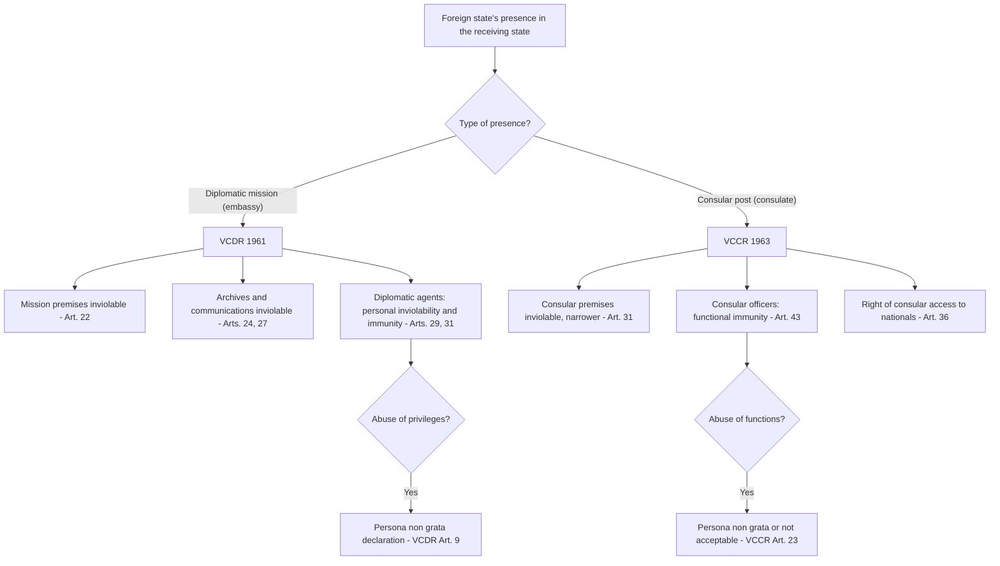

## Diplomatic and Consular Immunity under the Vienna Conventions of 1961 and 1963

### The Conceptual Problem

Diplomacy requires states to station representatives on one another's territory, often in circumstances of tension or hostility. Those representatives must be able to communicate freely with their governments, negotiate, and gather information without fear of coercion, arrest, or harassment by the host state. International law meets this need through a body of rules on **privileges and immunities** for diplomatic missions and consular posts.

Recall that **sovereign (state) immunity** is the rule under which a state is immune from the jurisdiction of another state's courts, a procedural rule flowing from sovereign equality. Diplomatic and consular immunities are a **separate and more specialised regime**. They protect **missions, premises, communications, and individual agents**, and they are governed principally by two codifying treaties:

- The **Vienna Convention on Diplomatic Relations (VCDR)**, adopted 18 April 1961, entered into force 24 April 1964, with near-universal participation (over 190 states parties).
- The **Vienna Convention on Consular Relations (VCCR)**, adopted 24 April 1963, entered into force 19 March 1967, also with very wide participation.

Both conventions were drafted by the International Law Commission (ILC) and adopted at diplomatic conferences in Vienna. The International Court of Justice (ICJ) has treated large parts of both as reflecting **customary international law**, so they bind even non-parties to that extent.

**Key Points**

- Diplomatic and consular immunities are **functional and reciprocal** in design, though the diplomatic regime is broader and more absolute than the consular regime.
- The regime protects the **institution** (mission, premises, archives, communications) and the **individual** (agents and, in part, their families and staff).
- The immunities belong to the **sending state**, not to the individual, which is why the sending state may waive them (VCDR Article 32).
- Immunity from jurisdiction is **not** impunity: the sending state remains responsible, the host state has remedies, and the individual may be prosecuted at home.

### Historical and Theoretical Foundations

#### Origins

Diplomatic inviolability is among the oldest rules of international law, traceable to ancient practice, and was systematised in the seventeenth and eighteenth centuries by writers such as Grotius. The modern law was largely customary until codified in 1961.

#### Theories of Justification

Three theories have historically been offered to justify diplomatic immunity.

| Theory | Content | Status |
| --- | --- | --- |
| **Extraterritoriality** | The mission is a fictional extension of the sending state's territory, and the diplomat is treated as never having left home | Rejected as a legal explanation by the ILC and by most modern authorities. It is misleading: the mission premises are part of the receiving state's territory, and the receiving state's law applies unless displaced by the Conventions |
| **Representative character** | The mission and its head personify the sending state, so an affront to the diplomat is an affront to the state | Recognised in the VCDR preamble as part of the rationale |
| **Functional necessity** | Privileges and immunities are needed so that the mission can perform its functions efficiently and without interference | The dominant theory, expressly endorsed in the preamble to the VCDR: the purpose of privileges and immunities "is not to benefit individuals but to ensure the efficient performance of the functions of diplomatic missions as representing States" |

The Conventions blend the functional and representative theories. The preamble to the VCDR states this combined rationale directly, and the same reasoning informs the VCCR, though the consular regime places greater emphasis on function.

### Structure of the Two Conventions

| Feature | VCDR (1961) | VCCR (1963) |
| --- | --- | --- |
| **Subject** | Permanent diplomatic missions (embassies) between states | Consular posts (consulates) performing administrative, commercial, and protective functions |
| **Nature of relations** | Political and representative; the mission represents the sending state in its entirety | Functional and administrative; consuls do not represent the state in a political sense |
| **Personal immunity** | Broad; diplomatic agents enjoy full immunity from criminal jurisdiction (Art. 31) | Narrower; consular officers enjoy immunity only for acts performed in the exercise of consular functions (Art. 43) |
| **Personal inviolability** | Absolute; no arrest or detention (Art. 29) | Qualified; may be arrested for a grave crime pursuant to a decision by the competent judicial authority (Art. 41) |
| **Premises** | Inviolable, with a strong duty of protection (Art. 22) | Inviolable but with narrower protection, including an assumption of consent in case of fire or disaster (Art. 31) |
| **Archives and documents** | Inviolable at any time and wherever located (Art. 24) | Inviolable at all times and wherever located (Art. 33) |
| **Communications** | Free communication; diplomatic bag inviolable (Art. 27) | Free communication; consular bag inviolable, but a request to open it is possible (Art. 35) |

The two Conventions are complementary, and a state may combine diplomatic and consular functions in a single mission (VCCR Article 70). The persons who carry out both functions then enjoy the more extensive diplomatic privileges.

### Part I: Diplomatic Immunity under the VCDR (1961)

#### Establishment of Missions and Their Functions

Article 2 provides that the establishment of diplomatic relations and of permanent diplomatic missions takes place by **mutual consent**. Article 3 lists the functions of a diplomatic mission:

- **(a)** Representing the sending state in the receiving state;
- **(b)** Protecting in the receiving state the interests of the sending state and of its nationals, **within the limits permitted by international law**;
- **(c)** **Negotiating** with the government of the receiving state;
- **(d)** Ascertaining by all **lawful means** conditions and developments in the receiving state and reporting to the government of the sending state;
- **(e)** Promoting friendly relations and developing economic, cultural, and scientific relations.

The phrase "by all lawful means" in Article 3(1)(d) is important: it delimits legitimate information-gathering from espionage, which may found a declaration of *persona non grata*.

#### Classes of Personnel

The VCDR distinguishes categories, and the scope of immunity depends on the category.

| Category | Definition (Art. 1) | Immunity scope |
| --- | --- | --- |
| **Head of mission** | Ambassador, nuncio, envoy, or *chargé d'affaires* | Full diplomatic immunity |
| **Diplomatic agents** | The head of mission and members of the diplomatic staff (those with diplomatic rank) | Full personal inviolability and immunity (Arts. 29, 31) |
| **Administrative and technical staff** | Members of the staff employed in the administrative and technical service of the mission | Immunity from criminal jurisdiction; immunity from civil and administrative jurisdiction only for acts performed in the course of their duties (Art. 37(2)) |
| **Service staff** | Members employed in the domestic service of the mission | Immunity for acts performed in the course of their duties (Art. 37(3)) |
| **Private servants** | Persons employed in the domestic service of a member of the mission, not employees of the sending state | Exempt from dues and taxes on emoluments; other privileges only to the extent admitted by the receiving state (Art. 37(4)) |
| **Family members** | Members of the family forming part of the household of a diplomatic agent (if not nationals of the receiving state) | Same privileges and immunities as the diplomatic agent (Art. 37(1)) |

Nationality also matters: under Article 38, a diplomatic agent who is a **national of, or permanently resident in, the receiving state** enjoys immunity from jurisdiction and inviolability **only in respect of official acts** performed in the exercise of functions, unless the receiving state grants additional privileges.

#### The Agrément and Persona Non Grata

- **Agrément (Article 4):** The sending state must ensure that the **agrément** (prior approval) of the receiving state has been given for the person it proposes to accredit as head of mission. The receiving state is **not obliged to give reasons** for a refusal.
- **Persona non grata (Article 9):** The receiving state may **at any time and without having to explain its decision** notify the sending state that the head of mission or any member of the diplomatic staff is *persona non grata*, or that any other member of the staff is **not acceptable**. The sending state must then recall the person or terminate their functions. If it fails to do so within a reasonable period, the receiving state may **refuse to recognise the person as a member of the mission**.

Article 9 is the principal **self-help** remedy available to a receiving state against abuse of diplomatic status. It is discretionary and requires no proof of wrongdoing.

#### Inviolability of the Mission Premises (Article 22)

Article 22 provides that:

1. The premises of the mission are **inviolable**. The agents of the receiving state may **not enter them, except with the consent of the head of the mission**.
2. The receiving state is under a **special duty** to take all appropriate steps to **protect the premises** against any intrusion or damage and to prevent any disturbance of the peace of the mission or impairment of its dignity.
3. The premises, their furnishings, and other property thereon, and the means of transport of the mission are **immune from search, requisition, attachment, or execution**.

The wording "may not enter, except with the consent of the head of the mission" is categorical. The Convention contains **no emergency exception**, in contrast with the consular provision. The receiving state may not enter even to respond to a fire, an emergency, or a crime, without the head of mission's consent, though implied consent is sometimes assumed in genuine emergencies in state practice. [Inference] In practice, host states typically seek consent and, if refused in an emergency threatening life, weigh the competing risks case by case, but there is no treaty basis for entry without consent.

**The Special Duty of Protection.** The receiving state's duty to protect the premises is a **due diligence** obligation of high intensity. Failure to fulfil it can ground state responsibility even where the intrusion is committed by private persons. In ***United States Diplomatic and Consular Staff in Tehran (United States v. Iran)*** (ICJ, Judgment, 1980), the Court held that Iran had breached its obligations under Article 22 by failing to prevent the seizure of the US embassy by militants on 4 November 1979, and by failing to protect it afterwards. Recall that the Court distinguished two phases: in the first, the militants' conduct was not attributable to Iran under the law of state responsibility, but Iran was responsible for its own failure to take appropriate steps; in the second, following the endorsement of the occupation by the Iranian authorities, the conduct became **attributable to Iran through its adoption of it as its own** (Article 11 of the Articles on Responsibility of States for Internationally Wrongful Acts (ARSIWA)).

The Court also made a fundamental observation about the diplomatic regime:

> The rules of diplomatic law, in short, constitute a self-contained regime which, on the one hand, lays down the receiving State's obligations regarding the facilities, privileges and immunities to be accorded to diplomatic missions and, on the other, foresees their possible abuse by members of the mission and specifies the means at the disposal of the receiving State to counter any such abuse.

The "self-contained regime" language has been widely cited. It means that the receiving state, when faced with abuse, must resort to the remedies within diplomatic law (declaring *persona non grata*, severing relations, and so forth) rather than violating the immunities as a countermeasure. The Court held that Iran's conduct was not justified as a response to alleged US misdeeds.

**Example: The Libyan Embassy Shooting (1984)**

On 17 April 1984, shots fired from within the Libyan "People's Bureau" in London killed a British police officer, Yvonne Fletcher, who was policing a demonstration outside. The UK government did not storm the building, invoking respect for Article 22, but broke off diplomatic relations and gave the occupants a limited period to leave, after which it searched the premises in the presence of Saudi Arabian representatives (as the protecting power arrangements permitted). The incident illustrates the strength of the inviolability rule and the reliance on the Convention's own mechanisms (severance of relations; Article 45 continues inviolability even after severance, with the receiving state respecting and protecting the premises).

**The Julian Assange Case and Asylum in Embassies.** In 2012, Ecuador granted diplomatic asylum to Julian Assange in its London embassy. The UK, as the receiving state, refused safe passage. The case is often cited for the proposition that **diplomatic asylum is not a rule of general international law**. In the *Asylum Case (Colombia v. Peru)* (ICJ, 1950), the Court held that Colombia had not shown a rule of general international law entitling it to grant diplomatic asylum and to require safe conduct. Use of mission premises to shelter fugitives is inconsistent with the functions of a mission (VCDR Article 41(3): premises must not be used in any manner incompatible with the functions of the mission). Within Latin America, regional treaties and practice recognise diplomatic asylum in certain circumstances (for example, the 1954 Caracas Convention on Diplomatic Asylum), but that is limited to parties.

#### Inviolability of Archives, Documents, and Communications (Articles 24 and 27)

- **Article 24:** The archives and documents of the mission are **inviolable at any time and wherever they may be**. This covers documents held outside the premises (for example, if removed or in transit).
- **Article 27(1):** The receiving state must permit and protect **free communication** on the part of the mission for all official purposes. The mission may use all appropriate means, including diplomatic couriers and messages in code or cipher. However, the mission may install and use a **wireless transmitter only with the consent of the receiving state**.
- **Article 27(2):** The **official correspondence** of the mission is inviolable.
- **Article 27(3):** The **diplomatic bag** shall not be opened or detained.
- **Article 27(4):** The packages constituting the diplomatic bag must bear visible external marks of their character and may contain only **diplomatic documents or articles intended for official use**.

The **diplomatic bag** rule is absolute in the Convention text: it may not be opened or detained. The regime has occasionally been abused for smuggling, and states have used scanning technology. The 1964 **Dikko Affair** is the classic example: in 1984, Umaru Dikko, a former Nigerian minister, was kidnapped in London, drugged, and placed in a crate labelled as a diplomatic bag at Stansted Airport, with the apparent intention of transporting him to Nigeria. British customs officers opened the crate, since it was not accompanied by a diplomatic courier and the person inside was not a "diplomatic document or article". The incident illustrates that the protection extends to bags meeting the Convention's requirements and not to containers merely labelled as such. [Inference] State practice suggests that where there are serious grounds to suspect abuse, host states have asked for the bag to be returned to its point of origin or opened in the presence of an official of the sending state, though the Convention does not expressly authorise this course. The ILC's 1989 draft articles on the status of the diplomatic courier and the diplomatic bag not accompanied by diplomatic courier did not lead to a convention.

The relationship between inviolability of communications and electronic surveillance is a live issue. The 2013 revelations concerning alleged surveillance of foreign missions raised questions about whether interception of mission communications breaches Article 27, and states have protested on that basis. [Inference] The prevailing view among commentators is that unlawful interception of mission communications violates the VCDR, though the technical means differ from those contemplated in 1961.

#### Personal Inviolability (Article 29)

Article 29 states: "The person of a diplomatic agent shall be **inviolable**. He shall not be liable to **any form of arrest or detention**. The receiving State shall treat him with due respect and shall take all appropriate steps to prevent any attack on his person, freedom or dignity."

The inviolability of the person is **absolute** in text. It includes a positive duty of protection. It does not prevent the receiving state from taking measures of **self-defence or to prevent a crime** in the moment. For instance, a diplomat who is committing an act of violence may be restrained to prevent harm, though not arrested for prosecution. [Inference] This is generally understood from state practice and the ILC commentary, not from an express provision in Article 29.

#### Immunity from Jurisdiction (Article 31)

Article 31(1) provides that a diplomatic agent enjoys:

- **Immunity from the criminal jurisdiction** of the receiving state, without exception.
- **Immunity from civil and administrative jurisdiction**, **except** in the case of:
  - **(a)** A real action relating to **private immovable property** situated in the receiving state, unless held on behalf of the sending state for the purposes of the mission;
  - **(b)** An action relating to **succession** in which the diplomatic agent is involved as executor, administrator, heir, or legatee **as a private person** and not on behalf of the sending state;
  - **(c)** An action relating to any **professional or commercial activity** exercised by the diplomatic agent in the receiving state **outside his official functions**.

Article 31(2) states that a diplomatic agent is **not obliged to give evidence as a witness**. Article 31(3) provides that no measures of execution may be taken in respect of a diplomatic agent except in the cases in (a), (b), and (c) above, and provided that the measures can be taken without infringing the inviolability of his person or his residence. Article 31(4) confirms that immunity from the jurisdiction of the receiving state **does not exempt** the diplomatic agent from the **jurisdiction of the sending state**.

**Immunity versus Inviolability.** These concepts are related but distinct:

| Concept | Meaning | Effect |
| --- | --- | --- |
| **Inviolability** | Freedom from physical interference: arrest, detention, search of person or property | A **bar to enforcement** measures by the host state's executive |
| **Immunity from jurisdiction** | Freedom from the adjudicative power of the host state's courts | A **bar to adjudication** of a claim or prosecution |

A diplomat who commits a serious crime cannot be arrested (inviolability) or prosecuted (immunity) in the receiving state, but the receiving state can declare the diplomat *persona non grata*, request a waiver, and cooperate with prosecution in the sending state.

**The "Immunity Is Not Impunity" Principle.** The Conventions provide several mechanisms to address wrongdoing:

1. **Waiver** by the sending state (Article 32).
2. **Prosecution** in the sending state (Article 31(4)).
3. **Persona non grata** declaration (Article 9).
4. **Severance of diplomatic relations** or lesser measures of retorsion.
5. Civil claims against the sending state itself, subject to the rules of state immunity.
6. Compulsory insurance regimes (in practice, many states require third-party liability insurance for diplomatic vehicles).

#### Exceptions to Civil Immunity: The Commercial Activity Exception

Article 31(1)(c) provides that immunity from civil jurisdiction does not extend to actions relating to "professional or commercial activity" by the diplomat outside official functions. Recall that Article 42 of the VCDR separately prohibits diplomats from practising for personal profit any professional or commercial activity in the receiving state. The exception in Article 31(1)(c) provides a civil remedy where the prohibition is breached. This is a narrow parallel to the commercial-activity exception in the restrictive theory of state immunity, but distinct in source, scope, and rationale.

#### Waiver (Article 32)

Article 32 provides that:

1. The immunity from jurisdiction of diplomatic agents, and of persons enjoying immunity under Article 37, may be **waived by the sending State**.
2. Waiver must always be **express**.
3. The initiation of proceedings by a diplomatic agent or person enjoying immunity precludes them from invoking immunity from jurisdiction in respect of any **counterclaim directly connected with the principal claim**.
4. **Waiver of immunity from jurisdiction** in respect of civil or administrative proceedings shall **not be held to imply waiver of immunity in respect of the execution of the judgment**, for which a **separate waiver** is required.

The individual diplomat **cannot** waive immunity personally, because the immunity belongs to the sending state. Requests for waiver are a common diplomatic tool where a serious crime is alleged. Sending states usually refuse in politically sensitive cases, though they may waive in clear cases of serious crimes. Instances of waiver include the 1997 case of Georgian diplomat Gueorgui Makharadze, who caused a fatal car accident in Washington, DC while intoxicated; the Georgian government waived his immunity, and he was prosecuted, convicted, and sentenced in the United States.

#### Duration of Privileges (Article 39)

A person entitled to privileges and immunities enjoys them from the moment he **enters the territory** of the receiving state to take up his post (or from notification of appointment if already there). When functions come to an end, privileges and immunities normally cease **when the person leaves the country, or on expiry of a reasonable period in which to do so**, but subsist until that time, even in case of armed conflict. However, **with respect to acts performed by such a person in the exercise of his functions as a member of the mission**, immunity **continues to subsist** (a form of residual immunity *ratione materiae*).

#### Other Privileges

| Privilege | Provision | Content |
| --- | --- | --- |
| **Freedom of movement** | Art. 26 | Subject to laws concerning prohibited or regulated zones for national security, the receiving state ensures freedom of movement and travel to all members of the mission |
| **Fiscal exemptions** | Arts. 23, 34 | Exemption of mission premises and diplomatic agents from most dues and taxes (with exceptions such as indirect taxes incorporated in prices, taxes on private immovable property, and charges for specific services rendered) |
| **Customs exemption** | Art. 36 | Exemption from customs duties for articles for official use and personal use of a diplomatic agent, and inviolability of personal baggage (which may be inspected only where there are serious grounds for presuming it contains prohibited articles, and then only in the presence of the agent) |
| **Exemption from social security provisions** | Art. 33 | Applies to services rendered to the sending state |
| **Exemption from personal services and military obligations** | Art. 35 | Exemption from all personal services, public service of any kind, and military obligations |
| **Exemption from giving evidence** | Art. 31(2) | Not obliged to give evidence as a witness |

#### Duties of Diplomatic Agents (Article 41)

The Convention balances privileges with duties. Under Article 41(1), without prejudice to their privileges and immunities, it is the duty of all persons enjoying such privileges and immunities to **respect the laws and regulations of the receiving state** and **not to interfere in its internal affairs**. Article 41(3) requires that the premises of the mission not be used in a manner incompatible with mission functions.

#### The Interaction with State Responsibility

Diplomatic law is a leading example of the interplay between primary rules and the secondary rules of state responsibility. Recall that ARSIWA Article 55 preserves *lex specialis*: where special rules govern the consequences of a breach, the general rules of state responsibility do not apply to that extent. The ICJ in *Tehran Hostages* treated diplomatic law as a "self-contained regime", but did not exclude resort to general international law for matters not covered. Two important implications follow:

- **Countermeasures against diplomatic immunities are excluded.** ARSIWA Article 50(2)(b) provides that countermeasures shall not affect the obligation to respect the **inviolability of diplomatic or consular agents, premises, archives and documents**. This is one of the few absolute limits on countermeasures.
- **The receiving state's remedies are those in the Convention.** These include *persona non grata* declarations, requests for waiver, severance of relations, and (outside the Convention) lawful acts of retorsion, such as expelling diplomats without stating reasons (which is authorised by Article 9), or restricting mission size.

### Part II: Consular Immunity under the VCCR (1963)

#### The Nature and Functions of Consular Relations

Consular officers perform a wide range of practical functions, defined in **Article 5** of the VCCR, including:

- Protecting the interests of the sending state and of its nationals in the receiving state (Art. 5(a));
- Furthering commercial, economic, cultural, and scientific relations (Art. 5(b));
- Issuing passports and travel documents, and visas (Art. 5(d));
- Helping and assisting nationals (Art. 5(e));
- Acting as notary and civil registrar and performing administrative functions (Art. 5(f));
- Safeguarding the interests of nationals in cases of succession, and of minors and persons lacking full capacity (Art. 5(g) and (h));
- Representing nationals before tribunals in the receiving state for provisional measures (Art. 5(i)).

Consular relations are established by **mutual consent** (Art. 2). Consular posts may be established only with the consent of the receiving state (Art. 4), and heads of post are admitted to their functions by an **exequatur** (Art. 12), which the receiving state may refuse without giving reasons.

#### Functional Immunity: The Core Difference

The most important structural difference between diplomatic and consular law is that consular officers enjoy a **narrower**, largely **functional** immunity.

**Article 43(1)** provides that consular officers and consular employees are **not amenable to the jurisdiction of the judicial or administrative authorities of the receiving State in respect of acts performed in the exercise of consular functions**. This is immunity *ratione materiae* (by reason of the subject matter). It does not attach to acts outside consular functions.

**Article 43(2)** creates exceptions even for official acts: the immunity does not apply in respect of a **civil action** either:

- **(a)** Arising out of a contract concluded by a consular officer or a consular employee in which he did not contract expressly or impliedly as an agent of the sending state; or
- **(b)** By a third party for damage arising from an **accident in the receiving state caused by a vehicle, vessel or aircraft**.

#### Personal Inviolability, Qualified (Article 41)

**Article 41(1)** provides that consular officers shall **not be liable to arrest or detention pending trial**, **except in the case of a grave crime and pursuant to a decision by the competent judicial authority**.

**Article 41(2)** provides that, except in the case specified in paragraph 1, consular officers shall not be committed to prison or liable to any other form of restriction on their personal freedom **save in execution of a judicial decision of final effect**.

**Article 41(3)** provides that if criminal proceedings are instituted against a consular officer, he must **appear before the competent authorities**. However, the proceedings shall be conducted with the **respect due to him by reason of his official position** and, except in the case specified in paragraph 1, in a manner which will hamper the exercise of consular functions as little as possible. Where it has become necessary to detain a consular officer, the proceedings against him shall be instituted with the **minimum of delay**.

The comparison with Article 29 of the VCDR is direct: diplomatic agents cannot be arrested or detained **in any circumstances**, while consular officers can be arrested for a **grave crime** on a judicial decision.

#### Inviolability of Consular Premises (Article 31)

- **Article 31(1):** Consular premises are inviolable **to the extent provided in the Article**.
- **Article 31(2):** The authorities of the receiving state **shall not enter that part of the consular premises which is used exclusively for the purpose of the work of the consular post except with the consent of the head of the consular post** or of his designee or of the head of the sending state's diplomatic mission. **The consent of the head of the consular post may, however, be assumed in case of fire or other disaster requiring prompt protective action.**
- **Article 31(4):** Consular premises, their furnishings, property, and means of transport shall be **immune from any form of requisition** for purposes of national defence or public utility. If expropriation is necessary for such purposes, all possible steps shall be taken to avoid impeding the performance of consular functions, and **prompt, adequate and effective compensation** shall be paid to the sending state.

Two differences from the diplomatic regime stand out: the protection covers the part of the premises used **exclusively** for the work of the post, and there is an express provision for **assumed consent in emergencies** such as fire.

#### Inviolability of Consular Archives and Communications (Articles 33 and 35)

- **Article 33:** The consular archives and documents are **inviolable at all times and wherever they may be**.
- **Article 35(1):** The receiving state shall permit and protect **freedom of communication** on the part of the consular post for all official purposes.
- **Article 35(3):** The **consular bag** shall be neither opened nor detained. **However, if the competent authorities of the receiving State have serious reason to believe that the bag contains something other than the correspondence, documents or articles** referred to in the Article, they may request that the bag be **opened in their presence by an authorised representative of the sending State**. If this request is refused by the authorities of the sending state, the bag shall be **returned to its place of origin**.

The consular bag regime is thus **more permissive** of inspection than the diplomatic bag regime, and it provides a mechanism (request to open; return if refused) that the VCDR does not textually include for the diplomatic bag.

#### Article 36: Consular Access to Detained Nationals

Article 36 is the most litigated provision of the VCCR. It provides that, with a view to facilitating the exercise of consular functions relating to nationals of the sending state:

- **(a)** Consular officers shall be free to **communicate with nationals** of the sending state and to have access to them, and nationals shall have the same freedom with respect to communication with and access to consular officers;
- **(b)** If he so requests, the competent authorities of the receiving state shall, **without delay**, inform the consular post of the sending state if, within its consular district, a national of that state is **arrested or committed to prison or to custody pending trial or is detained in any other manner**. Any communication addressed to the consular post by the person arrested, in prison, custody, or detention, shall also be forwarded **without delay**. **The said authorities shall inform the person concerned without delay of his rights under this sub-paragraph**;
- **(c)** Consular officers shall have the **right to visit** a national of the sending state who is in prison, custody or detention, to converse and correspond with him and to arrange for his legal representation.

Article 36(2) provides that these rights shall be exercised in conformity with the laws and regulations of the receiving state, **subject to the proviso that these laws and regulations must enable full effect to be given to the purposes for which the rights accorded under this article are intended**.

The ICJ has considered Article 36 in three cases:

| Case | Key holding |
| --- | --- |
| ***Vienna Convention on Consular Relations (Paraguay v. United States)*** (Provisional Measures, 1998) | Paraguay alleged that Virginia authorities had failed to inform a Paraguayan national (Angel Breard) of his consular rights. The ICJ indicated provisional measures requesting the United States to take all measures at its disposal to ensure that Breard was not executed pending the final decision. Breard was executed regardless; Paraguay later discontinued the case |
| ***LaGrand (Germany v. United States)*** (Judgment, 2001) | The Court held that Article 36(1) **creates individual rights**, which may be invoked before the Court by the national state of the detained individual. It found that the United States had breached Article 36 by failing to inform the LaGrand brothers of their rights, and that the application of the **procedural default rule** (which barred federal habeas claims not raised in state courts) had **prevented full effect** being given to the purposes of Article 36, in breach of Article 36(2). The Court also held that **provisional measures orders of the ICJ are binding**, resolving a long-standing debate |
| ***Avena and Other Mexican Nationals (Mexico v. United States)*** (Judgment, 2004) | The Court found that the United States had breached Article 36 in the cases of 51 Mexican nationals sentenced to death, and held that the appropriate remedy was **review and reconsideration** of the convictions and sentences, by means of the United States' own choosing, taking account of the violation. The Court held that the violation of the individual right had to be reviewed in light of the violation and that it was not sufficient to consider clemency alone |

The **individual rights** finding in *LaGrand* is doctrinally significant: it recognises that Article 36 confers rights on the individual as well as the sending state, a development in the direction of individual standing in international law. Domestic implementation has been contested. In ***Medellín v. Texas*** (US Supreme Court, 2008), the US Supreme Court held that the *Avena* judgment was not directly enforceable as domestic law without implementing legislation, and that a Presidential memorandum could not compel state courts to comply. In ***Sanchez-Llamas v. Oregon*** (US Supreme Court, 2006), the Court held that suppression of evidence is not a required remedy for Article 36 violations, and that state procedural default rules apply to Article 36 claims. The United States withdrew from the Optional Protocol Concerning the Compulsory Settlement of Disputes to the VCCR in March 2018.

**Example: Article 36 in practice**

A national of State A is arrested in State B on suspicion of a serious offence. The police in State B, unaware of or ignoring Article 36, do not inform the detainee that he may have the consulate of State A notified. The detainee is convicted and sentenced. Later, State A's consulate learns of the case.

1. **Breach:** State B has breached Article 36(1)(b), failing to inform the detainee of his rights without delay.
2. **Remedy:** Under *LaGrand* and *Avena*, State A may seek **review and reconsideration** of the conviction and sentence in light of the violation. The review must consider whether the violation caused actual prejudice, and it must be meaningful, not merely a general clemency process.
3. **Non-repetition:** *LaGrand* also established that a state may be required to provide assurances of non-repetition through compliance programmes, and to allow review in future cases of violation.

#### Comparison of Immunities: Diplomatic Agents and Consular Officers

| Aspect | Diplomatic agent (VCDR) | Consular officer (VCCR) |
| --- | --- | --- |
| **Personal inviolability** | Absolute (Art. 29): no arrest or detention | Qualified (Art. 41): arrest permitted for a grave crime pursuant to a judicial decision |
| **Criminal jurisdiction** | Complete immunity (Art. 31(1)) | Immunity only for acts performed in the exercise of consular functions (Art. 43(1)) |
| **Civil jurisdiction** | Complete, subject to three exceptions (Art. 31(1)) | Only for official acts, subject to exceptions for contracts not concluded as agent and for traffic accidents (Art. 43(2)) |
| **Testimony** | Not obliged to give evidence (Art. 31(2)) | May be called upon to give evidence, but may decline on official matters or to produce official documents or correspondence (Art. 44) |
| **Premises** | Fully inviolable; no emergency exception (Art. 22) | Inviolable in the part used exclusively for consular work; consent assumed in fire or disaster (Art. 31) |
| **Bag** | Not to be opened or detained (Art. 27(3)) | May be requested to be opened; returned if request is refused (Art. 35(3)) |
| **Expulsion mechanism** | *Persona non grata* (Art. 9) | *Persona non grata* or "not acceptable" (Art. 23) |
| **Immunity after functions end** | Continues for official acts (Art. 39(2)) | Continues for official acts (Art. 53(4)) |

#### Consular Officers' Immunity for Official Acts: The Nature of the Immunity

Because consular immunity is functional, whether a particular act falls within "the exercise of consular functions" often determines the outcome. In practice, acts such as issuing a visa, notarising a document, or registering a birth clearly fall within consular functions. Acts of violence, driving under the influence, and personal contracts do not, and consular officers can be prosecuted for them unless the act is shown to be linked to functions. Where a state alleges that an act was official, the receiving state may consider a certificate of the sending state as evidence but is not bound by it. Under the diplomatic regime, this issue does not arise for criminal jurisdiction because immunity is complete, while for consular officers it is the crux.

A notable illustration is the **Raymond Davis incident** (2011), in which a US Consulate employee in Lahore, Pakistan, shot and killed two Pakistanis in what he said was self-defence. The United States claimed diplomatic immunity, citing Davis's status as a member of the administrative and technical staff at the embassy in Islamabad, whereas the Pakistani authorities considered him a consular or non-diplomatic employee. The dispute turned on his category and notified status, and was resolved when the victims' families accepted *diyya* (blood money) under Pakistani law and Davis left the country. [Unverified] The precise status of Davis under the Conventions remained disputed, as accounts differ on how his position was notified.

### Immunity of Special Missions and Other Categories

Ad hoc diplomacy is governed by the **1969 Convention on Special Missions**, which entered into force in 1985 with a limited number of parties. It applies to temporary missions sent by one state to another with the latter's consent for a specific purpose. Customary law, and the analogy with the VCDR, apply more broadly. Other categories include:

- **Missions to international organisations**, governed by the 1946 Convention on the Privileges and Immunities of the United Nations, the 1947 Convention on the Privileges and Immunities of the Specialized Agencies, the 1961 VCDR by analogy in some cases, and the 1975 Vienna Convention on the Representation of States in Their Relations with International Organizations of a Universal Character (not in force).
- **Heads of state, heads of government, and foreign ministers**, who enjoy personal immunity (*ratione personae*) under customary international law, as confirmed in *Arrest Warrant of 11 April 2000 (Democratic Republic of the Congo v. Belgium)* (ICJ, 2002).

### Termination, Severance, and the Protection of Interests

**Severance of relations.** Even if diplomatic relations are broken off, or a mission is permanently or temporarily recalled, **Article 45** of the VCDR requires the receiving state to **respect and protect the premises of the mission, together with its property and archives**, even in case of armed conflict. The sending state may entrust custody of the premises to a **third state** acceptable to the receiving state, and may entrust protection of its interests and those of its nationals to a third state (the **protecting power**). Article 44 requires the receiving state to grant facilities to enable persons enjoying privileges and immunities to **leave at the earliest possible moment**, even in case of armed conflict.

**Persistence of immunities.** The privileges and immunities of members of the mission subsist until departure or a reasonable time thereafter (Article 39(2)), even in armed conflict.

### Abuse of Diplomatic and Consular Privileges

#### Typical Forms

- **Espionage.** Activities exceeding lawful information-gathering (VCDR Article 3(1)(d) speaks of "lawful means") may be met by expulsion. Mass expulsions of alleged intelligence officers are common, for example, the expulsion of Russian diplomats by multiple states after the 2018 Skripal poisoning in Salisbury.
- **Use of the bag** for illicit purposes.
- **Interference in internal affairs** (VCDR Article 41(1)).
- **Criminal conduct**, including violence, smuggling, and traffic offences.
- **Non-payment of debts**, and non-compliance with local law.

#### Remedies of the Receiving State

| Remedy | Legal basis | Notes |
| --- | --- | --- |
| *Persona non grata* / not acceptable | VCDR Art. 9; VCCR Art. 23 | No reasons required; sending state must recall or terminate functions |
| Request for waiver | VCDR Art. 32 | Sending state decides; must be express |
| Refusal to recognise a person as a member of the mission | VCDR Art. 9(2) | If sending state fails to recall |
| Limits on mission size | VCDR Art. 11 | Where no specific agreement, receiving state may require that size be kept within reasonable and normal limits |
| Severance of diplomatic relations | Customary law; VCDR Arts. 44-45 | Inviolability of premises persists |
| Retorsion (lawful unfriendly acts) | General international law | Does not require justification |
| Countermeasures affecting inviolability | **Prohibited** | ARSIWA Article 50(2)(b) |

#### The Limits on Host-State Self-Help

The *Tehran Hostages* judgment rejected the idea that abuse by the sending state or by mission members could justify the receiving state in disregarding inviolability. The Court stated that the receiving state's recourse lies within the diplomatic regime. It rejected Iran's argument that alleged US espionage and interference in Iranian internal affairs justified the seizure of the embassy and detention of personnel, noting that the Convention itself provided means of redress.

**The strongest form of each side of the debate on limits to inviolability.** Supporters of an absolute, self-contained regime argue that any exception, however well-intentioned, would invite pretextual claims of abuse, especially by more powerful states or in times of tension, and would destroy the reciprocity on which the whole system depends. The reciprocal nature of diplomatic relations means that a state that infringes another's mission risks retaliation against its own. Critics of absolute inviolability argue that the regime can shield serious crimes, including violence and smuggling, and that a rigid immunity without a mechanism for accountability undermines the legitimacy of the regime itself. They point to proposals for narrow exceptions for grave crimes or for compulsory insurance, though these have met with limited state support, and the Vienna Conventions have not been amended. The prevailing legal position is that the Conventions' remedies (*persona non grata*, waiver, prosecution at home) are sufficient and exclusive.

### Diplomatic Immunity, Human Rights, and Access to Justice

#### The Relationship to Other Legal Fields

- **Human rights and access to court.** The European Court of Human Rights has generally upheld diplomatic and state immunities as a legitimate limitation on the right of access to a court under Article 6 of the European Convention on Human Rights, but has required proportionality, particularly in employment cases (see *Cudak v. Lithuania* (2010) and *Sabeh El Leil v. France* (2011) on state immunity in employment disputes).
- **Domestic workers.** Abuse of domestic workers by diplomats has generated litigation in several states. In the United States, cases such as *Gonzalez Paredes v. Vila* (2007) addressed whether the commercial activity exception could apply to the mistreatment of domestic staff (holding that it did not). Several states have adopted policies such as registration of domestic workers and payment through bank accounts.
- **Immunity from suit for the sending state** is governed separately, as a matter of **state immunity** (the restrictive theory), rather than diplomatic law. Recall that under the restrictive theory, commercial acts of a state are not immune from jurisdiction. Claims against an embassy as such for employment or contracts may thus proceed, subject to exceptions, but the premises and bank accounts of the embassy are immune from execution. The two regimes interact, for example in the *Benkharbouche v. Embassy of the Republic of Sudan* case (UK Supreme Court, 2017), where the court disapplied provisions of the UK State Immunity Act to allow embassy employees' claims to proceed, while the inviolability of the mission premises and diplomatic immunity of individual diplomats remained undisturbed.

#### Diplomatic Immunity and Serious Crimes

Because immunity from criminal jurisdiction is complete for diplomatic agents, the response to serious offences by diplomats depends on sending-state cooperation. Immunity may be waived, the diplomat may be recalled and prosecuted at home under Article 31(4), or expelled. Although the individual is not liable to prosecution in the receiving state, the sending state's failure to investigate or prosecute may itself be a violation of duties owed under other treaties (for example, obligations to prosecute or extradite torture suspects under the Convention Against Torture).

### Application to Philippine Interests

Several aspects of the diplomatic and consular regime are directly relevant to the Philippines.

- **Treaty status.** The Philippines is a party to the VCDR (accession in 1965) and the VCCR (ratification in 1965). [Inference] Both conventions have been treated by Philippine courts as part of the law of the land under the **doctrine of incorporation** (1987 Constitution, Article II, Section 2), and the country's Foreign Service Act and Department of Foreign Affairs practice implement the regime.
- **Philippine jurisprudence on diplomatic immunity.** In ***Minucher v. Court of Appeals*** (G.R. No. 142396, 11 February 2003), the Supreme Court considered the immunity of a United States Drug Enforcement Administration agent and held that immunity extends to agents of a foreign state acting in the exercise of official functions, applying the principle that the immunity of the sending state extends to its agents for acts *jure imperii*. In ***Liang v. People*** (G.R. No. 125865, 28 March 2000, resolved on motion for reconsideration, 2001), the Supreme Court held that the immunity of an official of the Asian Development Bank from suit for defamation was not absolute, and that the alleged act of defamation was not part of official functions, and therefore immunity did not attach. The case shows that functional limits apply to immunity of international-organisation staff, a distinct but related regime, and that the Department of Foreign Affairs' certification of immunity is not conclusive on the courts. In ***Republic of Indonesia v. Vinzon*** (G.R. No. 154705, 26 June 2003), the Court held that Indonesia's embassy maintenance contract related to the embassy's sovereign functions.
- **Consular assistance for overseas Filipino workers.** The Philippines has one of the world's largest overseas labour populations. **VCCR Article 36** is therefore of significant practical value: it underlies the Philippine government's consular access to detained nationals, including those facing capital charges abroad. The Philippine Department of Foreign Affairs and Department of Migrant Workers rely on the right of consular notification and access to provide legal representation and support. Cases involving Filipino nationals facing death sentences abroad, such as the case of **Mary Jane Veloso** in Indonesia (whose execution was postponed in April 2015 at the last moment), demonstrate the importance of consular access and diplomatic intervention, and the *LaGrand* and *Avena* jurisprudence of the ICJ on the individual nature of Article 36 rights provides a foundation for arguments that failure to give notice without delay may require review and reconsideration of convictions. [Inference] The applicability of ICJ remedies depends on the respondent state's acceptance of the Court's jurisdiction, in the case of Article 36, typically through the Optional Protocol to the VCCR on the Compulsory Settlement of Disputes, to which the Philippines is not, to the best of available information, a party. Verification of treaty status would be needed before relying on that route.
- **Protection of Philippine missions abroad.** The Philippine government relies on VCDR Article 22 for the protection of its embassies and consulates, particularly in states with unstable security conditions, and on Article 45 and the protecting power mechanism during crises, as in evacuations of Filipinos from conflict zones.
- **Diplomatic dimension of the South China Sea dispute.** Diplomatic protests, *notes verbales*, and démarches exchanged between the Philippines and China concerning maritime incidents are conducted through the diplomatic channels protected by VCDR Article 27 (inviolability of official correspondence) and reflect the mission functions in Article 3, including negotiation and protection of the interests of the sending state and its nationals. The **Philippine Department of Foreign Affairs** has issued protests against Chinese activities in the exclusive economic zone through these channels, and the inviolability of diplomatic communications supports the confidentiality of such exchanges.

### Worked Example

**Example: Layered analysis of a diplomatic incident**

An attaché at the embassy of State S in State R, who holds diplomatic rank and has been notified to State R's Ministry of Foreign Affairs, causes a fatal traffic accident while driving under the influence of alcohol. A second embassy employee, a driver who is an administrative and technical staff member, is stopped and found carrying a large quantity of narcotics in the embassy's vehicle. The embassy also refuses entry to police who claim that a suspect involved in an unrelated crime has taken refuge inside.

**Analysis of the attaché**

1. **Status:** A member of the diplomatic staff, and therefore a "diplomatic agent" under Article 1(e) of the VCDR.
2. **Inviolability (Art. 29):** State R may not arrest or detain the attaché.
3. **Immunity (Art. 31(1)):** Complete immunity from criminal jurisdiction. The traffic accident is not within any civil exception, so civil immunity applies too (the exception for actions relating to private immovable property, succession, or professional or commercial activity is not engaged).
4. **State R's options:** Request State S to waive immunity (Art. 32), which must be express; declare the attaché *persona non grata* (Art. 9), requiring recall; or ask that State S prosecute (Art. 31(4)). If State S refuses to waive, State R may insist on recall. State R may also seek civil compensation for the victims from State S's insurer, if compulsory insurance rules exist.

**Analysis of the driver**

5. **Status:** Administrative and technical staff, covered by Article 37(2): immunity from criminal jurisdiction, but immunity from civil and administrative jurisdiction only for acts performed in the course of duties.
6. **Criminal immunity:** Complete, even if the drug offence is unrelated to official functions. State R cannot prosecute unless State S waives immunity. Inviolability of the person under Article 29 extends to administrative and technical staff through Article 37(2), so arrest is not permitted, though the person may be restrained in the moment for the protection of others.
7. **Vehicle and contents:** Means of transport of the mission are immune from search (Art. 22(3)), but if the driver was carrying drugs in a private capacity, the state may treat this as abuse and seek a waiver or expulsion. The narcotics themselves are not protected as diplomatic bag contents unless they are in a properly marked bag (Art. 27(4)), and the Convention does not protect contraband.

**Analysis of the embassy refusal**

8. **Premises (Art. 22):** The mission's premises are inviolable, and State R's agents may not enter without the consent of the head of mission, even to pursue a suspect. State R's remedies are diplomatic (protest, request for surrender of the suspect, and, if necessary, *persona non grata* or severance of relations), and self-help through forced entry is prohibited. Under Article 41(3), use of the premises to shelter a suspect is incompatible with mission functions, which supports State R's protest but does not authorise entry.

### Areas of Continuing Debate

1. **Absolute inviolability of the bag and mission premises versus security exceptions.** The strongest argument for an exception concerns imminent threats to life; the strongest argument against is the risk of abuse and loss of reciprocity.
2. **Electronic surveillance of missions.** How Article 27 applies to modern signals intelligence.
3. **Diplomatic immunity and serious human rights violations.** Debates over whether waiver should be presumed in grave crimes and whether the sending state has duties to prosecute.
4. **Definition of "consular functions".** How wide the notion of official acts is for consular officers, especially where the act is politically sensitive.
5. **Individual rights under Article 36 and the effectiveness of ICJ remedies.** The gap between international judgment and domestic implementation, exemplified by *Medellín v. Texas*.
6. **Immunity of former diplomats and residual immunity *ratione materiae*.** The scope of Article 39(2) where the conduct alleged is an international crime.
7. **Emerging technology.** Application of diplomatic law to cyber operations against or from missions, and to digital archives and cloud-stored documents, where the location "wherever they may be" language of Articles 24 and 33 is being tested. [Speculation] State practice on inviolability of data held on foreign servers is not yet settled.

### Common Misconceptions

- **"Embassies are the sovereign territory of the sending state."** Incorrect. The premises remain part of the receiving state's territory (the extraterritoriality theory is rejected), but they are inviolable.
- **"Diplomatic immunity means a diplomat can commit any crime without consequence."** Incorrect. The receiving state may expel the diplomat, request a waiver, and the sending state may prosecute at home.
- **"The individual diplomat can waive immunity."** Incorrect. Only the sending state can waive, and the waiver must be express.
- **"Consular officers have the same immunity as diplomats."** Incorrect. Consular immunity is functional and much narrower.
- **"A state can grant asylum in its embassy as of right."** Incorrect. There is no general rule of diplomatic asylum (*Asylum Case*, 1950).
- **"Diplomatic immunity and state immunity are the same."** Incorrect. They are separate regimes, though they interact.
- **"A receiving state may respond to abuse by violating inviolability as a countermeasure."** Incorrect. ARSIWA Article 50(2)(b) excludes this, and *Tehran Hostages* confirms it.

### Conclusion

The 1961 and 1963 Vienna Conventions codify one of the most successful and widely observed regimes in international law. Their durability rests on **reciprocity**: every state is both a sending and a receiving state, and each has a strong interest in protecting its own missions. The diplomatic regime provides broad, near-absolute inviolability and immunity, justified by functional necessity and representative character, and coupled with a self-contained system of remedies (*persona non grata*, waiver, and home-state prosecution) that excludes self-help through violation of inviolability. The consular regime is narrower and more functional, reflecting the administrative and protective character of consular work, and centres on the individual-rights dimension of Article 36 consular access, as developed by the ICJ in *LaGrand* and *Avena*. Ongoing controversy concerns the limits of immunity where serious crimes or human rights are involved, the effectiveness of remedies against abuse, and the application of the Conventions to new technologies. For a state such as the Philippines, whose interests combine large overseas nationals communities, an active diplomatic network, and disputes conducted substantially through diplomatic channels, the regime is of considerable practical importance.

**Related Topics**

- State (sovereign) immunity: the absolute versus restrictive theory and the commercial-activity exception
- Immunity of heads of state and senior officials *ratione personae* and *ratione materiae*
- Immunity of international organisations and their officials
- Diplomatic protection, consular protection, and the ICJ's individual-rights jurisprudence
- The law of countermeasures and the exclusion of diplomatic inviolability (ARSIWA Articles 49 to 54)
- Diplomatic asylum and territorial asylum
- The 1969 Convention on Special Missions
- Persona non grata practice, mass expulsions, and the law of retorsion
- Consular access, the death penalty, and the *LaGrand*, *Avena*, and *Medellín* line of cases
- Cyber operations, electronic surveillance, and the inviolability of diplomatic communications