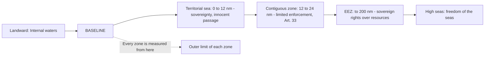

## UNCLOS Maritime Zones: Baselines, the Territorial Sea, and the Contiguous Zone

### The Conceptual Problem

The oceans cover roughly seventy percent of the planet, and states have always sought to control the waters adjacent to their coasts for security, fisheries, customs, and navigation. International law has to answer three questions:

1. **Where do a state's maritime zones begin?** (the problem of **baselines**)
2. **How much of the sea adjacent to the coast can a state treat as its own territory?** (the **territorial sea**)
3. **What limited powers may a state exercise beyond that territory to protect specific interests?** (the **contiguous zone**)

The governing instrument is the **United Nations Convention on the Law of the Sea (UNCLOS)**, adopted at Montego Bay on 10 December 1982 and in force since 16 November 1994. It has over 165 parties and is supplemented by the **1994 Agreement relating to the Implementation of Part XI** (deep seabed mining). UNCLOS is often described as a "constitution for the oceans" because it sets out, in a single package, the entitlements and limits of every maritime zone. Many of its provisions on the territorial sea, baselines, and contiguous zone reflect **customary international law** and bind non-parties, including the United States, which has not ratified UNCLOS but treats these provisions as customary. The International Court of Justice (ICJ) has repeatedly treated the baseline and territorial sea rules as declaratory of custom, for example in *Maritime Delimitation and Territorial Questions between Qatar and Bahrain* (Merits, 2001).

Recall that **customary international law** requires two elements: consistent state practice, and *opinio juris*, the belief that the practice is followed out of a sense of legal obligation. The 1982 rules on the territorial sea build on the earlier 1958 **Convention on the Territorial Sea and the Contiguous Zone**, itself a codification of customary rules developed in cases such as the *Anglo-Norwegian Fisheries Case (United Kingdom v. Norway)* (ICJ, 1951).

**Key Points**

- UNCLOS creates a system of **zones of decreasing coastal-state control** as one moves seaward: internal waters, territorial sea, contiguous zone, exclusive economic zone, continental shelf, and the high seas.
- **All maritime zones are measured from baselines**, so the location and legality of baselines control the outer extent of every other zone.
- The **territorial sea** is subject to full sovereignty, but that sovereignty is qualified by the **right of innocent passage** (Article 17).
- The **contiguous zone** is not territory: the coastal state has only **limited enforcement powers** to prevent and punish infringements of specified laws (Article 33).
- Entitlements to maritime zones derive from **land**, expressed in the maxim *la terre domine la mer* ("the land dominates the sea"), as recognised in the *North Sea Continental Shelf Cases* (ICJ, 1969).

### The Architecture of Maritime Zones

| Zone | Maximum breadth | Legal character | UNCLOS provision |
| --- | --- | --- | --- |
| **Internal waters** | Landward of the baseline | Full sovereignty; no right of innocent passage (with an exception for waters newly enclosed by straight baselines) | Art. 8 |
| **Archipelagic waters** | Enclosed by archipelagic baselines | Sovereignty, subject to archipelagic sea lanes passage and innocent passage | Arts. 46-54 |
| **Territorial sea** | 12 nautical miles from baselines | Sovereignty, subject to innocent passage | Arts. 2-32 |
| **Contiguous zone** | 24 nautical miles from baselines | Limited enforcement jurisdiction only | Art. 33 |
| **Exclusive economic zone (EEZ)** | 200 nautical miles from baselines | Sovereign rights over resources; specific jurisdiction | Arts. 55-75 |
| **Continental shelf** | 200 nautical miles, or up to 350 nautical miles where geological conditions are met | Sovereign rights over seabed resources | Arts. 76-85 |
| **High seas** | Beyond national jurisdiction | Freedom of the high seas | Arts. 86-120 |

A **nautical mile** is 1,852 metres (one minute of latitude). This item covers the first columns of the table that concern baselines, the territorial sea, and the contiguous zone.

### Part I: Baselines

#### Definition and Function

A **baseline** is the line from which the breadth of the territorial sea and the other maritime zones is measured. It also separates **internal waters** (landward of it) from the territorial sea (seaward of it). The baseline is the legal starting point for every maritime claim, so disputes over baselines can shift the boundaries of several zones at once, with large consequences for resource control.

UNCLOS provides several types of baseline, selected according to the geography of the coast.

| Type | Provision | Use |
| --- | --- | --- |
| **Normal baseline** | Art. 5 | The low-water line along the coast |
| **Straight baselines** | Art. 7 | Deeply indented coasts or a fringe of islands in the immediate vicinity |
| **Bay closing lines** | Art. 10 | Juridical bays with a closing line not exceeding 24 nautical miles |
| **River mouth closing lines** | Art. 9 | Rivers flowing directly into the sea |
| **Harbour works** | Art. 11 | Outermost permanent harbour works |
| **Low-tide elevations** | Art. 13 | Elevations used as basepoints only in specific conditions |
| **Archipelagic baselines** | Art. 47 | Archipelagic states only |
| **Reefs** | Art. 6 | Atolls or islands with fringing reefs: seaward low-water line of the reef |

#### Normal Baselines (Article 5)

Article 5 provides that, except where UNCLOS provides otherwise, the normal baseline is the **low-water line along the coast as marked on large-scale charts officially recognised by the coastal state**. In practice, states use "lowest astronomical tide" or an equivalent datum. The rule is simple: where the coast is regular and unindented, the baseline follows the coastline at low tide.

**Islands.** Under Article 121(1), an island is a naturally formed area of land, surrounded by water, which is above water at high tide. Article 121(2) provides that an island generates the same maritime zones as other land territory, including a territorial sea, contiguous zone, EEZ, and continental shelf. The exception is **Article 121(3)**: "Rocks which cannot sustain human habitation or economic life of their own shall have no exclusive economic zone or continental shelf." Rocks still generate a territorial sea and contiguous zone. This provision, and the meaning of "rocks," is the most litigated feature of the law of maritime entitlements, and it is addressed at greater length below in the discussion of the South China Sea Arbitration.

#### Straight Baselines (Article 7)

Where the coastline is **deeply indented and cut into**, or where there is **a fringe of islands along the coast in the immediate vicinity of the coast**, the method of straight baselines joining appropriate points may be used (Article 7(1)). Instead of following every indentation, the state draws straight lines between selected basepoints. This increases the area of internal waters and pushes the outer limit of the territorial sea seaward.

The legal source of the rule is the ***Anglo-Norwegian Fisheries Case (United Kingdom v. Norway)*** (ICJ, Judgment, 1951). Norway had drawn straight baselines along its heavily fragmented coast (the *skjærgård*, or "skerry guard" of thousands of islands and rocks). The United Kingdom challenged the lines. The Court held that Norway's system was **not contrary to international law**, and it identified three guiding principles that were later codified in the 1958 Convention and in UNCLOS Article 7:

1. **The baseline must not depart to any appreciable extent from the general direction of the coast** (Art. 7(3)).
2. The sea areas lying within the lines must be **sufficiently closely linked to the land domain** to be subject to the regime of internal waters (Art. 7(3)).
3. The Court also gave weight to **economic interests peculiar to a region**, the reality and importance of which are clearly evidenced by long usage (Art. 7(5)).

The **conditions and limits** in Article 7 are:

| Provision | Requirement |
| --- | --- |
| Art. 7(1) | Applies only where the coast is deeply indented or has a fringe of islands in the immediate vicinity |
| Art. 7(2) | Where the coastline is highly unstable (for example, a delta), basepoints may be selected along the furthest seaward extent of the low-water line; the lines remain effective until changed by the coastal state |
| Art. 7(3) | The drawing must not depart to any appreciable extent from the general direction of the coast; the sea areas within must be sufficiently closely linked to the land domain |
| Art. 7(4) | Straight baselines shall not be drawn to and from **low-tide elevations**, unless lighthouses or similar installations permanently above sea level have been built on them, or the drawing has received general international recognition |
| Art. 7(5) | Economic interests peculiar to the region may be taken into account |
| Art. 7(6) | The system of straight baselines may **not be applied in such a manner as to cut off the territorial sea of another State from the high seas or an exclusive economic zone** |

Article 8(2) adds that where the establishment of a straight baseline has the effect of enclosing as internal waters areas that had not previously been considered as such, **a right of innocent passage** as provided in UNCLOS exists in those waters.

**The problem of excessive straight baselines.** Because straight baselines enlarge maritime claims, states have sometimes drawn lines that arguably do not meet the Article 7 criteria. The US Freedom of Navigation Program has protested numerous excessive baseline claims (for example, those of Vietnam, Libya, and others), and the US Department of State's *Limits in the Seas* series catalogues them. The ICJ has scrutinised baselines in several cases. In *Qatar v. Bahrain* (2001), the Court held that the method of straight baselines is an **exception** to normal rules, to be applied restrictively, and that a coastline with a "fringe of islands" requires a real and continuous fringe, not merely a few scattered islands. In ***Maritime Dispute (Peru v. Chile)*** (2014) and ***Nicaragua v. Colombia*** (Territorial and Maritime Dispute, 2012), the Court considered the role of baselines in delimitation. In the 2012 judgment, the Court also declined to accept Nicaragua's proposed straight baselines connecting basepoints along the Nicaraguan coast for the purposes of delimitation, applying a demanding view of the Article 7 conditions.

**Example: Straight baseline analysis**

State X has a coastline with a continuous chain of small islands, each within a few nautical miles of the mainland and of one another, sheltering a sound.

1. **Threshold:** Is there a "fringe of islands along the coast in the immediate vicinity"? A close, continuous chain satisfies this.
2. **General direction:** The straight lines linking outer points of the chain must follow the general direction of the coast. Lines that cut across a wide open bight far from the mainland would fail.
3. **Close linkage:** Waters enclosed must be sufficiently linked to land to be treated as internal waters. Wide expanses of open sea would not qualify.
4. **Third-state impact:** The lines must not cut off another state's territorial sea from the high seas or EEZ.
5. **Consequence:** If satisfied, the territorial sea is measured from the straight lines. If not, other states may protest and may disregard the lines for navigation.

#### Bays (Article 10)

A **bay** for legal purposes is a well-marked indentation whose penetration is in such proportion to the width of its mouth as to contain land-locked waters and constitute more than a mere curvature of the coast (Article 10(2)). The **semicircle test** applies: an indentation is a bay only if its area is **as large as, or larger than, that of the semicircle whose diameter is a line drawn across the mouth of that indentation**.

If the distance between the natural entrance points of a bay does not exceed **24 nautical miles**, a closing line may be drawn between them, and the waters enclosed are **internal waters** (Article 10(4)). Where the mouth exceeds 24 nautical miles, a straight baseline of 24 nautical miles is drawn within the bay so as to enclose the maximum area of water (Article 10(5)).

**Historic bays.** Article 10(6) provides that these rules do not apply to so-called "historic" bays. A **historic bay** is a bay claimed on the basis of long-standing, open, continuous, and effective exercise of authority, acquiesced in by other states. The *Fisheries* case and the ICJ's judgment in *Land, Island and Maritime Frontier Dispute (El Salvador/Honduras: Nicaragua intervening)* (1992), concerning the Gulf of Fonseca, are the principal authorities. The Chamber held that the Gulf of Fonseca was a historic bay subject to a **condominium** of the three coastal states. Well-known claims of historic bays include Hudson Bay (Canada) and the Bay of Peter the Great (Russia; contested by other states).

#### Low-Tide Elevations (Article 13)

A **low-tide elevation** is a naturally formed area of land which is surrounded by and above water at low tide but submerged at high tide (Article 13(1)). Where a low-tide elevation is situated **wholly or partly at a distance not exceeding the breadth of the territorial sea from the mainland or an island**, the low-water line on that elevation may be used as the baseline. Where it is wholly situated at a distance exceeding the breadth of the territorial sea from the mainland or an island, it has **no territorial sea of its own** (Article 13(2)).

The ICJ has held that low-tide elevations are **not capable of appropriation** as territory in the same way as islands, in *Qatar v. Bahrain* (2001), while leaving open whether they may be subject to other forms of sovereignty. In *Sovereignty over Pedra Branca/Pulau Batu Puteh, Middle Rocks and South Ledge (Malaysia/Singapore)* (2008), the Court held that sovereignty over a low-tide elevation belongs to the state in whose territorial waters it is situated, and in *Nicaragua v. Colombia* (2012), it confirmed that low-tide elevations cannot be appropriated, and that the law on their status is not settled as to whether they can be subject to acquisition. The **South China Sea Arbitration** treated low-tide elevations as not generating maritime entitlements of their own, with consequences addressed below.

#### Archipelagic Baselines (Part IV)

**Archipelagic states** are states constituted wholly by one or more archipelagos (Article 46(a)), such as the Philippines and Indonesia. An **archipelago** is a group of islands, including parts of islands, interconnecting waters, and other natural features, which are so closely interrelated that such islands, waters, and other natural features form an intrinsic geographical, economic and political entity, or which historically have been regarded as such (Article 46(b)).

Under Article 47, an archipelagic state may draw **straight archipelagic baselines** joining the outermost points of the outermost islands and drying reefs, provided that:

- **(a)** The baselines include the main islands and an area in which the ratio of the area of the water to the area of the land, including atolls, is **between 1 to 1 and 9 to 1** (Art. 47(1));
- **(b)** The length of such baselines shall not exceed **100 nautical miles**, except that up to **3 percent** of the total number of baselines may exceed that length, up to a maximum length of **125 nautical miles** (Art. 47(2));
- **(c)** The drawing shall not depart to any appreciable extent from the general configuration of the archipelago (Art. 47(3));
- **(d)** Baselines shall not be drawn to and from low-tide elevations unless lighthouses or similar installations have been built on them, or where a low-tide elevation is situated wholly or partly at a distance not exceeding the breadth of the territorial sea from the nearest island (Art. 47(4));
- **(e)** The system shall not cut off from the high seas or EEZ the territorial sea of another state (Art. 47(5)).

The waters enclosed are **archipelagic waters** over which the state has sovereignty (Article 49), regardless of depth or distance from the coast. Foreign ships enjoy the right of **innocent passage** through archipelagic waters (Article 52), and the right of **archipelagic sea lanes passage** through designated sea lanes and air routes (Article 53), a regime resembling transit passage.

**Philippine relevance.** The Philippines is the archetypal archipelagic state, and the archipelagic concept has been central to Philippine maritime policy since the Philippine delegation advanced it in the negotiations preceding UNCLOS. The 1987 Philippine Constitution, Article I, refers to the **archipelagic doctrine**: the national territory comprises the Philippine archipelago, with all the islands and waters embraced therein, and all other territories over which the Philippines has sovereignty or jurisdiction, and the waters around, between, and connecting the islands of the archipelago, regardless of their breadth and dimensions, form part of the internal waters of the Philippines. The Philippine baselines were first set by **Republic Act No. 3046 (1961)**, amended by **Republic Act No. 5446 (1968)**, and then updated by **Republic Act No. 9522 (2009)**, which brought the baselines in line with UNCLOS. Republic Act No. 9522 designated the **Kalayaan Island Group** and **Bajo de Masinloc** (Scarborough Shoal) under a **"regime of islands"** consistent with Article 121, rather than enclosing them within the archipelagic baselines. The constitutionality of RA 9522 was upheld in ***Magallona v. Ermita*** (G.R. No. 187167, 16 August 2011), in which the Supreme Court held that the law was a mere statutory tool to demarcate the country's maritime zones as required by UNCLOS and that UNCLOS regulates maritime zones and does not affect the acquisition or loss of territory. The Court also held that the Philippine archipelagic waters are subject to the right of innocent passage and archipelagic sea lanes passage for foreign vessels, notwithstanding the constitutional "internal waters" language, as a consequence of the state's adherence to UNCLOS. [Inference] The Court's treatment reconciles the constitutional terminology of "internal waters" with the UNCLOS category of "archipelagic waters" by reading the constitutional text in light of the state's international obligations.

The Philippines has also enacted the **Philippine Maritime Zones Act (Republic Act No. 12064, 2024)**, which codifies the country's maritime zones consistent with UNCLOS and the 2016 arbitral award, and the **Philippine Archipelagic Sea Lanes Act (Republic Act No. 12065, 2024)**, which designates archipelagic sea lanes for the passage of foreign vessels and aircraft. [Unverified] Details of the sea lane designations and their implementation, including consultation with the International Maritime Organization (IMO), should be checked against the current text of the statutes and the IMO's adoption records before being relied upon.

**Key Points**

- Baselines are the **anchor** of the entire system of maritime zones.
- The type of baseline depends on coastal geography: normal, straight, bay closing, or archipelagic.
- Straight baselines are an **exception** and are applied restrictively, following the *Anglo-Norwegian Fisheries* criteria.
- Baseline claims are subject to **international scrutiny**, and the coastal state's determination is not conclusive: the validity of the delimitation with regard to other states depends upon international law (*Anglo-Norwegian Fisheries*, 1951).

### Part II: The Territorial Sea

#### Definition, Breadth, and Legal Status

The **territorial sea** is a belt of sea adjacent to the coastal state's land territory and internal waters (or archipelagic waters, for an archipelagic state) over which the state exercises **sovereignty**.

**Article 2** sets out the legal status:

1. The sovereignty of a coastal state extends, beyond its land territory and internal waters and, in the case of an archipelagic state, its archipelagic waters, to an adjacent belt of sea, described as the territorial sea.
2. This sovereignty extends to the **air space over the territorial sea as well as to its bed and subsoil**.
3. The sovereignty over the territorial sea is exercised subject to UNCLOS and to other rules of international law.

**Article 3** provides that every state has the right to establish the breadth of its territorial sea **up to a limit not exceeding 12 nautical miles**, measured from baselines determined in accordance with UNCLOS. The 12 nautical mile limit resolved a long historical dispute over the breadth of the territorial sea. Earlier claims ranged from 3 nautical miles (the traditional "cannon-shot" rule favoured by maritime powers) to 200 nautical miles (claimed by some Latin American states before the EEZ concept was accepted). The 1958 and 1960 Geneva Conferences failed to agree on a limit, and the 12 nautical mile compromise emerged in the Third UN Conference on the Law of the Sea (1973 to 1982).

#### The Outer Limit (Article 4)

The outer limit of the territorial sea is the line every point of which is at a distance from the nearest point of the baseline equal to the breadth of the territorial sea. It is determined by the "envelope of arcs" method.

#### Delimitation Between States with Opposite or Adjacent Coasts (Article 15)

Where the coasts of two states are opposite or adjacent, neither is entitled, failing agreement, to extend its territorial sea beyond the **median line**, every point of which is equidistant from the nearest points on the baselines from which the breadth of the territorial seas of each state is measured. This rule does not apply where, by reason of **historic title or other special circumstances**, it is necessary to delimit the territorial seas differently. The rule, therefore, reflects an **equidistance/special circumstances** approach, in contrast to the approach for the EEZ and continental shelf in Articles 74 and 83, which refer to delimitation "by agreement on the basis of international law, in order to achieve an equitable solution." The ICJ in ***Maritime Delimitation in the Black Sea (Romania v. Ukraine)*** (2009) established the standard three-stage methodology for delimitation: (1) provisional equidistance line; (2) relevant circumstances; (3) disproportionality test.

#### Sovereignty and Its Consequences

Sovereignty over the territorial sea means that the coastal state may:

- Enact laws and regulations governing the territorial sea, including customs, fiscal, immigration, and sanitary matters, environmental protection, and the conservation of living resources;
- Exploit and regulate fisheries and other resources in the territorial sea, to the exclusion of foreign vessels (unless it grants access);
- Regulate and control **air space** above the territorial sea, meaning that foreign aircraft have **no right of overflight** in the territorial sea without the coastal state's consent (unlike in the EEZ);
- Exercise **civil and criminal jurisdiction** over foreign ships in limited circumstances (Articles 27 and 28);
- Regulate marine scientific research and other activities.

The right of the coastal state is qualified by a **right of innocent passage** for foreign ships, discussed next, and by the **right of transit passage** and non-suspendable innocent passage in international straits (Part III).

#### The Right of Innocent Passage (Articles 17 to 26)

**Article 17** provides that, subject to UNCLOS, ships of all states, whether coastal or land-locked, enjoy the right of innocent passage through the territorial sea. **Passage** means navigation through the territorial sea for the purpose of (a) traversing that sea without entering internal waters or calling at a roadstead or port facility outside internal waters, or (b) proceeding to or from internal waters or a call at such roadstead or port facility (Article 18(1)). Passage must be **continuous and expeditious**, though it includes stopping and anchoring insofar as they are incidental to ordinary navigation, or rendered necessary by *force majeure* or distress, or for the purpose of rendering assistance to persons, ships, or aircraft in danger or distress (Article 18(2)).

**What makes passage "innocent"?** Article 19(1) states that passage is innocent so long as it is **not prejudicial to the peace, good order or security of the coastal State**. Article 19(2) lists activities that render passage **non-innocent**. Passage of a foreign ship is considered prejudicial if in the territorial sea it engages in any of the following:

| Sub-paragraph | Activity |
| --- | --- |
| (a) | Any threat or use of force against the sovereignty, territorial integrity, or political independence of the coastal state, or in any other manner in violation of the principles of international law embodied in the UN Charter |
| (b) | Any exercise or practice with weapons of any kind |
| (c) | Any act aimed at collecting information to the prejudice of the defence or security of the coastal state |
| (d) | Any act of propaganda aimed at affecting the defence or security of the coastal state |
| (e) | The launching, landing, or taking on board of any aircraft |
| (f) | The launching, landing, or taking on board of any military device |
| (g) | The loading or unloading of any commodity, currency, or person contrary to the customs, fiscal, immigration, or sanitary laws and regulations of the coastal state |
| (h) | Any act of wilful and serious pollution contrary to UNCLOS |
| (i) | Any fishing activities |
| (j) | The carrying out of research or survey activities |
| (k) | Any act aimed at interfering with any systems of communication or any other facilities or installations of the coastal state |
| (l) | Any other activity not having a direct bearing on passage |

The list in Article 19(2) is treated by many states and commentators as **exhaustive**, meaning that only activities enumerated make passage non-innocent, whereas some coastal states treat it as illustrative. A key element is that the **focus is on the ship's activities, not on the type of cargo or the ship's flag**. The list also implies that a ship that is merely of a particular type (such as a warship) does not for that reason lose its right of passage, though that point is disputed.

**The warship question.** UNCLOS does not expressly address whether **warships** enjoy the right of innocent passage without prior notification or authorisation. Section 3 of Part II is headed "Innocent passage in the territorial sea" and applies to "ships", with Subsection A applying to all ships and Subsections B and C to merchant ships and government ships operated for commercial purposes (B) and warships and other government ships operated for non-commercial purposes (C). Article 17, in Subsection A, applies to "ships of all States," which supports the view that warships benefit. **Maritime powers**, such as the United States, the United Kingdom, and Russia, maintain that warships enjoy the right of innocent passage without prior notification or authorisation. A significant number of coastal states, including **China, India, Pakistan, Bangladesh, Vietnam, and others**, require prior notification or authorisation for warship passage, on the basis that warships pose a greater potential threat to coastal-state security. [Inference] The text and drafting history support the maritime powers' position more directly, but state practice reflects a genuine divergence, and the International Tribunal for the Law of the Sea (ITLOS) and the ICJ have not resolved the question. The ***Corfu Channel Case (United Kingdom v. Albania)*** (ICJ, Merits, 1949) held that, in time of peace, states have the right to send their warships through straits used for international navigation between two parts of the high seas without the previous authorisation of a coastal state, provided that the passage is innocent, and that Albania could not require prior authorisation. It also held that the UK's later "Operation Retail" mine-sweeping in Albanian waters violated Albanian sovereignty. The *Corfu Channel* holding concerned international straits, and it is the closest ICJ authority on warship passage, but it is not directly a ruling on the general territorial sea.

**Submarines and other underwater vehicles.** Article 20 provides that in the territorial sea, **submarines and other underwater vehicles are required to navigate on the surface and to show their flag**.

**Nuclear-powered ships and ships carrying dangerous cargoes.** Article 23 provides that foreign nuclear-powered ships, and ships carrying nuclear or other inherently dangerous or noxious substances, when exercising the right of innocent passage, shall carry documents and observe special precautionary measures established for such ships by international agreements.

#### Coastal State Rights and Duties Regarding Innocent Passage

**Rights (Articles 21, 22, 25):**

- **Article 21:** The coastal state may adopt laws and regulations relating to innocent passage on matters including safety of navigation and regulation of maritime traffic, protection of navigational aids, cables and pipelines, conservation of living resources, prevention of infringement of fisheries laws, preservation of the environment, marine scientific research, and prevention of infringement of customs, fiscal, immigration, or sanitary laws. These laws **must not apply to the design, construction, manning, or equipment of foreign ships** unless giving effect to generally accepted international rules or standards (Article 21(2)).
- **Article 22:** The coastal state may, where necessary for the safety of navigation, require foreign ships exercising innocent passage to use **designated sea lanes and traffic separation schemes**, particularly tankers, nuclear-powered ships, and ships carrying dangerous substances.
- **Article 25(1):** The coastal state may take the **necessary steps** in its territorial sea to prevent passage which is not innocent.
- **Article 25(3):** The coastal state may, without discrimination in form or in fact among foreign ships, **suspend temporarily** in specified areas of its territorial sea the innocent passage of foreign ships if such suspension is essential for the protection of its security, including weapons exercises. Such suspension takes effect only after having been duly published.

**Duties (Article 24):** The coastal state shall not hamper the innocent passage of foreign ships except in accordance with UNCLOS. In particular, it shall not impose requirements on foreign ships which have the practical effect of denying or impairing the right of innocent passage, or discriminate in form or in fact against the ships of any state or ships carrying cargoes to, from, or on behalf of any state. It must also give appropriate publicity to any danger to navigation of which it has knowledge.

#### Criminal and Civil Jurisdiction over Foreign Ships (Articles 27 and 28)

**Criminal jurisdiction (Article 27).** The criminal jurisdiction of the coastal state **should not** be exercised on board a foreign ship passing through the territorial sea to arrest any person or to conduct any investigation in connection with any crime committed on board during the passage, **save only in the following cases**:

- **(a)** If the consequences of the crime extend to the coastal state;
- **(b)** If the crime is of a kind to disturb the peace of the country or the good order of the territorial sea;
- **(c)** If the assistance of the local authorities has been requested by the master of the ship or by a diplomatic agent or consular officer of the flag state; or
- **(d)** If such measures are necessary for the suppression of illicit traffic in narcotic drugs or psychotropic substances.

These limits do not affect the coastal state's right to take steps authorised by its laws for the purpose of an arrest or investigation on board a foreign ship **passing through the territorial sea after leaving internal waters** (Article 27(2)).

**Civil jurisdiction (Article 28).** The coastal state should not stop or divert a foreign ship passing through the territorial sea for the purpose of exercising civil jurisdiction in relation to a person on board. It may not levy execution against or arrest the ship for civil proceedings except **in respect of obligations or liabilities assumed or incurred by the ship itself in the course or for the purpose of its voyage through the waters of the coastal state**.

#### Warships and Government Ships: Immunity and Non-Compliance (Articles 29 to 32)

- **Article 29** defines a **warship** as a ship belonging to the armed forces of a state bearing the external marks distinguishing such ships of its nationality, under the command of an officer duly commissioned by the government of the state and whose name appears in the appropriate service list or its equivalent, and manned by a crew which is under regular armed forces discipline.
- **Article 30:** If a warship does not comply with the laws and regulations of the coastal state concerning passage through the territorial sea and disregards any request for compliance made to it, the coastal state **may require it to leave the territorial sea immediately**.
- **Article 31:** The **flag state bears international responsibility** for any loss or damage to the coastal state resulting from the non-compliance by a warship or other government ship operated for non-commercial purposes with the laws and regulations of the coastal state concerning passage through the territorial sea or with the provisions of UNCLOS or other rules of international law.
- **Article 32:** Subject to the exceptions in Subsections A and B, nothing in UNCLOS affects the **immunities of warships and other government ships operated for non-commercial purposes**.

The ITLOS provisional measures order in the ***"ARA Libertad" Case (Argentina v. Ghana)*** (2012) is a leading authority on the immunity of warships: the Tribunal ordered Ghana to release an Argentine naval training vessel that had been detained in the port of Tema in connection with a commercial creditor's enforcement action, reasoning that a warship enjoys immunity under UNCLOS and general international law. Recall that immunity from execution and enforcement measures is separate from immunity from jurisdiction, a distinction that is central to the law of state immunity.

**Example: Innocent passage analysis**

A foreign naval vessel of State F enters the 12-nautical-mile territorial sea of State C, on a route between two points of the high seas. The vessel:

1. Conducts flight operations with an on-board helicopter (Art. 19(2)(e)): launching or landing an aircraft renders passage non-innocent.
2. Performs radar survey and hydrographic sounding of the seabed (Arts. 19(2)(c), (j)): information-collecting and survey activities render passage non-innocent.
3. Stops for several hours to conduct unrelated activities (Art. 18(2)): not continuous and expeditious, and not incidental to ordinary navigation.

If any of these is established, passage is **not innocent**. State C may take necessary steps to prevent it (Art. 25(1)), and for a warship may require it to leave immediately (Art. 30). If State F disputes, it may argue that State C's characterisation is unfounded, and the dispute would be subject to the compulsory dispute settlement procedures under Part XV of UNCLOS, subject to the military-activities exception in Article 298(1)(b), which allows a state to declare that it does not accept compulsory procedures for disputes concerning military activities. [Inference] Where the activity in question is characterised as military, states that have made an Article 298 declaration may bar compulsory adjudication of that aspect of the dispute.

#### The Territorial Sea in International Straits (Part III, Briefly)

Where the territorial sea overlaps a strait used for international navigation, **transit passage** (Article 38) applies instead of innocent passage. Transit passage is the exercise of freedom of navigation and overflight solely for the purpose of continuous and expeditious transit, and it **cannot be suspended** by the strait state (Article 44). It permits submarines to transit submerged and aircraft to overfly. Only the coastal state's limited regulatory powers in Article 42 apply. Transit passage is beyond the scope of this item, but it is relevant to the contrast with innocent passage: in the territorial sea generally, innocent passage is more restrictive (surface navigation for submarines, no overflight, suspension possible).

**Key Points**

- The territorial sea extends **up to 12 nautical miles** from baselines and is subject to **sovereignty**, including over the airspace, seabed, and subsoil.
- The **right of innocent passage** is the principal limitation on coastal-state sovereignty, and passage is innocent unless it is prejudicial to the coastal state's peace, good order, or security.
- The **list in Article 19(2)** identifies non-innocent activities; the point of debate is whether it is exhaustive.
- The **status of warships** in innocent passage, and whether prior notification is required, remain contested in state practice.
- The territorial sea gives the coastal state **no right to bar** passage that is innocent, but it may take steps to prevent non-innocent passage and temporarily suspend passage in specified areas for security reasons.

### Part III: The Contiguous Zone

#### Definition and Legal Character

The **contiguous zone** is a zone adjacent to the territorial sea in which the coastal state may exercise **limited control** to prevent and punish infringements of its customs, fiscal, immigration, or sanitary laws and regulations. It is a **functional** zone: it does not constitute territory, and the coastal state does not have sovereignty over it.

**Article 33(1)** provides: "In a zone contiguous to its territorial sea, described as the contiguous zone, the coastal State may exercise the control necessary to:

- **(a)** **Prevent** infringement of its customs, fiscal, immigration or sanitary laws and regulations within its territory or territorial sea;
- **(b)** **Punish** infringement of the above laws and regulations committed within its territory or territorial sea."

**Article 33(2)** provides: "The contiguous zone may not extend beyond **24 nautical miles from the baselines** from which the breadth of the territorial sea is measured."

Where the territorial sea is 12 nautical miles, the contiguous zone therefore extends for a further **12 nautical miles**.

#### The Structure of the Coastal State's Power

The formulation of Article 33 is careful and has two limbs with a specific structure:

| Limb | Text | Effect |
| --- | --- | --- |
| **Prevention** | Prevent infringement of the specified laws "within its territory or territorial sea" | The coastal state may act against a vessel in the contiguous zone that is **about to enter** the territorial sea or territory in order to commit an infringement (for example, a vessel approaching with the intention of smuggling goods or landing illegal migrants) |
| **Punishment** | Punish infringement "committed within its territory or territorial sea" | The coastal state may act in the contiguous zone against a vessel that has **already committed** an infringement in territory or the territorial sea and is now seaward of it |

Two consequences follow from this wording:

1. The **infringement must relate to** the coastal state's territory or territorial sea. Acts committed wholly in the contiguous zone itself are not covered by Article 33 as such. The enumerated laws are **limited to four categories**: customs, fiscal, immigration, and sanitary. The coastal state does not thereby acquire general enforcement jurisdiction in the zone, and it may not use the contiguous zone to claim, for example, security-related jurisdiction. This limitation was **deliberately narrow**. During the 1958 Geneva Conference, proposals to include **security** as a fifth category were rejected. Several states, including China, India, and Bangladesh, have nevertheless asserted **security-related powers** in their contiguous zones, and the United States and other maritime powers regularly protest such claims as inconsistent with Article 33.
2. The **enforcement powers** are limited to those "necessary" to prevent or punish, meaning **proportionate**. The zone is one of **control**, not sovereignty, so that ships and aircraft of all states continue to enjoy high-seas-type freedoms of navigation and overflight there (subject to the EEZ regime, since the contiguous zone overlaps with the EEZ, where Article 58 provides for freedom of navigation and overflight).

#### Relationship to Hot Pursuit (Article 111)

Enforcement in the contiguous zone connects to the right of **hot pursuit** under Article 111. Hot pursuit of a foreign ship may be undertaken when the competent authorities of the coastal state have good reason to believe that the ship has violated its laws and regulations. The pursuit must be commenced when the foreign ship or one of its boats is **within the internal waters, the archipelagic waters, the territorial sea or the contiguous zone** of the pursuing state, and may only be continued outside the territorial sea or contiguous zone if the pursuit has not been interrupted. If the foreign ship is within a contiguous zone, the pursuit may be undertaken only **if there has been a violation of the rights for the protection of which the zone was established** (Article 111(1)). The right of hot pursuit ceases as soon as the pursued ship enters the territorial sea of its own state or of a third state.

#### Historical Development

The contiguous zone originated in the eighteenth-century British "hovering acts" and nineteenth-century United States practice, in which states claimed the right to enforce customs laws beyond the territorial sea, especially against smuggling. It was codified in Article 24 of the **1958 Convention on the Territorial Sea and the Contiguous Zone**, which set the limit at **12 nautical miles** from baselines, when the territorial sea was widely treated as 3 to 6 nautical miles. UNCLOS extended the maximum to **24 nautical miles** from the baselines, in parallel with the extension of the territorial sea to 12 nautical miles.

#### Contiguous Zone and Archaeological and Historical Objects (Article 303)

Article 303(2) provides a special application of the contiguous zone: in order to control traffic in **archaeological and historical objects** found at sea, the coastal state may, in applying Article 33, presume that their **removal from the seabed in the zone** referred to in that Article without its approval would result in an infringement within its territory or territorial sea of the laws and regulations referred to in that Article. This gives coastal states limited jurisdiction over underwater cultural heritage in the contiguous zone. The regime is further elaborated by the 2001 UNESCO Convention on the Protection of the Underwater Cultural Heritage, which the Philippines has ratified. [Unverified] The current ratification status and the domestic implementing legislation of the Philippines should be checked before reliance.

#### Contiguous Zone and the EEZ

The contiguous zone **overlaps** with the exclusive economic zone. Article 55 defines the EEZ as an area beyond and adjacent to the territorial sea, and the contiguous zone (up to 24 nautical miles) lies within the first 12 nautical miles of the EEZ where the territorial sea is 12 nautical miles. Coastal-state authority in the overlapping area is therefore a combination of the Article 33 enforcement powers for the four categories of law and the sovereign rights and jurisdiction over resources and specified activities under Part V. The contiguous zone does **not** need to be separately claimed under UNCLOS in the way that the EEZ must be proclaimed: it is understood as an option, and states typically establish it by legislation or proclamation. Whether a state has the right to exercise contiguous zone powers **without any formal claim** is debated. [Inference] State practice suggests that a claim by legislation or proclamation is the norm, and the better view is that a formal claim is required in the absence of express UNCLOS entitlement language such as that in Article 57 on the EEZ, but this is not settled.

**Example: Contiguous zone enforcement**

A foreign vessel is detected 18 nautical miles off State C's coast (a location within State C's 24-nautical-mile contiguous zone, and outside its 12-nautical-mile territorial sea). Intelligence suggests that it is carrying migrants to be landed on State C's coast without authorisation.

1. **Applicable law:** State C's immigration laws are within Article 33(1)(a).
2. **Prevention:** State C's coast guard may board and inspect the vessel to prevent the infringement of its immigration laws within its territory, provided that flag-state consent or other lawful authority applies (boarding of foreign vessels also engages the freedom of navigation and the exclusive jurisdiction of the flag state over vessels on the high seas or in the EEZ; boarding in the contiguous zone is justified by Article 33 for the limited purposes stated).
3. **Limits:** State C could not use the contiguous zone power to enforce, for example, its **security laws** against the vessel, or its environmental laws beyond those covered by the EEZ regime, on the sole basis of Article 33.
4. **Follow-up:** If the vessel escapes but had already landed persons in State C's territory, State C may pursue, subject to Article 111, and punish the infringement.

**Key Points**

- The contiguous zone extends to **24 nautical miles** from baselines and confers **enforcement powers only**, over **customs, fiscal, immigration, and sanitary** laws.
- The power is **preventive** (against anticipated infringements in territory or territorial sea) and **punitive** (against completed infringements in territory or territorial sea).
- Claims to **security jurisdiction** in the contiguous zone are contested and are not supported by the text of Article 33.
- The zone is a **high seas or EEZ area** with limited coastal control, so freedoms of navigation and overflight persist.

### Comparison of the Three Concepts

| Feature | Baselines | Territorial sea | Contiguous zone |
| --- | --- | --- | --- |
| **Nature** | Reference lines that determine the starting point of all zones | Zone of sovereignty | Zone of limited control |
| **Maximum extent** | Line drawn per UNCLOS rules | 12 nm from baselines | 24 nm from baselines |
| **Coastal-state powers** | Determine internal waters and the anchor for all other zones | Full sovereignty, subject to innocent passage | Prevent and punish infringements of customs, fiscal, immigration, and sanitary laws |
| **Foreign navigation** | In internal waters, no right of passage (with exceptions) | Innocent passage for ships; no overflight | Freedom of navigation and overflight (as in the high seas or EEZ) |
| **Airspace** | Sovereignty over airspace above internal waters | Sovereignty over airspace | Not subject to sovereignty |
| **Seabed and subsoil** | Sovereignty in internal waters | Sovereignty | Continental shelf regime |
| **Key articles** | Arts. 5-16, 47 | Arts. 2-32 | Art. 33 |
| **Leading authorities** | *Anglo-Norwegian Fisheries* (1951); *Qatar v. Bahrain* (2001) | *Corfu Channel* (1949); *Nicaragua v. United States* (1986) on innocent passage and coastal sovereignty | Practice under Art. 33; Art. 111 hot pursuit; *M/V "Saiga" (No. 2)* (ITLOS, 1999) on enforcement jurisdiction limits |

### Application to Philippine Interests: The South China Sea Arbitration

The **South China Sea Arbitration (Philippines v. China)** (PCA Case No. 2013-19, Award of 12 July 2016), conducted by an Annex VII tribunal constituted under UNCLOS, addressed several issues in the law of maritime entitlements. It is central to the application of the baseline and territorial-sea rules to features in the Spratly Islands and Scarborough Shoal.

#### Classification of Features

The Tribunal classified maritime features into three categories under Article 121 and Article 13:

| Category | Definition | Entitlements | Features identified by the Tribunal |
| --- | --- | --- | --- |
| **Fully entitled islands** | Naturally formed area of land above water at high tide capable of sustaining human habitation or economic life of its own (Art. 121(1)-(2)) | Territorial sea, contiguous zone, EEZ, continental shelf | The Tribunal found that **none** of the Spratly features (including Itu Aba/Taiping) qualified |
| **Rocks** | Naturally formed areas above water at high tide that cannot sustain human habitation or economic life of their own (Art. 121(3)) | Territorial sea and contiguous zone only; **no EEZ or continental shelf** | Scarborough Shoal, Gaven Reef (North), Johnson Reef, Cuarteron Reef, Fiery Cross Reef, McKennan Reef, and (per the Tribunal) Itu Aba, Thitu, West York Island, Spratly Island, North-East Cay, and South-West Cay |
| **Low-tide elevations** | Naturally formed areas above water at low tide only (Art. 13) | No territorial sea of their own; may be used as basepoints only within 12 nm of an island or mainland | Subi Reef, Hughes Reef, Mischief Reef, Second Thomas Shoal, Gaven Reef (South), Mischief Reef and others |

The Tribunal's interpretation of Article 121(3) was significant. It held that the phrase "cannot sustain human habitation or economic life of their own" is assessed by reference to the **natural capacity of the feature**, not the presence of installations or supplies brought from outside, and that "human habitation" implies the non-transient inhabitation of a stable community. It considered that the historical use of the features by small groups of fishermen was **not** habitation by a stable community and that the economic activity must be that of the feature itself and not merely extractive activity without local benefit. The Tribunal further found that the natural condition of a feature is what governs, and that **artificial modification** through island-building does not convert a rock or a low-tide elevation into a fully entitled island, nor does it change a low-tide elevation into an island. [Inference] The Tribunal's interpretation of the Article 121(3) threshold is stricter than some commentators' reading, but its reasoning on the natural condition of features is generally seen as reflecting the object of the provision.

#### Consequences for the Territorial Sea

- **Rocks** generate a **12-nautical-mile territorial sea** and a contiguous zone, from their own baselines. The territorial sea and contiguous zone of a rock apply the same rules as those discussed above.
- **Low-tide elevations** generate **no territorial sea**. Where a low-tide elevation is situated within 12 nautical miles of a high-tide feature, its low-water line may serve as a baseline for measuring the territorial sea of that feature (Article 13(1)). Where it is beyond that distance, it has no territorial sea of its own.
- **Artificial islands, installations, and structures** (Article 60, applicable in the EEZ, and Article 11 on harbour works in the territorial sea context) do **not** possess the status of islands, have no territorial sea of their own, and their presence does not affect the delimitation of the territorial sea, EEZ, or continental shelf (Article 60(8)). The Tribunal applied these principles to China's reclamation on seven reefs in the Spratly Islands and held that they did not alter the status of the features.
- **Second Thomas Shoal and Mischief Reef** were held to be **low-tide elevations** that form part of the exclusive economic zone and continental shelf of the Philippines, so that China's construction on Mischief Reef and interference at Second Thomas Shoal violated Philippine sovereign rights. The consequence is that Mischief Reef, as a low-tide elevation within the Philippines' EEZ, is not subject to appropriation and creates no territorial sea for China.

#### Scarborough Shoal

The Tribunal held that Scarborough Shoal (Bajo de Masinloc) contains **rocks that remain above water at high tide** and therefore generates a **territorial sea of up to 12 nautical miles** but no EEZ or continental shelf. It also held that **traditional fishing rights** of Filipino, Chinese, and other fishermen in the territorial sea of Scarborough Shoal were preserved, and that China had breached its obligations by preventing Philippine fishermen from fishing there, and by its law enforcement conduct that created a serious risk of collision. The **territorial sea** analysis on the effect of the rocks is therefore directly applied: entitlements are of the territorial sea only, and other states' vessels enjoy the right of innocent passage in that territorial sea (as well as traditional fishing rights preserved by the Tribunal's ruling), a point of contention given China's actions to restrict access. The question of which state has sovereignty over Scarborough Shoal was **outside the Tribunal's jurisdiction** and was not decided.

#### China's Baselines and Straight Baselines around Offshore Features

China has drawn straight baselines around the **Paracel Islands** (1996 declaration), which the United States and others have protested as inconsistent with UNCLOS Article 7 because the Paracels are not part of an archipelagic state, and Article 7 applies to coastlines, not to isolated oceanic island groups. The Tribunal in the 2016 Award noted that Article 7 straight baselines do not apply to such groups and, in the context of the Spratly Islands, that Article 47 archipelagic baselines are available only to **archipelagic states** and not to offshore archipelagos of continental states. China's claim to draw straight baselines around the Spratlys was thus contrary to UNCLOS. The tribunal's analysis is a direct application of the baseline provisions of Parts II and IV and underscores that only archipelagic states, such as the Philippines and Indonesia, may use archipelagic baselines.

#### Historic Rights and the "Nine-Dash Line"

China claimed "historic rights" in the waters within the nine-dash line. The Tribunal held that, to the extent China had historic rights to resources in the waters of the South China Sea, such rights were **extinguished** by the entry into force of UNCLOS, insofar as they were incompatible with the Convention's system of maritime zones, and that there was **no legal basis** for China to claim historic rights to resources within the sea areas falling within the nine-dash line. The holding reaffirmed the point that UNCLOS establishes a comprehensive system of zones measured from baselines, in which entitlements derive from land features, and that **historic title** claims in the sense of Article 10(6) (bays) or Article 15 (delimitation of the territorial sea) apply to particular categories, and not to claims over vast maritime areas.

#### Non-Compliance and Enforcement

China rejected the Award as "null and void". Recall that under UNCLOS Annex VII Article 11, the award is final and without appeal, and shall be complied with by the parties, and under Article 9, the absence or default of a party does not constitute a bar to the proceedings. The Philippine domestic legislation, the **Maritime Zones Act (RA 12064)**, codifies the territorial sea, contiguous zone, and EEZ of the Philippines in line with UNCLOS and the Award. Under ARSIWA Article 32, China may not rely on its internal law as justification for non-compliance.

### Areas of Continuing Debate

1. **Excessive straight baselines.** The boundary between legitimate and excessive baselines is contested, and the ICJ's case law has been comparatively sparse. The **US Freedom of Navigation Program** and diplomatic protests function as a form of *ad hoc* enforcement.
2. **Warship innocent passage and prior notification.** Whether coastal states may require prior notification or authorisation. The strongest form of the **maritime powers' position** is that the text of Article 17 applies to "ships of all States," that the drafting history rejected proposals to require authorisation, and that permitting notification requirements would undermine navigational freedoms and open the door to arbitrary restriction. The strongest form of the **coastal states' position** is that warships carry weapons and pose distinct security risks, that sovereignty in the territorial sea includes the right to control military presence, and that the Convention is silent on the specific question, leaving room for coastal-state regulation under Articles 21 and 25 in the interest of security.
3. **Security jurisdiction in the contiguous zone.** Whether coastal states may claim security-related powers beyond the four categories listed in Article 33. The strongest form of the **extension position** is that the contiguous zone's purpose is protection of the coastal state's vital interests, and that maritime security has become inseparable from customs, immigration and sanitary control in the context of terrorism and irregular migration. The strongest form of the **restriction position** is that Article 33 enumerates the categories exhaustively, that the drafting history rejected security as a category, and that allowing open-ended security claims would erode the freedoms of navigation and overflight in areas of the EEZ and high seas.
4. **Status of the "regime of islands" and Article 121(3).** The 2016 Award's interpretation has generated debate among commentators and states over the scope of rocks and the effect of the natural-capacity test.
5. **Baselines and sea-level rise.** Whether baselines and outer limits, once established and deposited, should be treated as **fixed** notwithstanding sea-level rise. The ILC's Study Group on Sea-level Rise in relation to International Law has examined the question, and a number of state declarations, including the 2021 **Pacific Islands Forum Declaration on Preserving Maritime Zones in the Face of Climate Change-related Sea-Level Rise**, support the view that maritime zones should be maintained once established. [Inference] The trend in state practice supports a principle of stability of baselines, but no treaty rule to that effect exists in UNCLOS, which contemplates the ambulatory character of low-water baselines except where the coastline is highly unstable (Article 7(2)) and where charts and lists of coordinates are deposited (Articles 16 and 75).
6. **Overlapping and unclaimed contiguous zones.** Whether an unclaimed contiguous zone may nonetheless be relied upon.

### Common Misconceptions

- **"The territorial sea is part of the high seas."** Incorrect. The territorial sea is subject to sovereignty, while the high seas are beyond national jurisdiction.
- **"Foreign ships have no rights in the territorial sea."** Incorrect. They enjoy the right of innocent passage, which the coastal state may not hamper except in accordance with UNCLOS.
- **"The contiguous zone is a zone of sovereignty, like the territorial sea."** Incorrect. It is a zone of **limited enforcement control** only.
- **"Baselines are always the coastline at low tide."** Incorrect. The normal baseline is the low-water line, but straight, archipelagic, and bay closing baselines depart from it.
- **"A state may draw straight baselines wherever it wishes."** Incorrect. Straight baselines are permitted only where the geographical conditions in Article 7 are met.
- **"Island-building creates new maritime zones."** Incorrect. Artificial islands do not have the status of islands, do not possess a territorial sea of their own, and do not alter the entitlements of the underlying feature (Article 60(8); Article 121; the 2016 Award).
- **"Innocent passage requires permission from the coastal state."** Incorrect for merchant ships. For warships, the position is contested, but the Convention text does not require permission.

### Conclusion

The rules on baselines, the territorial sea, and the contiguous zone form the foundation of the law of maritime zones. **Baselines** determine where all zones begin, and their selection is governed by geographical criteria that limit the extension of coastal-state control seaward. The **territorial sea** balances the coastal state's sovereignty against the international community's interest in freedom of navigation through the right of innocent passage, and its regime reflects a compromise between security interests and maritime mobility. The **contiguous zone** provides a narrow, functional extension of enforcement powers for four categories of law, without conferring sovereignty. Together, these rules illustrate the guiding principle that **maritime entitlements derive from land** and that they are subject to objective, treaty-based limits that are enforceable through international adjudication, as the 2016 South China Sea Arbitration demonstrated. For the Philippines, an archipelagic state whose baselines, maritime zones, and features have been the subject of both domestic constitutional review (*Magallona v. Ermita*) and international arbitration, the correct application of these rules is directly tied to national territory, resource control, and security.

**Related Topics**

- Archipelagic waters, archipelagic sea lanes passage, and the Philippine Archipelagic Sea Lanes Act
- Straits used for international navigation and the regime of transit passage
- The exclusive economic zone: rights, jurisdiction, and duties of coastal and other states
- The continental shelf and the delimitation of maritime boundaries between states with opposite or adjacent coasts
- The regime of islands, rocks, and low-tide elevations under UNCLOS Articles 13 and 121
- Hot pursuit, the right of visit, and enforcement jurisdiction at sea
- Dispute settlement under UNCLOS Part XV, ITLOS, Annex VII arbitration, and the Article 298 exceptions
- Historic bays, historic waters, and historic title
- Sea-level rise, the stability of baselines, and the preservation of maritime zones
- Freedom of navigation operations and coastal-state claims of excessive jurisdiction