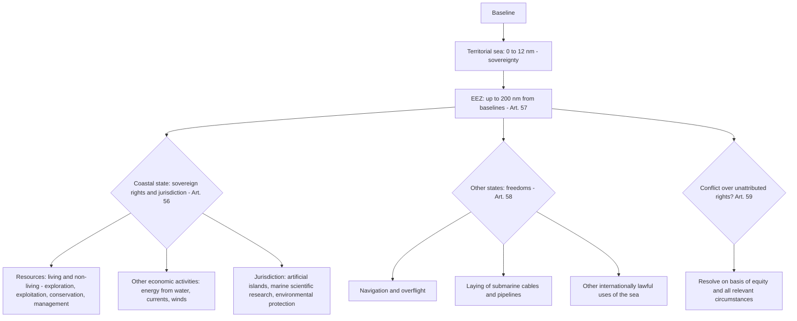

## The Exclusive Economic Zone Regime and Coastal State Resource Rights under UNCLOS

### The Conceptual Problem

Before the 1970s, the law of the sea divided the ocean into a narrow belt of coastal-state sovereignty (the territorial sea) and the high seas, where all states enjoyed freedom of fishing, navigation, and exploitation. That binary failed for two reasons. First, technology allowed distant-water fleets to deplete fish stocks and offshore hydrocarbon reserves adjacent to coasts that coastal states depended on. Second, developing coastal states, and Latin American states in particular, asserted extended jurisdiction unilaterally: Chile, Ecuador, and Peru in the 1952 Santiago Declaration claimed a 200-nautical-mile maritime zone, and Kenya introduced the "exclusive economic zone" concept at the 1972 Asian-African Legal Consultative Committee and in the UN Seabed Committee.

The **exclusive economic zone (EEZ)** is the compromise that emerged. It gives the coastal state **sovereign rights over resources** and **jurisdiction over specified activities** in a zone of up to 200 nautical miles from the baselines, while preserving for all other states the **high-seas freedoms of navigation, overflight, and laying of submarine cables and pipelines**. The EEZ is codified in **Part V (Articles 55 to 75)** of the **United Nations Convention on the Law of the Sea (UNCLOS)**, adopted at Montego Bay on 10 December 1982 and in force since 16 November 1994.

Recall that a **baseline** is the line from which the breadth of the territorial sea and every other maritime zone is measured, and that UNCLOS entitlements derive from land (the maxim *la terre domine la mer*). The EEZ is measured from the same baselines as the territorial sea.

The International Court of Justice (ICJ) has treated the EEZ as part of **customary international law**. In *Continental Shelf (Libya/Malta)* (Judgment, 1985), the Court recognised the 200-nautical-mile EEZ concept as part of contemporary customary law, and in *Nicaragua v. Colombia* (Territorial and Maritime Dispute, 2012), it confirmed the customary status of the entitlements in Articles 56 and 57. The United States, which has not ratified UNCLOS, proclaimed its own EEZ in Presidential Proclamation 5030 (1983) and treats the Part V balance as customary.

**Key Points**

- The EEZ is a **sui generis** zone: it is neither territory nor high seas, and residual rights not attributed by the Convention are resolved under Article 59 on the basis of equity and the interests involved.
- The coastal state has **sovereign rights** (a functional, resource-focused category) rather than **sovereignty**.
- Other states retain the freedoms of **navigation and overflight** and the **laying of cables and pipelines**, along with related lawful uses of the sea (Article 58).
- Unlike the territorial sea, the EEZ **does not exist automatically as a claim**: the coastal state must proclaim it, though the entitlement itself derives from law. [Inference] Whether entitlement exists *ipso jure* without a proclamation is generally answered in the affirmative for the continental shelf (Article 77(3)), while for the EEZ, state practice and the text of Article 57 (breadth "may not extend") suggest it is an entitlement to be established by the coastal state, and the point is debated.

### The Architecture of the EEZ Regime

| Article | Subject |
| --- | --- |
| 55 | Specific legal regime of the EEZ |
| 56 | Rights, jurisdiction, and duties of the coastal state |
| 57 | Breadth (200 nautical miles) |
| 58 | Rights and duties of other states |
| 59 | Basis for the resolution of conflicts regarding attribution of rights and jurisdiction |
| 60 | Artificial islands, installations, and structures |
| 61 | Conservation of living resources |
| 62 | Utilisation of living resources |
| 63 | Stocks occurring within the EEZs of two or more states, or both within the EEZ and beyond |
| 64 | Highly migratory species |
| 65 | Marine mammals |
| 66 | Anadromous stocks |
| 67 | Catadromous species |
| 68 | Sedentary species |
| 69 | Right of land-locked states |
| 70 | Right of geographically disadvantaged states |
| 71 | Non-applicability of Articles 69 and 70 in certain cases |
| 72 | Restrictions on transfer of rights |
| 73 | Enforcement of laws and regulations of the coastal state |
| 74 | Delimitation between states with opposite or adjacent coasts |
| 75 | Charts and lists of geographical coordinates |

### The Legal Character of the EEZ (Article 55)

**Article 55** defines the EEZ as "an area beyond and adjacent to the territorial sea, subject to the specific legal regime established in this Part, under which the rights and jurisdiction of the coastal State and the rights and freedoms of other States are governed by the relevant provisions of this Convention."

Three points follow.

1. **Specific legal regime.** The EEZ is a category of its own. The Convention did not assimilate it to the high seas or to the territorial sea. This choice was deliberate: the compromise at the Third UN Conference on the Law of the Sea (1973 to 1982) gave coastal states functional control over resources and related activities, and preserved for maritime powers the communication freedoms that they regarded as essential.
2. **Relationship with the high seas.** Article 58(2) applies Articles 88 to 115 and other pertinent rules of international law to the EEZ **insofar as they are not incompatible with Part V**. This incorporates by reference much of the law of the high seas, including flag-state jurisdiction, and the rules on piracy (Article 100), the slave trade (Article 99), and unauthorised broadcasting (Article 109).
3. **Residual rights.** Article 59 addresses cases where the Convention does not attribute rights or jurisdiction to the coastal state or to other states within the EEZ, and a conflict arises. It provides that the conflict "should be resolved on the basis of **equity** and in the light of all the relevant circumstances, taking into account the respective importance of the interests involved to the parties as well as to the international community as a whole." The provision was a compromise between the position that residual rights belong to the coastal state and the position that they belong to the international community. In the ***M/V "Virginia G" Case (Panama/Guinea-Bissau)*** (ITLOS, 2014), the Tribunal treated bunkering of foreign vessels fishing in the EEZ as an activity related to fishing which the coastal state can regulate, showing that an expansive interpretation of coastal-state jurisdiction is available for activities related to the exercise of sovereign rights.

### Breadth and Outer Limit (Article 57)

**Article 57** provides that the EEZ "shall not extend beyond **200 nautical miles from the baselines** from which the breadth of the territorial sea is measured." Since the territorial sea is up to 12 nautical miles, the EEZ occupies the area between 12 and 200 nautical miles from the baselines, though the legal regime applies from the outer limit of the territorial sea.

**Measurement.** A nautical mile is 1,852 metres. The 200-nautical-mile figure is a maximum, and the actual outer limit is subject to the rights of neighbouring states where zones overlap (Article 74) and to the rules for features that do not generate an EEZ (Article 121(3)).

**Publicity.** Under **Article 75**, the outer limit lines and lists of geographical coordinates of points shall be shown on charts of a scale adequate for ascertaining their position, and the coastal state shall give due publicity and deposit a copy with the UN Secretary-General.

**Entitlement and features.** Recall that under **Article 121**, islands generate an EEZ, but "rocks which cannot sustain human habitation or economic life of their own shall have no exclusive economic zone or continental shelf" (Article 121(3)), and that low-tide elevations generate no territorial sea or EEZ of their own (Article 13). These rules are essential for determining whether particular features are the source of an EEZ entitlement, and they are treated in the application section below.

### Coastal State Rights, Jurisdiction, and Duties (Article 56)

**Article 56(1)** provides that in the EEZ the coastal state has:

- **(a) Sovereign rights** for the purpose of **exploring and exploiting, conserving and managing the natural resources**, whether living or non-living, of the waters superjacent to the seabed and of the seabed and its subsoil, and with regard to **other activities for the economic exploitation and exploration of the zone**, such as the production of energy from the water, currents and winds;
- **(b) Jurisdiction** as provided for in the relevant provisions of the Convention with regard to:
  - **(i)** The establishment and use of **artificial islands, installations and structures**;
  - **(ii)** **Marine scientific research**;
  - **(iii)** The **protection and preservation of the marine environment**;
- **(c)** Other rights and duties provided for in the Convention.

#### Sovereign Rights versus Sovereignty

Recall that **sovereignty** is the plenary authority over a territory, exercised in the territorial sea (Article 2). **Sovereign rights** are a narrower, functionally defined set of powers, limited to specific purposes: resource activities and related economic exploitation. The distinction has practical consequences:

| Feature | Sovereignty (territorial sea) | Sovereign rights (EEZ) |
| --- | --- | --- |
| **Scope** | General authority over the zone, its airspace, seabed, and subsoil | Limited to resource-related and economic activities and specified jurisdiction |
| **Foreign navigation** | Innocent passage | Freedom of navigation |
| **Foreign overflight** | Requires coastal-state consent | Freedom of overflight |
| **Residual rights** | Belong to the coastal state | Resolved under Article 59 by equity |
| **Foreign military activities** | Regulated by coastal state (innocent passage restrictions) | Disputed; see below |

The text uses "sovereign rights", not "sovereignty," for the EEZ and continental shelf, and the ICJ, in *Nicaragua v. Colombia* (2012) and *Sovereignty and Sovereign Rights in the Caribbean Sea (Nicaragua v. Colombia)*, has treated the terms as distinct. The 2016 arbitral tribunal in *South China Sea Arbitration (Philippines v. China)* likewise treated the EEZ as a zone of sovereign rights and rejected any characterisation as territory.

#### Non-Living Resources

The coastal state has sovereign rights over the mineral and hydrocarbon resources in the seabed and subsoil, but for the seabed the EEZ regime **overlaps with the continental shelf regime**. Article 56(3) provides that the rights with respect to the seabed and subsoil shall be exercised in accordance with **Part VI** (continental shelf, Articles 76 to 85). The distinction is significant: the continental shelf right exists *ipso facto* and *ab initio*, and does not depend on occupation or express proclamation (Article 77(3)), whereas the EEZ requires proclamation and includes the water column. The ICJ in the *North Sea Continental Shelf Cases* (1969) established that the coastal state's rights over the continental shelf exist "*ipso jure*" as the natural prolongation of its land territory. [Inference] The doctrine of natural prolongation has diminished in importance for shelf within 200 nautical miles after *Libya/Malta* (1985), where the Court held that the distance criterion supersedes geological considerations within that limit, but it remains relevant beyond 200 nautical miles in defining the extended continental shelf.

#### Other Economic Activities

The reference to "production of energy from the water, currents and winds" in Article 56(1)(a) gives coastal states exclusive rights over **offshore renewable energy**, including offshore wind farms, tidal, and wave energy. This is of growing importance as states expand offshore wind capacity, and it means that foreign developers require coastal-state authorisation to build such installations in the EEZ. Installations related to such activities fall under Article 60 (artificial islands, installations, and structures).

#### Duties: "Due Regard" (Article 56(2))

Article 56(2) provides that in exercising its rights and performing its duties in the EEZ, the coastal state shall have **due regard to the rights and duties of other States** and shall act in a manner compatible with the Convention. This reciprocal duty of **due regard** appears in both directions: Article 58(3) requires other states to have due regard to the rights and duties of the coastal state, and to comply with the coastal state's laws and regulations adopted in accordance with the Convention and other rules of international law insofar as they are not incompatible with Part V.

The **Chagos Marine Protected Area Arbitration (Mauritius v. United Kingdom)** (PCA, Award of 18 March 2015) provides the leading authority on the "due regard" standard. The Tribunal held that "due regard" does not require a uniform standard applicable in all cases, and that its content depends on the nature of the rights involved, the extent of the anticipated impairment, the nature of the proposed activity, and the availability of alternative approaches. It concluded that the UK's establishment of a marine protected area around the Chagos Archipelago, without meaningful consultation with Mauritius regarding Mauritian fishing rights, breached the UK's obligation to have due regard under Article 56(2). The Tribunal reasoned that the UK's duty ordinarily calls for **consultation** where the rights of another state are likely to be affected.

### Rights and Duties of Other States (Article 58)

**Article 58(1)** provides that in the EEZ, all states, whether coastal or land-locked, enjoy, subject to the relevant provisions of the Convention, the **freedoms referred to in Article 87** (freedom of the high seas) of **navigation and overflight** and of the **laying of submarine cables and pipelines**, and **other internationally lawful uses of the sea related to these freedoms**, such as those associated with the operation of ships, aircraft, and submarine cables and pipelines, and compatible with the other provisions of the Convention.

**Article 58(3)** provides that in exercising their rights and performing their duties, states shall have **due regard** to the rights and duties of the coastal state and shall **comply with the laws and regulations** adopted by the coastal state in accordance with the Convention and other rules of international law insofar as they are not incompatible with Part V.

**What is excluded from Article 58?** Notably, the high-seas freedoms of **fishing**, of **constructing artificial islands and installations**, and of **scientific research** (Article 87(1)(d), (e), and (f)) are not listed. These are governed by coastal-state rights under Article 56 and by the specific provisions of Part V. Foreign fishing in the EEZ requires coastal-state authorisation (Article 62), and the coastal state controls scientific research (Article 246).

#### The Military Activities Controversy

The most contested question about the EEZ is whether foreign states may conduct **military activities** in another state's EEZ without the coastal state's consent. Two positions are maintained.

- **Position of maritime powers (for example, the United States, the United Kingdom, Japan, and Australia):** Military activities, including **naval exercises, surveillance, intelligence gathering, and military survey**, fall within "other internationally lawful uses of the sea related to [the freedoms of navigation and overflight]" in Article 58(1). Because the EEZ is not territory, and the coastal state's powers are limited to the functional categories in Article 56, the coastal state has no authority to prohibit or regulate military activities that do not interfere with its resource or environmental rights. The maritime powers point to the drafting history: proposals at the Third Conference to give coastal states security authority in the EEZ were not adopted.
- **Position of some coastal states (for example, China, India, Brazil, Malaysia, and Pakistan):** Military activities, especially **military surveying and intelligence collection**, require the coastal state's consent, because such activities are inconsistent with the coastal state's rights over marine scientific research, with its security interests, and with the requirement that other states have "due regard" for the coastal state's rights and act peacefully (Article 301). They rely on Article 88 (reservation of the high seas for peaceful purposes, applied to the EEZ by Article 58(2)) and Article 301 (peaceful uses of the seas). Several states made declarations on signature or ratification asserting that military exercises in the EEZ require prior consent.

Both positions can appeal to the text. The maritime powers' reading has strong support in the structure of the Convention and the drafting history, while the coastal states point to the residual nature of Article 59 and to the security dimension. The ICJ and ITLOS have not resolved the point. [Inference] State practice indicates that routine naval movements and exercises in the EEZ are common and often tolerated, while military survey and intelligence-gathering activities lead to diplomatic protests and, on occasion, incidents such as the **1 April 2001 EP-3 collision** between a US Navy surveillance aircraft and a Chinese fighter jet over the South China Sea, and the **2009 *USNS Impeccable* incident**, in which Chinese vessels harassed a US Navy ocean surveillance ship operating about 75 nautical miles south of Hainan Island.

**Strongest form of each side.** The maritime powers argue that limiting the EEZ regime to resource and environmental jurisdiction is the only reading that preserves the bargain struck in 1982, since accepting coastal-state veto power over military activities would convert 38 percent of the oceans into quasi-territorial waters and undermine global mobility. The coastal states argue that an EEZ is a zone in which the coastal state has a legitimate interest in knowing what is being done off its coast, that military surveying (for example, mapping the seabed, monitoring marine conditions for submarine operations) may in substance be marine scientific research or preparation for hostilities, and that treating the EEZ as an area of unrestricted military use discounts the "peaceful purposes" provisions of the Convention and the legitimate security concerns of coastal states.

### Artificial Islands, Installations, and Structures (Article 60)

**Article 60(1)** gives the coastal state the **exclusive right to construct and to authorise and regulate** the construction, operation, and use of:

- **(a)** Artificial islands;
- **(b)** Installations and structures for the purposes provided for in Article 56 and other economic purposes;
- **(c)** Installations and structures which may interfere with the exercise of the rights of the coastal state in the zone.

The coastal state has **exclusive jurisdiction** over such islands, installations, and structures, including jurisdiction with regard to customs, fiscal, health, safety, and immigration laws and regulations (Article 60(2)).

**Safety zones.** The coastal state may establish reasonable **safety zones** around them, not exceeding **500 metres** unless authorised by generally accepted international standards or recommended by the International Maritime Organization (Article 60(4) and (5)). Ships must respect these zones.

**Status.** **Article 60(8)** provides that artificial islands, installations, and structures **do not possess the status of islands**. They have **no territorial sea of their own**, and their presence does not affect the delimitation of the territorial sea, the EEZ, or the continental shelf. This provision was central to the 2016 South China Sea Arbitration: China's land reclamation on seven reefs did not change their legal status under Article 121 or Article 13, because artificial modification does not transform a low-tide elevation into an island.

**Removal.** Under Article 60(3), abandoned or disused installations or structures shall be removed to ensure safety of navigation, taking into account generally accepted international standards established by the competent international organisation (the IMO), with due regard to fishing, the protection of the marine environment, and the rights and duties of other states.

### Living Resources: Conservation and Utilisation (Articles 61 to 68)

#### The Coastal State's Duty of Conservation (Article 61)

**Article 61(1)** requires the coastal state to determine the **allowable catch** of the living resources in its EEZ. **Article 61(2)** provides that the coastal state, taking into account the best scientific evidence available to it, shall ensure through proper conservation and management measures that the maintenance of the living resources in the EEZ is **not endangered by over-exploitation**. As appropriate, the coastal state and competent international organisations (sub-regional, regional, or global) shall cooperate to this end.

**Article 61(3)** requires that such measures be designed to maintain or restore populations of harvested species at levels which can produce the **maximum sustainable yield (MSY)**, as qualified by relevant environmental and economic factors, including the economic needs of coastal fishing communities and the special requirements of developing states, and taking into account fishing patterns, the interdependence of stocks, and generally recommended international minimum standards.

**Article 61(4)** requires the coastal state to take into consideration the effects on species associated with or dependent upon harvested species (ecosystem considerations).

The **MSY standard** is the maximum average catch that can be harvested from a stock over time without depleting it. Because it is qualified by economic and environmental factors, the coastal state has considerable discretion, and the duty is one of conduct, not of result. A significant feature is that the determination of the allowable catch is **for the coastal state**, and the Convention leaves it to the coastal state to determine its own harvesting capacity (Article 62(2)).

#### Utilisation and the Surplus Concept (Article 62)

**Article 62(1)** provides that the coastal state shall promote the objective of **optimum utilisation** of the living resources in the EEZ, without prejudice to Article 61.

**Article 62(2)** provides that the coastal state shall determine its **capacity to harvest** the living resources of the EEZ. Where the coastal state does not have the capacity to harvest the entire allowable catch, it shall, through **agreements or other arrangements** and pursuant to the terms, conditions, laws, and regulations referred to in paragraph 4, give **other states access to the surplus** of the allowable catch, having particular regard to Articles 69 and 70 (land-locked and geographically disadvantaged states) and to the requirements of developing states in the sub-region or region.

The **surplus concept** is central: the coastal state has exclusive rights to the allowable catch up to its harvesting capacity, and only the **surplus** must be made available to others. The obligation to grant access is **qualified**, since the coastal state itself determines both its capacity and the allowable catch. The Convention does not establish a compulsory dispute settlement mechanism for the coastal state's discretionary determinations: **Article 297(3)(a)** excludes from compulsory binding procedures disputes relating to the coastal state's sovereign rights with respect to living resources in the EEZ, including its **discretionary powers for determining the allowable catch, its harvesting capacity, the allocation of surpluses to other states, and the terms and conditions established in its conservation and management laws**. These matters are subject only to **compulsory conciliation** in narrow circumstances (Article 297(3)(b)), for example where the coastal state has manifestly failed to comply with its obligations to ensure through proper conservation and management measures that the maintenance of the living resources is not seriously endangered.

**Article 62(4)** lists the matters that the coastal state's laws and regulations may regulate for foreign nationals fishing in the EEZ, including:

- Licensing of fishermen, fishing vessels, and equipment, including payment of fees or other forms of remuneration;
- Determining the species that may be caught, and fixing quotas;
- Regulating seasons and areas of fishing, types and sizes of gear, and types, sizes, and number of fishing vessels;
- Fixing the age and size of fish and other species that may be caught;
- Specifying information required of fishing vessels, including catch and effort statistics;
- Requiring the conduct of specified fisheries research programmes under the authorisation and control of the coastal state;
- The placing of observers or trainees on board;
- The landing of all or any part of the catch in the ports of the coastal state;
- Terms and conditions relating to joint ventures or other cooperative arrangements;
- Requirements for the training of personnel and the transfer of fisheries technology;
- Enforcement procedures.

#### Transboundary and Migratory Stocks (Articles 63 to 67)

| Article | Category | Regime |
| --- | --- | --- |
| **63(1)** | Stocks occurring within the EEZs of two or more coastal states | Coastal states shall seek, either directly or through appropriate sub-regional or regional organisations, to agree upon the measures necessary to coordinate and ensure the conservation and development of such stocks |
| **63(2)** | Stocks occurring both within the EEZ and in an area beyond and adjacent to it (**straddling stocks**) | The coastal state and states fishing for such stocks in the adjacent area shall seek, directly or through appropriate sub-regional or regional organisations, to agree upon the measures necessary for the conservation of these stocks |
| **64** and Annex I | **Highly migratory species** (for example, tunas, marlin, swordfish) | The coastal state and other states whose nationals fish in the region shall cooperate directly or through appropriate international organisations, with a view to ensuring conservation and promoting the objective of optimum utilisation throughout the region, both within and beyond the EEZ |
| **65** | **Marine mammals** | Nothing restricts the right of a coastal state or the competence of an international organisation to prohibit, limit, or regulate the exploitation of marine mammals more strictly than provided in Part V; states shall cooperate for their conservation, and in the case of cetaceans work through appropriate international organisations for conservation, management, and study |
| **66** | **Anadromous stocks** (for example, salmon), which spawn in freshwater and migrate to sea | The **state of origin** has primary interest in and responsibility for such stocks; fishing is permitted only in waters landward of the outer limit of the EEZ, except where this would result in economic dislocation for a state other than the state of origin |
| **67** | **Catadromous species** (for example, eels), which spend most of their life in freshwater and migrate to the sea to spawn | The coastal state in whose waters they spend the greater part of their life cycle is responsible for their management, and harvesting is permitted only in waters landward of the outer limits of the EEZ |
| **68** | **Sedentary species** | Part V does not apply to sedentary species as defined in Article 77(4), which are subject to the continental shelf regime |

The duty in Articles 63 and 64 is one of **cooperation** and **negotiation**: it does not oblige the states concerned to reach agreement, but it obliges them to seek to agree in good faith. These provisions were supplemented by the **1995 UN Fish Stocks Agreement** (Agreement for the Implementation of the Provisions of the UNCLOS relating to the Conservation and Management of Straddling Fish Stocks and Highly Migratory Fish Stocks), in force since 2001, which introduced the **precautionary approach**, compatibility requirements between measures in the EEZ and on the high seas, and strengthened regional fisheries management organisations (RFMOs), and by the **1993 FAO Compliance Agreement** and the **2009 FAO Port State Measures Agreement** aimed at combating illegal, unreported, and unregulated (IUU) fishing.

#### Land-Locked and Geographically Disadvantaged States (Articles 69 and 70)

- **Article 69** gives **land-locked states** the right to participate, on an equitable basis, in the exploitation of an appropriate part of the surplus of the living resources of the EEZs of coastal states of the same sub-region or region, taking into account the relevant economic and geographical circumstances of all the states concerned.
- **Article 70** grants the equivalent right to **geographically disadvantaged states**, defined as coastal states, including states bordering enclosed or semi-enclosed seas, whose geographical situation makes them dependent upon the exploitation of the living resources of the EEZs of other states in the sub-region or region for adequate supplies of fish, and coastal states which can claim no EEZ of their own.
- **Article 71** disapplies Articles 69 and 70 in the case of coastal states whose economy is overwhelmingly dependent on the exploitation of the living resources of their EEZ.
- **Article 72** prohibits the direct or indirect transfer of these rights to third states or their nationals by lease, licence, joint ventures, or any other arrangement, unless the states concerned agree otherwise.

These rights are heavily conditioned by the terms of bilateral, sub-regional, or regional agreements and depend on the existence of a "surplus." In practice, their operation has been very limited.

### Enforcement Jurisdiction (Article 73)

**Article 73(1)** authorises the coastal state, in the exercise of its sovereign rights to explore, exploit, conserve, and manage the living resources in the EEZ, to take such measures, including **boarding, inspection, arrest, and judicial proceedings**, as may be necessary to ensure compliance with the laws and regulations adopted by it in conformity with the Convention.

The Convention then sets **safeguards**:

- **Article 73(2):** Arrested vessels and their crews shall be **promptly released** upon the posting of a **reasonable bond or other security**.
- **Article 73(3):** Coastal state penalties for violations of fisheries laws and regulations in the EEZ may **not include imprisonment**, in the absence of agreements to the contrary by the states concerned, **or any other form of corporal punishment**.
- **Article 73(4):** In cases of arrest or detention of foreign vessels, the coastal state shall **promptly notify the flag state**, through appropriate channels, of the action taken and of any penalties subsequently imposed.

**Article 292** (prompt release) gives the flag state a special procedure before ITLOS: where the authorities of a state party have detained a vessel flying the flag of another state party and it is alleged that the detaining state has not complied with the provisions of the Convention for the prompt release of the vessel or its crew upon the posting of a reasonable bond or other financial security, the question of release may be submitted to a court or tribunal agreed upon by the parties, or, failing such agreement within 10 days from the time of detention, to ITLOS. The leading cases include *"Camouco" (Panama v. France)* (ITLOS, 2000), *"Monte Confurco" (Seychelles v. France)* (ITLOS, 2000), and *"Volga" (Russian Federation v. Australia)* (ITLOS, 2002), through which the Tribunal developed the criteria for what constitutes a "reasonable" bond, including the gravity of the alleged offences, the penalties imposed or imposable, the value of the detained vessel and cargo, and the amount of the bond imposed by the detaining state and its form.

The ***M/V "Saiga" (No. 2) Case (Saint Vincent and the Grenadines v. Guinea)*** (ITLOS, Judgment, 1999) establishes limits on enforcement: the arrest of the *Saiga* for bunkering activities allegedly in breach of Guinean customs laws was held unlawful because Guinea's customs laws could not be applied in the EEZ beyond the limited exceptions in Article 60(2) (customs jurisdiction over artificial islands and installations) and Article 33 (contiguous zone). The Tribunal also held that the use of excessive force in stopping and arresting the vessel violated international law, applying the standard that force must be avoided as far as possible and, where unavoidable, may not go beyond what is reasonable and necessary in the circumstances.

The *"Virginia G"* decision (ITLOS, 2014) qualified *Saiga (No. 2)* by holding that bunkering of vessels fishing in the EEZ is an activity related to fishing that the coastal state may regulate in the exercise of its sovereign rights.

#### Limits: No Imprisonment for Fisheries Offences

The prohibition on imprisonment in Article 73(3) has significant practical effect. A coastal state that imprisons foreign crew for fisheries violations in its EEZ (absent an agreement to the contrary) acts inconsistently with the Convention. In the **"Enrica Lexie" Incident (Italy v. India)** (Award of 21 May 2020, PCA Case No. 2015-28, concerning the shooting of two Indian fishermen by Italian marines guarding an Italian-flagged vessel off the Kerala coast), the Tribunal held that India had jurisdiction to some extent, but that the Italian marines were entitled to immunity as state officials for acts performed in the exercise of official functions, and that Italy was entitled to compensation for the loss of life. The case shows how EEZ incidents can raise issues of concurrent jurisdiction and immunity.

### The Duty to Protect the Marine Environment and Jurisdiction over Marine Scientific Research

#### Environmental Jurisdiction

Under Article 56(1)(b)(iii), the coastal state has **jurisdiction** with regard to the protection and preservation of the marine environment. Part XII of UNCLOS elaborates this jurisdiction:

- **Article 208** (pollution from seabed activities subject to national jurisdiction) and **Article 214** (enforcement) give the coastal state authority to adopt and enforce laws in respect of pollution from seabed activities.
- **Article 211(5)** allows coastal states to adopt laws and regulations for the prevention, reduction, and control of **vessel-source pollution** in their EEZ, conforming to and giving effect to **generally accepted international rules and standards** established through the competent international organisation (the IMO).
- **Article 211(6)** allows special mandatory measures in clearly defined areas of the EEZ where particular circumstances require them, subject to IMO approval.
- **Article 220** gives enforcement powers over foreign vessels for violations of applicable laws and rules in the EEZ, with graduated powers depending on the gravity of the violation: requiring the vessel to give information (Article 220(3)), physically inspecting the vessel where there are clear grounds for believing that the vessel has committed a violation resulting in a substantial discharge causing or threatening significant pollution (Article 220(5)), and instituting proceedings, including detention, where there is clear objective evidence of a violation resulting in a discharge causing major damage or threat of major damage to the coastline or related interests, or to any resources of the territorial sea or EEZ (Article 220(6)).
- **Article 234** (ice-covered areas) allows coastal states to adopt and enforce non-discriminatory laws for the prevention, reduction, and control of marine pollution from vessels in ice-covered areas within the limits of the EEZ.

In the ***South China Sea Arbitration*** (2016), the Tribunal held that China had breached Articles 192 (general obligation to protect and preserve the marine environment) and 194(5) (measures necessary to protect and preserve rare or fragile ecosystems and the habitat of depleted, threatened, or endangered species) through its large-scale island-building and its toleration of harvesting of endangered species such as giant clams by Chinese fishermen.

#### Marine Scientific Research (Articles 246 to 254)

**Article 246(1)** provides that coastal states, in the exercise of their jurisdiction, have the **right to regulate, authorise, and conduct marine scientific research** in their EEZ and on their continental shelf. Marine scientific research in the EEZ shall be conducted **with the consent of the coastal state** (Article 246(2)).

**Article 246(3)** provides that in normal circumstances, coastal states shall grant their consent for marine scientific research projects by other states or competent international organisations in their EEZ or on their continental shelf to be carried out **exclusively for peaceful purposes and in order to increase scientific knowledge** of the marine environment for the benefit of all mankind. **Article 246(5)** gives the coastal state discretion to **withhold consent** if the project:

- **(a)** Is of direct significance for the exploration and exploitation of natural resources, whether living or non-living;
- **(b)** Involves drilling into the continental shelf, the use of explosives, or the introduction of harmful substances into the marine environment;
- **(c)** Involves the construction, operation, or use of artificial islands, installations, and structures; or
- **(d)** Contains information communicated regarding the nature and objectives of the project that is inaccurate, or if the researching state or organisation has outstanding obligations to the coastal state from a prior research project.

**Article 252** provides for **implied consent**: states may proceed with a research project six months after the date upon which the information required was provided to the coastal state, unless within four months the coastal state has informed the researching state that it has refused consent, requires more information, or that there are outstanding obligations from a previous project.

Under Article 249, the researching state must comply with conditions including the right of the coastal state to participate in the project, the provision of reports and results, and assurance that the coastal state has access to all data and samples.

The line between **marine scientific research**, which requires consent, and **military surveys, hydrographic surveys, and other information-gathering activities**, which the maritime powers consider to fall within Article 58 freedoms, is central to the military activities controversy discussed above. UNCLOS does not define marine scientific research, and the point is unresolved.

**Article 297(2)** limits compulsory dispute settlement: disputes concerning marine scientific research in the EEZ or continental shelf are subject to compulsory procedures except that the coastal state is not obliged to accept submission to settlement of any dispute arising out of the exercise by the coastal state of a right or discretion in accordance with Article 246 or a decision to order suspension or cessation of a research project in accordance with Article 253. Such disputes are subject to compulsory conciliation.

### Delimitation of the EEZ between States with Opposite or Adjacent Coasts (Article 74)

**Article 74(1)** provides that the delimitation of the EEZ between states with opposite or adjacent coasts shall be effected **by agreement on the basis of international law**, as referred to in Article 38 of the Statute of the International Court of Justice, **in order to achieve an equitable solution**. Article 74(2) provides that if no agreement can be reached within a reasonable period of time, the states concerned shall resort to the procedures provided for in Part XV (dispute settlement). Article 74(3) provides that pending agreement, the states concerned shall make every effort to enter into **provisional arrangements of a practical nature** and, during this transitional period, not to jeopardise or hamper the reaching of the final agreement.

The identical formula governs the continental shelf (Article 83). This wording is a compromise between the **equidistance/special circumstances** approach favoured by some states (as in Article 15 for the territorial sea) and the **equitable principles** approach favoured by others.

#### The Three-Stage Methodology

The ICJ and international tribunals have developed a consistent methodology, established in ***Maritime Delimitation in the Black Sea (Romania v. Ukraine)*** (ICJ, 2009) and followed in subsequent cases such as *Nicaragua v. Colombia* (2012), *Peru v. Chile* (2014), and the ITLOS *Bay of Bengal Case (Bangladesh/Myanmar)* (2012):

| Stage | Task | Notes |
| --- | --- | --- |
| **Stage 1** | Construct a **provisional equidistance line** using appropriate basepoints on the relevant coasts | For adjacent coasts, the equidistance line; for opposite coasts, the median line. Departure only where compelling reasons make equidistance unworkable |
| **Stage 2** | Consider whether there are **relevant circumstances** that require adjustment of the provisional line to achieve an equitable result | Relevant circumstances include the general configuration of the coasts, the presence of islands, and in limited situations, conduct of the parties. Economic factors and access to resources are generally not relevant unless catastrophic |
| **Stage 3** | Apply the **disproportionality test**: verify that the line does not lead to a marked disproportion between the ratio of the respective coastal lengths and the ratio of the maritime areas allocated to each state | A check on equitableness, not a requirement of proportionality |

The ITLOS in the *Bay of Bengal Case (Bangladesh/Myanmar)* (2012) delimited the EEZ and continental shelf (including beyond 200 nautical miles) and used the **angle-bisector method** for the territorial sea and EEZ in view of the concavity of the coast, and the "equidistance/relevant circumstances" method for the continental shelf. The ***Bay of Bengal Arbitration (Bangladesh v. India)*** (Annex VII, 2014) followed similar reasoning.

A single boundary for the EEZ and the continental shelf, often called a **single maritime boundary**, is commonly drawn, and this was applied in *Gulf of Maine (Canada/United States)* (Chamber of the ICJ, 1984).

#### Provisional Arrangements and Joint Development

Where delimitation is unresolved, **joint development zones** and provisional arrangements are common. Examples include the **Timor Gap Treaty** (Australia and Indonesia, 1989, later replaced), the **Thailand–Malaysia Joint Development Area** (1979 Memorandum of Understanding), and the **Japan–South Korea Joint Development Zone** (1974 agreement). A duty to make every effort to enter into provisional arrangements is imposed by Articles 74(3) and 83(3), and the ITLOS in *Ghana/Côte d'Ivoire* (Special Chamber, 2017) considered the significance of this duty.

### Overlapping Entitlements and the Role of Features

The EEZ entitlement depends on the classification of features under Articles 13 and 121. Recall that:

- **Islands** generate a territorial sea, contiguous zone, EEZ, and continental shelf.
- **Rocks** (Article 121(3)) generate only a territorial sea and contiguous zone.
- **Low-tide elevations** generate no territorial sea, EEZ, or continental shelf of their own.

In delimitation, **islands** may be given **reduced effect** (or "enclaved" with a 12-nautical-mile territorial sea) where full effect would produce an inequitable result. The ICJ in *Nicaragua v. Colombia* (2012) enclaved the Colombian islands of Quitasueño, Serrana, and Serranilla, and gave the smaller Colombian islands reduced or no effect on the delimitation in the light of the disparity in coastal lengths.

### Application to Philippine Interests: The South China Sea Arbitration

The **South China Sea Arbitration (Philippines v. China)** (PCA Case No. 2013-19, Award of 12 July 2016), decided by an Annex VII tribunal, is the most important application of the EEZ regime to Philippine interests, and it directly addressed the coastal-state resource rights discussed above.

#### Historic Rights and the Nine-Dash Line

China claimed "historic rights" over living and non-living resources within the area encompassed by the "nine-dash line." The Tribunal held that:

- To the extent that China had historic rights to resources in the waters of the South China Sea, such rights were **superseded by the Convention** insofar as they were incompatible with its system of maritime zones. The Convention comprehensively allocates rights to resources and does not contain a category of historic rights to resources within the EEZ of another state.
- There was **no legal basis** for China to claim historic rights to resources within the sea areas falling within the nine-dash line, beyond the entitlements that China could claim under the Convention.

Recall that UNCLOS, in Article 62 and Article 297(3), gives the coastal state the exclusive right to determine the allowable catch and the surplus: the Tribunal's reasoning on incompatibility rests on the fact that these coastal-state rights are inconsistent with a claim by another state to historic rights over the same resources.

#### Status of Features and EEZ Entitlements

The Tribunal held that **none** of the high-tide features in the Spratly Islands, including **Itu Aba (Taiping)**, the largest, is capable of generating an EEZ or continental shelf under Article 121(3), because none can sustain human habitation or economic life of its own. It concluded that all high-tide features in the Spratlys are legally "rocks" for the purposes of Article 121(3), and as a result, **there is no overlapping entitlement to an EEZ** between China and the Philippines in the areas concerned, since the only features capable of generating EEZs in the area are Philippine (the main archipelago, including Palawan). This finding allowed the Tribunal to declare that **certain areas are within the Philippines' EEZ**, in particular the area around **Mischief Reef** and **Second Thomas Shoal**, both low-tide elevations that lie within 200 nautical miles of the Philippine coast and outside 12 nautical miles of any high-tide feature capable of generating an entitlement to a territorial sea, and that the area of **Reed Bank** (Recto Bank) is within the Philippine EEZ and continental shelf, not overlapped by any Chinese entitlement.

#### Violation of the Philippines' Sovereign Rights

The Tribunal found that China had violated the Philippines' sovereign rights in its EEZ by:

- **(a)** Interfering with Philippine petroleum exploration at **Reed Bank** in March 2011 (the incident involving the survey vessel *MV Veritas Voyager*, when Chinese Marine Surveillance vessels ordered the survey vessel to leave the area);
- **(b)** Purporting to prohibit fishing by Philippine vessels in the EEZ through the **annual Chinese moratorium on fishing** (announced from 1999, and applied in areas of the Philippine EEZ);
- **(c)** Failing to prevent Chinese fishing vessels from fishing in the Philippine EEZ at **Mischief Reef** and **Second Thomas Shoal** without Philippine authorisation (a breach of the Philippines' exclusive right to determine the allowable catch and grant licences under Article 62);
- **(d)** Constructing installations and artificial islands on **Mischief Reef** without the authorisation of the Philippines (a breach of Article 60, the coastal state's exclusive right to construct and authorise the construction of installations and structures in its EEZ, and of Article 56).

Because the Philippines' rights over these areas rested on the EEZ regime of Part V, the Tribunal's reasoning directly applies Articles 56, 60, and 62. China's rejection of the Award and its continuing conduct engage the general law of state responsibility, including the duty of cessation and the bar on invoking internal law as justification.

#### Traditional Fishing Rights

The Tribunal distinguished **traditional fishing rights** in the territorial sea of Scarborough Shoal (preserved for Filipino and Chinese fishermen) from the exclusive fishing rights of the coastal state in the EEZ. It found that **Scarborough Shoal** generates a territorial sea only (as a rock under Article 121(3)) and that **traditional fishing rights** of Filipino fishermen at the shoal were not extinguished by the Convention, since the Convention does not deal with the rights of traditional artisanal fishers in the territorial sea in the same way as those in the EEZ (where such rights may be extinguished by the coastal state's exclusive rights). [Inference] The distinction in the Tribunal's reasoning, which preserves the traditional fishing rights in the territorial sea of a feature but not in an EEZ, is derived from its reading of the legal character of the two zones. It has been described by commentators as one of the more novel aspects of the Award.

#### The Maritime Zones Act and Domestic Implementation

The Philippines' **Maritime Zones Act (Republic Act No. 12064, 2024)** codifies the country's maritime zones, including the EEZ, consistent with UNCLOS and the 2016 Award. Under earlier practice, the 1978 **Presidential Decree No. 1599** established the Philippine EEZ, and the **Fisheries Code of 1998 (Republic Act No. 8550, as amended by Republic Act No. 10654 of 2015)** implements the coastal-state powers in the EEZ concerning licensing, illegal fishing, and vessel monitoring. The 1987 Philippine Constitution, Article XII, Section 2, provides that the State shall protect the nation's **marine wealth** in its archipelagic waters, territorial sea, and exclusive economic zone, and reserves the use and enjoyment of these resources exclusively to Filipino citizens. Under the same provision, the President may enter into agreements with foreign-owned corporations involving either technical or financial assistance for large-scale exploration, development, and utilisation of minerals, petroleum, and other mineral oils according to the general terms and conditions provided by law. [Unverified] Details of the current statute text and its implementing rules should be verified against the primary legislation before being relied upon.

#### The Enforcement Gap

China's non-acceptance of the Award means that the Philippines cannot rely on adjudicative enforcement. Recall that under Annex VII Article 11, the award is final and without appeal, and shall be complied with by the parties, and under Article 9, non-appearance does not bar proceedings. Coastal-state enforcement under Article 73 is available against foreign vessels in the Philippine EEZ, but its exercise against Chinese state vessels raises immunity issues: **warships and government ships operated for non-commercial purposes** enjoy immunity under Articles 95, 96, and 32, and coastal-state enforcement under Article 73 is directed at fishing vessels engaged in illegal fishing, not at state-owned vessels performing government functions. China's use of coast guard vessels and maritime militia in the Philippine EEZ therefore raises complex questions of the applicable law-enforcement standards, as well as attribution: recall the attribution rules for state organs and for persons acting under a state's instructions, direction, or control in ARSIWA Articles 4 and 8.

### Worked Example

**Example: EEZ analysis of a fishing and survey incident**

Coastal State C has proclaimed a 200-nautical-mile EEZ. Foreign State F sends:

1. A **fishing fleet** that fishes 150 nautical miles from C's baselines without a licence.
2. A **research vessel** conducting seabed mapping 100 nautical miles off C's coast, without notifying C.
3. A **naval task force** conducting live-fire exercises 120 nautical miles off C's coast.
4. A **bunkering vessel** refuelling F's fishing fleet in C's EEZ.

**Analysis**

1. **Fishing fleet:** The right to fish in the EEZ is not among the freedoms in Article 58. C has sovereign rights to explore, exploit, conserve, and manage living resources (Article 56(1)(a)) and may determine the allowable catch and its own capacity (Articles 61 and 62). Unlicensed fishing is a violation of C's laws adopted under Article 62(4). C may take enforcement measures under Article 73(1), including boarding, inspection, arrest, and judicial proceedings, but must promptly release the vessel and crew upon a reasonable bond (Article 73(2)), may not impose imprisonment absent an agreement (Article 73(3)), and must promptly notify the flag state (Article 73(4)). F may apply to ITLOS for prompt release under Article 292.
2. **Research vessel:** Under Article 246, marine scientific research in C's EEZ requires C's consent. If the survey is marine scientific research, F has violated Article 246(2). If F characterises it as a hydrographic or military survey, the maritime-powers reading would treat it as an Article 58 use, and the coastal-state reading would treat it as requiring consent. The dispute over characterisation is unresolved in law, and the Article 297(2) limits on compulsory settlement of marine scientific research disputes would apply if characterised as such.
3. **Naval exercises:** Under the maritime powers' interpretation, F's exercises fall within Article 58(1) as internationally lawful uses of the sea related to navigation, provided F has due regard to C's rights (Article 58(3)), for example by avoiding interference with C's fisheries or installations, and issues notice to mariners. Under the coastal-state interpretation, C could require prior consent. Practice is divided.
4. **Bunkering vessel:** Following the *"Virginia G"* decision (ITLOS, 2014), C may regulate bunkering of foreign fishing vessels in its EEZ as an activity related to fishing, and the enforcement provisions of Article 73 apply to violations.

### Areas of Continuing Debate

1. **Military activities in the EEZ.** As set out above, the divide between maritime powers and coastal states over consent for military exercises and surveys remains unresolved.
2. **Residual rights under Article 59.** Whether residual rights presumptively belong to the coastal state or to the international community, and how the "equity" standard should operate in new contexts such as offshore renewable energy, carbon capture and storage, and undersea data infrastructure. [Speculation] Emerging uses such as offshore carbon sequestration and marine geoengineering may prompt claims that Article 56(1)(a)'s reference to "other activities for the economic exploitation and exploration of the zone" covers them.
3. **Historic rights and "traditional fishing".** Following the 2016 Award, whether any category of historic right to resources in another state's EEZ can persist alongside Part V.
4. **The reach of Article 121(3).** The 2016 Tribunal's strict natural-capacity reading has been challenged by some commentators and states, and the practical effect on the maritime entitlements of remote island territories is significant. Recall the strict natural-condition test outlined in the Award: whether a feature can sustain a stable human community or economic life of its own without external supplies.
5. **Sea-level rise.** Whether EEZ limits, once established and deposited under Article 75, must be treated as fixed notwithstanding coastline changes. The 2021 Pacific Islands Forum Declaration on Preserving Maritime Zones in the Face of Climate Change-related Sea-Level Rise supports the principle of stability, but UNCLOS text does not expressly mandate it. [Inference] The trend in state practice and in the International Law Commission's study suggests growing support for the fixed-limits position.
6. **Illegal, unreported, and unregulated (IUU) fishing and flag-state responsibility.** The ITLOS Advisory Opinion in the *Request for an Advisory Opinion Submitted by the Sub-Regional Fisheries Commission (SRFC)* (2015) held that flag states have a duty to ensure that vessels flying their flag comply with the coastal state's conservation measures in its EEZ and that the flag state is liable if it fails to exercise due diligence, though it is not liable for the vessel's violations as such. The Tribunal also held that the coastal state has the primary responsibility for the conservation and management of shared stocks in its EEZ, and that the flag state has a duty of due diligence.
7. **Environmental protection and climate change.** The 2024 ITLOS Advisory Opinion on **Climate Change and International Law** (Request by the Commission of Small Island States, delivered 21 May 2024) held that anthropogenic greenhouse gas emissions constitute marine pollution under Article 1(1)(4) of UNCLOS and that states have specific obligations under Part XII to prevent, reduce, and control such pollution. [Unverified] Details of the Opinion's holdings and operative paragraphs should be verified against the text of the Opinion before being relied upon.

### Common Misconceptions

- **"The EEZ is part of a state's territory."** Incorrect. The coastal state has sovereign rights and jurisdiction, not sovereignty, in the EEZ.
- **"Foreign ships need permission to navigate through the EEZ."** Incorrect. Freedom of navigation and overflight applies (Article 58), subject to due regard and compliance with the coastal state's laws consistent with Part V.
- **"The EEZ is a high-seas zone for fishing."** Incorrect. Fishing in the EEZ is governed by the coastal state's exclusive rights and requires authorisation (Articles 56, 61, 62).
- **"A coastal state must automatically share surplus catch with any state that asks."** Incorrect. The surplus obligation depends on the coastal state's own determination of the allowable catch and its capacity, and it is not subject to compulsory binding settlement (Article 297(3)(a)).
- **"Every island generates a 200-nautical-mile EEZ."** Incorrect. Rocks under Article 121(3) do not, and low-tide elevations do not generate entitlements of their own.
- **"A coastal state can imprison foreign fishermen for fisheries violations in its EEZ."** Incorrect, in the absence of agreement to the contrary (Article 73(3)).
- **"Building artificial islands can extend a state's EEZ."** Incorrect. Artificial islands have no territorial sea of their own and do not affect delimitation (Article 60(8)).
- **"UNCLOS gives the coastal state the right to veto foreign military activities in its EEZ."** Contested, and not supported by the text of Article 56 as read by the maritime powers, though several coastal states maintain otherwise.

### Conclusion

The exclusive economic zone regime is the central compromise of the 1982 Convention. It vests in the coastal state **sovereign rights over living and non-living resources and related economic activities**, as well as **jurisdiction over artificial islands, marine scientific research, and environmental protection**, out to 200 nautical miles from baselines, while preserving for all states the **communication freedoms of navigation, overflight, and cable-laying**. The regime is characterised by carefully calibrated powers: broad control over fisheries, conditioned by duties of conservation, optimum utilisation, and access for surplus stocks; enforcement powers subject to prompt release and the bar on imprisonment; and a system of **due regard** that obliges coastal and other states alike to accommodate each other's rights. The unresolved questions, notably the status of foreign military activities, the reach of residual rights under Article 59, and the effect of climate-driven change on maritime limits, reflect the tension between coastal-state control and the international community's interest in the freedom of the seas. For the Philippines, the EEZ regime is the legal basis of its resource entitlement in the West Philippine Sea, and the 2016 Arbitration Award demonstrated both the strength of the rule-based framework and the practical limits of enforcement in the absence of a compulsory enforcement mechanism.

**Related Topics**

- The continental shelf: natural prolongation, the 200-nautical-mile and extended shelf, and the Commission on the Limits of the Continental Shelf
- Delimitation of maritime boundaries: equidistance, relevant circumstances, and the disproportionality test
- The regime of islands, rocks, and low-tide elevations under UNCLOS Articles 13 and 121
- The 1995 UN Fish Stocks Agreement, regional fisheries management organisations, and IUU fishing
- Marine scientific research, military surveys, and hydrographic activities
- Protection and preservation of the marine environment under UNCLOS Part XII and vessel-source pollution
- Dispute settlement under UNCLOS Part XV: ITLOS, Annex VII arbitration, prompt release, and the limits in Articles 297 and 298
- Joint development zones and provisional arrangements in disputed maritime areas
- The high seas regime: freedoms, flag-state jurisdiction, and enforcement powers
- The 2016 South China Sea Arbitration, the enforcement of UNCLOS awards, and Philippine domestic maritime legislation