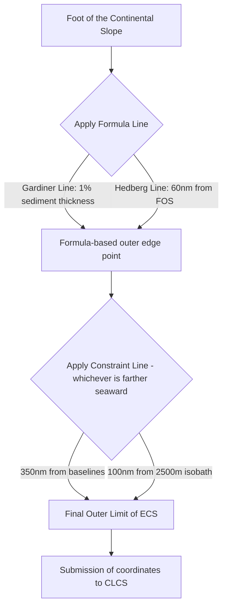

## The Continental Shelf, Extended Continental Shelf Claims, and the CLCS

### Doctrinal Foundation: Defining the Continental Shelf

The continental shelf is a maritime zone in which a coastal state exercises **sovereign rights** for the purpose of exploring and exploiting natural resources, without possessing full sovereignty over the water column above it. This distinction matters: sovereign rights over the shelf are functional and resource-specific, whereas sovereignty over territorial sea extends to the airspace, water, and seabed alike. The governing instrument is the United Nations Convention on the Law of the Sea (UNCLOS), concluded in 1982 and in force since 1994, Part VI of which (Articles 76-85) codifies the modern shelf regime, supplemented by customary international law developed originally through the 1958 Geneva Convention on the Continental Shelf and the *North Sea Continental Shelf Cases* (Germany v. Denmark; Germany v. Netherlands, ICJ, 1969).

Article 76(1) of UNCLOS defines the continental shelf as comprising the seabed and subsoil of the submarine areas that extend beyond a state's territorial sea throughout the natural prolongation of its land territory to the outer edge of the continental margin, or to a distance of 200 nautical miles (nm) from the baselines from which the breadth of the territorial sea is measured, where the outer edge of the continental margin does not extend up to that distance.

Two consequences follow from this text:

1. **Every coastal state has a continental shelf out to 200 nm** as a matter of law, regardless of the actual geological or geomorphological shelf beneath the water. This is the "distance criterion," and it applies even to states whose physical shelf is negligible or absent (for example, states with a steep drop-off close to shore).
2. **States with a continental margin that physically extends beyond 200 nm** may claim shelf rights further outward, up to defined limits, a right known as the extended continental shelf (ECS), sometimes termed the "outer continental shelf."

### Key Points: The Legal Nature of Shelf Rights

- Rights over the continental shelf are **inherent, not proclamation-dependent**. Article 77(3) states these rights do not depend on occupation, effective or notional, or on any express proclamation. This contrasts with the historical Truman Proclamation of 1945, which is generally credited with initiating state practice on shelf claims but which itself only asserted, rather than created, the right.
- Shelf rights are **exclusive**: Article 77(2) provides that if the coastal state does not explore the shelf or exploit its natural resources, no other state may undertake these activities without its express consent.
- Rights are limited to **natural resources**: Article 77(4) specifies mineral and other non-living resources of the seabed and subsoil, together with living organisms belonging to sedentary species (organisms that, at the harvestable stage, are either immobile on or under the seabed or unable to move except in constant physical contact with it, such as clams, sponges, and certain crab species). This excludes the water column's fish stocks, which remain governed by the exclusive economic zone (EEZ) regime under Part V.
- The continental shelf and the EEZ are **legally distinct zones** that happen to overlap out to 200 nm. A state can have shelf rights beyond its EEZ (via ECS) but cannot have EEZ rights beyond 200 nm, since the EEZ is capped by distance alone under Article 57.

### Mechanism: Establishing the Outer Limit Beyond 200 NM

Where a state asserts an ECS, Article 76(4)-(7) supplies a technical formula for locating the outer edge of the continental margin, combining geological, morphological, and distance-based tests. In summary:

- The coastal state must establish the **foot of the continental slope** (the point of maximum change in gradient at its base), then apply one of two alternative formulae to project the outer edge of the margin: the "Gardiner line" (sediment thickness formula, Article 76(4)(a)(i)) or the "Hedberg line" (a fixed 60 nm distance from the foot of the slope, Article 76(4)(a)(ii)).
- The resulting outer edge is then constrained by two **cutoff lines**, whichever is more permissive for the state: 350 nm from the baselines, or 100 nm from the 2,500 metre isobath (the line connecting points where water depth is 2,500 metres).
- Submarine ridges are treated distinctly: Article 76(6) prevents states from using the sediment-thickness formula on "submarine ridges" to extend beyond 350 nm, though this cap does not apply to "submarine elevations that are natural components of the continental margin" (such as plateaus, rises, caps, banks, and spurs), which may benefit from the 350 nm or 2,500m+100nm formula. This ridge/elevation distinction has generated significant technical and legal controversy, since UNCLOS does not define either term, and states have argued extensively over classification (e.g., Russia's submissions regarding the Lomonosov and Mendeleev Ridges in the Arctic).

### The Commission on the Limits of the Continental Shelf (CLCS)

The Commission on the Limits of the Continental Shelf is a technical body established under Annex II of UNCLOS, composed of 21 experts in geology, geophysics, and hydrography, elected by states parties and serving in their personal expert capacity rather than as state representatives.

**Function and legal effect of CLCS recommendations:**

- Under Article 76(8), a coastal state intending to establish the outer limits of its shelf beyond 200 nm must submit data on those limits to the CLCS. The Commission then issues **recommendations** on the basis of that data.
- Critically, Article 76(8) provides that limits of the shelf established by a coastal state **on the basis of** CLCS recommendations are **final and binding**. This creates a structural incentive: a state that disregards or departs from CLCS recommendations does not obtain the benefit of finality and binding status for its outer limit, though the underlying shelf entitlement (out to what geology actually supports) is not itself created by the CLCS — the Commission's role is to verify and recommend on limits, not to grant title.
- The CLCS **does not adjudicate sovereignty or maritime boundary disputes** between states. Rule 46 and Annex I of its Rules of Procedure specify that where a land or maritime dispute exists, the Commission shall not consider or qualify a submission that is the subject of that dispute, unless all states concerned give prior consent, or the submission does not prejudice matters relating to the delimitation of boundaries. This has produced significant practical complexity in semi-enclosed or contested seas, since the Commission routinely deflects examination of submissions until it receives assurance that no unresolved dispute is implicated (this is the practical posture the CLCS has taken toward multiple South China Sea-adjacent submissions).
- The 10-year submission deadline originally attached to Article 76 (running from a state's UNCLOS ratification) was effectively softened by a 2001 decision of the states parties, which permits states to submit preliminary information indicating the outer limits and a description of the status of preparation, pending full submission — a practice accommodation for states lacking the technical and financial capacity for full data compilation within the original period.

### Doctrinal Application: The Philippine ECS Submission and the South China Sea

The Philippines submitted a partial ECS submission concerning the Benham Rise (officially the Philippine Rise) region east of Luzon in 2009, which the CLCS examined and issued recommendations on in 2012 without objection from other states, since this area falls entirely within undisputed waters on the Pacific side of the archipelago. This is distinguishable in international law from the West Philippine Sea/South China Sea dispute, where the Philippines has refrained from lodging a full ECS submission for those waters given the overlapping claims of multiple states and the CLCS's practice of non-consideration absent dispute resolution or consent.

The doctrinal centerpiece for Philippine maritime entitlements in the South China Sea is not the continental shelf regime directly but the arbitral award in *The South China Sea Arbitration* (Philippines v. China, PCA Case No. 2013-19, Award of 12 July 2016), constituted under UNCLOS Annex VII. Although the Tribunal's core findings concerned the legal status of maritime features (rejecting China's "nine-dash line" historic rights claim as incompatible with UNCLOS, and classifying disputed features such as Mischief Reef, Second Thomas Shoal, and Scarborough Shoal as either low-tide elevations or "rocks" incapable of generating an EEZ or continental shelf under Article 121(3)), this ruling directly determines what continental shelf entitlements the Philippines possesses in that maritime space: because none of the disputed high-tide features in the Spratlys was found to generate an EEZ or continental shelf of its own, the continental shelf projecting from the Philippine archipelagic baseline in that area is unencumbered by competing entitlements generated by those features, even though China (a non-participating party that rejected the award) continues to dispute this outcome as a matter of practice.

### Analytical Debate: Delimitation of Overlapping Entitlements

Where two or more states have overlapping continental shelf entitlements (whether within or beyond 200 nm), the CLCS's technical recommendations do not resolve the boundary; delimitation between the states is governed separately by Article 83, which requires delimitation by agreement "on the basis of international law" to achieve an "equitable solution," without prescribing a specific method. The ICJ and arbitral tribunals have converged on a **three-stage methodology**, articulated most clearly in *Maritime Delimitation in the Black Sea* (Romania v. Ukraine, ICJ, 2009):

1. Construct a provisional equidistance line based on the geography of relevant coasts.
2. Consider whether relevant circumstances (e.g., significant coastal length disparity, presence of islands) require adjusting that line to achieve equity.
3. Apply a **disproportionality test**, checking that the resulting division of maritime space is not grossly disproportionate to the ratio of relevant coastal lengths.

[Inference] Where genuine debate persists among scholars is the degree to which "natural prolongation" (a geological/geomorphological concept central to the *North Sea Continental Shelf Cases*) retains independent legal weight in delimitation after UNCLOS's shift toward a primarily distance-based and equidistance/relevant-circumstances approach; post-UNCLOS jurisprudence, including *Bangladesh/Myanmar* (ITLOS, 2012), has generally treated natural prolongation as satisfied by the 200 nm distance criterion for shelf entitlement, reserving geological/geomorphological analysis for the discrete question of ECS outer-limit delineation under Article 76, rather than for delimitation between opposite or adjacent states.

### Related Topics

- Maritime zones under UNCLOS: territorial sea, contiguous zone, and the exclusive economic zone (EEZ)
- Baselines and archipelagic states (UNCLOS Part IV; the Philippine archipelagic baseline system)
- Article 121(3) and the legal status of islands, rocks, and low-tide elevations
- The South China Sea Arbitration (Philippines v. China, 2016): jurisdiction, merits, and non-compliance
- Maritime boundary delimitation methodology: equidistance/relevant circumstances and the disproportionality test
- UNCLOS Annex VII arbitration and compulsory dispute settlement under Part XV