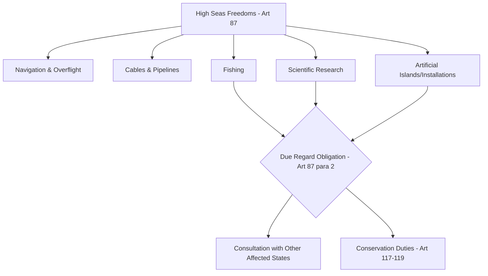

## High Seas Freedoms and the International Seabed Area as Common Heritage of Mankind

### Doctrinal Foundation: The High Seas Regime

The high seas are defined by Article 86 of the United Nations Convention on the Law of the Sea (UNCLOS, concluded 1982, in force 1994) as all parts of the sea not included in the exclusive economic zone (EEZ), territorial sea, internal waters of a state, or archipelagic waters. Part VII of UNCLOS (Articles 86-120) codifies this regime, building on customary international law reflected earlier in the 1958 Geneva Convention on the High Seas.

The foundational principle governing this space is the **freedom of the high seas**, rooted historically in the *mare liberum* doctrine and now codified in Article 87. This provision establishes that the high seas are open to all states, whether coastal or land-locked, and enumerates specific freedoms exercisable subject to UNCLOS and other rules of international law:

- Freedom of navigation
- Freedom of overflight
- Freedom to lay submarine cables and pipelines (subject to Part VI, the continental shelf regime)
- Freedom to construct artificial islands and installations (subject to Part VI)
- Freedom of fishing (subject to the conditions in Section 2 of Part VII, notably conservation obligations)
- Freedom of scientific research (subject to Parts VI and XIII)

This list is **non-exhaustive**; Article 87(1) uses the phrase "inter alia," and the freedoms are to be exercised "with due regard for the interests of other states" and for seabed activities under the international seabed Area regime.

### Key Points: Flag State Jurisdiction and the Absence of Territorial Sovereignty

Because the high seas fall outside any state's territorial sovereignty, order on this space is maintained through the doctrine of **flag state jurisdiction** rather than territorial jurisdiction. Article 92 provides that ships are subject to the exclusive jurisdiction of their flag state while on the high seas, except in cases expressly provided for in international treaties or in UNCLOS itself. Article 91 requires a genuine link between a state and any ship flying its flag, though the ICJ's advisory opinion in *IMCO* (1960) and subsequent state practice have left the genuine-link requirement weakly enforced in practice, giving rise to the phenomenon commonly termed "flags of convenience." [Unverified] The precise threshold of "genuine link" sufficient to trigger a flag state's international responsibility for a vessel remains contested, since UNCLOS does not specify consequences for a flag state's failure to establish one.

Exceptions to exclusive flag state jurisdiction, permitting a warship to board a foreign-flagged vessel on the high seas, are narrowly enumerated in Article 110 (the right of visit) and include reasonable grounds for suspecting the ship is engaged in piracy, the slave trade, unauthorized broadcasting, is without nationality, or is in reality of the same nationality as the warship despite flying a foreign flag. **Piracy** itself is defined in Article 101 as an illegal act of violence, detention, or depredation committed for private ends by the crew of a private ship or aircraft against another ship, aircraft, or persons/property on board, on the high seas or in a place outside the jurisdiction of any state; Article 105 establishes **universal jurisdiction** over piracy, meaning any state may seize a pirate ship and prosecute the offenders, regardless of the nationality of the pirates, the victims, or the flag involved — the most well-established example of universal jurisdiction operative in customary international law prior to UNCLOS's codification.

### Mechanism: Reconciling Overlapping High Seas Freedoms

Because multiple states exercise concurrent freedoms in the same maritime space, Article 87(2) requires that freedoms be exercised "with due regard for the interests of other states in their exercise of the freedom of the high seas." This due regard standard was applied and elaborated in the *Chagos Marine Protected Area Arbitration* (Mauritius v. United Kingdom, PCA, 2015), where the tribunal found the UK breached Article 87 and Article 194(4) by declaring a marine protected area without adequately consulting Mauritius regarding the latter's high seas fishing rights and other interests in the area — establishing that "due regard" imposes a procedural obligation of consultation, not merely a substantive balancing test applied unilaterally.

### Doctrinal Foundation: The International Seabed Area

Distinct from the high seas water column, the **Area** is a separately defined legal zone under Article 1(1)(1) of UNCLOS, comprising the seabed, ocean floor, and subsoil thereof beyond the limits of national jurisdiction — that is, beyond the outer edge of any coastal state's continental shelf (including any extended continental shelf established under Article 76).

The Area and its mineral resources are governed not by the freedom-based regime of the high seas but by the doctrine of the **common heritage of mankind (CHM)**, declared in Article 136. This is a distinct legal status from *res nullius* (belonging to no one, and thus capable of appropriation) and from *res communis* (open to common use by all, as with the high seas water column itself). Under the CHM doctrine as codified in Article 137:

- No state may claim or exercise sovereignty or sovereign rights over any part of the Area or its resources.
- No state or natural or juridical person may appropriate any part of the Area or its resources.
- All rights in the resources of the Area are **vested in mankind as a whole**, on whose behalf the International Seabed Authority (ISA) acts.

This principle traces to the 1970 UN General Assembly Declaration of Principles Governing the Seabed and Ocean Floor (Resolution 2749), itself substantially the product of Maltese diplomat Arvid Pardo's 1967 proposal to the UN General Assembly, which first articulated the CHM concept as a response to concern that technologically advanced states would unilaterally exploit deep seabed minerals before a legal regime could be established.

### Mechanism: Institutional Administration Through the ISA

The **International Seabed Authority**, established under Article 156, is the institutional mechanism through which the CHM principle is operationalized. Based in Kingston, Jamaica, the ISA has legal personality and is composed of an Assembly (all states parties), a Council (36 members, elected with attention to specified interest-group representation, including major consumer/importer states, major investor states, major exporters, developing states, and equitable geographic distribution), and a Secretariat.

The ISA's core functions include:

- Granting exploration and exploitation contracts to states parties or entities sponsored by them, over designated areas of the seabed.
- Administering a system, contemplated in Annex III, whereby mining is conducted partly by contractors and partly by the **Enterprise**, an organ intended to allow the ISA itself to conduct mining operations directly on behalf of mankind as a whole (Article 170), though the Enterprise has never been operationalized in the manner initially envisioned.
- Collecting and distributing financial benefits derived from Area activities, per Article 140, to states parties on an equitable basis, taking into particular consideration the interests of developing states and peoples who have not attained full independence.
- Formulating rules, regulations, and procedures — collectively termed the "Mining Code" — for prospecting, exploration, and exploitation of polymetallic nodules, polymetallic sulphides, and cobalt-rich crusts.

[Inference] The central unresolved regulatory question at present is the finalization of **exploitation regulations** (as distinct from the exploration regulations already adopted for the three mineral types listed above), a matter under prolonged negotiation within the ISA Council; the practical significance is that no commercial deep seabed mining exploitation contract has yet been granted under a completed regulatory framework, notwithstanding significant exploration contract activity and pressure from some states and companies to finalize the regime, as this area remains one of active multilateral negotiation subject to ongoing change.

### Doctrinal History: The 1994 Implementation Agreement

Part XI of UNCLOS, as originally drafted in 1982, encountered sustained objection from industrialized states — including the United States, which has consequently never ratified UNCLOS — principally over provisions perceived as unfavorable to private and state mining enterprises, including mandatory technology transfer requirements, production limitations designed to protect land-based mineral producers, and the financial burden of the parallel Enterprise-financing system.

This impasse was resolved through the 1994 **Agreement on the Implementation of Part XI**, which modifies the deep seabed mining regime substantially while leaving the CHM declaration and core institutional structure intact. Key modifications include the elimination of mandatory technology transfer obligations, market-oriented production policies replacing production ceilings tied to nickel demand projections, and a phased, more limited approach to Enterprise financing tied to joint-venture arrangements with contractors rather than direct ISA-funded operations. Article 2 of the 1994 Agreement provides that it and Part XI are to be interpreted and applied together as a single instrument, with the Agreement prevailing in the event of any inconsistency — a drafting technique adopted specifically to secure the accession of industrialized states without requiring formal amendment of UNCLOS itself under its own amendment procedures.

### Analytical Debate: CHM as Customary International Law and the Non-Ratification Problem

A genuine and continuing debate exists as to whether the prohibition on unilateral seabed mining outside the ISA framework binds non-parties to UNCLOS, most significantly the United States, as a matter of customary international law rather than treaty law alone.

**The position that the CHM prohibition is customary law** rests on the near-universal ratification of UNCLOS (169 parties as of the present), the consistent invocation of the CHM principle in state practice and UN organs since 1970, and the argument that the core CHM prohibition on appropriation reflects *opinio juris* — recall that this term denotes the belief that a practice is followed out of a sense of legal obligation, one of the two elements (together with consistent state practice) required to establish a rule of customary international law — sufficiently widespread and consistent to bind all states regardless of treaty ratification.

**The contrary position**, historically advanced by the United States notwithstanding its non-ratification, is that it complies with the *navigational and high seas freedom* provisions of UNCLOS as reflective of pre-existing customary law, while treating the deep seabed mining regime under Part XI as a treaty-created institutional framework that cannot bind non-parties, consistent with the general principle in Article 34 of the Vienna Convention on the Law of Treaties that a treaty does not create obligations for a third state without its consent. Domestically, the United States has instead relied on the Deep Seabed Hard Mineral Resources Act of 1980 as an alternative unilateral licensing framework, a position other states parties to UNCLOS regard as inconsistent with the exclusivity of the ISA's mandate over Area resources under Article 137.

### Related Topics

- The continental shelf, extended continental shelf claims, and the Commission on the Limits of the Continental Shelf (CLCS)
- Flag state jurisdiction, genuine link, and the problem of flags of convenience
- Universal jurisdiction over piracy and other international crimes under customary international law
- UNCLOS Part XII: marine environmental protection obligations and the *Chagos* and *South China Sea* arbitral findings
- The 1994 Agreement on the Implementation of Part XI: treaty modification techniques and universal participation
- Sources of customary international law: state practice, *opinio juris*, and the persistent objector doctrine