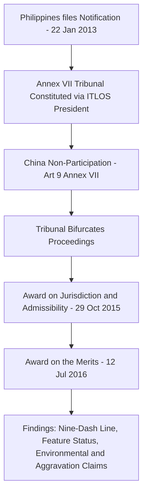

## UNCLOS Annex VII Arbitration and the 2016 Philippines v. China South China Sea Award

### Doctrinal Foundation: Compulsory Dispute Settlement Under Part XV

The United Nations Convention on the Law of the Sea (UNCLOS, concluded 1982, in force 1994) departs from the traditional international law default rule that adjudication requires the specific consent of both parties to a dispute. Part XV establishes a system of **compulsory dispute settlement**, meaning that ratification of UNCLOS itself constitutes advance consent to binding third-party adjudication of certain categories of disputes concerning the Convention's interpretation or application.

Article 286 provides that, subject to Section 3 of Part XV, any dispute concerning the interpretation or application of UNCLOS may, where no settlement has been reached through Section 1 means (negotiation, and other peaceful means the parties choose), be submitted at the request of any party to the dispute to a court or tribunal with jurisdiction under Section 2. Article 287 allows a state, upon signature or ratification, to choose among four fora for this purpose: the International Tribunal for the Law of the Sea (ITLOS), the International Court of Justice (ICJ), an Annex VII arbitral tribunal, or an Annex VIII special arbitral tribunal (for specified technical categories of disputes). Critically, Article 287(3) and (5) provide that **Annex VII arbitration is the default forum** where a state has not made a declaration selecting a different forum, or where the parties to a dispute have not accepted the same forum.

### Key Points: Structure and Composition of Annex VII Tribunals

Annex VII, comprising Articles 1-13, establishes an ad hoc arbitral mechanism rather than a standing court:

- **Constitution of the tribunal**: Article 3 provides for a five-member tribunal. Each party appoints one member (who may be its own national), and the parties then agree on the remaining three members, including the president, who must not be nationals of either party. If a party fails to make an appointment within the specified period, or if the parties cannot agree on the remaining members within the required timeframe, Article 3 provides that the President of the International Tribunal for the Law of the Sea shall make the necessary appointments — a default mechanism critical to preventing a respondent state from blocking arbitration simply by non-participation.
- **Jurisdiction is not dependent on the respondent's participation**: Article 9 of Annex VII expressly provides that the absence of a party or its failure to defend its case does not constitute a bar to proceedings, though the tribunal must first satisfy itself that it has jurisdiction over the dispute and that the claim is well founded in fact and law before making its award.
- **Limits on compulsory jurisdiction**: Article 297 excludes certain categories of dispute from compulsory binding procedures involving contentious issues (notably, aspects of coastal state discretion over marine scientific research and living resource management within the EEZ). Article 298 permits states, by declaration, to opt out of compulsory procedures for three specific categories: sea boundary delimitation disputes, disputes concerning military activities, and disputes in respect of which the UN Security Council is exercising its Charter functions. China made an Article 298 declaration in 2006 excluding, among other things, disputes concerning maritime boundary delimitation.

### Mechanism: The Philippines v. China Proceedings

On 22 January 2013, the Philippines initiated arbitral proceedings against China under Annex VII, invoking the compulsory procedures of Part XV. China refused to participate in the proceedings, submitting a Position Paper in December 2014 arguing, among other things, that the Tribunal lacked jurisdiction because the dispute was, in substance, one of territorial sovereignty over islands (not governed by UNCLOS) and maritime boundary delimitation (excluded by China's 2006 Article 298 declaration). Consistent with Article 9 of Annex VII, China's non-appearance did not prevent the proceedings from continuing; the Tribunal (constituted with the President of ITLOS making appointments on behalf of the non-participating party, per the Annex VII default mechanism) proceeded to consider the jurisdictional objections on its own initiative, given its independent obligation to satisfy itself of jurisdiction.

The Tribunal bifurcated the case, issuing a discrete **Award on Jurisdiction and Admissibility on 29 October 2015**, before proceeding to the merits. The Tribunal characterized the Philippines' submissions carefully to avoid matters excluded from compulsory jurisdiction: it held that the dispute, as framed, did not require it to rule on sovereignty over the disputed land features (avoiding the sovereignty exclusion) and that most of the Philippines' claims concerned the status of maritime features and the source and lawfulness of China's maritime claims under UNCLOS, not delimitation of overlapping entitlements as such (avoiding China's Article 298 boundary-delimitation exclusion, since delimitation presupposes overlapping valid entitlements to begin with — the Tribunal reasoned it could determine entitlement without delimiting a boundary).

### Doctrinal Content: The Award on the Merits (12 July 2016)

The Tribunal, sitting under the Permanent Court of Arbitration's registry (PCA Case No. 2013-19), issued its Award on the Merits on 12 July 2016. The ruling addressed several distinct doctrinal questions:

**1. The "nine-dash line" and historic rights.** China's claim, reflected in a nine-dash line depicted on official maps encompassing the majority of the South China Sea, was understood by the Tribunal to assert historic rights to resources within the line predating UNCLOS. The Tribunal held that, to the extent China had historic rights to resources in the waters of the South China Sea, such rights were **extinguished** by UNCLOS to the extent they were incompatible with the exclusive economic zone regime established by the Convention. This rests on the principle that UNCLOS's EEZ regime under Part V comprehensively allocates resource rights by reference to distance from coastal baselines, superseding any prior historic entitlement inconsistent with that allocation among states parties.

**2. Classification of maritime features under Article 121(3).** Recall that Article 121(3) provides that "rocks which cannot sustain human habitation or economic life of their own" are entitled only to a territorial sea and contiguous zone, not an EEZ or continental shelf. The Tribunal developed a substantive test for this provision — assessing the objective capacity of a feature, in its natural condition, to sustain a stable community of people or economic activity not dependent on outside resources or of a purely extractive character — and applied it to conclude that none of the high-tide features in the Spratly Islands, including Itu Aba (Taiping Island, the largest natural feature in the group), is a fully entitled "island" under Article 121(2) capable of generating an EEZ or continental shelf.

**3. Classification of features as rocks, low-tide elevations, or submerged banks.** The Tribunal made specific findings on individual features, including that **Mischief Reef** and **Second Thomas Shoal** are low-tide elevations (features above water at low tide but submerged at high tide, per Article 13, generating no territorial sea of their own and not subject to appropriation) situated within the Philippines' exclusive economic zone and continental shelf, and that **Scarborough Shoal** is a rock generating at most a territorial sea.

**4. China's interference with Philippine sovereign rights.** Building on the feature classifications above, the Tribunal found that China had violated the Philippines' sovereign rights in its exclusive economic zone and continental shelf by, among other things, interfering with Philippine fishing and hydrocarbon exploration at Reed Bank, constructing artificial installations on Mischief Reef without Philippine authorization, and failing to prevent Chinese fishing vessels from fishing in the Philippine EEZ.

**5. Environmental and law enforcement findings.** The Tribunal found China in breach of Articles 192 and 194 (obligations to protect and preserve the marine environment) through large-scale island-building and artificial island construction activities causing severe harm to the coral reef ecosystem, and separately found that Chinese law enforcement vessels had breached the International Regulations for Preventing Collisions at Sea (COLREGS) and Article 94 (duties of the flag state) in the course of intercepting Philippine vessels near Scarborough Shoal.

**6. Aggravation of the dispute.** The Tribunal further held that China's large-scale land reclamation and construction of artificial islands after the arbitration commenced aggravated and extended the dispute between the parties, a distinct finding grounded in the general international law principle that parties to a pending dispute must refrain from aggravating it.

### Analytical Debate: Binding Force, Non-Compliance, and Enforcement

A significant doctrinal debate surrounds the practical consequences of the Award given China's persistent rejection of it. Article 296(1) of UNCLOS and Article 11 of Annex VII both provide that an Annex VII award is **final and binding** on the parties to the dispute, without appeal (except in narrow circumstances not applicable here). China's position — articulated through its Position Paper, subsequent state statements, and continued conduct — is that the Tribunal lacked jurisdiction ab initio (rendering the Award, in its view, void rather than merely unenforced) and that it will neither accept nor recognize the Award.

**The mainstream international law position** treats a tribunal's determination of its own jurisdiction (the doctrine of *compétence de la compétence*, reflected in Article 288(4) of UNCLOS) as authoritative and not subject to unilateral override by a losing party; on this view, China remains bound by the Award as a matter of international law regardless of its rejection, and its continued conduct inconsistent with the Award constitutes an ongoing breach of its UNCLOS obligations. **The structural limitation**, however, is that UNCLOS provides no direct enforcement mechanism analogous to UN Security Council enforcement of ICJ judgments under Article 94(2) of the UN Charter — enforcement in practice depends on diplomatic pressure, reciprocal state practice, and the cumulative weight of the Award as a statement of the law binding on all UNCLOS parties in subsequent disputes, rather than on any centralized coercive mechanism. [Inference] This gap between the Award's formal bindingness and the absence of enforcement machinery is frequently cited by scholars as illustrative of the broader structural feature of international law addressed by the horizontal, decentralized character of the international legal system, in which compliance depends substantially on reciprocity, reputational cost, and diplomatic consequence rather than centralized coercion.

### Related Topics

- The continental shelf, extended continental shelf claims, and the CLCS
- Article 121 and the legal status of islands, rocks, and low-tide elevations
- Sources and limits of the EEZ regime under UNCLOS Part V
- State responsibility for internationally wrongful acts and the consequences of non-compliance with binding awards
- The ICJ's contentious jurisdiction compared to Annex VII compulsory arbitration
- Historic title and historic rights as a source of maritime entitlement outside UNCLOS