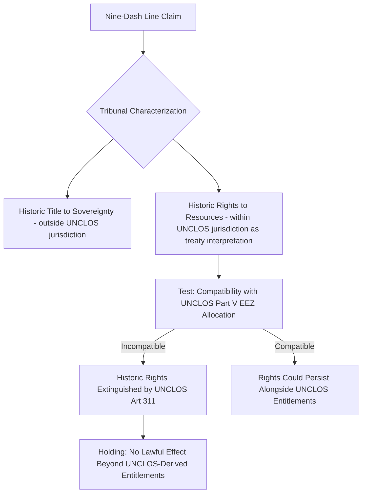

## The Nine-Dash Line, Historic Rights Claims, and Feature Classification in the West Philippine Sea and South China Sea Dispute

### Doctrinal Foundation: The Nine-Dash Line as a Claim

The "nine-dash line" (originally an eleven-dash line depicted on a 1947 Chinese government map, later reduced to nine dashes after the 1953 removal of two dashes in the Gulf of Tonkin) is a demarcation encompassing roughly 90 percent of the South China Sea, extending close to the coastlines of the Philippines, Vietnam, Malaysia, Brunei, and Indonesia's Natuna waters. The line itself does not correspond to any maritime zone recognized under the United Nations Convention on the Law of the Sea (UNCLOS, concluded 1982, in force 1994); it is not a territorial sea boundary, an exclusive economic zone (EEZ) limit, or a continental shelf outer limit as those terms are defined in UNCLOS Parts II, V, and VI.

China's official communications, notably its Note Verbale to the UN Secretary-General of 7 May 2009, have been understood to assert **"indisputable sovereignty" over the islands in the South China Sea and their adjacent waters**, together with **"sovereign rights and jurisdiction" over the relevant waters and seabed and subsoil**, without precisely specifying the legal basis or geographic extent of these entitlements relative to the line itself. This ambiguity — whether the line demarcates a claim to the islands and a UNCLOS-conforming zone generated from them, a broader claim to "historic waters" analogous to internal or territorial waters, or a *sui generis* claim to "historic rights" over resources short of full sovereignty — became a central question for adjudication in *The South China Sea Arbitration* (Philippines v. China, PCA Case No. 2013-19, Award of 12 July 2016), the Annex VII tribunal proceeding.

### Key Points: Historic Title, Historic Waters, and Historic Rights — Distinguishing the Concepts

Precision in terminology is essential here, since international law recognizes several distinct doctrines that are often conflated in political discourse:

- **Historic title** refers to a claim to full sovereignty over land territory or waters based on long, open, and continuous exercise of state authority, generally requiring acquiescence by other states. This is the doctrine of acquisition of territory through prescription or historic consolidation.
- **Historic waters** refers to a claim that a maritime area — typically a bay or similar enclosed water body — should be treated as internal waters despite not meeting the ordinary geographic criteria for a bay under Article 10 of UNCLOS, again requiring evidence of long-standing exclusive state authority, actual exercise of that authority, and acquiescence by other states, as recognized in customary international law and referenced in Article 15's savings clause for historic title.
- **Historic rights** (short of title) is a narrower and more contested category: a claim to specific, non-exclusive rights (typically fishing or resource-related rights) in waters that would otherwise fall under another state's jurisdiction, without a claim to full sovereignty over those waters.

China's claim, as the Tribunal characterized it for purposes of adjudication, was most plausibly understood as a claim to historic rights over living and non-living resources within the nine-dash line, rather than a claim to historic title or historic waters over the entire enclosed area (a broader claim which the Tribunal noted would be difficult to reconcile with the relatively open and long-standing use of South China Sea waters by other states' vessels for navigation).

### Mechanism: The Tribunal's Historic Rights Ruling

The Tribunal's jurisdictional threshold question was whether it could rule on historic rights at all, since disputes over historic title to sovereignty are outside UNCLOS's subject-matter jurisdiction. The Tribunal resolved this by framing the operative question not as one of sovereignty, but as one of the **relationship between China's claimed historic rights and the allocation of rights established by UNCLOS** — a question of treaty interpretation squarely within its jurisdiction under Article 288(1).

The Tribunal's reasoning proceeded through the following steps:

1. UNCLOS Article 311(1) provides that the Convention prevails, as between states parties, over the 1958 Geneva Conventions on the Law of the Sea, and more generally UNCLOS was intended to establish a **comprehensive allocation** of rights to maritime zones (territorial sea, EEZ, continental shelf) by reference to distance from coastal baselines.
2. Where a state's claimed historic rights to resources are **incompatible with this comprehensive allocation** — specifically, where they would allow a state to exploit resources in an area that UNCLOS assigns to another coastal state's exclusive economic zone or continental shelf — those historic rights are, as between UNCLOS parties, superseded.
3. The Tribunal therefore held that, to the extent China had historic rights to resources in the waters of the South China Sea, such rights were **extinguished by the entry into force of UNCLOS** to the extent they were incompatible with the exclusive economic zones provided for in the Convention. China's claim to historic rights to resources within the nine-dash line, insofar as it exceeded the entitlements UNCLOS itself would allocate to China from its own coasts and legitimate maritime features, was found to have **no lawful effect**.

### Doctrinal Content: Feature Classification Under Article 121

Because the extent of any state's legitimate maritime entitlement in the South China Sea depends on which land features generate which zones, the Tribunal undertook a detailed classification exercise under Article 121 of UNCLOS, which governs the "regime of islands":

- Article 121(1) defines an island as a naturally formed area of land, surrounded by water, which is above water at high tide.
- Article 121(2) provides that, subject to paragraph 3, the territorial sea, contiguous zone, EEZ, and continental shelf of an island are determined in the same manner as for other land territory — meaning a fully qualifying island generates a full suite of maritime zones, including a 200 nm EEZ and continental shelf.
- Article 121(3) creates a critical exception: **"Rocks which cannot sustain human habitation or economic life of their own shall have no exclusive economic zone or continental shelf."** Such features are entitled only to a territorial sea (12 nm) and contiguous zone (24 nm).
- Separately, Article 13 defines a **low-tide elevation** as a naturally formed area of land surrounded by and above water at low tide but submerged at high tide; under Article 13(1), a low-tide elevation situated within the territorial sea distance of the mainland or an island may be used as a baseline point, but under Article 13(2) and customary law as applied by the Tribunal, a low-tide elevation lying beyond the territorial sea of any land feature generates **no maritime zone of its own** and is not subject to appropriation, forming part of the seabed and subject to the legal regime of the EEZ or continental shelf in which it is located.

The Tribunal developed a substantive interpretive test for Article 121(3), holding that the capacity to "sustain human habitation or economic life" must be assessed by reference to the **objective, natural capacity** of the feature — considering factors such as availability of drinking water, food, and shelter sufficient to support a **non-transient population**, and requiring that any economic activity be **oriented toward the feature itself** rather than extractive activity dependent entirely on outside resources or benefiting a population resident elsewhere. Applying this test, the Tribunal concluded that **all of the high-tide features in the Spratly Islands are legally rocks** under Article 121(3), including Itu Aba (Taiping Island) — the largest naturally occurring feature in the group and the one most plausibly argued by claimant states to meet the habitation threshold — because historical use of the feature was found to reflect only transient occupation by fishermen and government personnel dependent on outside supply, not a genuinely self-sustaining human community or non-extractive economic life.

### Key Points: Specific Feature Findings

Building on this framework, the Tribunal made individualized determinations for features central to the Philippines' submissions:

- **Scarborough Shoal**: classified as a rock under Article 121(3), generating at most a 12 nm territorial sea, with the Tribunal separately finding that Scarborough Shoal has historically been a traditional fishing ground used by fishermen of multiple nationalities, including the Philippines and China, giving rise to traditional fishing rights that China had breached by restricting Filipino fishermen's access following the 2012 stand-off at the shoal.
- **Mischief Reef and Second Thomas Shoal**: classified as **low-tide elevations**, not islands or rocks, and found to be located within the Philippines' EEZ and continental shelf (generated from the Philippine archipelagic baseline), such that these features form part of the Philippine continental shelf and are not subject to a competing entitlement from any Spratly feature, since none of those features was found to generate an EEZ or continental shelf of its own.
- **Gaven Reef and Subi Reef**: also found to be low-tide elevations in their natural condition, notwithstanding subsequent large-scale land reclamation and construction activity, since the Tribunal held that the legal character of a feature is assessed by reference to its **natural condition**, unaltered by artificial construction — meaning a state cannot transform a low-tide elevation into an "island" for Article 121 purposes through land reclamation.

### Analytical Debate: The Relationship Between Feature Status and Historic Rights Claims

[Inference] The doctrinal significance of the Tribunal's two-track approach — extinguishing historic rights incompatible with UNCLOS while separately finding no Spratly feature capable of generating an EEZ or continental shelf — is that it forecloses, as a matter of law applicable between the Philippines and China as UNCLOS parties, essentially the entire legal basis on which China's claim within the nine-dash line as applied to Philippine-adjacent waters could rest: neither a surviving historic rights doctrine nor an entitlement generated by any Spratly or Scarborough feature can displace the Philippines' EEZ and continental shelf rights running from its own archipelagic baseline. China's continued position — that it does not recognize the Tribunal's jurisdiction or the resulting Award, and continues to assert rights within the nine-dash line as a matter of state practice — means this doctrinal outcome remains legally authoritative as between the parties under UNCLOS while contested as a practical matter of ongoing state conduct, illustrating the broader structural gap between the formal bindingness of Annex VII awards and the decentralized character of enforcement in international law.

A related scholarly debate concerns whether the "traditional fishing rights" the Tribunal recognized at Scarborough Shoal are properly understood as a species of **acquired rights under general international law** surviving within another state's territorial sea (a category the Tribunal treated as distinct from, and unaffected by, the extinguishment of the broader nine-dash line historic rights claim), or whether this represents a more novel doctrinal category with uncertain application to other similarly contested fishing grounds.

### Related Topics

- UNCLOS Annex VII arbitration and the 2016 Philippines v. China South China Sea award
- The continental shelf, extended continental shelf claims, and the CLCS
- Baselines and archipelagic states under UNCLOS Part IV
- Sources of customary international law: state practice, opinio juris, and acquiescence
- The exclusive economic zone regime under UNCLOS Part V
- State responsibility and the consequences of non-compliance with binding international awards