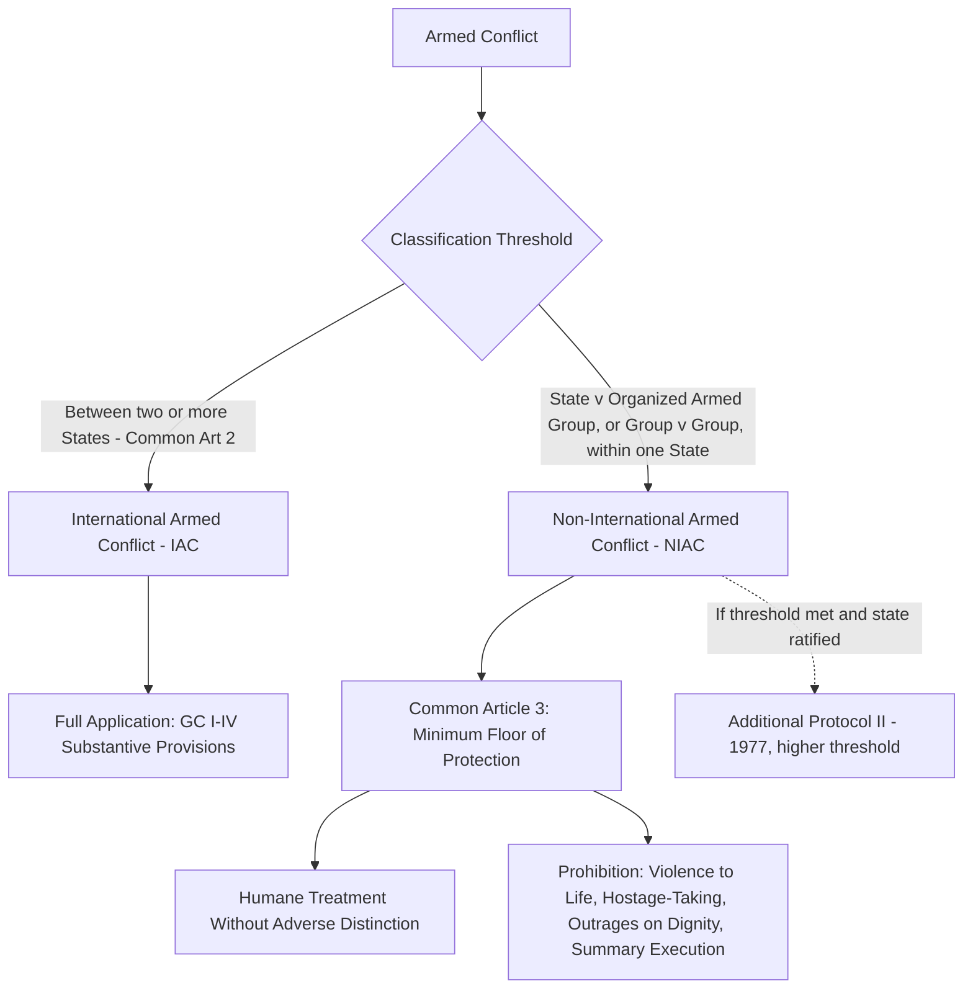

## The Four Geneva Conventions of 1949 and Common Article 3

### Doctrinal Foundation: The Structure of the 1949 Geneva Conventions

International humanitarian law (IHL), also termed the law of armed conflict, is the branch of international law governing the conduct of parties during armed conflict and the protection of persons who are not, or are no longer, taking part in hostilities. The four Geneva Conventions of 1949, adopted on 12 August 1949 and now universally ratified (196 states parties, making them among the most widely ratified treaties in existence), form the treaty-law core of this branch, supplemented by the two 1977 Additional Protocols and a substantial body of customary international humanitarian law.

The four Conventions each protect a distinct category of person, reflecting the historical development of IHL through successive revisions responding to the deficiencies revealed by prior conflicts:

- **Geneva Convention I (GC I)**: for the Amelioration of the Condition of the Wounded and Sick in Armed Forces in the Field, tracing its lineage to the original 1864 Geneva Convention prompted by Henry Dunant's account of the Battle of Solferino.
- **Geneva Convention II (GC II)**: for the Amelioration of the Condition of Wounded, Sick and Shipwrecked Members of Armed Forces at Sea, extending GC I's protections to naval warfare.
- **Geneva Convention III (GC III)**: relative to the Treatment of Prisoners of War, substantially revising and expanding the 1929 Geneva Convention on prisoners of war in light of the mistreatment of POWs during the Second World War.
- **Geneva Convention IV (GC IV)**: relative to the Protection of Civilian Persons in Time of War, the most significant innovation of the 1949 revision, since no comprehensive treaty protection for civilians under enemy control had previously existed, a gap starkly exposed by civilian treatment during the Second World War.

### Key Points: The Foundational Distinction Between International and Non-International Armed Conflict

A structural feature essential to understanding the 1949 Conventions is that each Convention's substantive protections (outside Common Article 3, discussed below) apply, by their own terms, to **international armed conflict (IAC)** — meaning armed conflict between two or more states parties, or situations of belligerent occupation, as specified in the identical Common Article 2 shared by all four Conventions. Common Article 2 provides that the Conventions apply to all cases of declared war or of any other armed conflict arising between two or more of the High Contracting Parties, even if the state of war is not recognized by one of them, and to cases of partial or total occupation of the territory of a High Contracting Party, even if that occupation meets with no armed resistance.

This IAC-focused design left a substantial protection gap for **non-international armed conflict (NIAC)** — armed conflict between a state and one or more organized non-state armed groups, or between such groups, occurring within the territory of a single state — which, particularly since 1949, has constituted the numerically dominant form of armed conflict globally.

### Mechanism: Common Article 3 as the Minimum Standard for Non-International Armed Conflict

**Common Article 3**, identically worded in all four 1949 Conventions, was the drafters' solution to this gap: a single provision applicable "in the case of armed conflict not of an international character occurring in the territory of one of the High Contracting Parties," establishing a floor of minimum humanitarian protections applicable regardless of how the parties to a NIAC characterize the conflict or one another (a state party cannot avoid Common Article 3 obligations by refusing to recognize an opposing non-state group as a legitimate belligerent, or by characterizing the conflict as mere internal disturbance if it in fact meets the requisite threshold).

Common Article 3 requires that persons taking no active part in hostilities, including members of armed forces who have laid down their arms and those placed *hors de combat* (a term of art denoting a combatant rendered incapable of fighting, whether by sickness, wounds, detention, or other cause) by sickness, wounds, detention, or any other cause, be treated humanely without adverse distinction founded on race, colour, religion or faith, sex, birth or wealth, or any other similar criteria. To this end, it prohibits, at any time and in any place whatsoever, with respect to such persons:

1. Violence to life and person, in particular murder of all kinds, mutilation, cruel treatment, and torture.
2. Taking of hostages.
3. Outrages upon personal dignity, in particular humiliating and degrading treatment.
4. The passing of sentences and the carrying out of executions without previous judgment pronounced by a regularly constituted court, affording all the judicial guarantees which are recognized as indispensable by civilized peoples.

Common Article 3 further requires that the wounded and sick be collected and cared for, and permits an impartial humanitarian body, such as the International Committee of the Red Cross (ICRC), to offer its services to the parties to the conflict.

### Key Points: The Threshold Question for Common Article 3 Application

Common Article 3's text does not itself define "armed conflict not of an international character" with precision, leaving the threshold question — distinguishing a NIAC from internal disturbances, riots, or sporadic acts of violence not rising to the level of armed conflict — to subsequent state practice and jurisprudence. The most influential judicial articulation is found in the *Tadić Jurisdiction Decision* (Prosecutor v. Tadić, ICTY Appeals Chamber, 1995), which held that a non-international armed conflict exists whenever there is **protracted armed violence between governmental authorities and organized armed groups or between such groups within a State**. This formulation establishes two cumulative criteria widely applied in subsequent practice and jurisprudence:

- **Intensity**: the violence must reach a level of intensity beyond internal disturbances and tensions (such as riots or isolated acts of violence), assessed through indicative factors including the gravity and duration of clashes, the type of weapons and military equipment used, and the number and caliber of forces involved.
- **Organization of the armed group**: the non-state party must possess a sufficient level of organization — a command structure, capacity to plan and carry out military operations, and ability to ensure respect for IHL — to distinguish it from an unorganized group of individuals.

[Inference] The precise weighting and application of these intensity and organization factors to borderline situations (for example, sustained but low-casualty insurgent activity, or fragmented armed groups without unified command) remains a matter of case-by-case assessment rather than a bright-line rule, and different international bodies have at times applied the *Tadić* factors with varying degrees of rigor.

### Doctrinal Content: Common Article 3 as Reflective of Customary International Law and *Jus Cogens*

Common Article 3's significance extends well beyond its status as treaty law binding states parties to the 1949 Conventions. The International Court of Justice, in *Military and Paramilitary Activities in and against Nicaragua* (Nicaragua v. United States, 1986), held that the rules stated in Common Article 3 constitute a **minimum yardstick** applicable in both international and non-international armed conflict, reflecting "elementary considerations of humanity" and constituting general principles of humanitarian law binding as customary international law independent of treaty obligation. This finding is doctrinally significant for two reasons: first, it means Common Article 3's core protections bind even a state or armed group not formally party to the Geneva Conventions (a practical near-impossibility today given universal ratification, but conceptually important for non-state armed groups, which cannot become parties to a treaty in any event); second, it establishes that some Common Article 3 prohibitions — most notably the prohibition of torture — are widely regarded by scholars and tribunals as reflecting **jus cogens** norms (recall that this term denotes a peremptory norm of general international law, accepted and recognized by the international community of states as a whole as a norm from which no derogation is permitted, per Article 53 of the Vienna Convention on the Law of Treaties), binding regardless of treaty ratification, regional practice, or purported consent to the contrary.

### Analytical Debate: The Adequacy of the Common Article 3 Minimum Standard

A genuine debate exists regarding the adequacy of Common Article 3 as the primary treaty-based regulatory framework for non-international armed conflict, given the significant asymmetry between IAC and NIAC regulation under the 1949 Conventions.

**The position favoring the sufficiency of the existing framework** notes that Common Article 3 was substantially supplemented by **Additional Protocol II of 1977**, which develops and supplements Common Article 3 for non-international armed conflicts meeting a higher organizational and territorial-control threshold (Article 1(1) of Additional Protocol II requires that the non-state party exercise such control over territory as to enable it to carry out sustained and concerted military operations and to implement the Protocol), and further notes that extensive customary international humanitarian law — as documented in the ICRC's 2005 Customary IHL Study — has developed to extend many IAC-specific treaty rules (such as prohibitions on specific weapons and targeting rules) to NIAC as a matter of customary law, substantially narrowing the practical gap between the two regimes.

**The critical position** emphasizes that Additional Protocol II's higher threshold excludes many actual NIACs (particularly those involving less territorially-consolidated non-state groups, a common feature of contemporary asymmetric and fragmented conflicts) from its more detailed protections, leaving Common Article 3's minimum floor as the *only* applicable treaty protection in a significant proportion of ongoing conflicts; this position further notes that, unlike the Geneva Conventions' grave breaches regime under Articles 50/51/130/147 (GC I/II/III/IV respectively), which establishes universal jurisdiction and mandatory prosecute-or-extradite obligations for grave breaches in IAC, no equivalent treaty-based grave breaches regime formally attaches to Common Article 3 violations, leaving individual criminal responsibility for such violations to depend on other bases — principally customary international law as applied by international criminal tribunals (the ICTY and International Criminal Tribunal for Rwanda both exercised jurisdiction over Common Article 3 violations as customary international law crimes) and Article 8(2)(c)-(f) of the Rome Statute of the International Criminal Court, which now codifies Common Article 3 violations as war crimes triable before the ICC.

### Related Topics

- Additional Protocols I and II of 1977: extension of IHL protections and the higher NIAC threshold
- The grave breaches regime and universal jurisdiction over war crimes
- Principles of distinction, proportionality, and precaution in the conduct of hostilities
- The ICTY's *Tadić* jurisprudence and the classification of armed conflict
- War crimes under Article 8 of the Rome Statute and ICC jurisdiction
- Jus cogens norms and their relationship to treaty and customary international law