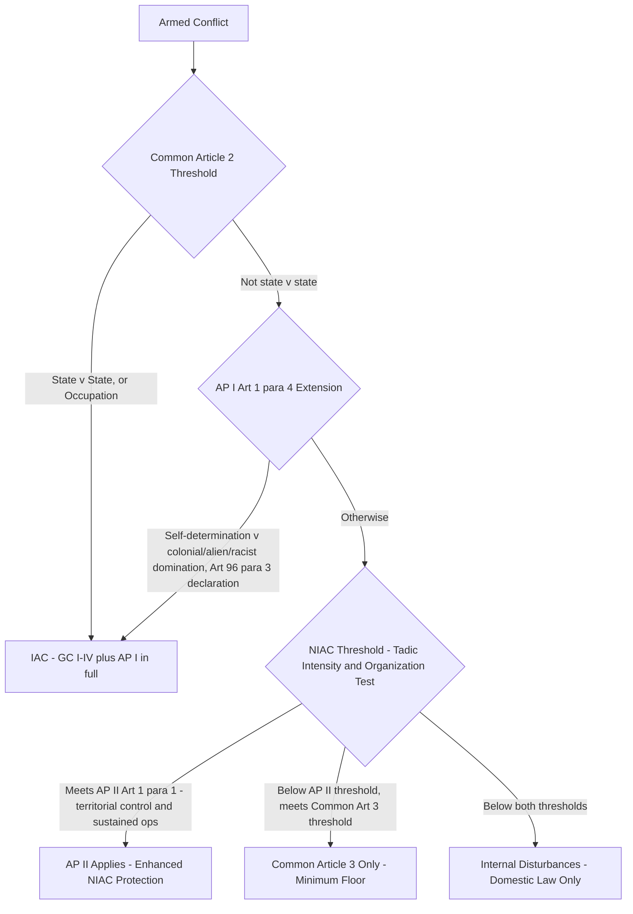

## Additional Protocols I and II and the International Versus Non-International Armed Conflict Distinction

### Doctrinal Foundation: The 1977 Additional Protocols in Context

The 1949 Geneva Conventions (GC I-IV) were adopted principally in response to the deficiencies of the Second World War and were structured, through Common Article 2, primarily around international armed conflict (IAC) — conflict between two or more states, including situations of belligerent occupation — with Common Article 3 supplying only a minimum floor of protection for non-international armed conflict (NIAC). By the 1970s, two developments exposed the inadequacy of this structure: the proliferation of wars of decolonization and national liberation movements, and the increasing prevalence and destructiveness of internal armed conflict globally. The two **1977 Additional Protocols**, adopted on 8 June 1977 under the auspices of a Diplomatic Conference convened by the Swiss government, were the treaty response to both developments.

- **Additional Protocol I (AP I)**, relating to the Protection of Victims of International Armed Conflicts, supplements and develops the IAC-focused 1949 Conventions, most significantly by codifying detailed rules on the conduct of hostilities (targeting law) that the 1949 Conventions themselves largely did not address, since those Conventions focused principally on the protection of persons already in enemy hands (the wounded, sick, shipwrecked, POWs, and civilians under occupation) rather than on how attacks may lawfully be conducted in the first place.
- **Additional Protocol II (AP II)**, relating to the Protection of Victims of Non-International Armed Conflicts, is the first (and remains the only) treaty instrument developing and supplementing Common Article 3's minimum standard for NIAC specifically, though it does so subject to a materially higher applicability threshold than Common Article 3 itself.

As of the present, AP I has 174 states parties and AP II 169, with several militarily significant states — notably the United States, which signed but has not ratified either Protocol, principally over objections to AP I's provisions on wars of national liberation and combatant status for irregular fighters — remaining outside AP I specifically.

### Key Points: The IAC/NIAC Classification Threshold Restated

Because both Protocols' applicability turns on conflict classification, the underlying threshold test bears restating in summary. Common Article 2 of the 1949 Conventions defines international armed conflict as armed conflict arising between two or more states parties, or belligerent occupation, regardless of whether either side recognizes a state of war. Non-international armed conflict, by contrast, is armed conflict between a state and one or more organized non-state armed groups, or between such groups, occurring within a single state's territory. The most influential judicial articulation of the NIAC threshold is the *Tadić Jurisdiction Decision* (Prosecutor v. Tadić, ICTY Appeals Chamber, 1995), which requires **protracted armed violence between governmental authorities and organized armed groups, or between such groups**, assessed through two cumulative criteria: (1) **intensity** of violence beyond mere internal disturbances or riots, evaluated through factors such as duration, gravity, and the weaponry and force levels involved; and (2) sufficient **organization** of the non-state armed group, meaning a command structure and capacity to plan, execute, and ensure compliance with IHL in military operations.

### Mechanism: AP I's Extension of the IAC Category — Wars of National Liberation

AP I's most doctrinally significant and historically contested innovation is **Article 1(4)**, which extends the definition of international armed conflict — beyond Common Article 2's state-versus-state and occupation categories — to include:

> armed conflicts in which peoples are fighting against colonial domination and alien occupation and against racist regimes in the exercise of their right of self-determination.

This provision effectively reclassifies certain conflicts that would otherwise be NIAC (a non-state liberation movement fighting an incumbent government or occupying power) as IAC, triggering the full protective regime of the Geneva Conventions and AP I — including, critically, prisoner-of-war status under GC III's framework for captured fighters — rather than only Common Article 3's minimum floor. Article 96(3) of AP I supplies the procedural mechanism: the authority representing such a people may undertake to apply the Conventions and the Protocol by unilateral declaration addressed to the depositary (Switzerland), with that undertaking then bringing the conflict fully within the IAC treaty framework as between the parties.

Article 1(4) proved to be the single most contentious provision of AP I during negotiation and remains a significant reason cited by non-ratifying states, including the United States and Israel, for withholding ratification, on the view that it introduces a political and asymmetric standard — tied to the perceived legitimacy of a cause (self-determination against colonial, alien, or racist domination) — into what should be a neutral, factually-triggered classification framework applicable regardless of the political character of the parties.

### Doctrinal Content: AP I's Codification of Targeting Law

Independent of the Article 1(4) extension, AP I's substantive contribution to IAC regulation lies chiefly in Part IV, which codifies, for the first time in comprehensive treaty form, the core principles governing the **conduct of hostilities**:

- **The principle of distinction** (AP I Article 48, elaborated in Articles 51-52): parties to a conflict must at all times distinguish between the civilian population and combatants, and between civilian objects and military objectives, directing operations only against the latter. Article 51(2) expressly prohibits making the civilian population as such the object of attack, and Article 52(2) defines military objectives as limited to objects which, by their nature, location, purpose, or use, make an effective contribution to military action, and whose total or partial destruction, capture, or neutralization offers a definite military advantage.
- **The principle of proportionality** (AP I Article 51(5)(b)): prohibits an attack which may be expected to cause incidental loss of civilian life, injury to civilians, or damage to civilian objects which would be **excessive in relation to the concrete and direct military advantage anticipated**. This is a comparative, not an absolute, standard — some incidental civilian harm is not per se unlawful, but the harm must not be excessive relative to the anticipated military gain, a determination assessed prospectively from the perspective of the commander at the time based on information reasonably available.
- **The principle of precaution** (AP I Article 57): requires that those who plan or decide upon an attack take constant care to spare the civilian population, do everything feasible to verify targets are military objectives, take all feasible precautions in the choice of means and methods of attack to minimize incidental civilian harm, and refrain from or suspend an attack if it becomes apparent the target is not a military objective or that the attack would violate the proportionality rule.

[Inference] Because a substantial number of militarily significant states (including the United States) are not parties to AP I, the practical operative question in many contemporary conflicts is the extent to which these three principles bind non-parties as customary international law; the ICRC's 2005 Customary IHL Study concluded that the core distinction, proportionality, and precaution rules reflect customary international law applicable in both IAC and NIAC, a conclusion generally accepted by non-party states in their own military doctrine (including the US Department of Defense Law of War Manual) even absent formal treaty ratification, though the precise customary content of certain subsidiary rules within Part IV remains subject to more granular disagreement among states and commentators.

### Key Points: AP II's Higher Threshold and Enhanced NIAC Protections

AP II applies only to non-international armed conflicts meeting a materially higher threshold than Common Article 3. **Article 1(1)** of AP II confines its application to conflicts occurring in the territory of a state party **between its armed forces and dissident armed forces or other organized armed groups which, under responsible command, exercise such control over a part of its territory as to enable them to carry out sustained and concerted military operations and to implement this Protocol**. Article 1(2) expressly excludes situations of internal disturbances and tensions, such as riots and isolated and sporadic acts of violence, from AP II's scope (a threshold restatement paralleling, but textually distinct from, the lower Common Article 3/*Tadić* threshold). Critically, AP II applies **only to conflict between a state's armed forces and a non-state group** — unlike Common Article 3, which also governs conflict between two or more non-state armed groups absent direct state party involvement.

Where applicable, AP II develops Common Article 3's minimum floor considerably, adding provisions including: fundamental guarantees for all persons not or no longer taking part in hostilities (Article 4, including an express prohibition on collective punishment, acts of terrorism, and slavery); specific protections for persons whose liberty has been restricted (Article 5); judicial guarantees for prosecution and punishment of offences related to the conflict (Article 6); protection of the wounded, sick, and shipwrecked and medical and religious personnel (Articles 7-12); protection of the civilian population from attack and from starvation as a method of combat (Articles 13-14); and protection of works and installations containing dangerous forces, such as dams and nuclear power stations (Article 15).

### Analytical Debate: The Persistent IAC/NIAC Asymmetry and Its Contemporary Strain

A significant and ongoing scholarly debate concerns whether the continued doctrinal separation between IAC and NIAC regulatory regimes — full AP I-supplemented Geneva Convention protection for IAC, versus the comparatively thinner AP II (applicable only above its higher threshold) or Common Article 3 alone for NIAC — remains justifiable given the transformation of contemporary armed conflict.

**The position defending the continued distinction** emphasizes state sovereignty concerns: NIAC by definition implicates a state's internal governance and its relationship with its own population or territory, and states have historically been unwilling to accept the same degree of international regulation, combatant privilege, or prisoner-of-war-equivalent status for non-state fighters challenging the state's own authority as they accept in the context of interstate war, viewing more expansive regulation of NIAC as risking the conflation of a state's law enforcement prerogatives with the law of war's combatant immunity framework.

**The critical position**, advanced by much of the ICRC's own institutional practice and a substantial body of scholarship, notes that the overwhelming majority of contemporary armed conflicts are non-international in character, that the humanitarian consequences for civilians in NIAC are frequently as severe as or more severe than in IAC, and that the resulting **customary international law convergence** documented in the ICRC's 2005 Customary IHL Study — which found that a substantial majority of customary IHL rules, including most targeting-law rules derived from AP I Part IV, apply equally in IAC and NIAC as a matter of customary law — has already substantially eroded the practical significance of the treaty-based asymmetry, such that the remaining formal distinction (particularly the absence of a combatant/POW-equivalent status regime for NIAC fighters, and the higher AP II applicability threshold excluding many actual NIACs from even AP II's own enhanced protections) is increasingly characterized as a legal formalism lagging behind customary law's own convergence.

### Related Topics

- The four Geneva Conventions of 1949 and Common Article 3
- The grave breaches regime, war crimes, and universal jurisdiction under IHL
- The principle of proportionality and the *Galić* and *Gotovina* jurisprudence on targeting
- Combatant status, prisoner-of-war status, and unlawful combatancy
- Customary international humanitarian law and the ICRC Customary IHL Study
- The right of self-determination in international law and its relationship to the use of force