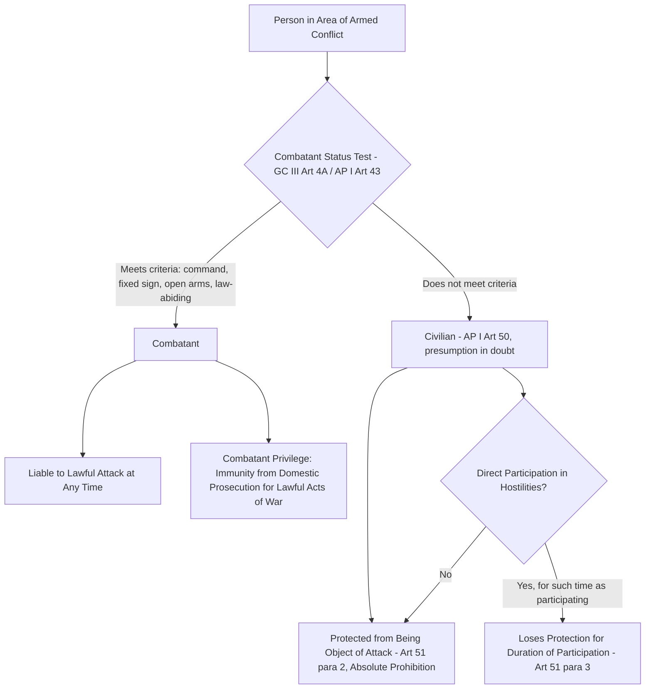

## The Principle of Distinction Between Combatants and Civilians

### Doctrinal Foundation: Distinction as the Cardinal Principle of IHL

The principle of distinction is widely regarded as the foundational organizing principle of the law governing the conduct of hostilities, from which the subsidiary rules of proportionality and precaution derive their operative significance. The International Court of Justice, in its *Advisory Opinion on the Legality of the Threat or Use of Nuclear Weapons* (1996), described the principle of distinction, together with the prohibition on causing unnecessary suffering, as one of the "cardinal principles" constituting the fabric of humanitarian law, and characterized the obligation to distinguish between combatants and non-combatants as an **"intransgressible" principle of customary international law** binding on all states regardless of treaty ratification.

The principle's core treaty articulation is found in **Article 48 of Additional Protocol I (AP I)** of 1977: "In order to ensure respect for and protection of the civilian population and civilian objects, the Parties to the conflict shall at all times distinguish between the civilian population and combatants and between civilian objects and military objectives and accordingly shall direct their operations only against military objectives." This provision synthesizes and builds upon customary rules traceable to the 1868 St. Petersburg Declaration and the 1907 Hague Regulations, which first articulated in treaty form the principle that the right of belligerents to injure the enemy is not unlimited.

### Key Points: The Two Constituent Distinctions

The principle of distinction, properly understood, requires two separate but related classifications to be made before and during an attack:

1. **Distinction between persons**: combatants versus civilians.
2. **Distinction between objects**: military objectives versus civilian objects.

Both classifications determine lawful targets; conversely, both civilians and civilian objects are protected from being made the object of attack, subject to specific exceptions discussed below.

### Mechanism: Defining the Combatant

**Combatant status** is a legal category carrying two significant consequences: the combatant's privilege (immunity from prosecution under domestic law for lawful acts of war that would otherwise constitute crimes, such as killing an opposing combatant) and, correspondingly, liability to be lawfully targeted at any time during the conflict (not merely while actively engaged in an attack). Combatant status is defined principally by **Article 4A of Geneva Convention III (GC III)**, which enumerates the categories of persons entitled to prisoner-of-war status upon capture — a category that substantially overlaps with, though is not textually identical to, the definition of lawful combatant. These categories include:

- Members of the armed forces of a party to the conflict, and members of militias or volunteer corps forming part of such armed forces.
- Members of other militias and volunteer corps, including organized resistance movements, belonging to a party to the conflict, provided they fulfil four cumulative conditions: (a) being commanded by a person responsible for subordinates, (b) having a fixed distinctive sign recognizable at a distance, (c) carrying arms openly, and (d) conducting operations in accordance with the laws and customs of war.
- Members of regular armed forces who profess allegiance to a government or authority not recognized by the detaining power.

Article 43 of AP I supplements and, for states parties, modifies this framework by defining the "armed forces" of a party to a conflict as comprising all organized armed forces, groups, and units under a command responsible to that party for the conduct of its subordinates, subject to an internal disciplinary system enforcing compliance with the rules of international law applicable in armed conflict — a formulation that relaxed, for AP I parties, the more demanding four-part test of GC III Article 4A(2) (notably the fixed distinctive sign and open carrying of arms requirements) for members of regular armed forces, while Article 44(3) addresses the more contested question of irregular fighters who cannot always distinguish themselves from the civilian population, a provision itself among the more contentious in AP I's negotiating history.

### Key Points: Defining the Civilian and the Civilian Population

**Article 50 of AP I** defines a civilian, by exclusion, as any person who does not belong to one of the categories of persons entitled to combatant status referred to in GC III Article 4A(1), (2), (3), and (6) and in AP I Article 43. Article 50(1) further provides that in case of doubt whether a person is a civilian, that person **shall be considered to be a civilian** — a presumption operating to the benefit of the protected category precisely because misclassification in either direction carries asymmetric costs, and the treaty resolves that doubt in favor of protection. Article 50(2) defines the civilian population as comprising all persons who are civilians, and Article 50(3) provides that the presence within the civilian population of individuals who do not come within the definition of civilians does not deprive the population of its civilian character — meaning the presence of combatants embedded among civilians does not convert the surrounding civilian population into a lawful target, though it may bear on the proportionality assessment for any attack directed at those embedded combatants.

**Article 51(2)** of AP I states the operative prohibition directly: "The civilian population as such, as well as individual civilians, shall not be the object of attack." This is understood as an **absolute prohibition** admitting no balancing against military necessity or advantage — unlike the proportionality rule (AP I Article 51(5)(b)), which permits some incidental civilian harm provided it is not excessive relative to anticipated military advantage, Article 51(2) prohibits deliberately targeting civilians as such under any circumstances.

### Doctrinal Content: Loss of Civilian Protection Through Direct Participation in Hostilities

**Article 51(3)** of AP I provides the critical qualification to civilian protection: civilians enjoy protection from attack "unless and for such time as they take a direct part in hostilities." This provision creates a temporally limited exception — a civilian who directly participates in hostilities loses protection **only for the duration of that participation**, reverting to protected civilian status once the specific hostile act concludes (in contrast to a combatant, who remains a lawful target continuously, including while asleep or off-duty, for the duration of the conflict).

The concept of "direct participation in hostilities" (DPH) is not itself defined in AP I, and its precise scope has generated substantial doctrinal debate, addressed most comprehensively in the ICRC's 2009 *Interpretive Guidance on the Notion of Direct Participation in Hostilities*. The Interpretive Guidance proposes a three-part cumulative test for an act to qualify as direct participation:

1. **Threshold of harm**: the act must be likely to adversely affect the military operations or military capacity of a party to the conflict, or alternatively to inflict death, injury, or destruction on persons or objects protected against direct attack.
2. **Direct causation**: there must be a direct causal link between the act and the harm likely to result, either from that act or from a coordinated military operation of which the act constitutes an integral part.
3. **Belligerent nexus**: the act must be specifically designed to directly cause the required threshold of harm in support of one party to the conflict and to the detriment of another.

[Speculation] The ICRC's Interpretive Guidance, while influential, is not itself a binding treaty text or universally endorsed restatement, and several of its specific conclusions — most notably its proposed "continuous combat function" category (treating members of an organized armed group whose continuous function it is to take direct part in hostilities as targetable on a continuous basis analogous to combatants, rather than only for the duration of discrete hostile acts) and its recommendation that force be limited to what is necessary given the circumstances (a "least-restrictive-means" or capture-rather-than-kill approach) — have been contested by a number of states' military and legal establishments as exceeding what is required by, or as departing from, the lex lata of AP I Article 51(3) itself.

### Analytical Debate: The "Revolving Door" Problem and Contested Scope of DPH

The temporally-limited character of the direct-participation exception generates what is commonly termed the **"revolving door" phenomenon**: a civilian may, under a strict reading of Article 51(3), participate directly in hostilities (for example, by planting an improvised explosive device), regain civilian protection immediately upon completing that discrete act, and thereafter be re-targetable only during a subsequent discrete act of participation, potentially cycling repeatedly between protected and unprotected status.

**The position favoring a strict, act-specific reading** of Article 51(3) emphasizes the textual language ("for such time as") and the protective purpose underlying the presumption of civilian status, arguing that expanding targetability beyond discrete hostile acts risks eroding the distinction principle's core protective function and effectively assimilating civilians who participate sporadically into a combatant-like status without the reciprocal formal accountability (command responsibility, disciplinary systems) that the combatant category presupposes.

**The position favoring a broader, function-based reading** — reflected in the ICRC's continuous combat function proposal, and echoed in some national military manuals and in the reasoning of the Israeli Supreme Court in the *Targeted Killings* case (*Public Committee Against Torture in Israel v. Government of Israel*, HCJ 769/02, 2006) — argues that a purely act-specific approach is difficult to operationalize against members of organized armed groups engaged in sustained hostile activity, and that a person whose continuous function within such a group is to engage in hostilities should be treated as targetable on an ongoing basis, more closely analogous to a combatant, precisely because the "revolving door" reading would afford such persons greater practical protection than actual combatants receive under identical circumstances of sustained hostile engagement.

### Related Topics

- The principle of proportionality and the prohibition of excessive incidental civilian harm
- The principle of precaution in attack under AP I Article 57
- Prisoner-of-war status and the combatant's privilege under Geneva Convention III
- Unlawful combatancy and the legal status of unprivileged belligerents
- The ICRC Interpretive Guidance on Direct Participation in Hostilities and its reception in state practice
- Additional Protocols I and II and the international versus non-international armed conflict distinction