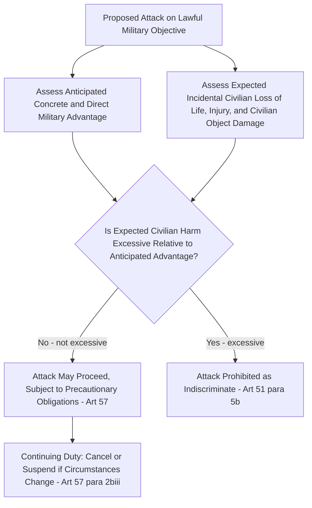

## The Principles of Proportionality and Military Necessity in the Conduct of Hostilities

### Doctrinal Foundation: Military Necessity as a Foundational and Limiting Concept

Military necessity is one of the foundational concepts underlying the entire structure of international humanitarian law (IHL), performing a dual and seemingly paradoxical function: it both **justifies** the use of force needed to achieve a legitimate military purpose and simultaneously **limits** that force to what is actually required for that purpose, thereby operating as a constraint rather than an open-ended license. This dual character is captured in the historical Lieber Code of 1863 (Instructions for the Government of Armies of the United States in the Field, prepared for the Union Army during the American Civil War), one of the earliest attempts to codify the laws of war, which defined military necessity as consisting of those measures indispensable for securing the ends of war that are lawful according to the modern law and usages of war.

Critically, military necessity does **not** operate in modern IHL as a freestanding justification permitting departure from specific treaty or customary rules. Rather, the balance between military necessity and humanitarian considerations has already been struck **within** the specific rules of IHL themselves during their formation — meaning a party cannot invoke military necessity as an independent defense to override an otherwise-binding specific prohibition (such as the prohibition on deliberately targeting civilians), except in the narrow instances where a specific rule expressly incorporates a military necessity qualification into its own terms (for example, Article 23(g) of the 1907 Hague Regulations, permitting destruction of enemy property only where "imperatively demanded by the necessities of war," or Article 54(5) of Additional Protocol I (AP I), permitting derogation from the prohibition on attacking objects indispensable to civilian survival in a party's own territory under imperative military necessity).

### Key Points: Military Necessity as Already Embedded in the Distinction Framework

Recall that the principle of distinction, codified in **Article 48 of AP I**, requires parties to a conflict to distinguish at all times between the civilian population and combatants, and between civilian objects and military objectives, directing operations only against the latter. **Article 52(2)** of AP I defines military objectives as objects which, by their nature, location, purpose, or use, make an effective contribution to military action, and whose total or partial destruction, capture, or neutralization, in the circumstances ruling at the time, offers a **definite military advantage**. This definition itself embeds a necessity-type limitation: an attack is lawful only against objects meeting this two-part cumulative test (effective contribution to military action, and definite military advantage from their neutralization), meaning objects lacking genuine military value cannot be attacked merely because doing so is convenient or advantageous in some diffuse or speculative sense.

### Mechanism: The Principle of Proportionality

Where an attack is directed at a lawful military objective but is expected to cause some incidental harm to civilians or civilian objects, the **principle of proportionality** governs whether that incidental harm renders the attack unlawful notwithstanding the objective's status as a legitimate target. The core treaty formulation is **Article 51(5)(b)** of AP I, which characterizes as **indiscriminate** (and therefore prohibited) an attack "which may be expected to cause incidental loss of civilian life, injury to civilians, damage to civilian objects, or a combination thereof, which would be **excessive in relation to the concrete and direct military advantage anticipated**." This is restated and reinforced in the precautionary obligations of **Article 57(2)(a)(iii)** and **57(2)(b)**, which require those who plan, decide upon, or execute an attack to refrain from launching, or to cancel or suspend, any attack expected to cause disproportionate incidental civilian harm.

Several doctrinal features of this rule warrant precise statement:

- **It is a comparative, not absolute, standard.** Unlike the prohibition on deliberately targeting civilians (AP I Article 51(2)), which is categorical, the proportionality rule does not prohibit all incidental civilian harm — it prohibits only harm that is **excessive** relative to the anticipated military advantage. Some collateral civilian harm is not per se unlawful under IHL.
- **The assessment is prospective, not retrospective.** The legality of an attack is assessed based on the information reasonably available to the commander planning or deciding upon the attack **at the time**, not based on the harm that actually eventuated in hindsight. A commander who reasonably, though mistakenly, assessed the anticipated civilian harm as proportionate based on available intelligence does not necessarily commit a violation merely because greater harm resulted than anticipated, provided the ex ante assessment was itself made in good faith and was reasonable.
- **"Concrete and direct" military advantage.** The military advantage weighed in the balance must be concrete and direct, not merely hypothetical, speculative, or diffuse — a matter of ongoing interpretive debate concerning whether the relevant advantage must be assessed attack-by-attack or may take into account a wider operational or campaign-level context (discussed further below).
- **No universally agreed quantitative metric.** IHL supplies no formula or numerical ratio for weighing civilian harm against military advantage; the assessment is inherently qualitative and contextual, applied by the responsible commander, and reviewed after the fact (where reviewed at all) by reference to the reasonableness of that contemporaneous judgment.

### Doctrinal Content: Judicial and Institutional Elaboration

The proportionality standard has been applied and elaborated in several significant bodies of practice, most notably the **Final Report to the Prosecutor by the Committee Established to Review the NATO Bombing Campaign Against the Federal Republic of Yugoslavia** (ICTY, 2000), which, while not itself a judicial decision, offered an influential institutional articulation of the difficulty in applying the proportionality standard: the Committee observed that reasonable military commanders might differ in their application of the proportionality principle to a given set of facts, and that the standard, properly applied, permits a range of reasonable professional judgment rather than a single determinate answer — a feature that has drawn criticism for potentially affording excessive deference to the attacking party's own contemporaneous assessment.

The **ICTY's *Galić* Trial Judgment** (Prosecutor v. Galić, 2003), addressing the prolonged siege and shelling of Sarajevo, applied the proportionality principle in convicting the accused for a campaign of sniping and shelling that included attacks constituting or contributing to unlawful terrorization and disproportionate harm to civilians, contributing significant jurisprudential content to the customary status and practical content of Article 51 of AP I as applied to a sustained urban siege context. [Inference] Because proportionality assessments turn heavily on fact-specific, contemporaneous operational judgments rarely fully reconstructable after the fact, subsequent accountability mechanisms (whether international tribunals, domestic courts-martial, or fact-finding missions) have generally found it more tractable to establish violations through evidence of a pattern of conduct, disregard for available precautions, or gross disparity between harm and advantage, than through a precise, generally applicable numerical or formulaic threshold.

### Analytical Debate: The Scope of "Military Advantage" — Attack-Specific or Campaign-Wide

A genuine and unresolved interpretive debate concerns the temporal and operational scope of the "concrete and direct military advantage" against which incidental civilian harm is weighed. AP I itself does not resolve whether "military advantage" must be assessed by reference to the isolated tactical value of the specific attack in question, or whether it may properly account for the wider strategic or campaign-level context of which that attack forms a part.

**The narrower, attack-specific position** holds that the advantage must be tied to the concrete and direct effect of the particular attack under consideration, consistent with the qualifiers "concrete and direct" (as opposed to general, indirect, or speculative) in Article 51(5)(b) itself, and consistent with the protective purpose of ensuring that diffuse claims of campaign-wide strategic benefit cannot be invoked to justify otherwise excessive harm from a specific, narrowly-scoped strike.

**The broader, contextual position**, reflected in the declarations and reservations of several states upon ratifying AP I (including the United Kingdom's statement that "military advantage" refers to the advantage anticipated from the **attack considered as a whole**, not only from isolated or particular parts of that attack), argues that modern military operations are frequently conducted as coordinated, multi-part campaigns in which individual strikes derive their military logic and value from their contribution to a broader operational objective, and that an artificially narrow, attack-by-attack assessment would fail to capture the genuine military rationale and value of coordinated operations, particularly in the context of a broader offensive or defensive campaign consisting of interdependent actions.

[Inference] This interpretive divergence has practical significance disproportionate to its textual subtlety, since a broader construction of "military advantage" tends, all else equal, to permit a larger quantum of anticipated incidental civilian harm to be characterized as non-excessive, while a narrower construction constrains the permissible harm calculus more tightly to the isolated tactical value of each individual strike — a divergence that remains unresolved by any single authoritative judicial pronouncement squarely adjudicating the point, leaving it a matter of continuing doctrinal and state-practice contestation.

### Related Topics

- The principle of distinction between combatants and civilians
- The principle of precaution in attack under Additional Protocol I Article 57
- Military objectives and the definition of "effective contribution to military action"
- The prohibition of indiscriminate attacks under Additional Protocol I Article 51
- The ICTY's *Galić* jurisprudence and the crime of terrorizing a civilian population
- Additional Protocols I and II and the international versus non-international armed conflict distinction