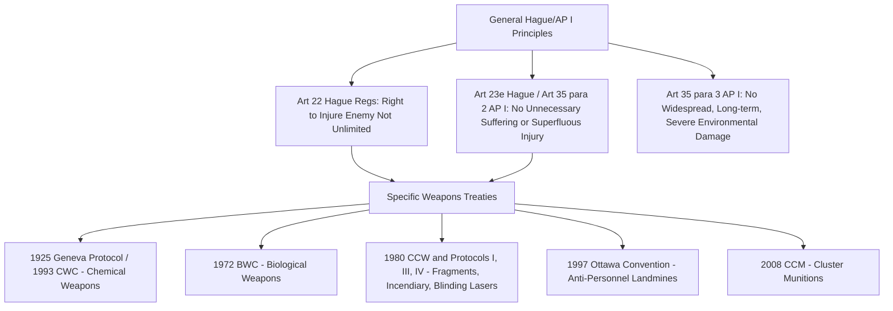

## Means and Methods of Warfare Under the Hague Regulations and Weapons-Specific Prohibitions

### Doctrinal Foundation: The Hague Regulations and the Origins of Weapons Regulation

International humanitarian law (IHL) distinguishes analytically between rules governing **who and what may be attacked** (the principle of distinction, discussed elsewhere in this chapter) and rules governing **how attacks may be carried out** — the permissible "means" (weapons and weapons systems) and "methods" (tactics and techniques of warfare) available to belligerents. This second body of rules traces its earliest codified expression to the **Hague Regulations of 1907** (formally, the Regulations annexed to the Hague Convention IV Respecting the Laws and Customs of War on Land), themselves building on the 1899 Hague Convention II and the earlier 1868 St. Petersburg Declaration.

The foundational limiting principle is stated in **Article 22 of the Hague Regulations**: "The right of belligerents to adopt means of injuring the enemy is not unlimited." This single sentence establishes the premise from which all subsequent weapons and methods regulation proceeds — that military necessity, however broadly conceived, does not license unrestricted violence, and that specific customary and treaty rules operate as external constraints on the choice of weapons and tactics regardless of their tactical utility.

### Key Points: The Prohibition of Unnecessary Suffering and Superfluous Injury

**Article 23(e)** of the Hague Regulations prohibits the employment of "arms, projectiles, or material calculated to cause unnecessary suffering," a formulation restated in modern terms by **Article 35(2) of Additional Protocol I (AP I)** of 1977: "It is prohibited to employ weapons, projectiles and material and methods of warfare of a nature to cause superfluous injury or unnecessary suffering." The International Court of Justice, in its *Advisory Opinion on the Legality of the Threat or Use of Nuclear Weapons* (1996), characterized this prohibition, together with the principle of distinction, as one of the "cardinal principles" of humanitarian law and as reflecting an **intransgressible** rule of customary international law binding on all states.

The doctrinal test for "unnecessary suffering" or "superfluous injury" is inherently **comparative**: a weapon or method is not prohibited merely because it causes severe suffering or injury (virtually all lethal weapons do), but only where the suffering or injury caused is **superfluous to the legitimate military purpose** of putting the enemy combatant out of action — that is, where the harm inflicted exceeds what is actually needed to achieve that military purpose. This standard has grounded several specific weapons prohibitions discussed below, though its inherently evaluative character (requiring a comparison between a weapon's military utility and the severity of the injury it causes) has generated recurring difficulty in application to novel weapons technology.

**Article 35(3)** of AP I supplies a related but analytically distinct prohibition: methods or means of warfare intended, or expected, to cause widespread, long-term, and severe damage to the natural environment are prohibited — a formulation understood to require the three qualifying conditions (widespread, long-term, and severe) to be met **cumulatively**, a notably high and much-debated threshold addressed further below.

### Mechanism: The Framework of Specific Weapons Treaties

Building on the general Hague/AP I principles, a body of specific weapons-control treaties has developed, each either banning or restricting a particular weapons category on the basis that its ordinary or intended use is inherently indiscriminate, causes unnecessary suffering, or otherwise fails to comply with the general principles above:

- **Chemical weapons**: prohibited by the 1925 Geneva Gas Protocol (prohibiting use only) and comprehensively banned, including development, production, and stockpiling, by the **1993 Chemical Weapons Convention (CWC)**, which established the Organisation for the Prohibition of Chemical Weapons (OPCW) as its verification body.
- **Biological weapons**: banned comprehensively, including development and stockpiling, by the **1972 Biological Weapons Convention (BWC)**, though the BWC notably lacks a formal verification mechanism analogous to the OPCW, a long-standing point of institutional weakness in the regime.
- **Blinding laser weapons**: prohibited by **Protocol IV (1995)** to the 1980 Convention on Certain Conventional Weapons (CCW), banning laser weapons specifically designed to cause permanent blindness to unenhanced vision — a rare instance of a weapon being prohibited preemptively, before widespread operational deployment, on the basis of an anticipated unnecessary-suffering assessment.
- **Anti-personnel landmines**: comprehensively banned (use, stockpiling, production, and transfer) by the **1997 Ottawa (Mine Ban) Convention**, adopted substantially outside the traditional Geneva/Hague treaty framework through the "Ottawa Process," a coalition-driven diplomatic initiative involving states and civil society (notably the International Campaign to Ban Landmines) operating outside the UN's traditional Conference on Disarmament framework. Several militarily significant states, including the United States, Russia, and China, remain outside the Convention.
- **Cluster munitions**: banned by the **2008 Convention on Cluster Munitions (CCM)**, addressing the weapon's tendency to disperse numerous submunitions over a wide area, a significant proportion of which historically fail to detonate on impact, creating a persistent post-conflict hazard functionally similar to landmines.
- **Non-detectable fragments and incendiary weapons**: regulated respectively by **Protocol I** (prohibiting weapons whose primary effect is injury by fragments not detectable by X-ray) and **Protocol III** (restricting, though not comprehensively banning, incendiary weapon use against civilian and, in specified circumstances, military targets) to the CCW.

### Doctrinal Content: Prohibited Methods of Warfare

Distinct from weapons-specific prohibitions, IHL separately prohibits certain **methods** or **tactics** of warfare regardless of the weapon employed:

- **Perfidy**, prohibited by **Article 37 of AP I**, is defined as acts inviting the confidence of an adversary to lead him to believe that he is entitled to, or is obliged to accord, protection under the rules of IHL, with intent to betray that confidence — examples given in the text include feigning an intent to negotiate under a flag of truce, feigning incapacitation by wounds, feigning civilian or non-combatant status, or feigning protected status by using UN, neutral, or protective emblems (such as the Red Cross). Perfidy is distinguished from the lawful practice of **ruses of war** (Article 37(2)), which mislead an adversary or induce recklessness but do not invite reliance on IHL protections themselves — camouflage, decoys, mock operations, and misinformation are given as lawful examples.
- **Denial of quarter**, prohibited by **Article 40 of AP I** and Article 23(d) of the Hague Regulations, bars orders that there shall be no survivors, threats to this effect, or conducting hostilities on this basis — the prohibition on refusing to accept an enemy's surrender.
- **Starvation of civilians as a method of warfare**, prohibited by **Article 54 of AP I**, bars attacking, destroying, removing, or rendering useless objects indispensable to the survival of the civilian population, including foodstuffs, agricultural areas, crops, livestock, drinking water installations, and irrigation works, for the specific purpose of denying their sustenance value to the civilian population or the adverse party (whatever the motive), subject to a narrow military-necessity-based derogation in Article 54(5) applicable to a party defending its own territory against invasion.
- **Improper use of protected emblems and signs**, addressed across the Geneva Conventions and AP I, prohibiting misuse of the Red Cross, Red Crescent, and other protective emblems, the white flag, and the distinctive emblems of the United Nations, in each case to preserve the practical protective function these signs serve by ensuring adversaries can rely on them in good faith.

### Analytical Debate: The Weapons Review Obligation and Novel Technologies

**Article 36 of AP I** imposes an important but frequently under-implemented obligation: in the study, development, acquisition, or adoption of a new weapon, means, or method of warfare, a state party is obliged to determine whether its employment would, in some or all circumstances, be prohibited by AP I or by any other rule of international law applicable to that state. This is a **domestic, self-executing review obligation** — AP I does not establish any international verification or oversight body to review states' weapons development, leaving compliance entirely to each state's own internal legal review process, the rigor and transparency of which varies substantially and is rarely subject to external scrutiny.

[Inference] The Article 36 review obligation has become a central point of contestation in debates over emerging weapons technologies not contemplated by the treaty drafters — most prominently, autonomous weapons systems capable of selecting and engaging targets with reduced or absent human intervention. **One position**, emphasizing the technology-neutral character of the general Hague/AP I principles (distinction, proportionality, precaution, prohibition of superfluous injury), holds that existing IHL, properly applied through rigorous Article 36 review, is capable in principle of governing such systems without need for a dedicated new treaty instrument, since the relevant legal questions (can the system reliably distinguish combatants from civilians; can it make the contextual, judgment-dependent proportionality assessment IHL requires) are assessable under the existing legal framework, however difficult that assessment may be in practice. **The contrary position**, advanced within ongoing discussions at the CCW's Group of Governmental Experts on Lethal Autonomous Weapons Systems, argues that the increasing removal of substantive human judgment from targeting decisions raises questions the existing framework was not designed to answer — particularly whether meaningful human control over the use of force is itself an independent legal or ethical requirement distinct from compliance with distinction and proportionality as such — and that a dedicated, weapons-category-specific instrument (following the precedent of the blinding-laser and landmine treaties) may be necessary rather than relying solely on states' individual, non-verified Article 36 assessments. [Speculation] As of the present, no binding multilateral instrument specifically and comprehensively regulating autonomous weapons systems has been concluded, and the trajectory of these ongoing CCW discussions toward either a new protocol, a non-binding political declaration, or continued reliance on existing IHL remains unresolved and subject to change.

### Related Topics

- The principle of distinction between combatants and civilians
- The principles of proportionality and military necessity in the conduct of hostilities
- The ICJ Nuclear Weapons Advisory Opinion and the customary status of core IHL principles
- Chemical and biological weapons disarmament: the CWC, BWC, and OPCW verification regime
- War crimes and individual criminal responsibility for unlawful means and methods under the Rome Statute
- Lethal autonomous weapons systems and the CCW Group of Governmental Experts process