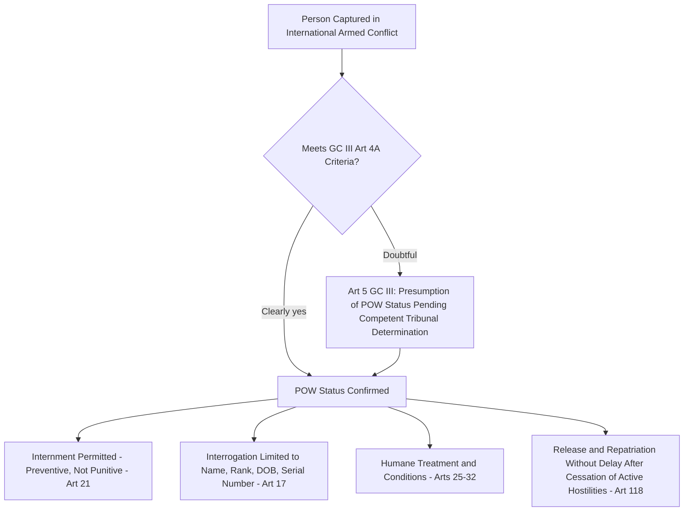

## Protection of Prisoners of War and Civilians Under Occupation

### Doctrinal Foundation: Two Distinct Protective Regimes

This item addresses two analytically distinct bodies of international humanitarian law (IHL) protection, unified by the fact that both concern persons who have fallen under the **power or authority of an adverse party** rather than persons still at liberty within their own state's control. Prisoner-of-war (POW) protection concerns captured combatants who remain, throughout their captivity, in an active relationship to an ongoing international armed conflict (IAC). Occupation law concerns the entire civilian population of a territory that has come under the effective control of a hostile foreign power, a status that may persist long after active hostilities in that territory have ceased. Both regimes are grounded in the 1949 Geneva Conventions — POW protection principally in **Geneva Convention III (GC III)**, civilian protection principally in **Geneva Convention IV (GC IV)** — supplemented by Additional Protocol I (AP I) of 1977 and customary international law.

### Key Points: Prisoner-of-War Status and Its Legal Consequences

**GC III, Article 4A**, defines the categories of persons entitled to POW status upon falling into the power of the enemy — principally members of the armed forces of a party to the conflict, and members of militias, volunteer corps, and organized resistance movements meeting the four cumulative conditions of responsible command, a fixed distinctive sign, open carrying of arms, and compliance with the laws and customs of war. Recall that these criteria substantially overlap with, though are not textually identical to, the definition of a lawful combatant entitled to the combatant's privilege — immunity from domestic prosecution for lawful acts of war.

POW status carries several doctrinally significant consequences distinguishing it sharply from ordinary criminal detention:

- **Article 21** permits internment of POWs (as opposed to more restrictive confinement) for the duration of active hostilities, without requiring any individualized judicial process, since POW internment is not punitive but preventive — designed solely to remove the combatant from further participation in hostilities, not to punish prior lawful conduct.
- **Article 17** limits interrogation upon capture: a POW is required to disclose only surname, first names, rank, date of birth, and army, regimental, personal, or serial number (or equivalent information) — the so-called "Big Four" — and may not be compelled to disclose further information, with the Convention specifying that no physical or mental torture, nor any other form of coercion, may be inflicted on prisoners to secure information of any kind, and prisoners who refuse to answer may not be threatened, insulted, or exposed to unpleasant or disadvantageous treatment of any kind.
- **Article 118** requires that prisoners of war be released and repatriated without delay after the **cessation of active hostilities**, a provision whose application to protracted or ambiguous conflict-termination scenarios has generated recurring practical difficulty (illustrated historically by prolonged POW retention disputes following the Iran-Iraq War and the Korean War armistice, where "cessation of active hostilities" did not coincide cleanly with a final peace settlement).
- **Article 5** addresses the doctrinally important scenario in which a captured person's entitlement to POW status is in doubt: such persons **shall enjoy the protection of the present Convention until such time as their status has been determined by a competent tribunal**, establishing a presumption of POW status pending individualized determination, rather than allowing the detaining power to unilaterally deny protected status to a category of captured persons without such a hearing.

### Mechanism: Occupation Law Under Geneva Convention IV and the Hague Regulations

**Occupation** is a distinct legal status under IHL, triggered not by any declaration but by a **factual test of effective control**. The foundational definition remains **Article 42 of the 1907 Hague Regulations**: "Territory is considered occupied when it is actually placed under the authority of the hostile army. The occupation extends only to the territory where such authority has been established and can be exercised." This is restated in **Common Article 2** of the 1949 Geneva Conventions, which extends the Conventions' application to "all cases of partial or total occupation of the territory of a High Contracting Party, even if the said occupation meets with no armed resistance." Occupation is therefore a matter of fact (does the occupying power exercise effective authority over the territory, displacing the sovereign's ability to exercise its own authority there) rather than a matter of the occupying power's own characterization or intent, and it can arise and persist independent of ongoing combat operations.

The governing legal principle of occupation law is that occupation is **temporary and does not transfer sovereignty**: the occupying power administers the territory but does not acquire title to it, and its administrative authority is constrained by the Hague Regulations and GC IV to preserve, so far as possible, the status quo ante pending a final resolution of the territory's status. Key substantive obligations include:

- **Article 43 of the Hague Regulations** requires the occupying power to take all measures in its power to restore and ensure, as far as possible, **public order and civil life**, respecting, unless absolutely prevented, the laws in force in the country — a provision generally understood to permit the occupying power to make necessary changes for its own security and the population's welfare, but not to remake the occupied territory's legal and institutional order wholesale.
- **Article 49 of GC IV** prohibits individual or mass forcible transfers or deportations of protected persons from occupied territory, and separately, in its final paragraph, prohibits the occupying power from **transferring parts of its own civilian population into the territory it occupies** — a provision of particular contemporary significance given its invocation in disputes concerning the legality of settlement activity in occupied territory.
- **Article 53 of GC IV** prohibits the occupying power from destroying real or personal property, whether individually or collectively owned, except where such destruction is rendered **absolutely necessary by military operations** — again reflecting the recurring IHL pattern of a general prohibition subject to a narrowly-construed military necessity exception.
- **Article 64 of GC IV** permits the occupying power to subject the population to provisions essential to enable it to fulfil its obligations under the Convention, maintain orderly government, and ensure the security of the occupying power and its administration, but the penal laws of the occupied territory generally remain in force, and the occupying power's own tribunals may try protected persons only for specified categories of offences.
- **Article 47 of GC IV** provides that protected persons in occupied territory shall not be deprived of the benefits of the Convention by any change introduced into the institutions or government of the territory, nor by any agreement between the occupied territory's authorities and the occupying power, nor by annexation — a provision designed to prevent an occupying power from circumventing its obligations through purported legal or political restructuring of the occupied territory.

### Doctrinal Content: Civilian Internment Under GC IV

Distinct from POW internment under GC III, **GC IV Articles 41–43 and 78–79** permit the occupying power (or a party to the conflict generally, with respect to enemy nationals in its own territory under Article 41) to intern civilians, but only where **absolutely necessary for imperative reasons of security concerning the Occupying Power** — a considerably more restrictive standard than the essentially automatic internment permitted for POWs under GC III, reflecting the different premise: civilian internment is an exceptional security measure requiring individualized justification, not a routine incident of status as it is for a captured combatant. **Article 78** further requires that any decision to intern a civilian be subject to a right of appeal, with the appeal decided with the least possible delay, and, if internment is maintained, periodic review at least twice yearly by a competent body established by the occupying power.

### Analytical Debate: Contested Applications of Occupation Law to Contemporary Territorial Situations

[Inference] The factual, effective-control test for the existence of occupation, combined with the temporal ambiguity inherent in "temporary" administration that in practice sometimes extends for decades, has generated recurring and genuinely contested applications of occupation law doctrine to specific contemporary territorial situations, particularly where a state disputes that it retains "effective control" following a partial or reconfigured military withdrawal, or where a territory's final status remains formally unresolved under a broader political process. Two illustrative dimensions of this debate:

**The threshold question of continuing occupation after military redeployment.** Where an occupying power withdraws ground forces from a territory but retains substantial control over its borders, airspace, or other key aspects of governance, a debate exists as to whether occupation, as a matter of the Hague Article 42 effective-control test, has genuinely ended or merely changed form. Proponents of a **functional test** argue that effective control can be exercised through means other than direct ground presence (control of borders, airspace, and key infrastructure sufficient to substitute for the local government's own authority in critical respects), such that occupation may continue notwithstanding a ground force withdrawal; proponents of a stricter **boots-on-the-ground test** argue that Article 42's requirement that authority be "actually placed" under the hostile army, and that occupation extend "only to the territory where such authority has been established and can be exercised," presupposes a more direct and territorially-present form of control that a purely external perimeter control does not satisfy.

**The applicability of Article 49(6)'s settlement-transfer prohibition to territories of disputed sovereign status.** A separate debate concerns whether GC IV's occupation-law framework applies in full to a territory whose prior sovereign status is itself contested (as opposed to territory whose status as belonging to another High Contracting Party immediately prior to occupation is undisputed) — an argument advanced by some states in specific disputed-territory contexts to argue that the classical occupation framework, including Article 49(6), does not straightforwardly apply — against the majority position among states, the ICRC, and international bodies including the ICJ (in its 2004 *Advisory Opinion on the Legal Consequences of the Construction of a Wall in the Occupied Palestinian Territory*) that GC IV's protections are triggered by the factual existence of occupation as such, independent of unresolved sovereignty disputes over the underlying territory, precisely because the Convention's protective purpose would otherwise be defeated in exactly the contested-sovereignty situations where civilian protection is often most acutely needed.

### Related Topics

- The four Geneva Conventions of 1949 and Common Article 3
- The principle of distinction between combatants and civilians
- The ICJ Advisory Opinion on the Legal Consequences of the Construction of a Wall
- Additional Protocols I and II and the international versus non-international armed conflict distinction
- Grave breaches and war crimes under Geneva Convention IV and the Rome Statute
- Belligerent occupation and the law of self-determination