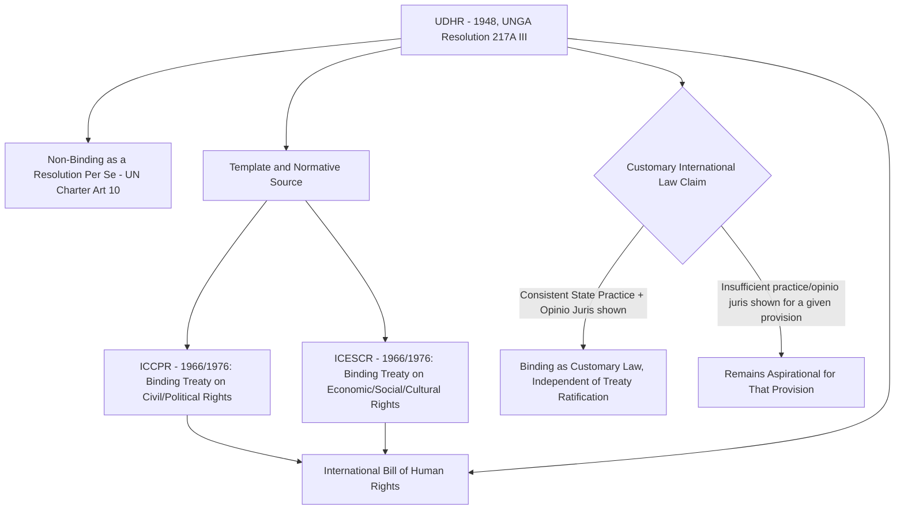

## The Universal Declaration of Human Rights and Its Contested Normative Status

### Doctrinal Foundation: The UDHR as a UN General Assembly Resolution

The Universal Declaration of Human Rights (UDHR) was adopted by the United Nations General Assembly on 10 December 1948 as **Resolution 217A (III)**, with 48 states voting in favor, none against, and eight abstentions (including the Soviet bloc states, Saudi Arabia, and South Africa). The UDHR's threshold doctrinal significance lies precisely in the legal form of its adoption: it is a **General Assembly resolution**, not a treaty. Under Article 10 of the UN Charter, General Assembly resolutions are, as a general matter, **recommendatory** rather than legally binding on member states, in contrast to a treaty, which creates binding obligations upon ratification for states that consent to be bound under the framework of the Vienna Convention on the Law of Treaties. This formal starting point — a non-binding recommendatory instrument, drafted deliberately as an aspirational proclamation rather than a binding legal text, per the explicit intent of its drafters, including the UN Commission on Human Rights chaired by Eleanor Roosevelt — is the origin of the UDHR's contested normative status, addressed in detail below.

The UDHR comprises a preamble and 30 articles, articulating a broad range of rights spanning civil and political rights (Articles 3–21, including the right to life, liberty and security of person, freedom from torture and slavery, equality before the law, freedom of expression, and the right to political participation) and economic, social, and cultural rights (Articles 22–27, including the right to social security, work, an adequate standard of living, education, and participation in cultural life), reflecting a drafting compromise between the differing rights priorities of the Western bloc (emphasizing civil and political rights) and the Soviet bloc and some developing states (emphasizing economic and social rights) during the drafting process.

### Key Points: Distinguishing Legal Bindingness From Legal Significance

A recurring analytical error is to treat the question "is the UDHR legally binding" as equivalent to the question "does the UDHR have legal significance." These are distinct inquiries. As a General Assembly resolution, the UDHR does not itself impose binding treaty obligations on states. However, this does not mean the UDHR is without legal effect, for at least three independent doctrinal reasons developed below: its role as the normative template for subsequent binding treaty law; its potential status, in whole or in part, as evidence of customary international law; and, more contested still, arguments that certain of its provisions have attained the status of general principles of law or, for a narrower subset of norms, jus cogens.

### Mechanism: The UDHR as Template for the Binding International Bill of Human Rights

The most doctrinally uncontroversial channel through which the UDHR acquired binding legal effect was through its **operationalization into binding treaty law**. The UDHR was always understood by its drafters as the first stage of a longer project, subsequently realized through two multilateral treaties opened for signature in 1966 and entering into force in 1976: the **International Covenant on Civil and Political Rights (ICCPR)** and the **International Covenant on Economic, Social and Cultural Rights (ICESCR)**. Together with the UDHR, these three instruments are collectively referred to as the **International Bill of Human Rights**. The ICCPR and ICESCR translate the UDHR's aspirational proclamations into binding treaty obligations for their respective states parties, each with its own supervisory mechanism (the Human Rights Committee for the ICCPR, and the Committee on Economic, Social and Cultural Rights for the ICESCR), and each subject to the ordinary rules of treaty law, including reservations, denunciation, and state-specific ratification status — meaning, critically, that a state's obligations under the ICCPR or ICESCR depend on that state's own ratification, unlike whatever independent normative force the UDHR itself might carry as discussed below.

### Doctrinal Content: The Customary International Law Argument

The most significant and most contested claim regarding the UDHR's independent legal force is that some or all of its provisions have, through subsequent state practice, crystallized into rules of **customary international law**, binding on all states regardless of treaty ratification. Recall that customary international law requires two cumulative elements, as articulated in the ICJ's *North Sea Continental Shelf Cases* (1969): (1) **consistent state practice**, meaning a general and consistent pattern of state conduct; and (2) ***opinio juris***, meaning that states engage in that practice out of a sense of legal obligation, rather than mere courtesy, convenience, or coincidence.

Proponents of the customary-law thesis point to a body of evidence: the UDHR's near-universal invocation in international diplomacy, its incorporation by reference into numerous national constitutions adopted since 1948, its repeated reaffirmation in subsequent UN instruments (including the 1993 Vienna Declaration and Programme of Action, adopted by consensus at the World Conference on Human Rights), and its citation as an authoritative statement of human rights standards by international and domestic tribunals across a wide range of jurisdictions — cumulatively argued to constitute the state practice and opinio juris required to establish customary status, at minimum for those UDHR provisions most consistently invoked and applied.

**A significant qualification, however, attaches to this claim**: the customary-law argument is generally understood by careful scholarship not to apply uniformly to the UDHR as an undifferentiated whole, but rather to be assessed **provision by provision**. Rights with the strongest claim to customary status — including the prohibitions on torture, slavery, and genocide, and the right to be free from racial discrimination — are also independently supported by dedicated treaty regimes and by widespread, unambiguous state practice and opinio juris specific to those norms (and, for some, including torture and genocide, an additional claim to jus cogens status, discussed below). Other UDHR provisions, particularly certain economic and social rights articulated in more open-textured or aspirational terms (for example, Article 24's right to "periodic holidays with pay"), have a considerably weaker claim to customary status, given the absence of the consistent, obligation-driven state practice required to establish a customary rule specifically with respect to those more programmatic provisions.

### Key Points: The Jus Cogens Question for a Narrower Core

A distinct and even more demanding claim concerns whether certain UDHR-articulated rights have attained the status of ***jus cogens*** — recall that this term denotes a peremptory norm of general international law, accepted and recognized by the international community of states as a whole as a norm from which no derogation is permitted, per Article 53 of the Vienna Convention on the Law of Treaties, such that even a treaty conflicting with the norm would be void. There is substantial, though not universal, scholarly and judicial consensus that a narrow set of prohibitions reflected in the UDHR — the prohibitions on genocide, slavery, torture, and racial discrimination in particular — constitute jus cogens norms, a conclusion supported by their non-derogable character even under the ICCPR's own derogation clause (Article 4(2) of the ICCPR excludes these categories from permissible derogation even in a declared public emergency), and by their consistent invocation as peremptory in international jurisprudence, including the International Law Commission's own codification work on peremptory norms. This jus cogens status, however, is properly understood as attaching to the **specific customary or treaty-based prohibition itself** (independently supported by extensive practice specific to that prohibition), rather than being derived from, or dependent upon, the UDHR's own status as an instrument.

### Analytical Debate: Universality Versus Cultural Relativism

Independent of the technical legal-sources debate addressed above, the UDHR has been the subject of a longstanding and unresolved **philosophical and political debate concerning universality**, which bears directly on its practical normative authority even where its formal legal status (whether as custom, treaty template, or otherwise) is not itself in dispute.

**The universalist position**, reflected in the UDHR's own text (Article 1's assertion that "all human beings are born free and equal in dignity and rights") and reaffirmed by consensus in the 1993 Vienna Declaration's statement that human rights are "universal, indivisible and interdependent and interrelated," holds that the rights articulated in the UDHR derive from the inherent dignity of the human person as such, independent of cultural, religious, or political particularity, such that no state may invoke its own cultural, religious, or developmental context to justify non-compliance with these standards.

**The cultural relativist critique**, articulated in various forms since the UDHR's drafting — including the American Anthropological Association's 1947 statement questioning the imposition of a Western-derived rights framework on non-Western societies, and later articulated through instruments such as the 1981 African Charter on Human and Peoples' Rights (which frames rights alongside corresponding duties to the community, family, and state, reflecting a more communitarian conception than the UDHR's more individual-rights-centered framework) and debates surrounding the 1993 Bangkok Declaration (adopted by Asian states preparing for the Vienna World Conference, which affirmed universality while also emphasizing that human rights must be considered in the context of national and regional particularities and various historical, cultural and religious backgrounds) — argues that the UDHR's specific formulation of rights reflects particular Western liberal philosophical premises (individual autonomy, a specific conception of the relationship between citizen and state) that are not neutral or universally shared, and that imposing this specific formulation uncritically risks a form of normative imperialism that fails to accommodate legitimate variation in how different societies structure the relationship between individual, community, and state.

[Inference] The practical resolution reached at the 1993 Vienna World Conference — reaffirming universality as a matter of formal consensus while simultaneously acknowledging that "the significance of national and regional particularities and various historical, cultural and religious backgrounds must be borne in mind" — is generally read by scholars not as a definitive resolution of the underlying philosophical debate, but as a diplomatic formula allowing states holding genuinely divergent positions on the universality question to converge on common text, meaning the tension between universalist and relativist premises continues to surface in subsequent human rights diplomacy, treaty negotiation, and implementation disputes rather than having been doctrinally settled.

### Related Topics

- The International Covenant on Civil and Political Rights and its supervisory mechanisms
- The International Covenant on Economic, Social and Cultural Rights and progressive realization
- Sources of customary international law: state practice, opinio juris, and the persistent objector doctrine
- Jus cogens norms and their relationship to treaty and customary international law
- Regional human rights systems: the African, Inter-American, and European Conventions
- The 1993 Vienna Declaration and Programme of Action