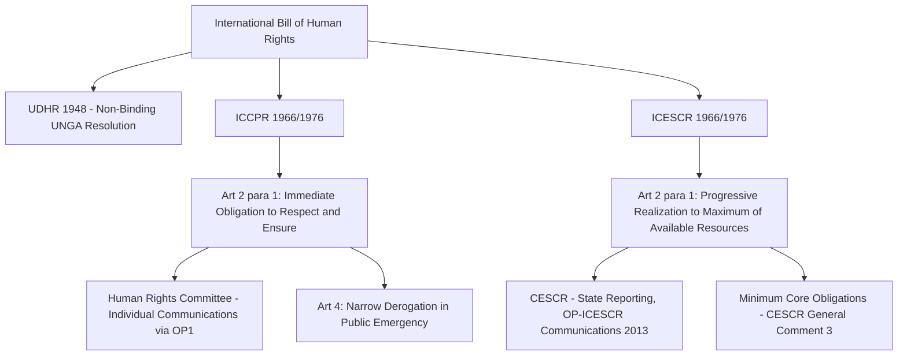

## The ICCPR and ICESCR as the Twin Covenants and the Civil-Political Versus Economic-Social-Cultural Rights Divide

### Doctrinal Foundation: From Aspiration to Binding Treaty Law

The Universal Declaration of Human Rights (UDHR), adopted as a non-binding UN General Assembly resolution in 1948, was understood by its drafters as the first stage of a longer codification project. That project reached its treaty-law fulfillment with the **International Covenant on Civil and Political Rights (ICCPR)** and the **International Covenant on Economic, Social and Cultural Rights (ICESCR)**, both adopted by the UN General Assembly on 16 December 1966 and both entering into force in 1976 upon reaching the required threshold of ratifications. Together with the UDHR, these two Covenants constitute the **International Bill of Human Rights**. Unlike the UDHR, both Covenants are multilateral treaties in the full legal sense, governed by the ordinary rules of treaty law under the Vienna Convention on the Law of Treaties, creating binding obligations only for states that have ratified or acceded to them, and subject to permissible reservations, denunciation procedures, and state-specific ratification status.

### Key Points: Why Two Covenants Rather Than One

The drafting history reveals that the UN Commission on Human Rights initially intended a **single, unified covenant** encompassing both categories of rights, consistent with the UDHR's own integrated treatment of civil-political and economic-social-cultural rights within a single instrument. The decision to split the project into two separate treaties was made by the UN General Assembly in 1951-1952, reflecting Cold War-era ideological division: Western states generally favored prioritizing civil and political rights, framed as directly justiciable, cost-neutral obligations of restraint on state power, viewing them as amenable to immediate, unqualified implementation and judicial enforcement; the Soviet bloc and a number of developing states favored greater emphasis on economic, social, and cultural rights, viewing civil-political rights as insufficient without the material and social conditions to make their exercise meaningful, but generally regarded these rights as inherently more resource-dependent and progressively realizable rather than immediately enforceable in the same manner.

### Mechanism: Differing Obligation Structures — Immediate Versus Progressive Realization

The single most significant doctrinal distinction between the two Covenants lies in the **nature of the obligation** each imposes on states parties, reflected in the differing language of their respective general obligation clauses.

**ICCPR Article 2(1)** obligates each state party "to respect and to ensure to all individuals within its territory and subject to its jurisdiction the rights recognized in the present Covenant," generally understood as imposing an **obligation of immediate effect** — a state party is expected to comply with its ICCPR obligations upon the Covenant's entry into force for that state, without an extended timeline for progressive compliance (subject to Article 4's narrow derogation clause for public emergencies threatening the life of the nation, and subject to specific rights being formulated with internal qualifications, such as permissible restrictions on freedom of expression under Article 19(3)).

**ICESCR Article 2(1)**, by contrast, obligates each state party "to take steps, individually and through international assistance and co-operation, especially economic and technical, to the maximum of its available resources, with a view to achieving **progressively** the full realization of the rights recognized in the present Covenant." This formulation embeds three distinct qualifications absent from the ICCPR's obligation clause: (1) the obligation is to **progressively** realize the rights, not to achieve immediate full compliance; (2) the resources committed are capped at what is available "to the maximum of," building resource constraints into the obligation's own terms; and (3) the reference to "international assistance and co-operation" acknowledges that full realization for developing states may depend in part on external assistance, a formulation without direct parallel in the ICCPR.

### Doctrinal Content: The ICCPR's Substantive Rights and Supervisory Mechanism

The ICCPR codifies, in binding treaty form, rights including the right to life (Article 6), freedom from torture and cruel, inhuman or degrading treatment (Article 7), freedom from slavery (Article 8), the right to liberty and security of person (Article 9), fair trial guarantees (Article 14), freedom of thought, conscience and religion (Article 18), freedom of expression (Article 19), and the right to political participation (Article 25). Article 4(2) specifies a narrow category of rights from which **no derogation is permitted even in time of public emergency threatening the life of the nation** — including the right to life, the prohibition on torture, the prohibition on slavery, and freedom of thought, conscience and religion — a list generally understood to substantially overlap with, though not be doctrinally identical to, the narrower category of rights independently recognized as jus cogens.

The ICCPR's supervisory body, the **Human Rights Committee**, established under Part IV of the Covenant, reviews periodic state reports and issues concluding observations, adopts General Comments interpreting the Covenant's provisions, and — critically, only for states that have separately ratified the **First Optional Protocol to the ICCPR (1966)** — may receive and consider individual communications alleging a violation by a states party of rights under the Covenant, issuing "Views" at the conclusion of that process. These Views, while influential and treated as authoritative interpretations of Covenant obligations, are **not judicial judgments** and carry no formal enforcement mechanism analogous to a domestic court's binding judgment, since the Human Rights Committee is a treaty-monitoring body rather than a court.

### Doctrinal Content: The ICESCR's Substantive Rights and the Minimum Core Doctrine

The ICESCR codifies rights including the right to work (Article 6), the right to just and favourable conditions of work (Article 7), the right to social security (Article 9), the right to an adequate standard of living, including adequate food, clothing and housing (Article 11), the right to the highest attainable standard of physical and mental health (Article 12), and the right to education (Article 13). The Covenant's supervisory body, the **Committee on Economic, Social and Cultural Rights (CESCR)**, was not established by the Covenant's own text (unlike the Human Rights Committee) but was created in 1985 by an ECOSOC resolution, reflecting the more institutionally attenuated supervisory architecture originally attached to the ICESCR relative to the ICCPR.

To address the risk that the "progressive realization" language might be read to permit indefinite deferral of any meaningful compliance, the CESCR articulated, in its influential **General Comment No. 3 (1990)**, the doctrine of a **"minimum core obligation"**: notwithstanding the progressive-realization framing of Article 2(1), the Committee held that there is a minimum core obligation to ensure the satisfaction of, at the very least, minimum essential levels of each of the rights, and that a state party in which any significant number of individuals is deprived of essential foodstuffs, essential primary health care, basic shelter and housing, or the most basic forms of education is, prima facie, failing to discharge its obligations under the Covenant — a formulation intended to establish an immediately applicable floor beneath which non-compliance cannot be excused by resource constraints, distinct from the progressively-realizable remainder of each right above that floor. [Inference] The precise doctrinal weight and legal status of the minimum core obligation doctrine — whether it is itself an authoritative interpretation of a binding treaty obligation, a normatively persuasive but non-binding interpretive gloss, or something in between — remains a matter on which state practice and scholarly opinion have not fully converged, since the doctrine's textual basis in Article 2(1) itself is inferential rather than express.

A significant procedural convergence between the two Covenants' enforcement architectures occurred with the adoption of the **Optional Protocol to the ICESCR (2008, in force 2013)**, which for the first time established an individual communications procedure for the ICESCR broadly analogous to the long-standing First Optional Protocol mechanism under the ICCPR — narrowing, though not eliminating, the historic procedural asymmetry between the two Covenants' supervisory mechanisms.

### Analytical Debate: Indivisibility in Principle Versus Persistent Structural Asymmetry in Practice

The 1993 Vienna Declaration and Programme of Action affirmed, as a matter of diplomatic consensus, that "all human rights are universal, indivisible and interdependent and interrelated," explicitly rejecting any doctrinal hierarchy privileging civil-political rights over economic-social-cultural rights or vice versa. This indivisibility principle is the dominant formal position within contemporary international human rights law and diplomacy.

**Notwithstanding this formal consensus, a genuine debate persists** regarding whether the structural asymmetries embedded in the two Covenants' original drafting — the immediate-versus-progressive obligation distinction, the delayed and still procedurally narrower individual communications mechanism for the ICESCR, and the CESCR's later and less formally empowered institutional origin — have produced an enduring **practical hierarchy** in which economic, social, and cultural rights remain, in state practice and in the jurisprudence of domestic and regional courts, treated as less directly justiciable and less rigorously enforced than civil and political rights, notwithstanding the indivisibility principle's formal rejection of any such hierarchy.

**One position**, emphasizing the 2013 entry into force of the OP-ICESCR and the CESCR's minimum core jurisprudence, together with a body of national constitutional jurisprudence (most prominently South African constitutional case law recognizing certain socio-economic rights as directly justiciable, including *Government of the Republic of South Africa v. Grootboom*, 2000, concerning the right of access to adequate housing) treats the indivisibility principle as being substantively realized through gradual doctrinal and institutional convergence, such that the original 1966 asymmetry is progressively narrowing rather than static.

**The contrary position** argues that the underlying conceptual distinction between negative obligations of restraint (generally associated with civil-political rights) and positive, resource-dependent obligations of provision (generally associated with economic-social-cultural rights) is not merely a historical drafting artifact but reflects a genuine and persistent structural difference in how these two categories of rights can be adjudicated and enforced, given the institutional competence concerns (separation of powers, budgetary allocation, and the comparative institutional capacity of courts versus legislatures to make resource-allocation decisions) that arise distinctively, though not exclusively, in the context of adjudicating economic and social rights claims — a concern which, on this view, means the indivisibility principle's aspirational affirmation has not fully dissolved a substantive and defensible asymmetry in how the two rights categories are, and perhaps should be, institutionally enforced.

### Related Topics

- The Universal Declaration of Human Rights and its contested normative status
- Regional human rights systems: the African, Inter-American, and European Conventions
- Derogation and limitation clauses in international human rights treaties
- Jus cogens norms and their relationship to treaty and customary international law
- Justiciability of socio-economic rights in comparative constitutional law
- State reporting mechanisms and the UN human rights treaty body system