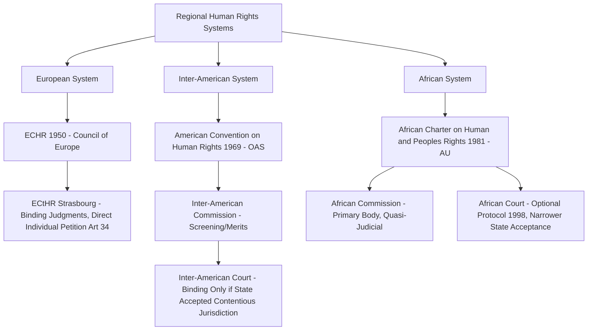

## Regional Human Rights Systems: The European, Inter-American, and African Courts of Human Rights

### Doctrinal Foundation: The Rationale for Regional Adjudicative Systems

Alongside the universal human rights framework built around the UN human rights treaty bodies (such as the Human Rights Committee under the International Covenant on Civil and Political Rights (ICCPR)), international law has developed three principal **regional human rights systems**, each combining a substantive treaty instrument with a dedicated judicial or quasi-judicial enforcement body. Regional systems developed on the premise that geographic proximity, shared regional political institutions, and a narrower, more cohesive membership could support **stronger adjudicative and enforcement mechanisms** than were politically achievable at the universal UN level — most significantly, standing courts capable of issuing legally binding judgments against states, in contrast to the UN treaty bodies' non-binding "Views" and concluding observations. The three principal systems are the European, Inter-American, and African systems, each built around a founding regional human rights convention and a corresponding court.

### Mechanism: The European Court of Human Rights

The **European Court of Human Rights (ECtHR)**, seated in Strasbourg, was established under the **European Convention on Human Rights (ECHR)**, formally the Convention for the Protection of Human Rights and Fundamental Freedoms, adopted in 1950 under the auspices of the Council of Europe (an organization distinct from the European Union) and in force since 1953. The ECtHR is generally regarded as the most institutionally developed and judicially active of the three regional systems, with jurisdiction over 46 Council of Europe member states as of the present (Russia was expelled from the Council of Europe in March 2022 following its invasion of Ukraine, and the Court's jurisdiction over Russia in respect of events occurring before the effective date of that expulsion has been the subject of continuing litigation and Committee of Ministers practice).

Key structural features of the ECHR system include:

- **Article 34** grants a right of **individual petition**: any person, non-governmental organization, or group of individuals claiming to be a victim of a Convention violation by a state party may lodge an application directly with the Court, without requiring a separate optional protocol acceptance (unlike the ICCPR's First Optional Protocol structure) — individual petition is built into the Convention's core architecture for all states parties.
- **Article 46** provides that final judgments of the Court are **binding** on the respondent state party, with the **Committee of Ministers** of the Council of Europe supervising execution of judgments — a formal, institutionalized enforcement supervision mechanism without a comparably robust parallel at the UN treaty-body level.
- The Court has developed an influential interpretive doctrine known as the **margin of appreciation**, according states parties a degree of deference in how they implement certain Convention rights (particularly rights subject to qualification clauses, such as Article 8's right to private and family life, restrictable where "necessary in a democratic society" for specified purposes), calibrated to factors including the degree of consensus among states parties on the issue and the sensitivity of the subject matter to national social or moral judgment — a doctrine without a directly equivalent counterpart of the same developed sophistication in the other two regional systems, though functionally comparable deference concepts exist elsewhere.
- Leading jurisprudence includes *Soering v. United Kingdom* (1989), establishing that extradition to a state where a real risk of treatment contrary to Article 3 (prohibition of torture and inhuman or degrading treatment) exists would itself violate the extraditing state's Article 3 obligations — an influential articulation of extraterritorial, non-refoulement-type protection under a general human rights instrument rather than under refugee-specific treaty law.

### Doctrinal Content: The Inter-American System

The Inter-American system operates under the **American Convention on Human Rights** (1969, in force 1978), adopted within the framework of the Organization of American States (OAS), and comprises a **two-tier institutional structure** distinguishing it from the ECHR's single-court model:

- The **Inter-American Commission on Human Rights**, which has a dual mandate: it functions both as a general human-rights monitoring and promotion body for all OAS member states (including the United States and Canada, which have not ratified the American Convention itself), and as the mandatory **first-instance screening and merits body** for individual petitions alleging violations of the Convention by states parties, deciding on admissibility and merits before a case may proceed further.
- The **Inter-American Court of Human Rights**, seated in San José, Costa Rica, which has both a contentious (adjudicative) jurisdiction and an advisory jurisdiction. Critically, the Court's **contentious jurisdiction is not automatic for all states parties to the Convention**: under Article 62 of the Convention, a state party must make a **separate declaration accepting the Court's contentious jurisdiction** (or accept it on a case-specific basis) for the Court to be able to issue a binding judgment against it — a structural feature meaning a state can ratify the American Convention itself while declining to subject itself to the Court's binding adjudicative authority. A case can only reach the Court after having first been processed through the Commission, and only the Commission or a state party (not an individual petitioner directly) may refer a case to the Court under the Convention's original text, though the 2001 amendments to the Court's Rules of Procedure expanded victims' procedural participation once a case is before the Court.
- Leading jurisprudence includes *Velásquez Rodríguez v. Honduras* (1988), the Court's first contentious judgment, establishing the doctrine that a state's failure to investigate, prosecute, and provide a remedy for a human rights violation — even one committed by non-state or unidentified actors, in this instance a forced disappearance — can itself constitute an independent violation of the Convention's obligations to respect and ensure rights, a foundational articulation of positive due-diligence obligations in international human rights law with significant subsequent influence on the jurisprudence of the other regional systems and UN treaty bodies alike.

### Doctrinal Content: The African System

The African system operates under the **African Charter on Human and Peoples' Rights** (1981, in force 1986; also known as the Banjul Charter), adopted within the framework of what was then the Organisation of African Unity (now the African Union). The African Charter is doctrinally distinctive among the three regional instruments in several respects:

- It articulates not only individual rights but also **"peoples' rights"** (a category largely absent from the ECHR and the American Convention in comparably developed form), including the right of peoples to self-determination (Article 20), to freely dispose of their wealth and natural resources (Article 21), and to a general satisfactory environment favourable to their development (Article 24).
- It attaches, alongside enumerated rights, a corresponding set of **individual duties** (Articles 27–29), including duties to the family, society, and the state — reflecting a more communitarian conception of the individual-state-community relationship than the more individual-rights-centered framing of the ECHR and American Convention, a structural feature frequently cited in comparative human rights scholarship as reflective of the drafters' intent to root the instrument in specifically African social and philosophical traditions.
- Institutionally, the Charter originally established only the **African Commission on Human and Peoples' Rights** as a quasi-judicial monitoring and complaint-review body, issuing recommendations rather than binding judgments. A dedicated court — the **African Court on Human and Peoples' Rights** — was established later, by a separate **1998 Protocol** (in force 2004), reflecting a staged institutional development broadly analogous to, though later and less complete than, the Inter-American system's Commission-then-Court structure.
- The African Court's jurisdiction to receive cases directly from individuals and NGOs is itself subject to a further, narrower opt-in requirement under Article 34(6) of its founding Protocol: a state party must make a **specific additional declaration** accepting direct individual/NGO access, distinct from and narrower in practice than mere ratification of the 1998 Protocol itself. [Unverified] The number of states that have made this Article 34(6) declaration has fluctuated, with several states that once made the declaration subsequently withdrawing it, and current, precise figures should be verified against the Court's own published status information rather than assumed static, given the documented instability in state acceptance of this direct-access mechanism.

### Analytical Debate: Comparative Institutional Strength and the Sources of Divergence

[Inference] A significant comparative debate in the scholarship concerns why the three regional systems have developed such markedly different degrees of institutional strength and adjudicative reach — the ECtHR's near-universal, structurally embedded compulsory individual petition and binding-judgment model, against the Inter-American Court's opt-in contentious jurisdiction and Commission-gatekeeping structure, against the African Court's still narrower and more unevenly accepted direct-access mechanism. Several non-exclusive explanatory factors are commonly advanced:

- **Political and regional integration context**: the European system developed within, and arguably drew institutional legitimacy and enforcement leverage from, a broader and deepening regional political and (later) economic integration project (the Council of Europe and, separately, the European Union), a context of regional political convergence not present to the same degree in the OAS or AU frameworks at the time of the Inter-American and African systems' founding and subsequent development.
- **Sequencing and timing of ratification versus institutional design**: the ECHR's built-in, non-optional individual petition mechanism reflects a drafting choice made at a particular historical moment of post-war European consensus-building, whereas both the American Convention and the African Charter were drafted with an opt-in structure for compulsory adjudication precisely because a comparable level of ex ante consensus for compulsory binding jurisdiction was not achievable among the broader and more politically heterogeneous OAS and AU memberships at their respective founding moments.
- **Divergent conceptions of the individual-state-community relationship**: the African Charter's incorporation of peoples' rights and corresponding individual duties reflects, on one reading, a genuinely different underlying philosophical premise about the relationship between rights and community obligation, rather than merely a weaker or earlier-stage version of the European model — a point cautioning against treating the European system's high degree of compulsory judicial enforcement as a normative benchmark against which the other regional systems' differing institutional choices should necessarily be assessed as underdeveloped rather than as reflecting a distinct, and defensibly deliberate, institutional philosophy.

[Speculation] Whether the trajectory of institutional development across these three systems will continue toward convergence (narrower, more frequently exercised opt-outs; broader acceptance of compulsory and direct-access adjudicative mechanisms) or will instead continue to reflect durable, region-specific institutional and philosophical divergence, remains a matter on which the available evidence permits genuine disagreement rather than confident prediction, given the documented instability even in existing acceptance mechanisms such as the African Court's Article 34(6) declarations.

### Related Topics

- The ICCPR and ICESCR as the twin covenants and the civil-political versus economic-social-cultural rights divide
- The Universal Declaration of Human Rights and its contested normative status
- State responsibility for internationally wrongful acts and the due diligence standard
- Margin of appreciation and judicial deference in international human rights adjudication
- The right to self-determination in international law
- Non-refoulement and the international law of extradition