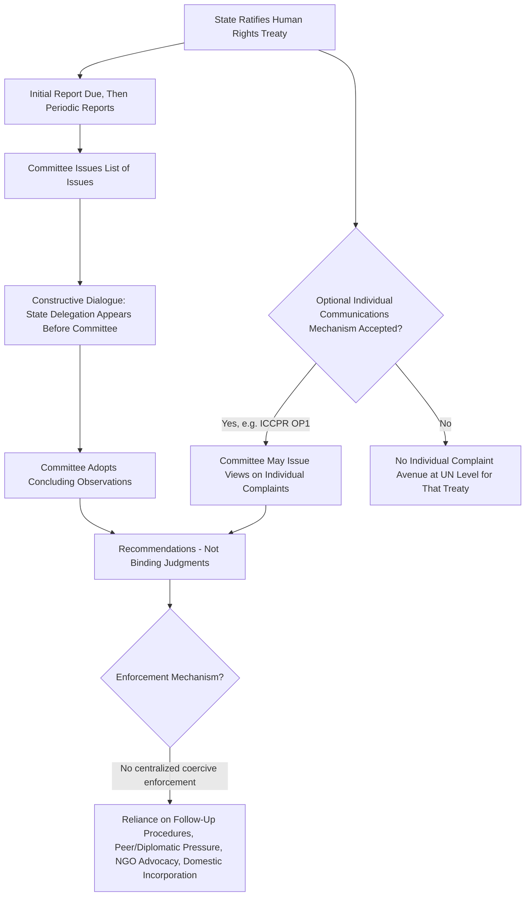

## UN Treaty-Body Reporting Mechanisms and Their Enforcement Limitations

### Doctrinal Foundation: The UN Treaty Body System

The United Nations human rights framework relies on a decentralized architecture of **treaty bodies** — committees of independent experts, each established under a specific multilateral human rights treaty to monitor states parties' compliance with that treaty's obligations. There is no single, unified UN human rights court analogous to the regional systems' courts (the European Court of Human Rights, the Inter-American Court, or the African Court); instead, each of the nine core UN human rights treaties has generated its own dedicated committee, with jurisdiction limited strictly to that treaty's states parties and substantive scope. The principal treaty bodies include the **Human Rights Committee** (under the International Covenant on Civil and Political Rights (ICCPR)), the **Committee on Economic, Social and Cultural Rights (CESCR)** (under the ICESCR), the **Committee on the Elimination of Racial Discrimination (CERD Committee)**, the **Committee on the Elimination of Discrimination against Women (CEDAW Committee)**, the **Committee against Torture (CAT Committee)**, and the **Committee on the Rights of the Child (CRC Committee)**, among others.

Each treaty body typically performs three overlapping functions: (1) reviewing periodic **state reports** on treaty implementation, (2) issuing **General Comments** (or General Recommendations) interpreting the treaty's substantive provisions, and (3), where the relevant treaty or an optional protocol to it so provides, considering **individual communications** alleging a specific violation by a state party.

### Mechanism: The State Reporting Cycle

The **state reporting mechanism** is the near-universal core supervisory function shared by all treaty bodies, structured around a recurring cycle:

1. **Initial and periodic reports**: a state party is required, typically within one to two years of ratification and then periodically thereafter (commonly every four to five years, varying by treaty), to submit a report to the relevant committee describing the legislative, judicial, administrative, and other measures it has adopted to give effect to the treaty's provisions, together with any factors and difficulties affecting the degree of fulfillment of its obligations.
2. **List of issues**: the committee typically reviews the state report and transmits a "list of issues" or "list of questions" seeking clarification or additional information on specific matters of concern prior to the formal review session.
3. **Constructive dialogue**: a delegation from the reporting state appears before the committee (typically in Geneva) for an interactive session — termed a "constructive dialogue" — in which committee members pose questions and the state delegation responds, often supplemented by information the committee has independently gathered from other sources (UN agencies, national human rights institutions, and civil society/NGO "shadow reports" or "alternative reports" submitted specifically to counterbalance or supplement the state's own self-reported account).
4. **Concluding observations**: following the dialogue, the committee adopts **concluding observations**, identifying positive developments, principal areas of concern, and specific recommendations for the state party's future action, typically requesting that certain priority recommendations be addressed and reported on within a shorter follow-up period before the next full periodic report is due.

### Key Points: The Individual Communications Procedure Where Available

A subset of treaty bodies possess an additional, narrower function: reviewing **individual communications** (complaints) from persons claiming to be victims of a violation by a state party. This function is not automatic upon treaty ratification but requires a **separate opt-in acceptance**, structured differently across treaties:

- Under the ICCPR, this function is conferred by the **First Optional Protocol** (1966), a wholly separate treaty instrument that a state must independently ratify.
- Under other treaties (such as the Convention against Torture, Article 22, and CEDAW, via its own 1999 Optional Protocol), a comparable separate acceptance or optional protocol ratification is likewise required.
- Following such acceptance, an individual may submit a communication alleging a specific violation, and after an admissibility assessment (requiring, among other things, exhaustion of available domestic remedies), the committee considers the merits and adopts **"Views"** — its conclusion on whether a violation occurred, together with any recommended remedy.

### Doctrinal Content: The Central Enforcement Limitation — Non-Binding Character of Outputs

The single most consequential structural feature of the UN treaty body system, and the central "enforcement limitation" this item addresses, is that **neither concluding observations nor Views on individual communications constitute legally binding judgments** in the manner of a domestic court decision or a regional human rights court's binding judgment (such as those of the European Court of Human Rights under Article 46 ECHR). Treaty bodies are **committees of independent experts monitoring treaty compliance**, not courts; their outputs are properly characterized as authoritative interpretations and recommendations, carrying significant interpretive and normative weight (courts, including some domestic courts, frequently cite treaty body General Comments and Views as persuasive authority on the proper interpretation of a treaty's substantive provisions), but they lack the formal binding force and centralized enforcement architecture their court counterparts possess.

This structural limitation manifests in several concrete respects:

- **No judgment execution mechanism**: unlike the Council of Europe's Committee of Ministers, which formally supervises execution of ECtHR judgments under Article 46(2) ECHR, no comparably robust, dedicated UN institutional body exists to supervise state compliance with treaty body concluding observations or Views, beyond the treaty bodies' own limited follow-up procedures (several committees have introduced designated follow-up rapporteurs and follow-up reporting requests, but these lack coercive authority).
- **No sanction for non-compliance with Views**: a state found to have violated a treaty in an individual communication faces no automatic legal or institutional sanction for declining to implement the committee's recommended remedy; compliance rates with treaty body Views vary considerably across states and treaties, and non-compliance carries reputational rather than formal legal consequence.
- **Reporting delays and non-reporting**: states routinely submit periodic reports late or, in some cases, not at all, and treaty bodies possess no enforcement tool beyond continued requests, public notation of the delinquency, and diplomatic or reputational pressure exerted through the broader UN human rights architecture (including the separate, Human Rights Council-administered **Universal Periodic Review** mechanism, itself a distinct peer-review process rather than a treaty-body function, but operating in a complementary capacity).
- **Resource and capacity constraints**: treaty body members serve in a part-time, largely unremunerated expert capacity, sessions are time-limited, and the volume of state reports and individual communications has, as a matter of persistent institutional concern documented in UN reform discussions (including the 2012-2014 treaty body strengthening process), significantly outpaced the system's existing review capacity, generating substantial backlogs in some committees' individual communications caseloads.

### Analytical Debate: Is Non-Bindingness a Design Flaw or a Structural Feature Reflecting the Limits of State Consent?

A genuine debate exists as to how the non-binding character of the UN treaty body system should properly be understood and assessed.

**The reform-oriented critical position** argues that the absence of binding force and centralized enforcement represents a significant structural weakness relative to the regional court systems, particularly the European model, and that this weakness measurably undermines the practical protective value of the UN treaty framework for individuals in states where domestic remedies are themselves inadequate or unavailable — a concern amplified by the treaty bodies' chronic reporting backlogs and by the wide variance in state compliance with Views, which on this view suggests the system functions more as an expressive and interpretive mechanism than as an effective remedial one for many rights-holders in practice.

**The position defending the current architecture** as a deliberate and defensible design choice notes that the treaty body system was never conceived, at the point of its original negotiation, as a judicial system, but rather as a **supervisory and dialogic mechanism** operating on the premise that near-universal state participation (a substantially larger and more politically heterogeneous membership than any single regional system) was achievable only by foregoing the compulsory binding-judgment model — meaning the trade-off between near-universality of participation and depth of binding enforcement was a conscious one, and that the system's genuine value lies in its capacity for sustained, iterative dialogue, its normative and interpretive contribution to treaty meaning (frequently absorbed into domestic law and regional jurisprudence even without formal bindingness), and its capacity to generate sustained public and diplomatic scrutiny of state practice — functions distinct from, but not necessarily inferior in overall systemic value to, a smaller number of binding judgments issued by a narrower-membership regional court.

[Inference] The ongoing UN treaty body strengthening process, including periodic General Assembly resolutions addressing harmonization of reporting guidelines, streamlined reporting procedures (such as the optional "simplified reporting procedure" allowing a state to respond to a pre-transmitted list of issues in lieu of a full narrative report), and proposals for consolidating or better coordinating the nine separate committees, suggests an institutional recognition of the capacity and coherence concerns raised by critics, though the fundamental non-binding character of treaty body outputs has not itself been the subject of any serious proposal for structural change, since altering that feature would likely require renegotiation of the underlying treaties themselves — a threshold few states have shown appetite to cross.

### Related Topics

- The ICCPR and ICESCR as the twin covenants and the civil-political versus economic-social-cultural rights divide
- Regional human rights systems: the European, Inter-American, and African Courts of Human Rights
- The Universal Periodic Review mechanism of the UN Human Rights Council
- State responsibility for internationally wrongful acts and remedies under international law
- Domestic incorporation and the reception of international human rights treaties in national legal systems
- NGO participation and shadow reporting in international human rights supervision