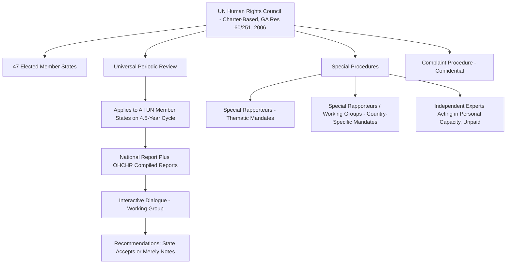

## The UN Human Rights Council, Universal Periodic Review, and Special Procedures

### Doctrinal Foundation: The Human Rights Council as a Charter-Based Body

The **UN Human Rights Council (HRC)** is a distinct institutional category from the treaty bodies addressed elsewhere in this chapter: whereas treaty bodies (the Human Rights Committee, the CESCR, and others) derive their existence and jurisdiction from specific multilateral human rights treaties and are limited to that treaty's states parties, the Human Rights Council is a **Charter-based body**, established by **UN General Assembly Resolution 60/251** on 15 March 2006, deriving its authority from the UN Charter's general human rights mandate (Articles 1(3), 55, and 62) rather than from any specific human rights treaty. This distinction has an important practical consequence: the Council's mandate and mechanisms apply, at least in principle, to **all UN member states**, regardless of which specific human rights treaties any given state has ratified — a structurally universal jurisdiction the treaty body system, limited by definition to each treaty's own states parties, cannot replicate.

The Council replaced the earlier **UN Commission on Human Rights**, a subsidiary body of the Economic and Social Council (ECOSOC) that had, by the early 2000s, drawn sustained criticism for perceived politicization and for permitting states with poor human rights records to secure membership and thereby shield themselves and allied states from scrutiny. The 2006 reform elevated the new body to a subsidiary organ of the **General Assembly** directly (rather than ECOSOC), comprising 47 member states elected by the General Assembly for staggered three-year terms, with seats allocated according to regional distribution formulas, and introduced eligibility and review mechanisms — including the possibility, under General Assembly Resolution 60/251 paragraph 8, of a two-thirds General Assembly vote to suspend a member state's Council membership rights for gross and systematic violations of human rights, a mechanism invoked against Libya in 2011 and against Russia in April 2022 — intended to address the predecessor Commission's credibility deficit, albeit with continuing and unresolved debate as to how fully that objective has been achieved.

### Mechanism: The Universal Periodic Review

The Council's most structurally distinctive innovation, without direct precedent in the prior Commission on Human Rights framework, is the **Universal Periodic Review (UPR)**, established under UN General Assembly Resolution 60/251 and elaborated through subsequent Council institution-building decisions (notably Council resolution 5/1 of 2007). The UPR is a **peer-review mechanism** under which the human rights record of **every UN member state** is reviewed on a periodic cycle (originally four years, later extended to four and a half years to accommodate the full UN membership), regardless of that state's specific treaty ratification status — the defining structural feature distinguishing UPR from the treaty-body reporting system, since even a state that has ratified few or no core human rights treaties remains subject to UPR review by virtue of UN membership alone.

The UPR process proceeds through a structured cycle:

1. **National report**: the state under review submits its own national report on the human rights situation within its territory.
2. **Compiled UN information**: the Office of the UN High Commissioner for Human Rights (OHCHR) compiles a report summarizing information from UN treaty bodies, special procedures, and other UN sources concerning the state under review.
3. **Stakeholder summary**: OHCHR separately compiles a summary of information submitted by other stakeholders, principally NGOs and national human rights institutions.
4. **Interactive dialogue and Working Group session**: the state under review participates in an interactive dialogue before the UPR Working Group (comprising all Council member states, though any UN member state may participate in the dialogue), during which other states pose questions and issue **recommendations**.
5. **Outcome report and response**: a report of the Working Group session is adopted, listing the recommendations made; the reviewed state then indicates, typically at the subsequent Council plenary session, which recommendations it **accepts** and which it merely **notes** (a formal category distinguishing recommendations the state declines to commit to implementing from those it accepts).

### Key Points: The Non-Binding Character of UPR Outcomes

Consistent with the broader pattern observed across the UN human rights architecture, **UPR outcomes are not legally binding**. A state's acceptance of a recommendation during the UPR process constitutes a political commitment, subject to review and follow-up in the subsequent review cycle, but carries no direct legal enforcement mechanism, and a state's decision merely to "note" (rather than accept) a recommendation carries no formal legal consequence beyond the diplomatic and reputational record that decision creates. [Inference] The UPR's practical value is therefore generally understood by commentators to lie less in direct legal enforceability and more in the mechanism's universality (subjecting even powerful states that might otherwise resist treaty-body or special-procedure scrutiny to at least this baseline peer-review process), its function in generating a periodic, comprehensive, and internationally visible record of a state's human rights situation and its own stated commitments, and its capacity to be invoked by domestic civil society actors as leverage in subsequent domestic advocacy, even though the underlying assessment of how much genuine behavioral change UPR produces, as opposed to expressive or diplomatic effect, remains a matter of ongoing empirical debate rather than settled consensus.

### Doctrinal Content: Special Procedures

**Special procedures** constitute the Human Rights Council's second principal monitoring mechanism, comprising **special rapporteurs, independent experts, and working groups** appointed by the Council to examine and report on either a specific **thematic** human rights issue (for example, the Special Rapporteur on Torture, the Special Rapporteur on Freedom of Religion or Belief, or the Working Group on Enforced or Involuntary Disappearances) or the human rights situation in a specific **country** (a country-specific mandate, historically a more politically contentious category of mandate given its focused scrutiny of a single named state).

Key structural features of special procedures mandate-holders:

- They serve in a **personal, independent expert capacity**, unpaid, and are not UN staff members — a design feature intended to preserve independence from both the states under scrutiny and from UN institutional and political pressures, analogous in this respect to the independent-expert model used for treaty body membership.
- Their principal functional tools include: conducting **country visits** (subject to the visited state's invitation or consent, though a number of states have issued so-called "standing invitations" agreeing in advance to accept visit requests from any special procedures mandate-holder), transmitting **communications** to states raising specific alleged violations and requesting information or corrective action (a mechanism distinct from, and without the individual-communications legal architecture of, the treaty bodies' formal Views procedure), and submitting **annual thematic and country reports** to the Council (and, for many mandates, also to the General Assembly).
- Special procedures communications and reports, like treaty body Views and UPR recommendations, are **not legally binding**; a state's response to a special rapporteur's communication or its cooperation with a country visit request is a matter of political choice, and the mandate-holder possesses no independent enforcement authority.

### Analytical Debate: Politicization Concerns and the Credibility of Charter-Based Mechanisms

A significant and recurring debate, tracing back to the criticisms that prompted the 2006 replacement of the Commission on Human Rights, concerns whether the Human Rights Council's membership-election process and its country-specific scrutiny mechanisms remain vulnerable to the same **politicization concerns** that undermined its predecessor's credibility.

**The critical position** points to the continuing election of states with documented serious human rights concerns to Council membership (membership eligibility under Resolution 60/251 requires only a General Assembly majority vote and a stated, non-binding pledge regarding human rights commitments, rather than any objective, independently verified human rights performance threshold), to persistent allegations of disproportionate or selectively intense scrutiny of certain states relative to others facing comparable or more severe documented concerns, and to instances of high-profile state withdrawal from or non-cooperation with the Council (the United States, for example, withdrew from Council membership in 2018 during the first Trump administration citing what it characterized as chronic bias against a particular state and inadequate reform of the membership process, before subsequently rejoining in 2021) as evidence that the 2006 reform's stated objective of insulating the body from politicization has been only partially achieved.

**The position defending the Council's institutional value**, while frequently acknowledging these specific criticisms as legitimate, argues that the introduction of the UPR mechanism — precisely because of its universal, every-state-reviewed structure — represents a genuine structural advance over the predecessor Commission's more selective and country-specific-only scrutiny model, since even a powerful or well-connected state cannot avoid UPR review altogether (in contrast to the Commission-era practice under which politically influential states could more readily avoid sustained scrutiny), and that the special procedures system, through its independent-expert design and its capacity to generate sustained public reporting even absent state cooperation, retains meaningful investigative and normative value irrespective of the separate and more clearly political dynamics affecting Council membership composition and country-specific mandate creation and renewal votes.

[Inference] The underlying tension in this debate reflects a broader structural feature common to essentially all UN political (as opposed to treaty-based, expert) human rights bodies: because Council membership, mandate creation, and resolution adoption are all ultimately determined by intergovernmental vote among UN member states rather than by an independent judicial or expert body's own determination, some degree of political calculation in these processes is a built-in structural feature of the Charter-based system rather than a correctable design flaw, meaning debates over the Council's politicization are unlikely to be definitively resolved through incremental procedural reform alone.

### Related Topics

- UN treaty-body reporting mechanisms and their enforcement limitations
- The Universal Declaration of Human Rights and its contested normative status
- Regional human rights systems: the European, Inter-American, and African Courts of Human Rights
- NGO participation and shadow reporting in international human rights supervision
- The UN Commission on Human Rights and the 2006 institutional reform
- State sovereignty and the limits of international human rights scrutiny