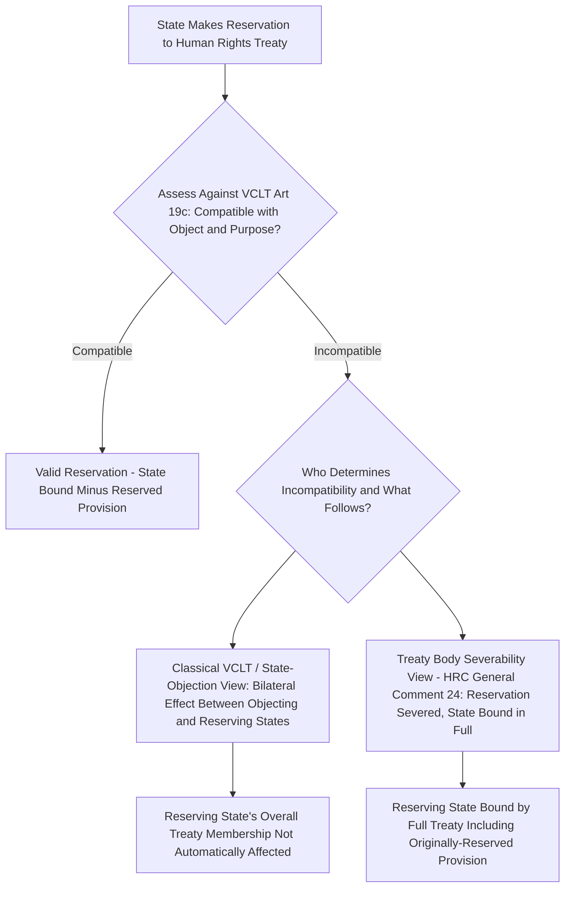

## State Reservations to Human Rights Treaties and Their Effect on Enforceability

### Doctrinal Foundation: The General Law of Reservations Under the Vienna Convention

A **reservation**, as defined in **Article 2(1)(d) of the Vienna Convention on the Law of Treaties (VCLT)** (1969, in force 1980), is a unilateral statement, however phrased or named, made by a state when signing, ratifying, accepting, approving, or acceding to a treaty, whereby it purports to **exclude or modify the legal effect of certain provisions of the treaty in their application to that state**. Reservations are the treaty-law mechanism permitting a state to become a party to a multilateral treaty while declining to be bound by specific provisions it finds unacceptable, and their availability is generally understood to serve the goal of maximizing broad participation in multilateral treaties that might otherwise attract fewer ratifications if states were forced to accept the entirety of a treaty's text without qualification.

The general VCLT framework, codified in **Articles 19–23**, permits reservations **unless** the reservation is prohibited by the treaty itself, the treaty permits only specified reservations not including the one in question, or the reservation is **incompatible with the object and purpose of the treaty** (Article 19(c)) — this final, more open-textured "object and purpose" test being the provision of greatest doctrinal significance for the human rights treaty context addressed below. Under the ordinary VCLT scheme, other states parties may **object** to a reservation (Article 20-21), with the legal consequences of an objection depending on whether the objecting state intends to preclude entry into force of the treaty between itself and the reserving state altogether, or merely to exclude application of the reserved provision as between the two states — a bilateral, reciprocity-based logic characteristic of the VCLT's general design.

### Key Points: Why Human Rights Treaties Strain the Classical VCLT Reservations Framework

Human rights treaties present a structural challenge to the VCLT's classical reservations architecture because that architecture was designed principally with **synallagmatic** (reciprocal, bilateral-exchange-type) treaties in mind — treaties in which each state party's obligations run principally to other states parties, such that a reservation's effect can sensibly be assessed bilaterally (as between the reserving state and each objecting state). Human rights treaties, by contrast, are widely understood to be **non-reciprocal** in character: the obligations a state assumes under a human rights treaty run principally to the **individuals within its own jurisdiction**, not to other states parties as such, meaning the classical bilateral reciprocity logic underlying the VCLT reservations regime — under which an objecting state's objection recalibrates the treaty relationship as between itself and the reserving state — does not translate cleanly, since an individual within the reserving state's jurisdiction has no comparable capacity to "object" to a reservation affecting the very rights that treaty is meant to protect for that individual.

This structural tension has generated one of the most significant and unresolved doctrinal debates in the law of treaties, addressed in detail below: how the VCLT's "object and purpose" incompatibility test in Article 19(c) should be applied and, more contentiously, **who has the authority to determine** that a given reservation to a human rights treaty is invalid, and what legal consequence follows from such a determination.

### Mechanism: The Human Rights Committee's General Comment No. 24 and the "Severability" Position

The most influential and most contested institutional intervention on this question is the Human Rights Committee's **General Comment No. 24 (1994)**, interpreting the reservations regime applicable to the ICCPR. The Committee took several doctrinally significant positions:

1. The Committee asserted its own **competence to determine the validity of a reservation** to the ICCPR — a position not without controversy, since the ICCPR's text does not expressly confer this function on the Committee, and the classical VCLT model generally leaves questions of reservation validity to be worked out through the inter-state objection mechanism rather than through determination by a treaty's own supervisory body.
2. The Committee reasoned that, because of the ICCPR's non-reciprocal character (noted above), the ordinary inter-state objection mechanism is an **inadequate and impractical tool** for policing reservation compatibility with a human rights treaty's object and purpose, since states rarely object to one another's reservations to human rights treaties for reasons connected to the substantive protection of individual rights (as opposed to reasons of broader diplomatic or political relationship management), leaving the object-and-purpose test toothless if enforcement is left to inter-state objection alone.
3. Most significantly, the Committee endorsed what is generally termed the **"severability" doctrine**: where a reservation to the ICCPR is found incompatible with the Covenant's object and purpose, the **normal consequence is not that the reserving state fails to become a party to the treaty at all**, but rather that the invalid reservation is **severed** (treated as if it had not been made), leaving the reserving state bound by the Covenant **in full**, including the provision it had attempted to reserve against — a doctrinal position with no direct counterpart in the VCLT's own general text, which does not expressly address the consequence of an invalid reservation in these terms.

### Doctrinal Content: The Counter-Position — State Objection to the Committee's Competence

General Comment No. 24's severability position was met with **significant and explicit objection from several states parties**, most prominently the United States, the United Kingdom, and France, in formal responses submitted to the UN, raising two distinct objections:

1. **A competence objection**: these states argued that the Human Rights Committee, as a body whose functions are defined by the ICCPR's own text (principally reviewing state reports and, for states accepting the First Optional Protocol, individual communications), lacks the textual authority to issue an authoritative determination of reservation validity binding on states parties, since no provision of the ICCPR or its Optional Protocols confers this specific competence, and general international law otherwise leaves such determinations to the states parties themselves through the ordinary inter-state VCLT mechanism.
2. **A substantive objection to the severability consequence itself**: these states argued that severability is inconsistent with the fundamental treaty-law principle of **state consent** — since a reservation is definitionally a condition on which a state's consent to be bound was given, treating that condition as void while nonetheless holding the state bound by the very provision it sought to exclude effectively **binds the state to an obligation to which it never consented**, a result these states characterized as difficult to reconcile with the consensual foundation of treaty obligation generally, whatever the special characteristics of human rights treaties might otherwise justify.

[Inference] This unresolved disagreement over both the competence question (who decides) and the consequence question (severability versus some alternative, such as treating the reservation and ratification as a package that either both stand or the state is not bound by the treaty at all) means that, notwithstanding General Comment No. 24's considerable influence and its frequent citation by other treaty bodies and by the International Law Commission in its own subsequent work on reservations, the doctrine cannot accurately be described as settled international law binding on states that have expressly and persistently rejected it — the debate remains, in a meaningful sense, a genuinely live one rather than one resolved definitively in either direction.

### Key Points: The International Law Commission's Guide to Practice

The **International Law Commission (ILC)**, in its 2011 **Guide to Practice on Reservations to Treaties** — a non-binding but highly authoritative codification and progressive-development exercise addressing reservations across all treaty types, not human rights treaties specifically — addressed this debate directly and adopted a position that can be characterized as a **qualified, partial endorsement of severability**, while notably declining to endorse the proposition that a treaty-monitoring body's own determination of invalidity is, by itself, dispositive without regard to the reserving state's own subsequently expressed intent. The Guide to Practice's approach (Guideline 4.5.3) provides that, as a **presumption**, the reserving state is considered a party to the treaty without the benefit of the invalid reservation, **unless a contrary intention of the reserving state can be identified** — meaning the reserving state retains an opportunity to indicate that it did not intend to be bound by the treaty at all in the absence of its reservation, in which case it would not be considered a party, rather than being conclusively and irrevocably bound in full regardless of its own subsequently clarified intent. This represents a partial convergence toward, but not a full and unqualified adoption of, the Human Rights Committee's original General Comment No. 24 position.

### Analytical Debate: Reservations, the CEDAW and Genocide Convention Contexts, and the Practical Enforcement Consequence

The doctrinal significance of this debate is not merely theoretical, since human rights treaties in practice attract a substantial volume of reservations, some raising acute object-and-purpose concerns. The **Convention on the Elimination of All Forms of Discrimination against Women (CEDAW)** has attracted a notably high volume of reservations, including reservations by a number of states parties citing conflicts between specific CEDAW provisions (particularly Article 16, concerning equality in marriage and family relations) and the reserving state's domestic religious or customary personal-status law — reservations the CEDAW Committee has, in its own General Recommendations, characterized as raising serious object-and-purpose compatibility concerns given their potential to hollow out core substantive provisions of the Convention for a significant proportion of the treaty's states parties.

The ICJ's earlier **Advisory Opinion on Reservations to the Genocide Convention** (1951) — predating the VCLT itself but foundational to the modern "object and purpose" compatibility test later codified in VCLT Article 19(c) — had already recognized, in the specific context of the Genocide Convention, that a treaty of a universal, humanity-protecting character might require departure from the traditional unanimity-based approach to reservations (under which any single state's objection could in principle exclude the reserving state from the treaty relationship with that objecting state), endorsing instead a compatibility-based test assessed by reference to the treaty's object and purpose — a foundational recognition, well before the ICCPR-specific debate discussed above, that human-rights-adjacent, universal-participation-oriented treaties might warrant a distinct reservations analysis from ordinary bilateral-exchange treaties, even though the ICJ's 1951 opinion did not itself resolve the subsequent, more specific competence and severability questions that arose decades later in the ICCPR context.

[Inference] The practical enforcement consequence of this unresolved debate is that a reservation's actual legal effect in a specific case may depend substantially on **which body is asked** — a treaty's own monitoring committee, applying a severability-inclined interpretive approach in the course of reviewing a state's periodic report or an individual communication, may proceed to assess the state's compliance with the ostensibly-reserved provision as though the reservation were void, while the reserving state itself may continue to maintain, as a matter of its own position, that it is not bound by that provision at all — leaving the reservation's operative legal status genuinely indeterminate between these two positions in the absence of a mechanism capable of authoritatively resolving the dispute as between the treaty body's interpretive view and the reserving state's own contrary assertion of non-consent.

### Related Topics

- The ICCPR and ICESCR as the twin covenants and the civil-political versus economic-social-cultural rights divide
- UN treaty-body reporting mechanisms and their enforcement limitations
- The Vienna Convention on the Law of Treaties: formation, interpretation, and invalidity of treaties
- The 1951 ICJ Advisory Opinion on Reservations to the Genocide Convention
- Sources of international law and the role of the International Law Commission
- CEDAW and the elimination of discrimination against women in international law