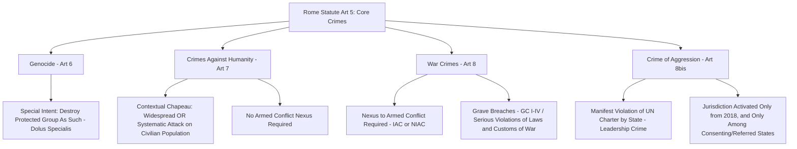

## The Rome Statute and the Four Core Crimes: Genocide, Crimes Against Humanity, War Crimes, and Aggression

### Doctrinal Foundation: The Rome Statute and the Principle of Complementarity

The **Rome Statute of the International Criminal Court**, adopted on 17 July 1998 and in force since 1 July 2002, establishes the International Criminal Court (ICC), the first permanent international criminal tribunal with jurisdiction to try individuals for the most serious crimes of concern to the international community as a whole. Article 5(1) of the Statute enumerates the Court's subject-matter jurisdiction as limited to four categories — **genocide, crimes against humanity, war crimes, and the crime of aggression** — collectively termed the "core crimes," distinguishing the Rome Statute's approach from the broader and less precisely delimited category of "international crimes" that might be identified more generally across customary and treaty international criminal law (such as piracy, torture as a standalone treaty crime, or terrorism-related offenses not separately codified in the Statute).

A foundational structural principle governing the Court's relationship to national jurisdictions is **complementarity**, articulated in the Statute's Preamble and Article 17. Recall that this term denotes the principle that the ICC's jurisdiction is intended to be **complementary to national criminal jurisdictions**, not to supersede or displace them: under Article 17, a case is inadmissible before the ICC where it is being or has been genuinely investigated or prosecuted by a state with jurisdiction over it, unless that state is **unwilling or unable genuinely** to carry out the investigation or prosecution. This is a marked institutional design choice distinguishing the ICC from its ad hoc predecessor tribunals (the ICTY and ICTR), which possessed **primacy** over national courts rather than mere complementary jurisdiction, reflecting states' preference, in the Rome Statute negotiations, for a permanent court that would operate as a backstop to national accountability efforts rather than as a court with automatic priority.

### Key Points: Genocide

**Article 6** of the Rome Statute defines genocide by adopting, essentially verbatim, the definition first codified in **Article II of the 1948 Convention on the Prevention and Punishment of the Crime of Genocide**, a formulation now also recognized as reflecting customary international law and, for the underlying prohibition itself, jus cogens status. Genocide consists of any of five enumerated acts — killing members of a group; causing serious bodily or mental harm to members of a group; deliberately inflicting on the group conditions of life calculated to bring about its physical destruction in whole or in part; imposing measures intended to prevent births within the group; and forcibly transferring children of the group to another group — committed **with intent to destroy, in whole or in part, a national, ethnical, racial or religious group, as such**.

The doctrinally distinctive and most demanding element of genocide is this **special intent requirement** (*dolus specialis*), which distinguishes genocide from crimes against humanity and requires proof not merely that the perpetrator intended the underlying act (killing, causing serious harm, and so forth), but that the perpetrator specifically intended, through that act, to **destroy the protected group as such**, in whole or in substantial part. This heightened intent requirement — generally regarded as the most difficult element to prove of any core international crime, since it requires evidence of the perpetrator's specific destructive purpose rather than merely a discriminatory motive or awareness that a group was being targeted — was addressed authoritatively by the ICJ in *Application of the Genocide Convention* (Bosnia and Herzegovina v. Serbia and Montenegro, 2007), which held that genocide had occurred at Srebrenica but that Serbia itself was not directly responsible for that genocide (as opposed to having breached a separate duty to prevent and punish it), given the ICJ's finding that the requisite genocidal intent could not be attributed to Serbia as a state on the evidentiary record before it — an outcome frequently cited to illustrate the demanding character of the specific-intent standard even where large-scale killing of a protected group's members is otherwise established.

### Key Points: Crimes Against Humanity

**Article 7** defines crimes against humanity as any of a list of enumerated acts (including murder, extermination, enslavement, deportation or forcible transfer of population, torture, rape and other sexual violence, persecution, and enforced disappearance, among others) "when committed as part of a **widespread or systematic attack directed against any civilian population, with knowledge of the attack**." Two structural elements distinguish crimes against humanity from both genocide and ordinary domestic crimes:

- **The contextual "chapeau" element**: the underlying act must form part of a widespread **or** systematic attack (the two qualifiers are disjunctive, not cumulative — an attack may qualify as either sufficiently widespread in scale or sufficiently systematic in organization, without necessarily being both) directed against a civilian population, pursuant to or in furtherance of a State or organizational policy to commit such attack (Article 7(2)(a)).
- **No requirement of an underlying discriminatory or group-destructive intent** (except for the specific act of persecution, which itself requires a discriminatory intent) and, critically, **no requirement of a nexus to armed conflict** — unlike war crimes, which by definition require a connection to an armed conflict, crimes against humanity may be committed in peacetime, a doctrinal development tracing to the post-World War II Nuremberg Charter but substantially clarified and expanded in subsequent international criminal tribunal jurisprudence, including the ICTY and ICTR.

[Unverified] Unlike genocide and, as discussed below, war crimes, crimes against humanity have not yet been codified in a single, dedicated, widely-ratified multilateral convention analogous to the Genocide Convention or the Geneva Conventions; efforts toward such a dedicated Crimes Against Humanity Convention have proceeded through the International Law Commission's own draft articles process, and the current status of that initiative's progress toward adoption as a binding multilateral instrument should be verified against current ILC and UN General Assembly records rather than assumed to have reached a settled endpoint.

### Doctrinal Content: War Crimes

**Article 8** of the Rome Statute defines war crimes with reference to the pre-existing corpus of international humanitarian law addressed elsewhere in this curriculum — principally the **grave breaches** provisions of the four 1949 Geneva Conventions (applicable in international armed conflict) and **serious violations of the laws and customs applicable in armed conflict**, whether international or non-international in character, drawing on the Hague Regulations tradition and customary IHL. Article 8(2) is structured around this IAC/NIAC distinction, with separate, differently-scoped lists of prohibited acts for each category — reflecting, at the level of individual criminal responsibility, the same doctrinal asymmetry addressed elsewhere in this curriculum's treatment of Additional Protocols I and II, whereby non-international armed conflict has historically attracted a somewhat narrower and later-developed body of applicable substantive law than international armed conflict, though Article 8(2)(c) and (e) do bring a substantial range of NIAC-applicable war crimes within the Court's jurisdiction, reflecting the post-1990s jurisprudential development (led significantly by the ICTY's *Tadić* jurisprudence) extending individual criminal responsibility for serious IHL violations into the NIAC context.

Article 8(1) further specifies that the Court shall have jurisdiction over war crimes **in particular** when committed as part of a plan or policy or as part of a large-scale commission of such crimes — language generally understood not to impose a strict jurisdictional threshold excluding isolated incidents altogether, but to signal a prosecutorial-priority emphasis on the more systemic and grave manifestations of war crimes given the Court's inherently limited institutional capacity.

### Doctrinal Content: The Crime of Aggression — A Distinctively Delayed and Constrained Jurisdiction

The **crime of aggression** occupies a unique procedural position among the four core crimes. Although listed in Article 5(1) from the Statute's original 1998 adoption, Article 5(2) (as originally drafted) provided that the Court could **not exercise jurisdiction over the crime of aggression until a provision was adopted defining the crime and setting out the conditions for jurisdiction** — a deferral reflecting the states parties' inability to reach agreement, at the 1998 Rome Conference itself, on the crime's precise definition and, more contentiously, on the appropriate role of the UN Security Council in triggering or screening aggression prosecutions, given the Security Council's own primary Charter responsibility for determining the existence of an act of aggression under Article 39 of the UN Charter.

This gap was substantially, though not completely, resolved by the **2010 Kampala Amendments**, adopted at the Rome Statute's first Review Conference, which inserted **Article 8bis**, defining the crime of aggression as the planning, preparation, initiation, or execution, by a person in a position effectively to exercise control over or direct the political or military action of a State, of an act of aggression which, by its character, gravity, and scale, constitutes a **manifest violation of the UN Charter** — itself defined by reference to a list of qualifying acts drawn substantially from UN General Assembly Resolution 3314 (1974) on the definition of aggression, including invasion, bombardment, blockade, and armed attack by one state's armed forces against another.

Two features distinguish the crime of aggression's jurisdictional regime from the other three core crimes:

- It is a **leadership crime**: only persons in a position effectively to exercise control over or direct a state's political or military action can be prosecuted, unlike the other core crimes, which in principle can reach a considerably broader range of direct perpetrators and accessories regardless of leadership position.
- The Kampala Amendments' jurisdictional activation was itself **further delayed**: the Court's jurisdiction over aggression was only activated by a further Assembly of States Parties decision **effective 17 July 2018**, and even then subject to significant jurisdictional limitations — most significantly, the Court cannot exercise jurisdiction over the crime of aggression with respect to a state party that has lodged a declaration opting out, and, per an interpretive understanding adopted alongside the amendments, cannot exercise jurisdiction over the crime when committed by nationals or on the territory of a **non-states-party state** absent a UN Security Council referral — a considerably narrower jurisdictional reach than applies to genocide, crimes against humanity, and war crimes under the Statute's general Article 12 jurisdictional provisions.

### Analytical Debate: The Security Council's Role in Aggression Jurisdiction and Broader ICC Jurisdictional Reach

[Inference] The narrower jurisdictional regime specifically applicable to the crime of aggression reflects a genuine and only partially resolved underlying tension between two competing institutional visions debated extensively during both the original Rome Conference and the Kampala Review Conference: **one position**, associated principally with the UN Security Council's permanent members, held that because the UN Charter itself assigns the Security Council primary responsibility for determining the existence of an act of aggression (Article 39), any ICC prosecution of the crime of aggression should logically require a prior Security Council determination that an act of aggression has occurred, preserving the Council's Charter-based primacy in this specific domain; **the contrary position**, associated with a broader coalition of non-permanent-member states and civil society, argued that conditioning ICC aggression prosecutions on Security Council authorization would subject the crime's enforcement to the Council's own well-documented political constraints (including the veto power of the five permanent members, several of which have themselves been the subject of aggression allegations in various contexts), effectively insulating the very states most capable of committing large-scale acts of aggression from meaningful accountability. The compromise ultimately reflected in the Kampala Amendments and their 2017/2018 activation — permitting the Prosecutor to proceed with an aggression investigation based on a state referral or proprio motu initiation, subject to a Pre-Trial Division authorization procedure, in the **absence** of a Security Council determination, while nonetheless preserving significant separate jurisdictional carve-outs benefiting non-states-party states — represents neither position in unqualified form, and the practical scope of the Court's aggression jurisdiction going forward remains a matter under continuing negotiation and interpretation within the Assembly of States Parties, particularly regarding contested treaty-interpretation questions about the non-states-party jurisdictional limitation's precise scope and legal basis.

### Related Topics

- The principle of complementarity and admissibility challenges before the ICC
- The 1948 Genocide Convention and the ICJ's *Bosnia v. Serbia* judgment
- The four Geneva Conventions of 1949 and the grave breaches regime
- UN Security Council referrals and deferrals under Rome Statute Articles 13 and 16
- Modes of individual criminal liability: command responsibility and joint criminal enterprise
- The use of force under the UN Charter and the prohibition on aggression under Article 2(4)