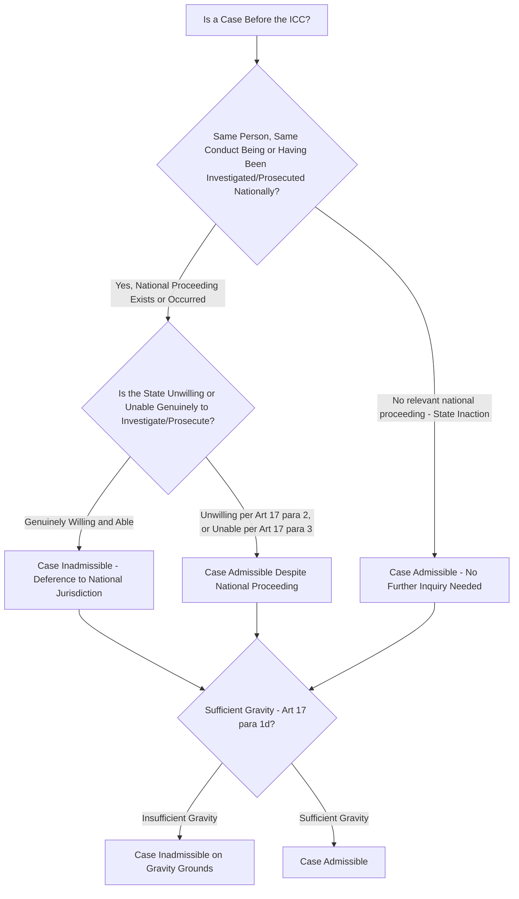

## The Complementarity Principle and Admissibility Before the ICC

### Doctrinal Foundation: Complementarity as the ICC's Foundational Jurisdictional Architecture

The **principle of complementarity** is the structural premise on which the International Criminal Court's (ICC) relationship to national criminal jurisdictions is built, distinguishing the Court's design from that of its ad hoc predecessor tribunals. Recall that the ICTY and ICTR, established by UN Security Council resolutions in the 1990s, possessed **primacy** over national courts — Article 9(2) of the ICTY Statute, for instance, permitted the Tribunal to formally request that a national court defer to its own concurrent jurisdiction at any stage. The Rome Statute's drafters, negotiating a **permanent, standing court** intended to secure broad state ratification rather than being imposed by Security Council fiat on specific situations, adopted the opposite structural default: the ICC's jurisdiction is **complementary** to, not supreme over, national jurisdictions, meaning national courts retain the **primary responsibility and the first opportunity** to investigate and prosecute the core crimes, with the ICC intervening only where that national response is genuinely absent or deficient.

This principle is stated in the Rome Statute's Preamble, which affirms that "it is the duty of every State to exercise its criminal jurisdiction over those responsible for international crimes" and emphasizes "that the International Criminal Court established under this Statute shall be **complementary to national criminal jurisdictions**." The operative legal mechanism giving effect to this principle is **Article 17**, governing the admissibility of cases before the Court.

### Mechanism: The Article 17 Admissibility Test

Article 17(1) establishes that the Court shall determine a case to be **inadmissible** where:

- (a) The case is being investigated or prosecuted by a **State which has jurisdiction over it**, unless the State is unwilling or unable genuinely to carry out the investigation or prosecution;
- (b) The case has **already been investigated** by a State with jurisdiction, and that State has decided not to prosecute the person concerned, unless that decision resulted from unwillingness or inability genuinely to prosecute;
- (c) The person concerned has **already been tried** for conduct which is the subject of the complaint, and a further trial by the Court is not permitted under Article 20(3) (the Statute's own double-jeopardy, or *ne bis in idem*, provision, itself subject to an exception where the prior national proceeding was designed to shield the person from criminal responsibility, or was not conducted independently or impartially);
- (d) The case is **not of sufficient gravity** to justify further action by the Court — a distinct admissibility criterion, addressed further below, operating independently of the complementarity analysis proper.

The threshold inquiry under subparagraphs (a) and (b) therefore proceeds in two analytically distinct stages: first, is there a **national proceeding** (an investigation, a prosecution, or a completed decision not to prosecute) covering the same case; and second, if so, is that state genuinely **unwilling or unable** to carry it out. Only where **no** relevant national proceeding exists at all does the case become admissible before the ICC without need to reach the unwillingness/inability inquiry — a scenario sometimes termed "inaction," which the Appeals Chamber has confirmed itself renders a case admissible without requiring the Prosecutor to additionally demonstrate unwillingness or inability, since Article 17(1)(a) and (b) apply only where a relevant national proceeding is actually ongoing or has actually occurred.

### Doctrinal Content: The "Same Person, Same Conduct" Test

The threshold question of whether a relevant national proceeding exists "covering the same case" has been substantially elaborated in the Court's own jurisprudence through what is generally termed the **"same person, same conduct" test**, articulated in the Pre-Trial and Appeals Chamber jurisprudence in *Prosecutor v. Kony et al.* (the Lord's Resistance Army situation, Uganda) and further developed in *Prosecutor v. Ruto, Kosgey and Sang* (the Kenya situation). Under this test, a national proceeding renders an ICC case inadmissible only where it covers **substantially the same conduct** alleged in the ICC case, against **substantially the same person** — meaning a national prosecution of the same individual for a materially different or narrower set of underlying conduct (for example, prosecuting a suspect only for ordinary domestic assault or murder charges where the ICC case concerns that same individual's alleged conduct constituting crimes against humanity or genocide as such) does not necessarily satisfy Article 17, since the "case" for admissibility purposes is defined by the specific conduct and incidents under scrutiny, not merely by the identity of the accused. This test has generated recurring practical controversy in specific situations (notably the *Kenya* and *Libya* admissibility challenges) where states have argued their domestic proceedings adequately mirror the ICC's case, and the Court has in some instances found the national proceedings insufficiently congruent in scope or specific conduct covered to satisfy the test.

### Key Points: Unwillingness and Inability Under Article 17(2) and (3)

Where a relevant national proceeding does exist, Article 17(2) and (3) supply the criteria for assessing genuine unwillingness or inability:

**Unwillingness (Article 17(2))** is assessed, having regard to the principles of due process recognized by international law, by considering whether one or more of the following exist: (a) the proceedings were or are being undertaken, or the national decision was made, **for the purpose of shielding** the person from criminal responsibility for crimes within the Court's jurisdiction; (b) there has been an **unjustified delay** in the proceedings inconsistent with an intent to bring the person to justice; or (c) the proceedings were not or are not being conducted **independently or impartially**, and were or are being conducted in a manner inconsistent with an intent to bring the person to justice.

**Inability (Article 17(3))** is assessed by considering whether, due to a **total or substantial collapse or unavailability of its national judicial system**, the State is unable to obtain the accused or the necessary evidence and testimony, or is otherwise unable to carry out its proceedings — a criterion addressing a state's genuine incapacity (as distinct from unwillingness, which addresses a state's lack of genuine intent notwithstanding retained capacity) to conduct meaningful proceedings, illustrated in practice by situations of state collapse or severe conflict-related breakdown of judicial infrastructure, as was found relevant in aspects of the *Libya* admissibility proceedings concerning the case against Saif al-Islam Gaddafi.

### Doctrinal Content: The Gravity Threshold

Independent of the complementarity inquiry proper, Article 17(1)(d) requires that a case be of **sufficient gravity** to justify further Court action — a criterion the Appeals Chamber has clarified is not a narrow numerical or casualty-count threshold but a qualitative and quantitative assessment encompassing factors such as the scale, nature, manner of commission, and impact of the alleged crimes, and, per the Office of the Prosecutor's own charging practice, the degree of responsibility of the alleged perpetrators (with the Court's practical caseload emphasis, reflecting its own limited institutional capacity relative to the scale of atrocity crimes globally, generally directed at those most responsible — senior leadership figures — rather than lower-level direct perpetrators, who are more often left to national or hybrid jurisdictions to address). [Inference] The gravity threshold operates as a distinct filtering function from complementarity, meaning even a case involving genuine state inaction or unwillingness may still be found inadmissible if the specific conduct or perpetrator at issue is not judged sufficiently grave relative to the Court's overall caseload priorities and institutional focus on the gravest situations and most responsible individuals.

### Analytical Debate: "Positive Complementarity" and the Ne Bis In Idem Tension With State Sovereignty

A significant debate concerns the proper characterization of the complementarity principle's underlying purpose and the degree to which it should be understood to **encourage**, rather than merely **permit**, national prosecutions.

**The "positive complementarity" position**, increasingly reflected in the Office of the Prosecutor's own stated policy and practice, holds that complementarity should be understood not merely as a passive jurisdictional filter determining where a given case is heard, but as an active institutional strategy through which the Court's very existence, and the credible prospect of ICC intervention in cases of state inaction or unwillingness, is intended to **incentivize states to strengthen their own domestic capacity** to investigate and prosecute atrocity crimes — meaning the "success" of the complementarity system is measured, on this view, not solely by the number of cases the Court itself tries, but by the broader deterrent and capacity-building effect the system has on national judicial systems' willingness and ability to handle such cases themselves, consistent with the Rome Statute's own Preamble affirmation of states' primary duty in this regard.

**The critical position** raises two distinct concerns with this framing. First, it notes a **tension with sovereignty and due process concerns** running in the opposite direction from the concerns Article 17 itself was designed to address: because a state seeking to avoid ICC jurisdiction has an incentive to conduct at least a nominal domestic investigation or prosecution sufficient to satisfy the "same person, same conduct" test, positive complementarity's practical operation may in some instances reward superficially adequate but substantively deficient national proceedings that fall short of genuine accountability while nonetheless defeating ICC admissibility, particularly given the demanding evidentiary burden the unwillingness/inability inquiry imposes on the Prosecutor to prove the negative (that a state is not genuinely investigating) rather than requiring the state itself to affirmatively demonstrate the adequacy of its proceedings. Second, and relatedly, critics note that the Court's own practical resource constraints and the political sensitivity of unwillingness/inability findings (which necessarily involve the Court passing judgment on the integrity or capacity of another state's judicial system, a politically fraught determination in the specific and often geopolitically sensitive situations before the Court) mean that positive complementarity's aspirational capacity-building function has, in practice, been realized unevenly and is difficult to disentangle empirically from cases where deference to nominally adequate national proceedings has in fact produced accountability gaps rather than genuine complementary justice.

### Related Topics

- The Rome Statute and the four core crimes: genocide, crimes against humanity, war crimes, and aggression
- UN Security Council referrals and deferrals under Rome Statute Articles 13 and 16
- Modes of individual criminal liability: command responsibility and joint criminal enterprise
- The gravity threshold and prosecutorial discretion under the Rome Statute
- Hybrid and internationalized criminal tribunals as complements to the ICC
- State cooperation obligations and non-cooperation under Part 9 of the Rome Statute