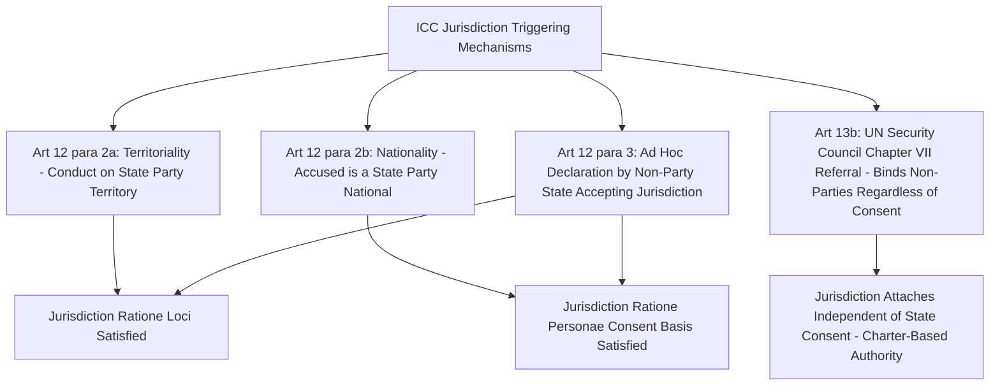

## ICC Jurisdiction Ratione Personae, Loci, and Temporis, and the Problem of Non-Signatory States

### Doctrinal Foundation: The Three Jurisdictional Dimensions Distinguished From Admissibility

Jurisdiction and admissibility are analytically distinct inquiries before the International Criminal Court (ICC), though they are frequently addressed together in practice. Recall that admissibility, governed by Article 17's complementarity and gravity criteria, asks whether a case that otherwise falls within the Court's jurisdiction should nonetheless proceed before the Court, given the existence and adequacy of national proceedings. **Jurisdiction**, by contrast, is the logically antecedent question: does the Court have the **legal authority to hear the matter at all**, independent of whether any state has investigated it. The Rome Statute organizes this jurisdictional inquiry along three classical dimensions of jurisdiction familiar from general international law: jurisdiction *ratione personae* (over persons), *ratione loci* (over territory), and *ratione temporis* (over time) — to which a fourth dimension, jurisdiction *ratione materiae* (over subject matter, addressed elsewhere in this curriculum's treatment of the four core crimes), completes the Statute's overall jurisdictional framework under Articles 5 through 13.

### Key Points: Jurisdiction Ratione Personae — Natural Persons Only

**Article 25(1)** of the Rome Statute confines the Court's jurisdiction to **natural persons** — the Court has no jurisdiction over states as such, nor over legal or juridical persons such as corporations, a deliberate design choice distinguishing the ICC's individual-focused model from, for example, the International Court of Justice's state-to-state contentious jurisdiction. This reflects the foundational post-Nuremberg principle of **individual criminal responsibility** under international law: international crimes are committed by individuals, not by abstract state entities, and it is individuals who bear criminal liability, even though the underlying conduct may also separately engage a state's responsibility under the distinct law of state responsibility (addressed elsewhere in this curriculum) — a parallel-track system in which individual criminal responsibility and state responsibility operate concurrently but are legally and institutionally separate.

Article 26 further excludes jurisdiction over persons who were **under the age of 18** at the time of the alleged commission of a crime, and Article 27 establishes the principle of **irrelevance of official capacity**: the Statute applies equally to all persons without distinction based on official capacity, including as Head of State or Government, and official capacity does not, in itself, constitute a ground for reduction of sentence — a provision of particular doctrinal significance given its tension, addressed further below, with the customary international law doctrine of **head-of-state immunity** that a sitting head of state might otherwise invoke before a domestic or international tribunal.

### Mechanism: Jurisdiction Ratione Loci and the Triggering Mechanisms of Article 12

**Article 12** establishes the Statute's core jurisdictional preconditions, structured around alternative bases for the Court's jurisdiction to attach to a given situation:

- **Article 12(2)(a) — territorial jurisdiction**: the Court may exercise jurisdiction if the conduct in question occurred on the territory of a **state party** (or a state that has otherwise accepted the Court's jurisdiction through a declaration under Article 12(3)).
- **Article 12(2)(b) — nationality jurisdiction**: the Court may exercise jurisdiction if the **accused is a national** of a state party (or of a state accepting jurisdiction under Article 12(3)), regardless of where the conduct occurred.

These two bases are **disjunctive, not cumulative**: jurisdiction can attach on the basis of **either** territoriality **or** nationality being satisfied, meaning a non-state-party national who commits a core crime on the territory of a state party falls within the Court's jurisdiction (territoriality satisfied, even though nationality is not), just as a state-party national who commits a core crime on non-state-party territory also falls within the Court's jurisdiction (nationality satisfied, even though territoriality is not).

A third, distinct triggering pathway exists independent of Article 12's territoriality/nationality preconditions: **Article 13(b)**, permitting the **UN Security Council**, acting under Chapter VII of the UN Charter, to **refer a situation to the Prosecutor** regardless of whether the relevant state is a party to the Rome Statute or has otherwise consented to the Court's jurisdiction — a mechanism deriving its binding legal force not from the Rome Statute's own consent-based framework but from the Security Council's Chapter VII enforcement authority under the UN Charter, binding on all UN member states under Article 25 of the Charter. This mechanism has been invoked twice as of the present: the 2005 referral of the situation in Darfur, Sudan (Security Council Resolution 1593), and the 2011 referral of the situation in Libya (Security Council Resolution 1970) — in both instances directed at non-states-party states.

### Doctrinal Content: Jurisdiction Ratione Temporis

**Article 11** confines the Court's temporal jurisdiction, establishing that the Court has jurisdiction only with respect to crimes committed **after the entry into force of the Statute**, which occurred on 1 July 2002. For a state that becomes a party to the Statute **after** its general 1 July 2002 entry into force, Article 11(2) further specifies that the Court's jurisdiction with respect to that state extends only to crimes committed **after the Statute's entry into force for that particular state** (that is, after that state's own ratification takes effect), unless that state has separately made an Article 12(3) declaration accepting jurisdiction retroactively to 1 July 2002 or to a specified earlier date, but never earlier than the Statute's general 1 July 2002 entry into force in any event — meaning the Court's jurisdiction can never reach conduct predating 1 July 2002 under any combination of these provisions, a firm outer temporal limit reflecting the general international law principle against retroactive criminal jurisdiction (*nullum crimen sine lege*, itself separately codified in Rome Statute Article 22).

### Analytical Debate: The Non-Party Territorial Jurisdiction Problem — Consent and Its Critics

The most persistent and consequential jurisdictional controversy concerns the situation addressed briefly above: because Article 12(2)(a)'s territoriality basis operates independently of the nationality basis, the Court can, in principle, exercise jurisdiction over the **national of a non-states-party state** where that national's alleged conduct occurred on the territory of a state that **is** a party (or has accepted jurisdiction under Article 12(3)) — a scenario that has proven acutely controversial in practice, most prominently in connection with the ICC's investigations touching on the conduct of United States nationals in Afghanistan (a state party) and, separately, in connection with the Israel/Palestine situation, given Palestine's accession to the Rome Statute and the Court's subsequent territorial jurisdiction ruling extending to the West Bank, Gaza, and East Jerusalem.

**The position defending this jurisdictional structure**, which reflects the Rome Statute's own negotiated text and the majority position among states parties and the Court's own jurisprudence (including the Pre-Trial Chamber's 2021 ruling on territorial jurisdiction in the Palestine situation), rests on ordinary principles of **territorial sovereignty and jurisdiction under general international law**: a state possesses the sovereign authority to exercise criminal jurisdiction over conduct occurring on its own territory regardless of the nationality of the perpetrator (the ordinary territorial principle underlying domestic criminal jurisdiction generally), and a state party to the Rome Statute has, through its own ratification, **delegated** this pre-existing territorial jurisdictional competence to the Court — meaning the Court's jurisdiction over a non-party national committing crimes on state-party territory is not an assertion of jurisdiction over a non-consenting state's own nationals as such, but rather the state-party territorial sovereign's own delegated authority being exercised by the Court on the territorial state's behalf, a transfer fully consistent with the general international law principle (reflected in Article 34 of the Vienna Convention on the Law of Treaties) that a treaty does not of itself create obligations for a third state without that state's consent, since it is **not** the non-party state being bound by the Rome Statute — only its national, present on consenting territory, being subject to jurisdiction the territorial sovereign itself validly possessed and validly delegated.

**The critical position**, articulated most prominently and persistently by the United States across multiple administrations (reflected in domestic legislation including the American Servicemembers' Protection Act of 2002, colloquially termed "The Hague Invasion Act" for its provisions authorizing measures to secure the release of covered US personnel detained by or on behalf of the ICC, and, more recently, in the 2020 imposition of sanctions against ICC officials during the first Trump administration in response to the Afghanistan investigation), argues that this jurisdictional structure functions, as a **practical matter**, to subject non-consenting states' nationals — and, by extension, to constrain those states' own military and political decision-making — to an international tribunal whose founding treaty that state never ratified and whose jurisdiction it has never accepted, a result these critics characterize as difficult to reconcile with the fundamental treaty-law principle that states cannot be bound, even indirectly through their nationals' exposure to prosecution, by a treaty regime to which they have withheld consent, regardless of the formal "delegated territorial sovereignty" characterization offered in defense of the arrangement. [Inference] This disagreement reflects, at bottom, a genuine and unresolved difference over whether the relevant unit of analysis for consent purposes should be the **state whose territory hosts the conduct** (which has plainly consented, satisfying the critics' own consent-based premise) or the **state whose national is exposed to prosecution** (which has not), and this framing dispute has not been, and is unlikely to be, definitively resolved through further ICC jurisprudence alone, since the Court's own rulings necessarily proceed from and reinforce the first framing, while non-party critical states continue to assert the second.

### Related Topics

- The Rome Statute and the four core crimes: genocide, crimes against humanity, war crimes, and aggression
- The complementarity principle and admissibility before the ICC
- UN Security Council referrals and deferrals under Rome Statute Articles 13 and 16
- Head-of-state immunity and its interaction with international criminal jurisdiction
- State cooperation obligations and non-cooperation under Part 9 of the Rome Statute
- The Vienna Convention on the Law of Treaties and the pacta tertiis principle